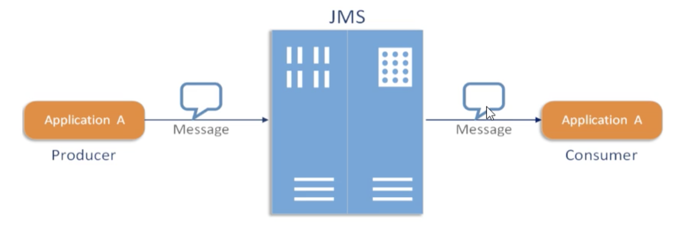
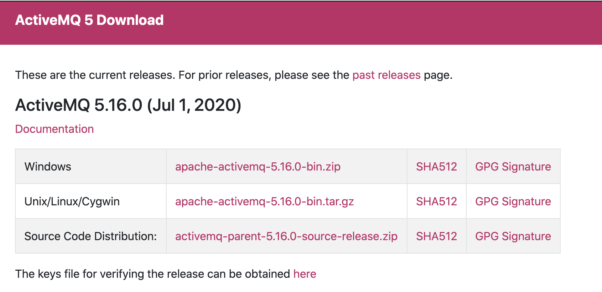
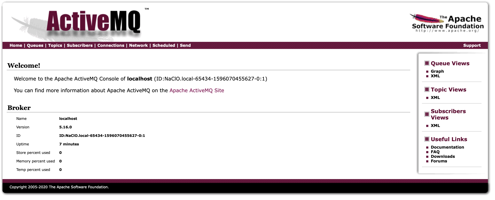
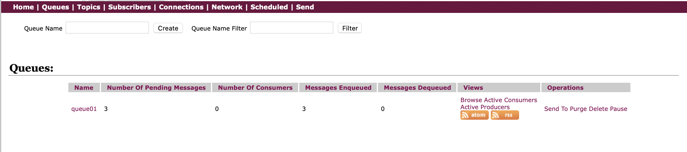
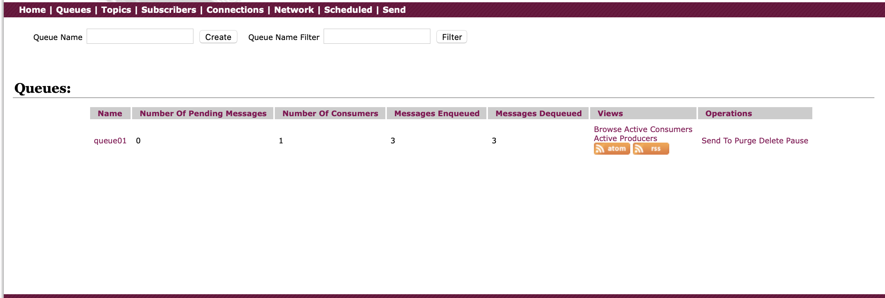
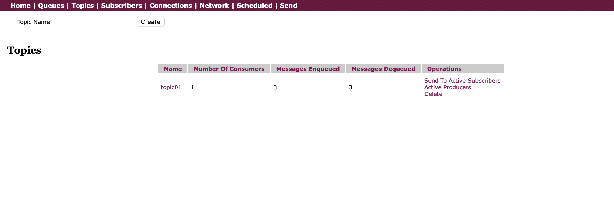
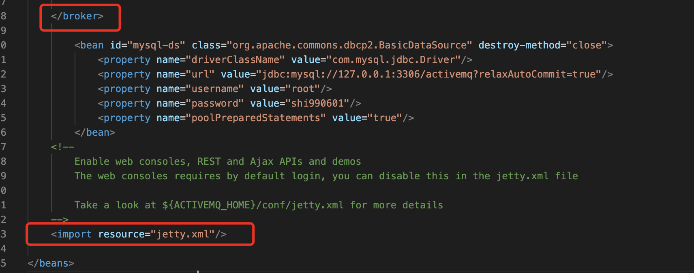
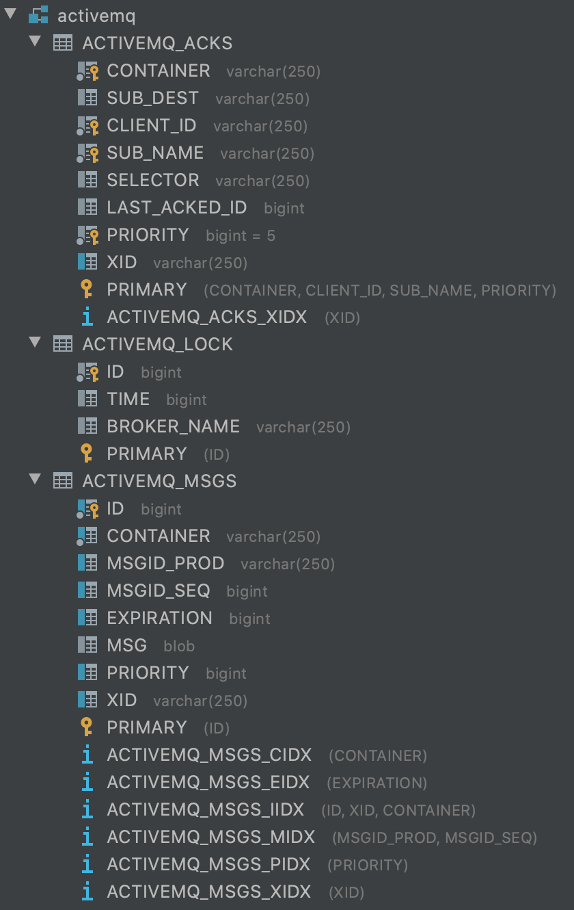
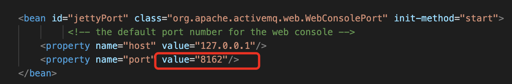
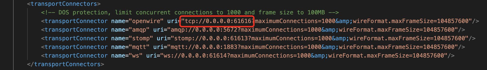

## 0. JMS

1. 简介

   * JMS即Java消息服务（Java Message Service）应用程序接口，是一个Java平台中关于面向消息中间件（MOM）的API，用于在两个应用程序之间，或分布式系统中发送消息，进行异步通信。Java消息服务是一个与具体平台无关的API，绝大多数MOM提供商都对JMS提供支持。
   * Java消息服务指的是两个应用程序之间进行异步通信的API，它为标准信息协议和消息服务提供了一组通用接口，包括创建、发送、读取消息等，用于支持JAVA应用程序开发。在JavaEE中，当两个应用程序使用JMS进行通信时，它们之间并不是直接相连的，而是通过一个共同的消息收发服务组件关联起来以达到接耦/异步削峰的效果。

2. 图

   

3. JMS的组成结构和特点

   1. JMS provider
      * 实现JMS接口和规范等消息中间件，也就是我们的MQ服务器
   2. JMS producer
      * 消息生产者，创建和发送JMS消息等客户端应用
   3. JMS consumer
      * 消息消费者，接受和处理JMS消息等客户端应用
   4. JMS message
      * 消息头
        * JMSDestination：消息发送的目的地，主要是指Queue和Topic。
        * JMSDeliveryMode：持久和非持久模式。
        * JMSExpriation：消息的过期时间，默认是永不过期。
        * JMSPriorit：消息优先级，从0～9十个级别，0～4是普通消息，5～9是加急消息，默认是4级。
        * JMSMessageID：唯一识别每个消息的标识，由MQ产生。
      * 消息体
        * TextMessage：普通字符串消息，包含一个string。
        * MapMessage：一个Map类型的消息，key为string类型，而值value为Java的基本类型。
        * BytesMessage：二进制数组消息，包含一个byte[]。
        * StreamMessage：Java数据流消息，用标准流操作来顺序的填充和读取。
        * ObjectMessage：对象消息，包含一个可序列化的Java对象。
      * 消息属性
        * 他们是以属性名和属性值对的形式制定的。
        * 可以将属性视为消息头的扩展，属性制定一些消息头没有包括的附加信息，比如可以在属性里指定消息选择器。
        * 消息的属性就像可以分配给一条消息的附加消息头一样。它们允许开发者添加有关消息的不透明附加信息。
        * 它们还用于暴露消息选择器在消息过滤时使用的数据。

4. JMS的可靠性

   * PERSISTENT：持久化

     * 非持久化
       - `messageProducer.setDeliveryMode(DeliveryMode.NON_PERSISTENT);`
       - 当服务器宕机，消息不存在。
     * 持久化（默认）
       - `messageProducer.setDeliveryMode(DeliveryMode.PERSISTENT);`
       - 当服务器宕机，消息依然存在。

   * Transaction：事务

     - producer提交时的事物

       * false

         * 只要执行send，就进入到队列中。
         * 关闭事务，那就第二个签收参数到设置需要有效。

       * true

         - 先执行send再执行commit，消息才被真正的提交到队列中。

           ````java
           session.commit();
           ````

         - 消息需要批量发送，需要缓冲区处理。

   * ACknowledge：签收

     - 非事务
       - 自动签收（默认）：`Session.AUTO_ACKNOWLEDGE`
       - 手动签收：`Session.CLIENT_ACKNOWLEDGE`
         - 客户端调用acknowledge方法手动签收
       - 允许重复消息：`Session.DUPS_OK_ACKNOWLEDGE`
     - 事务
       - 生产事务开启，只有commit后才能将全部消息变为已消费
     - 签收与事务的关系
       - 在事务性会话中，当一个事务被成功提交则消息会自动签收，如果事务回滚，则消息会被再次传送。
       - 非事务性会话中，消息何时被确认取决于创建会话时的应答模式。

5. 总结

   - 点对点
     - 点对点模型时基于队列的，生产者发消息到队列，消费者从队列接收消息，队列的存在使得消息的异步传输成为可能。
     - 如果在session关闭时有部分消息已被收到但是没有被签收，那当消费者下次连接到相同队列时，这些消息还会被再次接收。
     - 队列可以长久地保存消息直到消费者收到消息。消费者不需要因为担心消息会丢失而时刻和队列保持激活到连接状态，充分体现了异步传输模式的优势。
   - 订阅
     - 非持久订阅
       - 只有当客户端处于激活状态，也就是和MQ保持连接状态才能收到发送到某个主题的消息。
       - 如果消费者处于离线状态，生产者发送的主题消息将会丢失作废，消费者永远不会收到。
       - 先要订阅注册才能收到发布，只给订阅者发布消息
     - 持久订阅
       - 客户端首先向MQ注册一个自己的身份ID识别号，当这个客户端处于离线时，生产者会为这个ID保存所有发送到主题的消息，当客户端再次连接到MQ时会根据消费者的ID得到所有当自己处于离线状态时发送到主题的消息。
     - 总
       - 非持久订阅状态下，不能恢复或从新派送一个未签收的消息。
       - 持久订阅模式下，才能恢复或重新派送一个未签收的消息。
       - 当所有消息必须被接受，则用持久订阅。当消息丢失可以被容忍，则用非持久订阅。

6. 几种MQ产品对比

   | 特性              | ActiceMQ       | RabbitMQ   | Kafka            | RocketMQ       |
   | ----------------- | -------------- | ---------- | ---------------- | -------------- |
   | PRODUCER-COMSUMER | 支持           | 支持       | 支持             | 支持           |
   | PUBLISH-SUBSCRIBE | 支持           | 支持       | 支持             | 支持           |
   | REQUEST-REPLY     | 支持           | 支持       | -                | 支持           |
   | API完备性         | 高             | 高         | 高               | 低（静态配置） |
   | 多语言支持        | 支持，JAVA优先 | 语言无关   | 支持，JAVA优先   | 支持           |
   | 单机吞吐量        | 万级           | 万级       | 十万级           | 单机万级       |
   | 消息延迟          | -              | 微秒级     | 毫秒级           | -              |
   | 可用性            | 高（主从）     | 高（主从） | 非常高（分布式） | 高             |
   | 消息丢失          | -              | 低         | 理论上不会丢失   | -              |
   | 消息重复          | -              | 可控性     | 理论上会有重复   | -              |
   | 文档的完备性      | 高             | 高         | 高               | 中             |
   | 提供快速入门      | 有             | 有         | 有               | 无             |
   | 首次部署难度      | -              | 低         | 中               | 高             |


## 1. ActiveMQ简介

1. 官网

   http://activemq.apache.org/

2. 百度百科

   * Apache ActiveMQ是Apache软件基金会所研发的开放源代码消息中间件；
   * 由于ActiveMQ是一个纯Java程序，因此只需要操作系统支持Java虚拟机，ActiveMQ便可执行。

3. 消息中间件

   * 消息中间件利用高效可靠的消息传递机制进行平台无关的数据交流，并基于数据通信来进行分布式系统的集成。
   * 通过提供消息传递和消息排队模型，它可以在分布式环境下扩展进程间的通信。


## 2. ActiveMQ安装

### 下载地址

* calssic

  http://activemq.apache.org/components/classic/download/

* artemis

  http://activemq.apache.org/components/artemis/download/

  

### 1. Windows下安装

### 2. Linux下安装

1. 下载

   进入官网，下载tar.gz压缩版

2. 解压

   ````bash
   tar -zxvf apache-activemq-5.16.0-bin.tar.gz
   ````

3. 进入解压目录 启动ActiveMQ

   ````bash
   ./activemq start  
   ````

### 3. MacOS下安装

#### 1. 下载版安装同Linux下安装

#### 2. 使用homebrew安装

1. 打开terminal输入命令安装

   ```bash
   brew install activemq
   ```

2. 启动

   ````bash
   activemq start
   ````

#### 4. Docker安装

1. 拉取

   ````bash
   docker pull activemq
   ````

2. 启动

   ````bash
   docker run activemq
   ````

   

## 3. ActiveMQ简单使用

### 1. 常用命令

1. 启动

   ````bash
   ./activemq start
   ````

2. 带日志的启动

   ````bash
   ./activemq start > path/run_activemq.log
   ````

3. 重启

   ````bash
   ./activemq restart
   ````

4. 关闭

   ````bash
   ./activemq stop
   ````

### 2. 查看进程命令

* `ps -ef|grep activemq|grep -v grep`
* `netstat -anp|grep 61616`
* `lsof -i:61616`

### 3. ActiveMQ控制台

1. 浏览器访问

   http://localhost:8161/admin/

2. 输入用户名密码

   * 默认用户名：==admin==
   * 默认密码：==admin==

3. 进入页面

   


### 4. 环境搭建

1. 创建maven工程

2. pom依赖

   ````xml
   <properties>
     <project.build.sourceEncoding>UTF-8</project.build.sourceEncoding>
     <maven.compiler.source>1.8</maven.compiler.source>
     <maven.compiler.target>1.8</maven.compiler.target>
   </properties>
   <dependencies>
     <dependency>
       <groupId>org.apache.activemq</groupId>
       <artifactId>activemq-all</artifactId>
       <version>5.15.9</version>
     </dependency>
     <dependency>
       <groupId>org.apache.xbean</groupId>
       <artifactId>xbean-spring</artifactId>
       <version>3.16</version>
     </dependency>
     <dependency>
       <groupId>org.slf4j</groupId>
       <artifactId>slf4j-log4j12</artifactId>
       <version>2.0.0-alpha1</version>
     </dependency>
     <dependency>
       <groupId>org.projectlombok</groupId>
       <artifactId>lombok</artifactId>
       <version>1.18.10</version>
     </dependency>
     <dependency>
       <groupId>org.junit.jupiter</groupId>
       <artifactId>junit-jupiter</artifactId>
       <version>5.7.0-M1</version>
     </dependency>
   </dependencies>
   ````

## 4. 队列Queue案例

1. 消息生产者编码

   ````java
   public class JmsProduce {
       public static final String ACTIVEMQ_URL = "tcp://127.0.0.1:61616";
       public static final String QUEUE_NAME = "queue01";
   
       public static void main(String[] args) throws JMSException {
           //1 创建连接工厂 按照给定的URL地址，采用默认用户名密码
           ActiveMQConnectionFactory activeMQConnectionFactory = new ActiveMQConnectionFactory(ACTIVEMQ_URL);
   
           //2 通过连接工厂，获得连接connection
           Connection connection = activeMQConnectionFactory.createConnection();
           connection.start();
   
           //3 创建会话session
           //两个参数（事务/签收）
           Session session = connection.createSession(false, Session.AUTO_ACKNOWLEDGE);
   
           //4 创建目的地（具体是队列还是主题）
           Queue queue = session.createQueue(QUEUE_NAME);
   
           //5 创建消息的生产者
           MessageProducer messageProducer = session.createProducer(queue);
   
           //6 通过使用messageProducer生产3条消息发送到MQ的队列里来
           for (int i = 1; i <= 3; i++) {
               //7 创建消息
               TextMessage textMessage = session.createTextMessage("msg---" + i);
               //8 通过messageProducer发送给MQ
               messageProducer.send(textMessage);
           }
           //9 关闭资源
           messageProducer.close();
           session.close();
           connection.close();
   
           System.out.println("----消息发布完成----");
       }
   }
   ````

   * 运行

     

     * 说明

       | 英文                      | 翻译           | 说明                                             |
       | :------------------------ | :------------- | :----------------------------------------------- |
       | Number Of Pending Message | 等待消息的数量 | 这个是未出队列的数量。公式=总接受量-总出队列数   |
       | Number of Consumers       | 消费者数量     | 消费者端端消费者数量                             |
       | Messages Enqueued         | 进队消息数     | 进入队列的总数量，包括出队列的。这个数量只增不减 |
       | Messages Dequeued         | 出队消息数     | 可以理解为是消费者消费掉的数量                   |

2. 消息消费者编码

   通过同步阻塞方法消费消息

   ````java
   public class JmsConsumer {
       public static final String ACTIVEMQ_URL = "tcp://127.0.0.1:61616";
       public static final String QUEUE_NAME = "queue01";
   
       public static void main(String[] args) throws JMSException {
           //1 创建连接工厂 按照给定的URL地址，采用默认用户名密码
           ActiveMQConnectionFactory activeMQConnectionFactory = new ActiveMQConnectionFactory(ACTIVEMQ_URL);
   
           //2 通过连接工厂，获得连接connection
           Connection connection = activeMQConnectionFactory.createConnection();
           connection.start();
   
           //3 创建会话session
           //两个参数（事务/签收）
           Session session = connection.createSession(false, Session.AUTO_ACKNOWLEDGE);
   
           //4 创建目的地（具体是队列还是主题）
           Queue queue = session.createQueue(QUEUE_NAME);
   
           //5 创建消费者
           MessageConsumer messageConsumer = session.createConsumer(queue);
   				/**
            * 同步阻塞方法(receive())
            * 订阅者或接收者调用messageConsumer的receive()方法来接受消息，
            * receive()方法能在接收到消息之前（或超时之前）将一直阻塞。
            */
           while (true) {
               TextMessage textMessage = (TextMessage) messageConsumer.receive();
               if (null != textMessage) {
                   System.out.println("----消费者接收到消息" + textMessage.getText());
               } else {
                   break;
               }
           }
           messageConsumer.close();
           session.close();
           connection.close();
       }
   }
   ````

   通过监听的方式消费消息

   ````java
   public class JmsConsumer {
       public static final String ACTIVEMQ_URL = "tcp://127.0.0.1:61616";
       public static final String QUEUE_NAME = "queue01";
       public static Logger logger = LoggerFactory.getLogger(JmsConsumer.class);
   
       public static void main(String[] args) throws JMSException, IOException {
           //1 创建连接工厂 按照给定的URL地址，采用默认用户名密码
           ActiveMQConnectionFactory activeMQConnectionFactory = new ActiveMQConnectionFactory(ACTIVEMQ_URL);
   
           //2 通过连接工厂，获得连接connection
           Connection connection = activeMQConnectionFactory.createConnection();
           connection.start();
   
           //3 创建会话session
           //两个参数（事务/签收）
           Session session = connection.createSession(false, Session.AUTO_ACKNOWLEDGE);
   
           //4 创建目的地（具体是队列还是主题）
           Queue queue = session.createQueue(QUEUE_NAME);
   
           //5 创建消费者
           MessageConsumer messageConsumer = session.createConsumer(queue);
         
           //通过监听的方式消费消息
           messageConsumer.setMessageListener(new MessageListener() {
               @Override
               public void onMessage(Message message) {
                   if (null != message && message instanceof TextMessage) {
                       TextMessage textMessage = (TextMessage) message;
                       try {
                           System.out.println("----消费者接收到消息" + textMessage.getText());
                       } catch (JMSException e) {
                           e.printStackTrace();
                       }
                   }
               }
           });
           System.in.read();
           messageConsumer.close();
           session.close();
           connection.close();
       }
   }
   ````

   * 运行

     

   * 说明

     1. 先生产，只启动1号消费者。问题：1号消费者能消费消息吗？

        Yes！

     2. 先生产，先启动1号消费者再启动1号消费者。问题：2号消费者能消费消息吗？

        No！

     3. 先启动2个消费者，再生产6条消息，问题：消费情况如何

        一人一半！

## 5. 主题Topic案例

1. 生产者编码

   ````java
   public class JmsProduce_Topic {
       public static final String ACTIVEMQ_URL = "tcp://127.0.0.1:61616";
       public static final String TOPIC_NAME = "topic01";
   
       public static void main(String[] args) throws JMSException {
           //1 创建连接工厂 按照给定的URL地址，采用默认用户名密码
           ActiveMQConnectionFactory activeMQConnectionFactory = new ActiveMQConnectionFactory(ACTIVEMQ_URL);
   
           //2 通过连接工厂，获得连接connection
           Connection connection = activeMQConnectionFactory.createConnection();
           connection.start();
   
           //3 创建会话session
           //两个参数（事务/签收）
           Session session = connection.createSession(false, Session.AUTO_ACKNOWLEDGE);
   
           //4 创建目的地（具体是队列还是主题）
           Topic topic = session.createTopic(TOPIC_NAME);
   
           //5 创建消息的生产者
           MessageProducer messageProducer = session.createProducer(topic);
   
           //6 通过使用messageProducer生产3条消息发送到MQ的队列里来
           for (int i = 1; i <= 3; i++) {
               //7 创建消息
               TextMessage textMessage = session.createTextMessage("TOPIC_NAME---" + i);
               //8 通过messageProducer发送给MQ
               messageProducer.send(textMessage);
           }
           //9 关闭资源
           messageProducer.close();
           session.close();
           connection.close();
   
           System.out.println("----消息发布完成----");
       }
   }
   ````

2. 消费者编码

   ````java
   public class JmsConsumer_Topic {
       public static final String ACTIVEMQ_URL = "tcp://127.0.0.1:61616";
       public static final String TOPIC_NAME = "topic01";
   
       public static void main(String[] args) throws JMSException, IOException {
           //1 创建连接工厂 按照给定的URL地址，采用默认用户名密码
           ActiveMQConnectionFactory activeMQConnectionFactory = new ActiveMQConnectionFactory(ACTIVEMQ_URL);
   
           //2 通过连接工厂，获得连接connection
           Connection connection = activeMQConnectionFactory.createConnection();
           connection.start();
   
           //3 创建会话session
           //两个参数（事务/签收）
           Session session = connection.createSession(false, Session.AUTO_ACKNOWLEDGE);
   
           //4 创建目的地（具体是队列还是主题）
           Topic topic = session.createTopic(TOPIC_NAME);
   
           //5 创建消费者
           MessageConsumer messageConsumer = session.createConsumer(topic);
   
           //通过监听到方式消费消息
           messageConsumer.setMessageListener((message) -> {
               if (null != message && message instanceof TextMessage) {
                   TextMessage textMessage = (TextMessage) message;
                   try {
                       System.out.println("----消费者接收到消息" + textMessage.getText());
                   } catch (JMSException e) {
                       e.printStackTrace();
                   }
               }
           });
           System.in.read();
           messageConsumer.close();
           session.close();
           connection.close();
       }
   }
   ````

3. 启动，先启动消费者，再启动生产者。

   

## 6. Topic模式与Queue模式对比

| 比较项目   | Top模式队列                                                  | Queue模式队列                                                |
| ---------- | ------------------------------------------------------------ | ------------------------------------------------------------ |
| 工作模式   | "订阅-发布模式"，如果当前没有订阅者，消息将会被丢弃。如果有多个订阅者，那么这些订阅者都会收到消息 | "负载均衡"模式，如果当前没有消费者，消息也不会丢弃；如果有多个消费者，那么一条消息也只会发送给其中一个消费者，并且要求消费者ack信息 |
| 有无状态   | 无状态                                                       | Queue数据默认会在mq服务器上以文件形式保存，比如ActiveMQ一般保存在$AMQ_HOME\data\kr-store-data下面。也可以配制成DB存储 |
| 传递完整性 | 如果没有订阅者，消息会被丢弃                                 | 消息不会丢弃                                                 |
| 处理效率   | 由于消息要按照订阅者的数量进行复制，所以处理性能会随着订阅者的增加而明显降低，并且还要结合不同消息协议自身的性能差异 | 由于一条消息指发送给一个消费者，所以就算消费者再多，性能也不会有明显降低。当然不同消息协议的具体性能也是有差异的 |

## 7. ActiveMQ的Broker

1. 是什么

   - 相当于一个ActiveMQ服务器实例
   - 实现了用代码形式启动ActiveMQ嵌入到Java代码中，以便随时启动，节省了资源，也保证了可靠性。

2. 通过不同的配置文件启动

   ````bash
   ./activemq start xbean:file:/Users/naclo/software/apache/activemq/apache-activemq-5.16.0/conf/activemq.xml
   ````

3. 嵌入式MQ

   1. pom.xml添加依赖

      ````xml
      <dependency>
        <groupId>com.fasterxml.jackson.core</groupId>
        <artifactId>jackson-databind</artifactId>
        <version>2.9.4</version>
      </dependency>
      ````

   2. 编写EmbedBroker.java

      ````java
      public class EmbedBroker {
          public static void main(String[] args) throws Exception {
              BrokerService brokerService = new BrokerService();
              brokerService.setUseJmx(true);
              brokerService.addConnector("tcp://localhost:61616");
              brokerService.start();
          }
      }
      
      ````

   3. 运行测试

## 8. Spring整合ActiveMQ

1. pom.xml添加依赖

   ````xml
   <dependency>
     <groupId>org.springframework</groupId>
     <artifactId>spring-jms</artifactId>
     <version>5.2.8.RELEASE</version>
   </dependency>
   <dependency>
     <groupId>org.apache.activemq</groupId>
     <artifactId>activemq-pool</artifactId>
     <version>5.15.9</version>
   </dependency>
   <dependency>
     <groupId>org.springframework</groupId>
     <artifactId>spring-webmvc</artifactId>
     <version>5.2.8.RELEASE</version>
   </dependency>
   <dependency>
     <groupId>org.aspectj</groupId>
     <artifactId>aspectjrt</artifactId>
     <version>1.9.6</version>
   </dependency>
   <dependency>
     <groupId>org.aspectj</groupId>
     <artifactId>aspectjweaver</artifactId>
     <version>1.8.13</version>
   </dependency>
   <dependency>
     <groupId>cglib</groupId>
     <artifactId>cglib</artifactId>
     <version>2.1_2</version>
   </dependency>
   ````

2. 编写Spring配置文件ApplicationContext.xml

   ````xml
   <?xml version="1.0" encoding="UTF-8"?>
   <beans xmlns="http://www.springframework.org/schema/beans"
          xmlns:xsi="http://www.w3.org/2001/XMLSchema-instance"
          xmlns:context="http://www.springframework.org/schema/context"
          xmlns:aop="http://www.springframework.org/schema/aop"
          xmlns:tx="http://www.springframework.org/schema/tx"
          xsi:schemaLocation="http://www.springframework.org/schema/beans
                              http://www.springframework.org/schema/beans/spring-beans.xsd
                              http://www.springframework.org/schema/context
                              http://www.springframework.org/schema/context/spring-context.xsd
                              http://www.springframework.org/schema/aop
                              http://www.springframework.org/schema/aop/spring-aop.xsd
                              http://www.springframework.org/schema/tx
                              http://www.springframework.org/schema/tx/spring-tx.xsd"
   >
       <!-- 开启包的自动扫描 -->
       <context:component-scan base-package="com.naclo.activemq"/>
       <!-- 配置生产者 -->
       <bean id="jmsFactory" class="org.apache.activemq.pool.PooledConnectionFactory" destroy-method="stop">
           <property name="connectionFactory">
               <!-- 真正可以产生connection的connectionFactory，由对应的JMS服务厂商提供 -->
               <bean class="org.apache.activemq.ActiveMQConnectionFactory">
                   <property name="brokerURL" value="tcp://127.0.0.1:61616"/>
               </bean>
           </property>
           <property name="maxConnections" value="100"/>
       </bean>
   
       <!-- 这个是队列目的地 点对点的 -->
       <bean id="destinationQueue" class="org.apache.activemq.command.ActiveMQQueue">
           <constructor-arg index="0" value="spring-active-queue"/>
       </bean>
   
       <!-- spring提供的JMS工具类 他可以进行消息发送接收等  -->
       <bean id="jmsTemple" class="org.springframework.jms.core.JmsTemplate">
           <property name="connectionFactory" ref="jmsFactory"/>
        	  <!-- 队列 -->
           <property name="defaultDestination" ref="destinationQueue"/>
           <property name="messageConverter">
               <bean class="org.springframework.jms.support.converter.SimpleMessageConverter"/>
           </property>
       </bean>
   </beans>
   ````

3. 队列

   1. 编写队列生产者

      ````java
      @Service
      public class SpringMQ_Produce {
          @Autowired
          private JmsTemplate jmsTemplate;
      
          public static void main(String[] args) {
              ApplicationContext ctx=new ClassPathXmlApplicationContext("ApplicationContext.xml");
              SpringMQ_Produce produce= (SpringMQ_Produce) ctx.getBean("springMQ_Produce");
              produce.jmsTemplate.send((session)->{
                  TextMessage textMessage = session.createTextMessage("----Spring整合ActiveMQ----");
                  return textMessage;
              });
              System.out.println("----sent task over----");
          }
      }
      ````

   2. 编写队列消费者

      ````java
      @Service
      public class SpringMQ_Consumer {
          @Autowired
          private JmsTemplate jmsTemplate;
      
          public static void main(String[] args) {
              ApplicationContext ctx=new ClassPathXmlApplicationContext("ApplicationContext.xml");
              SpringMQ_Consumer consumer= (SpringMQ_Consumer) ctx.getBean("springMQ_Consumer");
      
              String returnValue =(String) consumer.jmsTemplate.receiveAndConvert();
              System.out.println("----消费者收到的消息"+returnValue);
          }
      }
      ````

4. 主题

   1. 修改ApplicationContext.xml

      ````xml
      <!-- 这个是主题 -->
      <bean id="destinationTopic" class="org.apache.activemq.command.ActiveMQTopic">
        <constructor-arg index="0" value="spring-active-topic"/>
      </bean>
      <!-- spring提供的JMS工具类 他可以进行消息发送接收等  -->
      <bean id="jmsTemple" class="org.springframework.jms.core.JmsTemplate">
        <property name="connectionFactory" ref="jmsFactory"/>
        <!-- 主题 -->
        <property name="defaultDestination" ref="destinationTopic"/>
        <property name="messageConverter">
          <bean class="org.springframework.jms.support.converter.SimpleMessageConverter"/>
        </property>
      </bean>
      ````

      

   2. 编写主题生产者

      ````java
      @Service
      public class SpringMQ_Produce {
          @Autowired
          private JmsTemplate jmsTemplate;
      
          public static void main(String[] args) {
              ApplicationContext ctx=new ClassPathXmlApplicationContext("ApplicationContext.xml");
              SpringMQ_Produce produce= (SpringMQ_Produce) ctx.getBean("springMQ_Produce");
              produce.jmsTemplate.send((session)->{
                  TextMessage textMessage = session.createTextMessage("----Spring整合ActiveMQ----");
                  return textMessage;
              });
              System.out.println("----sent task over----");
          }
      }
      ````

   3. 编写主题消费者

      ````java
      @Service
      public class SpringMQ_Consumer {
          @Autowired
          private JmsTemplate jmsTemplate;
      
          public static void main(String[] args) {
              ApplicationContext ctx=new ClassPathXmlApplicationContext("ApplicationContext.xml");
              SpringMQ_Consumer consumer= (SpringMQ_Consumer) ctx.getBean("springMQ_Consumer");
      
              String returnValue =(String) consumer.jmsTemplate.receiveAndConvert();
              System.out.println("----消费者收到的消息"+returnValue);
          }
      }
      ````

5. 实现消费者不启动，通过配置监听完成

   1. 编写自定义监听器类

      ````java
      @Component
      public class MyMessageListener implements MessageListener {
          @Override
          public void onMessage(Message message) {
              if (null != message && message instanceof TextMessage) {
                  TextMessage textMessage = (TextMessage) message;
                  try {
                      System.out.println(textMessage.getText());
                  } catch (JMSException e) {
                      e.printStackTrace();
                  }
              }
          }
      }
      ````

   2. 修改ApplicationContext.xml增加

      ````xml
      <!-- 配置监听器 -->
      <bean id="jmsContainer" class="org.springframework.jms.listener.DefaultMessageListenerContainer">
        <property name="connectionFactory" ref="jmsFactory"/>
        <property name="destination" ref="destinationTopic"/>
        <property name="messageListener" ref="myMessageListener"/>
      </bean>
      ````

## 9. SpringBoot整合ActiveMQ

### 1. 队列

1. 队列生产者

   1. 新建maven工程boot_mq_produce并设置包名com.naclo.boot.activemq

   2. 编写pom.xml

      ````xml
      <?xml version="1.0" encoding="UTF-8"?>
      <project xmlns="http://maven.apache.org/POM/4.0.0"
               xmlns:xsi="http://www.w3.org/2001/XMLSchema-instance"
               xsi:schemaLocation="http://maven.apache.org/POM/4.0.0 http://maven.apache.org/xsd/maven-4.0.0.xsd">
        <modelVersion>4.0.0</modelVersion>
      
        <groupId>com.naclo</groupId>
        <artifactId>boot_mq_produce</artifactId>
        <version>1.0-SNAPSHOT</version>
      
        <parent>
          <groupId>org.springframework.boot</groupId>
          <artifactId>spring-boot-starter-parent</artifactId>
          <version>2.1.5.RELEASE</version>
          <relativePath/>
        </parent>
      
        <properties>
          <project.build.sourceEncoding>UTF-8</project.build.sourceEncoding>
          <maven.compiler.source>1.8</maven.compiler.source>
          <maven.compiler.target>1.8</maven.compiler.target>
        </properties>
      
        <dependencies>
          <dependency>
            <groupId>org.springframework.boot</groupId>
            <artifactId>spring-boot-starter</artifactId>
          </dependency>
          <dependency>
            <groupId>org.springframework.boot</groupId>
            <artifactId>spring-boot-starter-web</artifactId>
          </dependency>
          <dependency>
            <groupId>org.springframework.boot</groupId>
            <artifactId>spring-boot-starter-test</artifactId>
          </dependency>
          <dependency>
            <groupId>org.springframework.boot</groupId>
            <artifactId>spring-boot-starter-activemq</artifactId>
          </dependency>
        </dependencies>
      
        <build>
          <plugins>
            <plugin>
              <groupId>org.springframework.boot</groupId>
              <artifactId>spring-boot-maven-plugin</artifactId>
            </plugin>
          </plugins>
        </build>
      </project>
      ````

   3. 编写application.yml

      ````yml
      server:
        port: 7777
      
      spring:
        activemq:
          broker-url: tcp://127.0.0.1:61616  #MQ服务器地址
          user: admin
          password: admin
        jms:
          pub-sub-domain: false  #false=Queue true=Topic
      
      # 自己定义队列名称
      myqueue: boot-activemq-queue
      ````

   4. 配置bean

      ````java
      @Component
      @EnableJms
      public class ConfigBean {
          @Value("${myqueue}")
          private String myQueue;
      
          @Bean
          public Queue queue(){
              return new ActiveMQQueue(myQueue);
          }
      }
      ````

   5. 编写消息生产者Queue_Produce

      ````java
      @Component
      public class Queue_Produce {
          @Autowired
          private JmsMessagingTemplate jmsMessagingTemplate;
      
          @Autowired
          private Queue queue;
      
          public void produceMsg() {
              jmsMessagingTemplate.convertAndSend(queue, "----" + UUID.randomUUID().toString().substring(0, 6));
          }
      }
      ````

   6. 编写主启动类MainApp_Produce

      ````java
      @SpringBootApplication
      public class MainApp_Produce {
          public static void main(String[] args) {
      
              SpringApplication.run(MainApp_Produce.class, args);
          }
      }
      ````

   7. 编写测试类

      ````java
      @SpringBootTest(classes = MainApp_Produce.class)
      @RunWith(SpringJUnit4ClassRunner.class)
      @WebAppConfiguration
      public class TestActiveMQ {
      
          @Autowired
          private Queue_Produce queue_produce;
      
          @Test
          public void testSend() throws Exception {
              queue_produce.produceMsg();
          }
      }
      ````

   8. 新增需求，定时推送，三秒发一条

      1. 修改Queue_Produce新增定时投递方法

         ````java
         //间隔时间三秒钟定投
         @Scheduled(fixedDelay = 3000)
         public void produceMsgScheduled() {
           jmsMessagingTemplate.convertAndSend(queue, "----Scheduled" + UUID.randomUUID().toString().substring(0, 6));
           System.out.println("----produceMsgScheduled----");
         }
         ````

      2. 修改主启动类MainApp_Produce添加注解

         ````java
         @EnableScheduling
         ````

2. 队列消费者

   1. 新建maven工程boot_mq_consumer并设置包名com.naclo.boot.activemq

   2. 编写pom.xml

      同上

   3. 编写application.yml

      ````yaml
      server:
        port: 8888
      
      spring:
        activemq:
          broker-url: tcp://127.0.0.1:61616  #MQ服务器地址
          user: admin
          password: admin
        jms:
          pub-sub-domain: false  #false=Queue true=Topic
      
      # 自己定义队列名称
      myqueue: boot-activemq-queue
      ````

   4. 编写消息消费者Queue_Consumer

      ````java
      @Component
      public class Queue_consumer {
      
          @JmsListener(destination = "${myqueue}")
          public void receive(TextMessage textMessage) throws Exception{
              System.out.println("---消费者收到消息："+textMessage.getText());
          }
      }
      ````

   5. 编写主启动类MainApp_Produce

      ````java
      @SpringBootApplication
      public class MainApp_Consumer {
          public static void main(String[] args) {
      
              SpringApplication.run(MainApp_Consumer.class, args);
          }
      }
      ````

### 2. 发布订阅

1. 订阅生产者

   1. 新建maven工程boot_mq_topic_producer并设置包名com.naclo.boot.activemq.topic

   2. 编写pom.xml

      同上

   3. 编写application.yml

      ````yaml
      server:
        port: 6666
      
      spring:
        activemq:
          broker-url: tcp://127.0.0.1:61616  #MQ服务器地址
          user: admin
          password: admin
        jms:
          pub-sub-domain: true  #false=Queue true=Topic
      
      # 自己定义队列名称
      mytopic: boot-activemq-topic
      ````

   4. 配置bean

      ````java
      @Component
      public class ConfigBean {
      
          @Value("${mytopic}")
          private String topicName;
      
          @Bean
          public Topic topic() {
              return new ActiveMQTopic(topicName);
          }
      }
      ````

   5. 编写消息生产者Topic_Produce

      ````java
      @Component
      public class Topic_Produce {
      
          @Autowired
          private JmsMessagingTemplate jmsMessagingTemplate;
      
          @Autowired
          private Topic topic;
      
          @Scheduled(fixedDelay = 3000)
          public void produceTopic(){
              jmsMessagingTemplate.convertAndSend(topic,"主题消息"+ UUID.randomUUID().toString().substring(0,6));
          }
      }
      ````

   6. 编写主启动类MainApp_TopicProduce

      ````java
      @SpringBootApplication
      @EnableScheduling
      public class MainApp_TopicProduce {
      
          public static void main(String[] args) {
              SpringApplication.run(MainApp_TopicProduce.class,args);
          }
      }
      ````

2. 订阅消费者

   1. 新建maven工程boot_mq_topic_consumer并设置包名com.naclo.boot.activemq.topic

   2. 编写pom.xml

      同上

   3. 编写application.yml

      ````yaml
      server:
        port: 5555
      
      spring:
        activemq:
          broker-url: tcp://127.0.0.1:61616  #MQ服务器地址
          user: admin
          password: admin
        jms:
          pub-sub-domain: true  #false=Queue true=Topic
      
      # 自己定义队列名称
      mytopic: boot-activemq-topic
      ````

   4. 编写消息消费者Topic_Consumer

      ````java
      @Component
      public class Topic_Consumer {
      
          @JmsListener(destination = "${mytopic}")
          public void receive(TextMessage textMessage) throws Exception {
              System.out.println("消费者收到订阅的主题" + textMessage.getText());
          }
      }
      ````

   5. 编写主启动类MainApp_TopicConsumer

      ````java
      @SpringBootApplication
      public class MainApp_TopicConsumer {
          public static void main(String[] args) {
              SpringApplication.run(MainApp_TopicConsumer.class, args);
          }
      }
      ````

## 10. ActiveMQ的传输协议

### 1. 各种协议介绍

1. Transmission Control Protocol（TCP）（默认）
   - 默认的Broker配置，TCP的Client监听端口61616。
   - 在网络传输数据前，必须要序列化数据，消息说通过一个叫wire protocol的来序列化成字节流。
   - 默认情况下ActiveMQ把wire protocol叫做OpenWire，它的目的是促使网络上的效率和数据快速交互。
   - TCP连接的URI形式如：tcp://hostname:port?key=value&key=value，后面的参数上可选的
   - TCP传输的优点
     - TCP传输协议可靠性高，稳定性高
     - 高效性：字节流方式传递，效率很高
     - 高效性、可用性：应用广泛，支持任何平台
   - 具体参数配置查看官网：http://activemq.apache.org/tcp-transport-reference
2. New I/O API Protocol（NIO）
   - NIO协议和TCP协议类似但NIO更侧重于底层的访问操作，它允许开发人员对同一资源可有更多的client调用和服务端游更多的负载。
   - 适合使用NIO的场景
     - 可能有大量的Client去连接到Broker上，一般情况下，大量的Client去连接Broker是被操作系统的线程所限制的。因此，NIO的实现比TCP需要更少的线程去运行，所以建议使用NIO协议
     - 可能对于Broker有一个很迟钝的网络传输，NIO比TCP提供更好的性能。
   - NIO连接的URI形式如：nio://hostname:port?key=value
   - 具体参数配置查看官网：http://activemq.apache.org/nio-transport-reference
3. Advanced Message Queuing Protocol（AMQP）
   - 一个提供统一消息服务的应用层标准高级消息队列协议，是应用层协议的一个开放标准，为面向消息的中间件设计。基于此协议的客户端与消息中间件可传递消息，并不受客户端/中间件不同产品，不同开发语言等条件的限制。
   - 具体参数配置查看官网：http://activemq.apache.org/amqp
4. Streaming Text Orientated Message Protocol（stomp）
   - 是流文本定向消息协议，是一种为MOM（面向消息的中间件）设计的简单文本协议
   - 具体参数配置查看官网：http://activemq.apache.org/stomp
5. Secure Sockets Layer Protocol（SSL）
6. mqtt协议
7. ws协议

### 2. 各种协议对比

| 协议    | 描述                                                         |
| ------- | ------------------------------------------------------------ |
| TCP     | 默认的协议，相对性能可以                                     |
| NIO     | 基于TCP协议之上的，进行了扩展和优化，具有更好的扩展性        |
| UDP     | 性能比TCP更好，但是不具有可靠性                              |
| SSL     | 安全链接                                                     |
| HTTP(S) | 基于HTTP或HTTPS                                              |
| VM      | VM本身不是协议，当客户端和代理做同一个Java虚拟机（VM）中运行时，它们之间需要通信，但不想占用网络通道，而是直接通信，可以使用该方式 |

### 3. NIO案例

1. 修改配置文件activemq.xml

   ````xml
   <transportConnector name="nio" uri="nio://0.0.0.0:61618?trace=true"/>
   ````

2. 修改生产者和消费者

   ````java
   public static final String ACTIVEMQ_URL = "nio://127.0.0.1:61618";
   ````

3. 修改某端口，支持多种协议

   ````xml
   <transportConnector name="auto+nio" uri="auto+nio://0.0.0.0:61608?maximumConnections=1000&amp;wireFormat.maxFramSize=104857600&amp;org.apache.activemq.transport.nio.SelectorManager.corePoolSize=20&amp;org.apache.activemq.transport.nio.SelectorManager.maximumPoolSize=50"/>
   ````

## 11. ActiveMQ的消息存储和持久化

1. 简介

2. 种类

   1. AMQ Message Store

      - 基于文件的存储方式，是以前的默认存储消息存储，现在不用了

   2. KahaDB消息存储（独立）

      - 基于日志的存储方式，从5.4版本之后开始的默认持久化插件

      - 官网：http://activemq.apache.org/kahadb

      - 消息存储使用一个事务日志和仅仅用一个索引文件来存储它所有的地址。

      - 默认配置

        ````xml
        <persistenceAdapter>
          <kahaDB directory="${activemq.data}/kahadb"/>
        </persistenceAdapter>
        ````

      - 文件说明

        默认路径：`${activemq.data}/kahadb`

        1. `db-<Number>.log` KahaDB存储消息到预定大小的数据记录文件中，文件命名为`db-<Number>.log`。当数据文件已满时，一个新的文件会随之创建，number数值也会随之递增，它随着消息数量的增多，如每32M一个文件，文件名按照数字进行编号，如db-1.log、db-2.log……。当不再有引用到数据文件中的任何消息时，文件会被删除或归档。
        2. `db.data` 该文件包含了持久化的B-Tree索引，索引了消息数据记录中的消息，它是消息的索引文件，本质上是B-Tree，使用B-Tree作为索引指向`db-<Number>.log`里面存储的消息。
        3. `db.free` 当前`db.data`文件里哪些页面是空闲的，文件具体内容是所有空闲页的ID。
        4. `db.redo` 用来进行消息恢复，如果KahaDB消息存储中强制退出后启动，用于恢复B-Tree索引。
        5. `lock` 文件锁，表示当前获得kahadb读写权限的broker

   3. LevelDB消息存储

      - 从5.8版本之后引进，和KahaDB非常相似，也是基于文件的本地数据库存储形式，但是它提供比KahaDB更快的持久性。

      - 不使用自定义B-Tree实现来索引预写日志，而是使用基于LevelDB的索引

      - 默认配置

        ````xml
        <persistenceAdapter>
          <levelDB directory="activemq-data"/>
        </persistenceAdapter>
        ````

   4. JDBC消息存储

      1. 说明

         - 使用第三方数据库存储数据

      2. 使用

         1. 添加mysql数据库的驱动包到lib文件夹

         2. 修改activemq.xml为jdbcPersistenceAdapter配置

            ````xml
            <persistenceAdapter>
            	<jdbcPersistenceAdapter dataSource="#mysql-ds"/>
            </persistenceAdapter>
            ````

            - dataSource指定将要引用的持久化数据库的bean名称
            - createTableOnStartup是否在启动的时候创建数据表，默认值是true，这样每次启动都会去创建数据表了，一般是第一次启动的时候设置为true之后改成false。

         3. 添加数据库连接池配置，添加在末尾`</broker>`之后`<import>`之前

            ````xml
            <bean id="mysql-ds" class="org.apache.commons.dbcp2.BasicDataSource" destroy-method="close"> 
              <property name="driverClassName" value="com.mysql.jdbc.Driver"/> 
              <property name="url" value="jdbc:mysql://127.0.0.1:3306/activemq?relaxAutoCommit=true"/> 
              <property name="username" value="activemq"/> 
              <property name="password" value="activemq"/> 
              <property name="poolPreparedStatements" value="true"/> 
            </bean> 
            ````

            

         4. 数据库建库建表

            1. 新建一个名为activemq的数据库

               ````sql
               CREATE DATABASE activemq;
               ````

            2. 启动ActiveMQ自动生成三张表

               

            3. 三张表说明

               - ACTIVEMQ_MSGS
                 - 消息表，queue和topic都存在里面
                 - 结构
                   - `ID`：自增的数据库主键
                   - `CONTAINER`：消息的Destination
                   - `MSGID_PROD`：消息发送者的主键
                   - `MSG_SEQ`：发送消息的顺序，`MSGID_PROD`+`MSG_SEQ`可以组成JMS的MessageID
                   - `EXPIRATION`：消息的过期时间，存储的是从1970-01-01到现在的毫秒数
                   - `MSG`：消息本体的Java序列化对象的二进制数据
                   - `PRIORITY`：优先级，从0-9，数值越大优先级越高
               - ACTIVEMQ_ACKS
                 - 存储订阅关系。如果是持久化Topic，订阅者和服务器的订阅关系在这张表保存
                 - 存储持久订阅的信息和最后一个持久订阅接收的消息ID
                 - 结构
                   - `CONTAINER`：消息的Destination
                   - `SUB_DEST`：如果是使用Static集群，这个字段会有集群其他系统的信息
                   - `CLIENT_ID`：每个订阅者都必须有一个唯一的客户端ID用以区分
                   - `SUB_NAME`：订阅者名称
                   - `SELECTOR`：选择器，可以选择只消费满足条件的消息。条件可以用自定义属性实现，可支持多属性AND和OR操作
                   - `LAST_ACKED_ID`：记录消费过的消息的ID
               - ACTIVEMQ_LOCK
                 - 在集群环境中才有用，只有一个Broker可以获得消息，称为Master Broker，其他只能作为备份等待Master Broker不可用，才可能成为下一个Master Broker。
                 - 这个表用于记录那个Broker是当前的Master Broker

      3. 总结

         - queue
           - 在没有消费者的情况下会将消息保存到ACTIVEMQ_MSGS表中，只要有任意一个消费者已经消费过了，消费之后这些消息将会被立即删除。
         - topic
           - 一般是先启动消费者订阅再生产的情况下会将消息保存到ACTIVEMQ_ACKS中。

      4. 开发中的坑

         - 数据库jar包
           - 需要使用到的相关jar包放置到ActiveMQ安装路径下的lib目录。mysql-jdbc驱动以及数据库连接池的jar包
         - createTablesOnStartup属性
           - 在jdbcPersistenceAdapter标签中设置了createTablesOnStartup属性为true时，在第一次启动ActiveMQ时，ActiveMQ服务节点会自动创建所需要的数据表，启动完成后可以去掉这个属性，或者更改createTablesOnStartup属性为false。
         - 下划线
           - “java.lang.IllegalStateException:BeanFactory not initialized or already closed”
           - 操作系统机器名有“_”。更改机器名重启即可

   5. JDBC Message store with ActiveMQ Journal

      - 说明
        - 克服了JDBC Store的不足
        - 使用高速缓存写入技术，大大提高了性能
        - 当消费者的消费速度能够及时跟上生产者消息产生速度时，journal文件能够大大减少需要写入DB中的消息

      - 配置

        ````xml
        <persistenceFactory>
            <journalPersistenceAdapterFactory
                journalLogFiles="4"
                journalLogFileSize="32768"
                useJournal="true"
                useQuickJournal="true"
                dataSource="#mysql-ds"
                dataDirectory="activemq-data"
            />
        </persistenceFactory>
        ````

3. 总结

   1. 演变
      - 从最初的AMQ Message Store方案到V4版本中推出的High performance journal（高性能事务支持）附件，并且同步推出了关于关系型数据库的存储方案。V5.3版本中又推出了对KahaDB的支持（V5.4版本后成为ActiveMQ默认的持久化方案），后来V5.8版本开始支持LevelDB，到现在，V5.9版本提供了标准的Zookeeper+LevelDB集群化方案。
   2. 简单对比
      - AMQ：基于日志文件
      - KahaDB：基于日志文件，从5.4版本开始默认的持久化插件
      - JDBC：基于第三方数据库
      - LevelDB：基于文件的本地数据库存储，从5.8版本之后推出的LevelDB性能高于KahaDB
      - Replicated LevelDB Store：从5.9版本提供了基于LevelDB和Zookeeper的数据复制方式，用于Master-slave方式的首选方案。
   3. 持久化的逻辑
      - 在发送者将消息发送出去后，消息中心首先将消息存储到本地数据文件、内存数据库或者远程数据库等，然后试图将消息发送给接收者，发送成功则将消息从存储中删除，失败则继续尝试。
      - 消息中心启动后首先要检查指定的存储位置，如果有未发送成功的消息，则需要把消息重新发送出去。

## 12. ActiveMQ多节点集群

- 基于Zookeeper和LevelDB搭建ActiveMQ集群。

- 集群仅提供主备方式的高可用集群功能，避免单点故障。

- 官网

  http://activemq.apache.org/masterslave.html

- 部署步骤

  1. 集群部署规划图

     | 主机      | Zookeeper集群端口 | AMQ集群bind端口            | AMQ消息tcp端口 | 管理控制台端口 | AMQ节点安装目录       |
     | --------- | ----------------- | -------------------------- | -------------- | -------------- | --------------------- |
     | localhost | 2191              | bind="tcp://0.0.0.0:63631" | 61616          | 8161           | /mq_cluster/mq_node01 |
     | localhost | 2192              | bind="tcp://0.0.0.0:63632" | 61617          | 8162           | /mq_cluster/mq_node02 |
     | localhost | 2193              | bind="tcp://0.0.0.0:63633" | 61618          | 8163           | /mq_cluster/mq_node03 |

  2. 打开conf/jetty.xml，修改默认端口号

     

  3. 打开conf/activemq.xml，修改brokerName为同一个

     

  4. 打开conf/activemq.xml，修改持久化配置

     - mq_node01

       ````xml
       <persistenceAdapter>
       	<replicatedLevelDB
            directory="${activemq.data}/leveldb"
            replicas="3"
            bind="tcp://0.0.0.0:63631"
            zkAddress="localhost:2191,localhost:2192,localhost:2193"
            hostname="naclomq"
            sync="local_disk"
            zkPath="/activemq/leveldb-stores"       
         />
       </persistenceAdapter>
       ````

     - mq_node01

       ````xml
       <persistenceAdapter>
       	<replicatedLevelDB
            directory="${activemq.data}/leveldb"
            replicas="3"
            bind="tcp://0.0.0.0:63632"
            zkAddress="localhost:2191,localhost:2192,localhost:2193"
            hostname="naclomq"
            sync="local_disk"
            zkPath="/activemq/leveldb-stores"       
         />
       </persistenceAdapter>
       ````

     - mq_node03

       ````xml
       <persistenceAdapter>
       	<replicatedLevelDB
            directory="${activemq.data}/leveldb"
            replicas="3"
            bind="tcp://0.0.0.0:63633"
            zkAddress="localhost:2191,localhost:2192,localhost:2193"
            hostname="naclomq"
            sync="local_disk"
            zkPath="/activemq/leveldb-stores"       
         />
       </persistenceAdapter>
       ````

  5. 修改各节点的消息端口

     

  6. 启动脚本

     ````sh
     # activemq01 start
     cd  ~/software/apache/activemq/mq_cluster/mq_node01/bin
     ./activemq start
     
     # activemq02 start
     cd  ~/software/apache/activemq/mq_cluster/mq_node02/bin
     ./activemq start
     
     # activemq03 start
     cd  ~/software/apache/activemq/mq_cluster/mq_node03/bin
     ./activemq start
     
     echo 'activemq集群开启完成'
     ````

  7. 关闭脚本

     ````shell
     # activemq01 start
     cd  ~/software/apache/activemq/mq_cluster/mq_node01/bin
     ./activemq stop
     
     # activemq02 start
     cd  ~/software/apache/activemq/mq_cluster/mq_node02/bin
     ./activemq stop
     
     # activemq03 start
     cd  ~/software/apache/activemq/mq_cluster/mq_node03/bin
     ./activemq stop
     
     echo 'activemq集群关闭'
     ````

  8. s s

- s s

