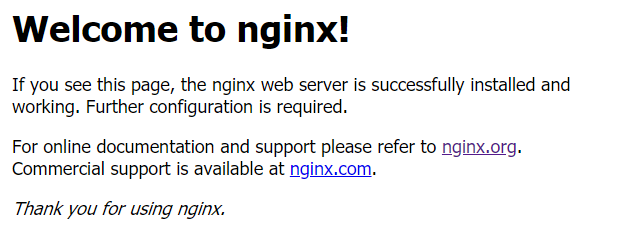
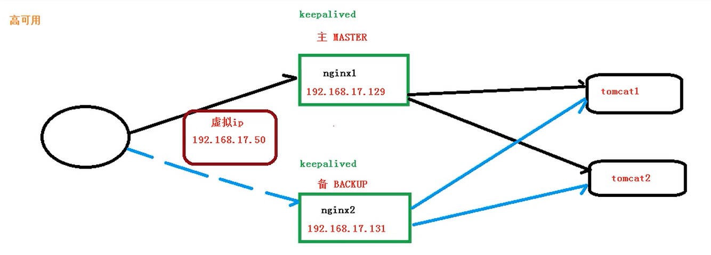
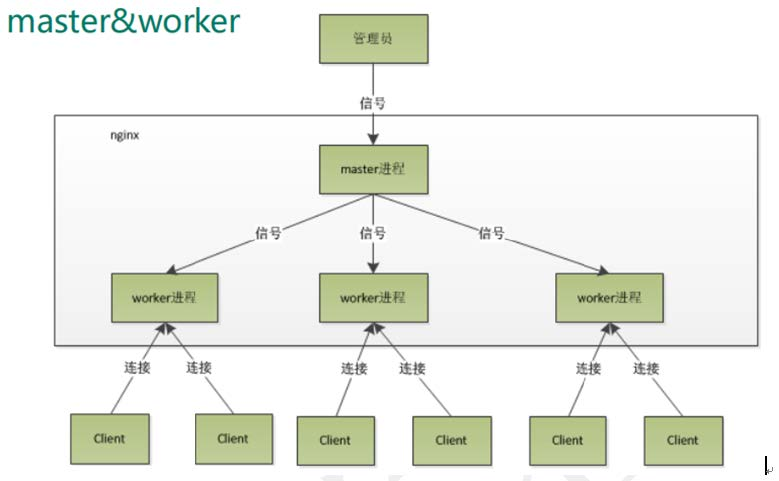
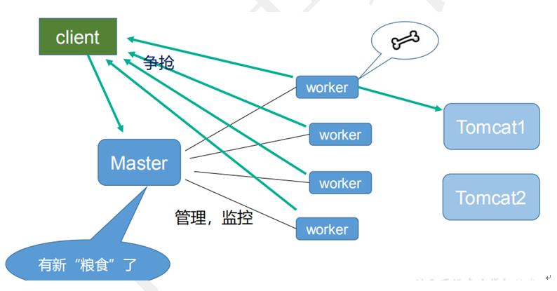

## 1. Nginx简介

1. 官网

   http://nginx.org/

2. 百度百科

   * Nginx是一个==高性能==的HTTP和反向代理web服务器，同时也提供了IMAP/POP3/SMTP服务。
   * 其将源代码以类BSD许可证的形式发布，因它的稳定性、丰富的功能集、示例配置文件和低系统资源的消耗而闻名。
   * Nginx是一款轻量级的Web 服务器/反向代理服务器及电子邮件（IMAP/POP3）代理服务器，在BSD-like 协议下发行。其特点是==占有内存少==，==并发能力强==，事实上nginx的并发能力在同类型的网页服务器中表现较好，中国大陆使用nginx网站用户有：百度、京东、新浪、网易、腾讯、淘宝等。
   * Nginx不仅可以做反向代理，实现负载均衡。 还能用作正向代理来进行上网等功能。

3. 正向代理

   如果把局域网外的Internet想想成一个巨大的资源库，则局域网中的客户端要访问Internet,则需要通过代理服务器来访问，这种代理服务就称为正向代理。

   正向代理是一个位于客户端和原始服务器之间的服务器，为了从原始服务器取得内容，客户端向代理发送一个请求并指定目标(原始服务器)，然后代理向原始服务器转交请求并将获得的内容返回给客户端。客户端才能使用正向代理。

   

4. 反向代理

   客户端对代理是无感知的，因为客户端不需要任何配置就可以访问，我们只需要将请求发送到反向代理服务器，由反向代理服务器去选择目标服务器获取数据后，再返回给客户端，此时反向代理服务器和目标服务器对外就是一个服务器，暴露的是代理服务器地址，隐藏了真实服务器IP地址。

   

5. 负载均衡

   负载均衡，英文名称为Load Balance，其含义就是指将负载（工作任务）进行平衡、分摊到多个操作单元上进行运行，例如FTP服务器、Web服务器、企业核心应用服务器和其它主要任务服务器等，从而协同完成工作任务。

   负载均衡构建在原有网络结构之上，它提供了一种透明且廉价有效的方法扩展服务器和网络设备的带宽、加强网络数据处理能力、增加吞吐量、提高网络的可用性和灵活性。

   

6. 动静分离

   动静分离是指在web服务器架构中，将静态页面与动态页面或者静态内容接口和动态内容接口分开不同系统访问的架构设计方法，进而提升整个服务访问性能和可维护性。

   

## 2. Nginx安装

### Windows下安装

1. 下载

   http://nginx.org/en/download.html

2. 解压

3. 运行

   1. 双击nginx.exe，双击后一个黑色的弹窗一闪而过，运行成功
   2. 打开cmd命令窗口，切换到nginx解压目录下，输入命令 nginx.exe 或者 start nginx ，回车即可

4. 查看运行

   tasklist /fi "imagename eq nginx.exe"

5. 输入http://localhost:80 测试访问

   

6. 关闭nginx

   1. 输入nginx命令

      * nginx -s stop(快速停止nginx)  

      * nginx -s quit(完整有序的停止nginx)

   2. 使用taskkill

      * taskkill /f /t /im nginx.exe

### Linux下安装

1. 安装依赖

   * gcc

     ````
     yum -y install gcc automake autoconf libtool make
     ````

   * g++

     ````
     yum install gcc gcc-c++
     ````

   * PCRE编译安装

     * yum安装

       ````shell
       #查看pcre是否重复
       rpm -qa | grep pcre
       #卸载重复的pcre
       yum remove 其中一个的pcre的包名
       #下载安装
       yum install -y pcre pcre-devel
       #查看pcre版本
       pcre-config --version
       ````

     * 编译安装

       ````shell
       #下载
       wget    https://netix.dl.sourceforge.net/project/pcre/pcre/8.40/pcre-8.40.tar.gz
       #解压
       tar -zxvf pcre-8.40.tar.gz
       #进入安装包目录
       cd pcre-8.40
       #编译安装  
       ./configure
       make
       make install
       #查看pcre版本
       pcre-config --version
       ````

   * zlib

     * yum安装

       ````
       yum -y install zlib
       ````

     * 源码编译安装

       ````shell
       #下载
       wget http://zlib.net/zlib-1.2.11.tar.gz
       #解压
       tar -zxvf zlib-1.2.11.tar.gz
       #进入安装包目录
       cd zlib-1.2.11
       #编译安装
       ./configure
       make
       make install
       ````

   * OpenSSL

     ````
     yum -y install openssl openssl-devel
     ````

2. Nginx安装

   * yum安装

     ````shell
     #添加Nginx到YUM源
     rpm -Uvh http://nginx.org/packages/centos/7/noarch/RPMS/nginx-release-centos-7-0.el7.ngx.noarch.rpm
     
     #安装Nginx
     yum -y install nginx
     ````

   * 源码编译安装

     ````shell
     #下载
     wget 
     #解压
     tar -zxvf 
     #进入安装包目录
     cd 
     
     #编译安装  
     ./configure
     make
     make install
     ````

3. 防火墙与端口号

   ````shell
   # 查看开放的端口号
   firewall-cmd --list-all
   # 设置开放的端口号
   firewall-cmd --add-service=http -permanent
   sudo firewall-cmd --add-port=80/tcp --permanent
   # 重启防火墙
   firewall-cmd -reload
   ````

### mac安装

1. 使用brew安装

   ````bash
   brew install nginx
   ````

2. 查看信息

   ````bash
   brew info nginx
   ````

3. 一些目录

   ````
   # 安装目录
   /usr/local/etc/nginx
   # 实际安装目录
   /usr/local/Cellar/nginx
   # 配置文件目录
   /usr/local/etc/nginx/nginx.conf
   # 网页目录
   /usr/local/var/www/
   # 启动脚本目录
   /usr/local/bin/nginx
   ````

   

4. 配置文件目录

   ````
   /usr/local/etc/nginx/nginx.conf
   ````

   

### 使用Docker安装

1. 查看可以Nginx版本

   ````
   docker search nginx
   ````

2. 拉取官方的最新版本的镜像

   ````
   docker pull nginx:latest
   ````

3. 查看本地镜像，检查是否安装了nginx

   ````
   docker images
   ````

4. 运行容器

   ````shell
   docker run --rm --name nginx-test -p 8080:80 -d nginx
    
   #命令解释
       --rm：容器终止运行后，自动删除容器文件。
       --name nginx-test：容器的名字叫做nginx-test,名字自己定义.
       -p: 端口进行映射，将本地 8080 端口映射到容器内部的 80 端口
       -d：容器启动后，在后台运行
       
   #docker文件在容器中相关位置分别是：
   日志位置：/var/log/nginx/
   配置文件位置：/etc/nginx/
   项目位置：/usr/share/nginx/html
   
   #启动时文件映射
   docker run --name docker_nginx -p 8080:80 -d 
     -v /home/naclo/docker/nginx/log:/var/log/nginx  
     -v /home/naclo/docker/nginx/conf/nginx.conf:/etc/nginx/nginx.conf
     -v /home/naclo/docker/nginx/conf.d:/etc/nginx/conf.d 
     -v /home/naclo/docker/nginx/html:/usr/share/nginx/html
     nginx
   ````

5. 查看启动的容器

   ````
   docker container ps
   ````

6. 进入正在运行的容器

   ````shell
   # 命令1
   docker exec -it 容器id /bin/bash
   
   # 命令2
   docker attach 容器id
   
   # 区别
   # exec 是在容器中打开新的终端，并且可以启动新的进程
   # attach 直接进入容器启动命令的终端，不会启动新的进程
   ````

7. 访问测试

   通过浏览器可以直接访问 8080 端口的 nginx 服务

   

## 3.Nginx常用命令和配置文件

### 常用命令

1. 启动命令

   ````shell
   nginx
   ````

2. 关闭命令

   ````shell
   nginx -s stop
   ````

3. 重新加载命令

   ````shell
   nginx -s reload
   ````

4. 查看版本号

   ````shell
   nginx -v
   ````

### 配置文件

1. 位置

   直接安装：nginx/conf/nginx.conf

   docker安装：/etc/nginx/nginx.conf

2. nginx.conf分块

   1. 全局块

      ````
      user  nginx;
      worker_processes  1;
      
      error_log  /var/log/nginx/error.log warn;
      pid        /var/run/nginx.pid;
      ````

      * 从配置文件开始到 events 块之间的内容，主要会设置一些影响nginx 服务器整体运行的配置指令，主要包括配置运行 Nginx 服务器的用户（组）、允许生成的 worker process 数，进程 PID 存放路径、日志存放路径和类型以及配置文件的引入等。

      * 这是 Nginx 服务器并发处理服务的关键配置，worker_processes 值越大，可以支持的并发处理量也越多，但是会受到硬件、软件等设备的制约

        

   2. events块

      ````
      events {
          worker_connections  1024;
      }
      ````

      * events 块涉及的指令主要影响 Nginx 服务器与用户的网络连接，常用的设置包括是否开启对多 work process 下的网络连接进行序列化，是否允许同时接收多个网络连接，选取哪种事件驱动模型来处理连接请求，每个 word process 可以同时支持的最大连接数等。

   3. http块

      ````
      http {
          include       mime.types;
          default_type  application/octet-stream;
      
          log_format  main  '$remote_addr - $remote_user [$time_local] "$request" '
                            '$status $body_bytes_sent "$http_referer" '
                            '"$http_user_agent" "$http_x_forwarded_for"';
      
      
          access_log  logs/access.log  main;
      
          sendfile        on;
          #tcp_nopush     on;
      
          keepalive_timeout  65;
      
          #gzip  on;
      
          server {
              listen       80;
              server_name  localhost;
      
              #charset koi8-r;
      
              #access_log  logs/host.access.log  main;
      
              location / {
                  root   html;
                  index  index.html index.htm;
              }
          }
      }
      ````

      * 这算是 Nginx 服务器配置中最频繁的部分，代理、缓存和日志定义等绝大多数功能和第三方模块的配置都在这里。

      * http 块也可以包括 http全局块、server 块。

        * http全局块

          ````
          include       mime.types;
          default_type  application/octet-stream;
          
          log_format  main  '$remote_addr - $remote_user [$time_local] "$request" '
          '$status $body_bytes_sent "$http_referer" '
          '"$http_user_agent" "$http_x_forwarded_for"';
          
          
          access_log  logs/access.log  main;
          
          sendfile        on;
          #tcp_nopush     on;
          
          keepalive_timeout  65;
          
          #gzip  on;
          ````

          http全局块配置的指令包括文件引入、MIME-TYPE 定义、日志自定义、连接超时时间、单链接请求数上限等。

        * server 块

          ````
          server {
                  listen       80;
                  server_name  localhost;
          
                  #charset koi8-r;
          
                  #access_log  logs/host.access.log  main;
          
                  location / {
                      root   html;
                      index  index.html index.htm;
                  }
          }
          ````

          * 这块和虚拟主机有密切关系，虚拟主机从用户角度看，和一台独立的硬件主机是完全一样的，该技术的产生是为了节省互联网服务器硬件成本。

          * 每个 http 块可以包括多个 server 块，而每个 server 块就相当于一个虚拟主机。 

          * 而每个 server 块也分为全局 server 块，以及可以同时包含多个 locaton 块。

            * 全局 server 块

              ````
              listen       80;
              server_name  localhost;
              
              #charset koi8-r;
              
              #access_log  logs/host.access.log  main;
              ````

              最常见的配置是本虚拟机主机的监听配置和本虚拟主机的名称或IP配置。

            * location 块

              ````
              location / {
                  root   html;
                  index  index.html index.htm;
              }
              ````

              一个 server 块可以配置多个 location 块。 

              这块的主要作用是基于 Nginx 服务器接收到的请求字符串（例如 server_name/uri-string），对虚拟主机名称（也可以是IP别名）之外的字符串（例如 前面的 /uri-string）进行匹配，对特定的请求进行处理。地址定向、数据缓存和应答控制等功能，还有许多第三方模块的配置也在这里进行。

              * location指令说明

                用于匹配UTL

                ````
                location [ = | ~ | ~* | ^~] uri{
                
                }
                ````

                1. =：用于不含正则表达式的 uri 前，要求请求字符串与 uri 严格匹配，如果匹配成功，就停止继续向下搜索并立即处理该请求。
                2. ~：用于表示 uri 包含正则表达式，并且区分大小写。
                3. ~*：用于表示 uri 包含正则表达式，并且不区分大小写。
                4. ^~：用于不含正则表达式的 uri 前，要求 Nginx 服务器找到标识 uri 和请求字符串匹配度最高的 location 后，立即使用此 location 处理请求，而不再使用 location 块中的正则 uri 和请求字符串做匹配。

## 4. Nginx配置实例1 反向代理

### 实例一

1. 实现效果

   打开浏览器，在地址栏输入www.naclo.com ，跳转到tomcat主页面

2. 步骤

   1. 在hosts中加上域名映射地址

      127.0.0.1  www.naclo.com

   2. 在nginx中进行转发的配置（反向代理配置）

      在location中添加`proxy_pass  需要转发的地址;`

      ````
      location / {
          root   html;
          proxy_pass http://127.0.0.1:8080;
          index  index.html index.htm;
      }
      ````

   3. 启动nginx测试

      * 访问www.naclo.com跳转成功

### 实例二

1. 实现效果

   * 使用nginx反向代理，根据访问的路径跳转到不同端口的服务中

   * nginx监听端口为9001

   * 访问http://127.0.0.1:9001/edu/直接跳转到127.0.0.1:8080

   * 访问http://127.0.0.1:9001/vod/直接跳转到127.0.0.1:8081

2. 配置server

   ```
   server {
   	listen       9001;
   	server_name  127.0.0.1;
   	
   	location ~ /edu/ {
   		proxy_pass 127.0.0.1:8080;
   	}
   	location ~ /vod/ {
   		proxy_pass 127.0.0.1:8081;
   	}
   }
   ```

3. 启动nginx，测试

   * 访问http://127.0.0.1:9001/edu/成功跳转
   * 访问http://127.0.0.1:9001/vod/成功跳转

## 5. Nginx配置实例2 负载均衡

### 负载均衡策略

1. 轮询（默认）

   * 每个请求按时间顺序逐一分配到不同的后端服务器，如果后端服务器down掉，能自动剔除。

2. weight

   * weight代表权重默认为1, 权重越高被分配的客户端多。

   * 指定轮询几率，weight和访问比率成正比，用于后端服务器性能不均的情况

     ````
     upstream server_pool{
         server 192.168.1.1 weight=10;
         server 192.168.1.2 weight=10;
     }
     ````

3. ip_hash

   * 每个请求按访问ip的hash结果分配，这样每个访客固定访问一个后端服务器，可以解决session的问题。

     ````
     upstream server_pool{
     	ip_hash; 
     	server 192.168.1.1:80; 
     	server 192.168.1.2:80; 
     }
     ````

4. fair（第三方）

   * 按后端服务器的响应时间来分配请求，响应时间短的优先分配。

     ````
     upstream server_pool{
     	server 192.168.1.1:80; 
     	server 192.168.1.2:80; 
     	fair; 
     }
     ````

### 实例一

1. 实现效果

   浏览器地址栏输入地址http://127.0.0.1/edu/a.html，负载均衡效果，平均8080和8081端口中

2. 配置

   http内加上

   ````
   upstream myserver{
   	server 127.0.0.1:8080;
   	server 127.0.0.1:8081;
   }
   ````

   location内加上

   ````
   proxy_pass myserver;
   ````

3. 启动nginx，测试

   访问http://127.0.0.1/edu/a.html，实现了负载均衡，轮流访问2080和8081

## 6. Nginx配置实例3 动静分离

### 简介

* Nginx 动静分离简单来说就是把动态跟静态请求分开，不能理解成只是单纯的把动态页面和静态页面物理分离。严格意义上说应该是动态请求跟静态请求分开，可以理解成使用Nginx 处理静态页面，Tomcat处理动态页面。
* 动静分离从目前实现角度来讲大致分为两种， 一种是纯粹把静态文件独立成单独的域名，放在独立的服务器上，也是目前主流推崇的方案； 另外一种方法就是动态跟静态文件混合在一起发布，通过 nginx 来分开。 
* 通过 location 指定不同的后缀名实现不同的请求转发。通过 expires 参数设置，可以使浏览器缓存过期时间，减少与服务器之前的请求和流量。
* 具体 Expires 定义：是给一个资源设定一个过期时间，也就是说无需去服务端验证，直接通过浏览器自身确认是否过期即可，所以不会产生额外的流量。此种方法非常适合不经常变动的资源。（如果经常更新的文件，不建议使用 Expires 来缓存），我这里设置 3d，表示在这 3 天之内访问这个 URL，发送一个请求，比对服务器该文件最后更新时间没有变化，则不会从服务器抓取，返回状态码 304，如果有修改，则直接从服务器重新下载，返回状态码 200。

### 实例一

1. 准备

   新建data文件夹

   在data文件夹新建两个文件夹www和image

   在www文件夹放入一个html页面

   在image文件夹放如一张图片

2. 配置

   修改location

   ````
   location /www/ {
   	root   C:/Users/24713/Desktop/data;
   	index  index.html index.htm;
   }
   location /image/ {
   	root   C:/Users/24713/Desktop/data;
   	autoindex on;
   }
   ````

3. 实现效果

   * 访问http://127.0.0.1:80/www/a.html可以访问页面
   * 访问http://127.0.0.1:80/image/可以列出image下文件

   * 访问http://127.0.0.1:80/image/1.jpg可以访问页面

## 7. Nginx配置高可用集群

1. Nginx高可用原理



2. 准备

   1. 需要两台nginx服务器

      * 主ip为192.168.17.129

      * 附ip为192.168.17.131

   2. 需要keepalived

      * 安装keepalived

        ````shell
        yum install keepalived -y
        ````

      * 安装之后，在etc里面生成目录keepalived，有文件keepalived.conf

   3. 需要虚拟ip

3. 完成高可用配置（主从配置）

   修改keepalived.conf

   ````
   ! Configuration File for keepalived
   
   global_defs {
      notification_email {
        acassen@firewall.loc
        failover@firewall.loc
        sysadmin@firewall.loc
      }
      notification_email_from Alexandre.Cassen@firewall.loc
      smtp_server 192.168.17.129
      smtp_connect_timeout 30
      router_id LVS_DEVEL
   }
   vrr_script chk_http_port{
   	script "/usr/local/src/nginx_check.sh"
   	interval 2     #(检测脚本执行的间隔)
   	weight 2
   }
   vrrp_instance VI_1 {
       state MASTER  # 备份服务器上讲MASTER改为BACKUP
       interface ens33 # 网卡
       virtual_router_id 51   # 主备机的virtual_router_id必须相同
       priority 100    #主备机取不同的优先级，主机值较大，备份机较小
       advert_int 1
       authentication {
           auth_type PASS
           auth_pass 1111
       }
       virtual_ipaddress {
           192.168.17.50   # VRRP 虚拟地址
       }
   }
   ````

   创建/usr/local/src/nginx_check.sh文件

   ````shell
   #!/bin/bash
   A=`ps -C nginx –no-header |wc -l`
   if [ $A -eq 0 ];then
       /usr/local/nginx/sbin/nginx
       sleep 2
       if [ `ps -C nginx --no-header |wc -l` -eq 0 ];then
           killall keepalived
       fi
   fi
   ````

4. 启动nginx和keepalived

   * 启动nginx：nginx

   * 启动keepalived：systemctl start keepalived.service

5. 测试

   1. 在浏览器地址栏输入虚拟ip地址192.168.17.50可以访问

   2. 把主服务器(192.168.17.129) nginx 和keepalived停止，再输入192.168.17.50 可以访问

## 8. Nginx原理

1. master个worker

   

2. worker如何进行工作

   

3. 一个master和多个worker的好处

   1. 可以使用nginx -s reload热部署，利用nginx进行热部署操作
   2. 每个worker是独立的进程，如果有其中一个worker出现问题，其他worker独立的，继续进行争抢，实现请求过程，不会造成服务中断。

4. 设置多少个worker合适

   * worker的数量和服务器的cpu数相等是最为适宜的。

5. 连接数worker_connection

   1. 发送请求，占用了worker的几个连接数？
      * 2个或4个
   2. nginx有一个master，四个worker，每个worker支持最大的连接数1024，支持的最大并发数是多少
      * 普通的静态访问最大并发数是：worker_connection*worker_processes/2
      * 如果是HTTP作为反向代理，最大并发数是：worker_connection*worker_processes/4