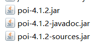
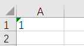
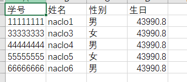
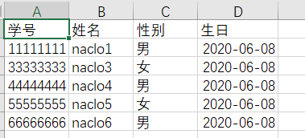
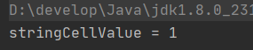
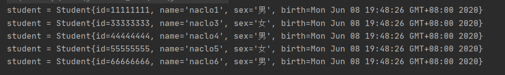

## 简介

### 百度百科

* Apache POI是[Apache软件基金会](https://baike.baidu.com/item/Apache软件基金会)的开放源码函式库，POI提供API给Java程序对Microsoft Office格式档案读和写的功能。

### 基本功能

* HSSF － 提供读写Microsoft Excel格式档案的功能。
* XSSF － 提供读写Microsoft Excel OOXML格式档案的功能。
* HWPF － 提供读写Microsoft Word格式档案的功能。
* HSLF － 提供读写Microsoft PowerPoint格式档案的功能。
* HDGF － 提供读写Microsoft Visio格式档案的功能。

### 如何下载

1. POM方式

   ````xml
   <!-- poi主体 -->
   <dependency>
       <groupId>org.apache.poi</groupId>
       <artifactId>poi</artifactId>
       <version>4.1.2</version>
   </dependency>
   <!-- poi对ooxml格式的支持 -->
   <dependency>
       <groupId>org.apache.poi</groupId>
       <artifactId>poi-ooxml</artifactId>
       <version>4.1.2</version>
   </dependency>
   ````

2. jar包方式

   通过对pom文件进行分析poi依赖以下几个包，可自行下载导入

   以poi 4.1.2为例

   ```
   org.apache.poi:poi:4.1.2
   org.apache.poi:poi-ooxml:4.1.2
   org.apache.poi:poi-ooxml-schemas:4.1.2
   org.apache.xmlbeans:xmlbeans:3.1.0
   com.github.virtuald:curvesapi:1.06
   com.zaxxer:SparseBitSet:1.2
   commons-codec:commons-codec:1.13
   org.apache.commons:commons-collections4:4.4
   org.apache.commons:commons-math3:3.6.1
   org.apache.commons:commons-compress:1.19
   ```

3. 我这里下载好了，打包了一份，可以自行下载

   

   * 正常文件名的为jar包
   * 以javadoc结尾的为javadoc文档

   * 以sources结尾的为源代码

   * 文档和源代码可以自行选择要不要导入

## 操作Excel

### 写文件

1. 简单写一个文件步骤

   ````java
   @Test
   public void testWrite() throws Exception {
       //设置文件路径
       String PATH = "D:\\";
       //1、创建一个工作簿
       //如果是要2007版本之前的是new HSSFWorkbook();文件名以xls结尾
       //如果是要2007版本之后的是new XSSFWorkbook();文件名以xlsx结尾
       Workbook workbook = new XSSFWorkbook();
       
       //2、创建一个工作表，参数可以填表的名字，不填就是默认名字Sheet
       Sheet sheet = workbook.createSheet();
       
       //3、创建一个行
       Row row = sheet.createRow(0);
       
       //4、创建一个单元格
       Cell cell = row.createCell(0);
       
       //5、为单元格赋值
       cell.setCellValue("1");
   
       //创建一个文件流，excel2007之前是xls结尾文件名，之后是xlsx结尾
       FileOutputStream fileOutputStream = new FileOutputStream(PATH + "testWrite.xlsx");
       //以文件流的新式输出
       workbook.write(fileOutputStream);
       
       //流使用完要关闭
       fileOutputStream.close();
   }
   ````

   运行后输出结果

   

2. 从数据库读数据并输出

   创建一个实体类

   ````java
   public class Student {
       int id;
       String name;
       String sex;
       Date birth;
   	//省略构造器，getter,setter,toString等方法
   }
   ````

   写一个初始化该实体类的方法，应该是要从数据库中读取，为了方便，就直接赋值了

   ```java
   public  List<Student> initStudentList(){
       List<Student> studentList=new ArrayList<>();
       studentList.add(new Student(11111111,"naclo1","男",new Date()));
       studentList.add(new Student(33333333,"naclo3","女",new Date()));
       studentList.add(new Student(44444444,"naclo4","男",new Date()));
       studentList.add(new Student(55555555,"naclo5","女",new Date()));
       studentList.add(new Student(66666666,"naclo6","男",new Date()));
       return studentList;
   }
   ```

   创建表格

   ```java
   @Test
   public void testWriteStudentList() throws Exception {
       //设置文件路径
       String PATH = "D:\\";
       //获取学生列表，应该是从数据库中读取
       List<Student> studentList=this.initStudentList();
   
       //创建工作簿
       Workbook workbook = new XSSFWorkbook();
   
       //创建工作表
       Sheet sheet = workbook.createSheet("学生表");
   
       //3、设置表头,默认下标从0开始
       //可以对表头设置格式，请看下文
       Row row = sheet.createRow(0);
       row.createCell(0).setCellValue("学号");
       row.createCell(1).setCellValue("姓名");
       row.createCell(2).setCellValue("性别");
       row.createCell(3).setCellValue("生日");
   
       //循环为表赋值
       for (int rowNum = 1; rowNum <= studentList.size(); rowNum++) {
           //列表下标是从0开始，而循环是从1开始，所以下标要减一
           Student student = studentList.get(rowNum - 1);
           row = sheet.createRow(rowNum);
           //为正常的表格数据赋值
           row.createCell(0).setCellValue(student.getId());
           row.createCell(1).setCellValue(student.getName());
           row.createCell(2).setCellValue(student.getSex());
           //设置日期会是默认以数字形式输出，所以要对日期进行格式化，请看下文
           row.createCell(3).setCellValue(student.getBirth());
       }
   
       //输出学生表到目录
       FileOutputStream fileOutputStream = new FileOutputStream(PATH + "StudentList.xlsx");
       workbook.write(fileOutputStream);
       fileOutputStream.close();
   }
   ```

   运行后输出结果

   

3. 设置日期会是默认以数字新式输出，所以要对日期进行格式化

   ````java
   //创建一个单元格
   Cell cell = row.createCell(3);
   //为单元格赋值，为日期类型
   cell.setCellValue(student.getBirth());
   //把单元格设置为日期格式
   CreationHelper createHelper = workbook.getCreationHelper();
   CellStyle cellStyle = workbook.createCellStyle();
   //把单元格设置为日期格式
   cellStyle.setDataFormat(createHelper.createDataFormat().getFormat("yyyy-MM-dd"));
   //单元格应用格式
   cell.setCellStyle(cellStyle);
   ````

   运行后输出结果

   

4. 设置数字会是默认以字符串形式输出，所以要对格式进行修改，否则不好应用一些公式

   整数 

   ````java
   Cell cell = row.createCell(0);
   cell.setCellValue(student.getId());
   CellStyle cellStyle = workbook.createCellStyle();
   cellStyle.setDataFormat(HSSFDataFormat.getBuiltinFormat("0"));
   cell.setCellStyle(cellStyle);
   ````

   小数

   ````java
   Cell cell = row.createCell(0);
   cell.setCellValue(student.getId());
   HSSFCellStyle cellStyle = workbook.createCellStyle();
   cellStyle.setDataFormat(HSSFDataFormat.getBuiltinFormat("0.00"));
   cell.setCellStyle(cellStyle);
   ````

5. 为表头设置样式

   ````java
   //给第一行表头设置字体格式
   Row row = sheet.getRow(0);
   for (int cellNum = 0; cellNum <4; cellNum++) {
       //创建格式
       CellStyle cellStyle = workbook.createCellStyle();
       //创建字体
       Font font = workbook.createFont();
       //设置字体
       font.setFontName("宋体");
       //字体设置为加粗
       font.setBold(true);
       //设置字体颜色
       font.setColor((short)1);
       //设置字体大小
       font.setFontHeightInPoints((short)20);
       //选择需要用到的字体格式
       cellStyle.setFont(font);
       //为单元格设置格式
       row.getCell(cellNum).setCellStyle(cellStyle);
   }
   ````

6. 设置自适应列宽

   ```java
   //设置自适应列宽
   sheet.autoSizeColumn(3);
   ```

### 读文件

1. 简单读一个文件步骤，以前面输出的testWrite.xlsx文件为例

   ````java
   @Test
   public void testRead() throws Exception {
       //1、获取文件流
       FileInputStream inputStream = new FileInputStream(PATH + "testWrite.xlsx");
       //2、获得工作簿
       Workbook workbook = new XSSFWorkbook(inputStream);
       //3、获得工作表
       Sheet sheet = workbook.getSheetAt(0);
       //4、获得行
       Row row = sheet.getRow(0);
       //5、获得单元格
       Cell cell = row.getCell(0);
       //获取表的值
       String stringCellValue = cell.getStringCellValue();
       System.out.println("stringCellValue = " + stringCellValue);
   
       //流使用完要关闭
       inputStream.close();
   }
   ````

   输出结果

   

2. 从读数据并进行持久化，以前面输出的StudentList.xlsx文件为例

   写一个持久化方法，这里就简单的输出

   ````java
   public void saveStudent(Student student){
       System.out.println("student = " + student);
   }
   ````

   读取文件

   ````java
   @Test
   public void testStudentList() throws Exception {
       //获取文件流
       FileInputStream inputStream = new FileInputStream(PATH + "StudentList.xlsx");
       //获得工作簿
       Workbook workbook = new XSSFWorkbook(inputStream);
       //获得工作表
       Sheet sheet = workbook.getSheetAt(0);
       //获取行数
       int physicalNumberOfRows = sheet.getPhysicalNumberOfRows();
       //循环获取行，因为第一行是表头，所以跳过，下标从2开始
       for (int i = 1; i < physicalNumberOfRows; i++) {
           //获得行
           Row row = sheet.getRow(i);
           //注意，表格上的数据类型不同，获取数值的方法不同
           //获取数字类型的数据,返回值是double，这里强转为int
           int cell0 = (int)row.getCell(0).getNumericCellValue();
           //获取字符串类型的数据
           String cell1 = row.getCell(1).getStringCellValue();
           //获取字符串类型的数据
           String cell2 = row.getCell(2).getStringCellValue();
           //获取日期类型的数据
           Date cell3 = row.getCell(3).getDateCellValue();
   
           //对数据进行持久化操作
           saveStudent(new Student(cell0,cell1,cell2,cell3));
       }
   
       //流使用完要关闭
       inputStream.close();
   }
   ````

   运行后输出结果

   