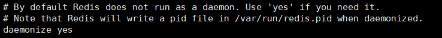
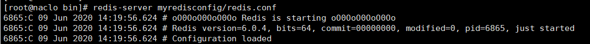

## Redis介绍

1. 百度百科

   Redis（==Re==mote ==Di==ctionary ==S==erver )，即==远程字典服务==，是一个开源的使用ANSI C语言编写、支持网络、可基于内存亦可持久化的日志型、==Key-Value数据库==，并提供多种语言的API。从2010年3月15日起，Redis的开发工作由VMware主持。从2013年5月开始，Redis的开发由Pivotal赞助。

2. 官网

   * 英文官网https://redis.io/
   * 中文官网http://www.redis.cn/

## Redis安装

### Winsows下安装

1. 下载

   https://github.com/dmajkic/redis/downloads

2. 解压

3. 双击 redis-server.exe 启动即可

4. 通过客户端去访问

   `redis-cli`

### Linux下安装

1. 下载

   https://redis.io/download

2. 上传到Linux服务器下/opt目录

3. 解压

   `tar -zxvf redis-6.0.4.tar.gz`

4. 进入目录

   ` cd redis-6.0.4 `

5. 编译

   `make`

   

6. 安装

   `make install`

   

7. 查看默认安装目录：/usr/local/bin

   `cd /usr/local/bin`

8. 拷贝配置文件（备用）

   ````shell
   # 在redis的解压目录下备份redis.conf
   mkdir myredisconfig
   # 拷一个备份，养成良好的习惯，我们就修改这个文件
   cp redis.conf myredisconfig 
   
   ````

9. 修改配置保证可以后台应用

   ````shell
   # 修改配置保证可以后台应用
   vim redis.conf
   #修改 daemonize改为yes
   ````

   * 默认情况

     

   * 修改后

     

   * daemonize 设置yes或者no区别
     * daemonize:yes
       redis采用的是单进程多线程的模式。当redis.conf中选项daemonize设置成yes时，代表开启
       守护进程模式。在该模式下，redis会在后台运行，并将进程pid号写入至redis.conf选项
       pidfile设置的文件中，此时redis将一直运行，除非手动kill该进程。
     * daemonize:no
       当daemonize选项设置成no时，当前界面将进入redis的命令行界面，exit强制退出或者关闭
       连接工具(putty,xshell等)都会导致redis进程退出。

10. 启动测试

    ````shell
    # 进入安装目录
    cd /usr/local/bin
    # 通过自定义配置文件启动
    redis-server myredisconfig/redis.conf
    ````

    正常启动

    

    后台启动

    

11. 使用redis客户端连接

    ````
    cd /usr/local/bin
    redis-cli -p 6379
    ````

    

12. 查看当前进程信息

    ps -ef|grep redis

    

13. 关闭连接

    ````shell
    # 关闭Redis
    shutdown
    # 退出连接
    exit
    ````

    


### Mac下安装

1. 使用homebrew安装

   ````bash
   brew install redis
   ````

2. 配置文件位置

   ````
   /usr/local/etc/redis.conf
   ````

### Docker安装

1. 查看可用的 Redis 版本

   `docker search redis`

   

2. 拉取官方的最新版本的镜像

   `docker pull redis:latest`

   

3. 查看本地镜像

   `docker images`

   

4. 运行容器

   ````shell
   docker run -d --rm --name redis-test -p 6379:6379 redis
   #命令解释
       --rm：容器终止运行后，自动删除容器文件。
       --name redis-test：容器的名字叫做redis-test,名字自己定义.
       -p: 端口进行映射，将本地 6379 端口映射到容器内部的 6379 端口
       -d：容器启动后，在后台运行
   
   #docker文件在容器中相关位置：
   配置文件位置：/etc/redis/redis.conf
   数据位置：/data
   
   #启动时文件映射
   docker run --rm --name redis-test1 -p 6379:6379 -d -v /home/naclo/docker/redis/config/redis.conf:/etc/redis/redis.conf -v /home/naclo/docker/redis/data:/data redis redis-server /etc/redis/redis.conf
   ````

   

5. 进入docker

   `docker exec -it redis-test /bin/bash`

   

6. 通过 redis-cli 连接测试使用 redis 服务

   `redis-cli -p 6379`

   

## Redis配置文件详解

````bash
#修改为守护模式
daemonize yes
#设置进程锁文件
pidfile /usr/local/redis-3.2.8/redis.pid
#端口
port 6379
#客户端超时时间
timeout 300
#日志级别
loglevel debug
#日志文件位置
logfile /usr/local/redis-3.2.8/log-redis.log
#设置数据库的数量，默认数据库为0，可以使用SELECT <dbid>命令在连接上指定数据库id
databases 16
##指定在多长时间内，有多少次更新操作，就将数据同步到数据文件，可以多个条件配合
#save <seconds> <changes>
#Redis默认配置文件中提供了三个条件：
save 900 1
save 300 10
save 60 10000
#指定存储至本地数据库时是否压缩数据，默认为yes，Redis采用LZF压缩，如果为了节省CPU时间，
#可以关闭该#选项，但会导致数据库文件变的巨大
rdbcompression yes
#指定本地数据库文件名
dbfilename dump.rdb
#指定本地数据库路径
dir /usr/local/redis-3.2.8/db/
#指定是否在每次更新操作后进行日志记录，Redis在默认情况下是异步的把数据写入磁盘，如果不开启，可能
#会在断电时导致一段时间内的数据丢失。因为 redis本身同步数据文件是按上面save条件来同步的，所以有
#的数据会在一段时间内只存在于内存中
appendonly no
#指定更新日志条件，共有3个可选值：
#no：表示等操作系统进行数据缓存同步到磁盘（快）
#always：表示每次更新操作后手动调用fsync()将数据写到磁盘（慢，安全）
#everysec：表示每秒同步一次（折衷，默认值）
appendfsync everysec
````


## Redis使用

