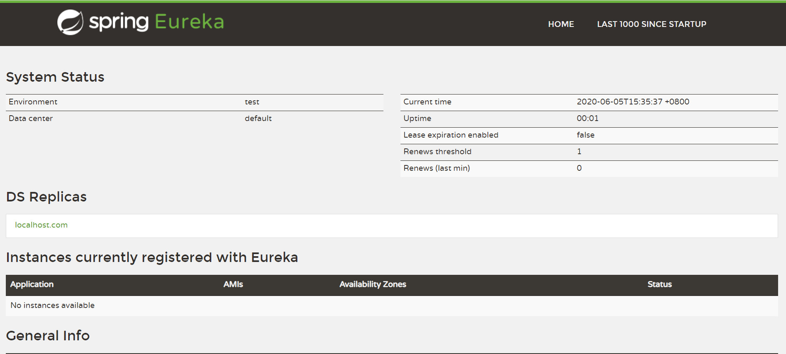
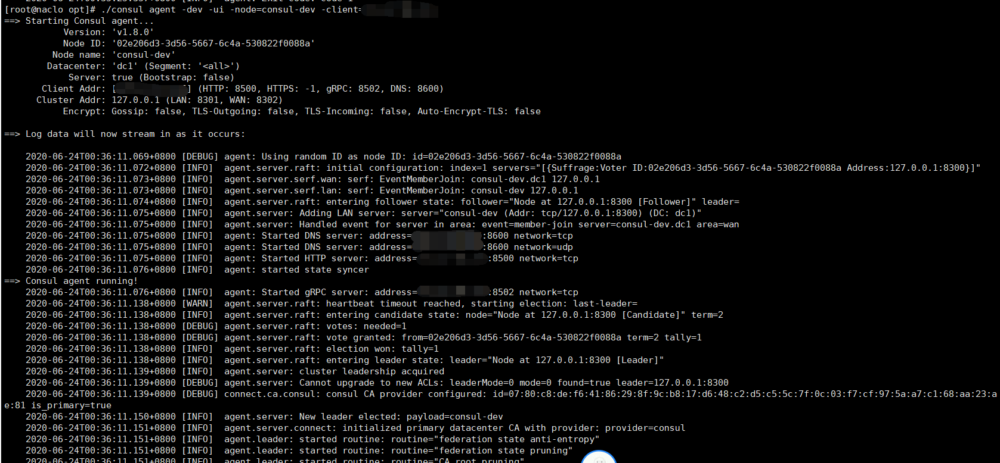
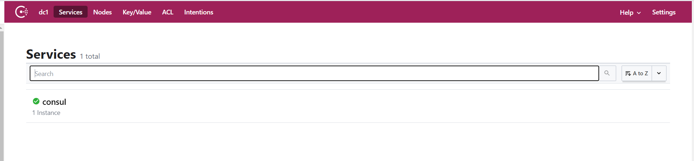

SpringCloud官网https://spring.io/projects/spring-cloud

中文官网https://www.springcloud.cc/

## 分布式理论

### CAP理论

1. CAP

   * C：Consistency（强一致性）

     在分布式系统中的所有数据备份，在同一时刻是否同样的值。等同于所有节点访问同一份最新的数据副本。

   * A：Availability（可用性）

     在集群中一部分节点故障后，集群整体是否还能响应客户端的读写请求。对数据更新具备高可用性。

   * P：Partition tolerance（分区容错性）

     以实际效果而言，分区相当于对通信的时限要求。系统如果不能在时限内达成数据一致性，就意味着发生了分区的情况，必须就当前操作在C和A之间做出选择。

2. 核心==一个分布式系统不可能同时很好的满足一致性，可用性和分区容错性这三个需求==

3. 分类

   * CA - 单点集群，满足一致性，可用性的系统，通常在课扩展性上不太强大
   * CP - 满足一致性，分区容忍性的系统，通常性能不是特别高
   * AP - 满足可用性，分区容忍性的系统，通常可能对一致性要求低一些


### BASE理论

1. BASE

   * BA：Basically Available（基本可用）

     基本可用是指分布式系统在出现不可预知故障的时候，允许损失部分可用性——但请注意，这绝不等价于系统不可用。

   * S：Soft State（软状态）

     也称为弱状态，和硬状态相对，是指允许系统中的数据存在中间状态，并认为该中间状态的存在不会影响系统的整体可用性，即允许系统在不同节点的数据副本之间进行数据同步的过程存在延时。

   * E：Eventually Consistent（最终一致性）

     是系统中所有的数据副本，在经过一段时间的同步后，最终能够达到一个一致的状态。因此，最终一致性的本质是需要系统保证最终数据能够达到一致，而不需要实时保证系统数据的强一致性


## 1. 环境搭建

#### 1. 创建父工程

1. pom依赖

   ````xml
   <!-- 配置打包方式 -->
   <packaging>pom</packaging>
   
   <!-- 统一管理jar包版本 -->
   <properties>
       <project.build.sourceEncoding>UTF-8</project.build.sourceEncoding>
       <maven.compiler.source>1.8</maven.compiler.source>
       <maven.compiler.target>1.8</maven.compiler.target>
       <junit.version>4.12</junit.version>
       <log4j.version>1.2.17</log4j.version>
       <lombok.version>1.16.18</lombok.version>
       <mysql.version>5.1.47</mysql.version>
       <druid.version>1.1.16</druid.version>
       <mybatis.spring.boot.version>1.3.0</mybatis.spring.boot.version>
   </properties>
   
   <!-- 子模块继承之后，提供作用：锁定版本+子modlue不用写groupId和version  -->
   <dependencyManagement>
       <dependencies>
           <!--spring boot 2.2.2-->
           <dependency>
               <groupId>org.springframework.boot</groupId>
               <artifactId>spring-boot-dependencies</artifactId>
               <version>2.2.2.RELEASE</version>
               <type>pom</type>
               <scope>import</scope>
           </dependency>
           <!--spring cloud Hoxton.SR1-->
           <dependency>
               <groupId>org.springframework.cloud</groupId>
               <artifactId>spring-cloud-dependencies</artifactId>
               <version>Hoxton.SR1</version>
               <type>pom</type>
               <scope>import</scope>
           </dependency>
           <!--spring cloud alibaba 2.1.0.RELEASE-->
           <dependency>
               <groupId>com.alibaba.cloud</groupId>
               <artifactId>spring-cloud-alibaba-dependencies</artifactId>
               <version>2.1.0.RELEASE</version>
               <type>pom</type>
               <scope>import</scope>
           </dependency>
           <dependency>
               <groupId>mysql</groupId>
               <artifactId>mysql-connector-java</artifactId>
               <version>${mysql.version}</version>
           </dependency>
           <dependency>
               <groupId>com.alibaba</groupId>
               <artifactId>druid</artifactId>
               <version>${druid.version}</version>
           </dependency>
           <dependency>
               <groupId>org.mybatis.spring.boot</groupId>
               <artifactId>mybatis-spring-boot-starter</artifactId>
               <version>${mybatis.spring.boot.version}</version>
           </dependency>
           <dependency>
               <groupId>junit</groupId>
               <artifactId>junit</artifactId>
               <version>${junit.version}</version>
           </dependency>
           <dependency>
               <groupId>log4j</groupId>
               <artifactId>log4j</artifactId>
               <version>${log4j.version}</version>
           </dependency>
           <dependency>
               <groupId>org.projectlombok</groupId>
               <artifactId>lombok</artifactId>
               <version>${lombok.version}</version>
               <optional>true</optional>
           </dependency>
       </dependencies>
   </dependencyManagement>
   
   <build>
       <plugins>
           <plugin>
               <groupId>org.springframework.boot</groupId>
               <artifactId>spring-boot-maven-plugin</artifactId>
               <configuration>
                   <fork>true</fork>
                   <addResources>true</addResources>
               </configuration>
           </plugin>
       </plugins>
   </build>
   ````

2. ss

#### 2. 创建子模块1：支付模块

1. 子模块名称

   `cloud-provider-payment8001`

2. pom依赖

   ````xml
   <dependencies>
       <dependency>
           <groupId>org.springframework.boot</groupId>
           <artifactId>spring-boot-starter-web</artifactId>
       </dependency>
       <dependency>
           <groupId>org.springframework.boot</groupId>
           <artifactId>spring-boot-starter-actuator</artifactId>
       </dependency>
       <dependency>
           <groupId>org.mybatis.spring.boot</groupId>
           <artifactId>mybatis-spring-boot-starter</artifactId>
       </dependency>
       <dependency>
           <groupId>com.alibaba</groupId>
           <artifactId>druid-spring-boot-starter</artifactId>
           <version>1.1.10</version>
       </dependency>
       <!--mysql-connector-java-->
       <dependency>
           <groupId>mysql</groupId>
           <artifactId>mysql-connector-java</artifactId>
       </dependency>
       <!--jdbc-->
       <dependency>
           <groupId>org.springframework.boot</groupId>
           <artifactId>spring-boot-starter-jdbc</artifactId>
       </dependency>
       <dependency>
           <groupId>org.springframework.boot</groupId>
           <artifactId>spring-boot-devtools</artifactId>
           <scope>runtime</scope>
           <optional>true</optional>
       </dependency>
       <dependency>
           <groupId>org.projectlombok</groupId>
           <artifactId>lombok</artifactId>
           <optional>true</optional>
       </dependency>
       <dependency>
           <groupId>org.springframework.boot</groupId>
           <artifactId>spring-boot-starter-test</artifactId>
           <scope>test</scope>
       </dependency>
   </dependencies>
   ````

3. 创建application.yml

   ````yml
   server:
     port: 8001
   
   spring:
     application:
       name: cloud-provider-payment
     datasource:
       type: com.alibaba.druid.pool.DruidDataSource            # 当前数据源操作类型
       driver-class-name: org.gjt.mm.mysql.Driver              # mysql驱动包
       url: jdbc:mysql://localhost:3306/springcloudstudy?serverTimezone=Asia/Shanghai&useSSL=true&useUnicode=true&characterEncoding=UTF-8
       username: root
       password: root
   
   mybatis:
     mapperLocations: classpath:mapper/*.xml
     type-aliases-package: com.naclo.entities    # 所有Entity别名类所在包
   ````

4. 创建主启动类PaymentMain8001

   ````java
   @SpringBootApplication
   public class PaymentMain8001 {
       public static void main(String[] args) {
           SpringApplication.run(PaymentMain8001.class, args);
       }
   }
   ````

5. 编写业务类

   1. 创建数据库，表

      ````sql
      # 创建数据库
      CREATE DATABASE `springcloudstudy`;
      
      # 建payment表
      CREATE TABLE payment(
          id bigint(20) NOT NULL AUTO_INCREMENT COMMENT 'ID',
          serial varchar(200) DEFAULT '',
          PRIMARY KEY (id)
      )ENGINE=InnoDB AUTO_INCREMENT=1 DEFAULT CHARSET=utf8;
      
      # 插入数据
      INSERT INTO payment(serial) values ('123456');
      ````

   2. 创建实体类

      *主实体Payment*

      ````java
      @Data
      @AllArgsConstructor
      @NoArgsConstructor
      public class Payment implements Serializable {
          private Long id;
          private String serial;
      }
      ````

      *json封装实体CommonResult*

      ````java
      @Data
      @AllArgsConstructor
      @NoArgsConstructor
      public class CommonResult<T> {
          private Integer code;
          private String message;
          private T data;
      
          public CommonResult(Integer code, String message) {
              this(code, message, null);
          }
      }
      ````

   3. dao

      *PaymentDao*

      ````java
      @Mapper
      public interface PaymentDao {
          public int create(Payment payment);
      
          public Payment getPaymentById(@Param("id") Long id);
      }
      ````

      *PaymentMapper*

      ````xml
      <?xml version="1.0" encoding="UTF-8" ?>
      <!DOCTYPE mapper PUBLIC "-//mybatis.org//DTD Mapper 3.0//EN" "http://mybatis.org/dtd/mybatis-3-mapper.dtd" >
      
      <mapper namespace="com.naclo.dao.PaymentDao">
      
          <insert id="create" parameterType="Payment" useGeneratedKeys="true" keyProperty="id">
              insert into payment(serial)
              values (#{serial});
          </insert>
      
          <resultMap id="BaseResultMap" type="com.naclo.entities.Payment">
              <id column="id" property="id" jdbcType="BIGINT"/>
              <id column="serial" property="serial" jdbcType="VARCHAR"/>
          </resultMap>
      
          <select id="getPaymentById" parameterType="Long" resultMap="BaseResultMap">
              select *
              from payment
              where id = #{id};
          </select>
      </mapper>
      ````

   4. service

      *PaymentService*

      ````java
      public interface PaymentService {
          public int create(Payment payment);
      
          public Payment getPaymentById(Long id);
      }
      ````

      *PaymentServiceImpl*

      ````java
      @Service
      public class PaymentServiceImpl implements PaymentService {
          @Resource
          private PaymentDao paymentDao;
      
          @Override
          public int create(Payment payment) {
              return paymentDao.create(payment);
          }
      
          @Override
          public Payment getPaymentById(Long id) {
              return paymentDao.getPaymentById(id);
          }
      }
      ````

   5. controller

      *PaymentController*

      ````java
      @RestController
      @Slf4j
      public class PaymentController {
      
          @Resource
          private PaymentService paymentService;
      
          @PostMapping(value = "/payment/create")
          public CommonResult create(@RequestBody Payment payment) {
              int result = paymentService.create(payment);
              if (result > 0) {
                  return new CommonResult(200, "插入数据库成功", result);
              } else {
                  return new CommonResult(444, "插入数据库失败", null);
              }
          }
      
          @GetMapping(value = "/payment/get/{id}")
          public CommonResult<Payment> getPaymentById(@PathVariable("id") Long id) {
              Payment payment = paymentService.getPaymentById(id);
              if (payment != null) {
                  return new CommonResult(200, "查询成功", payment);
              } else {
                  return new CommonResult(444, "没有对应记录,查询ID: " + id, null);
              }
          }
      }
      ````

6. 启动，测试

   1. get数据

      发送：`http://localhost:8001/payment/get/1`

      返回：`{"code":200,"message":"查询成功","data":{"id":1,"serial":"123456"}}`

   2. post数据

      发送：`http://localhost:8001/payment/create?serial=222`

      返回：`{"code":200,"message":"插入数据库成功","data":1}`

#### 3. 开启热部署Devtools

1. 在子工程添加pom依赖

   ````xml
   <dependency>
       <groupId>org.springframework.boot</groupId>
       <artifactId>spring-boot-devtools</artifactId>
       <scope>runtime</scope>
       <optional>true</optional>
   </dependency>
   ````

2. 在父工程pom添加插件

   ````xml
   <build>
       <plugins>
           <plugin>
               <groupId>org.springframework.boot</groupId>
               <artifactId>spring-boot-maven-plugin</artifactId>
               <configuration>
                   <fork>true</fork>
                   <addResources>true</addResources>
               </configuration>
           </plugin>
       </plugins>
   </build>
   ````

3. 开启自动编译选项

   File | Settings | Build, Execution, Deployment | Compiler

   勾选

   * `Automatically show first error in editor`
   * `Display notification on build completion`
   * `Build project automatically`
   * `Compile independent modules in parallel`

4. 注册

   `ctrl+shift+alt+/`选择`1. Registry...`

   勾选`compiler.automake.allow.when.app.running`

5. 重启

#### 4 创建子模块2：消费者订单模块

1. 子模块名称

   `cloud-consumer-order80`

2. pom依赖

   ````xml
   <dependencies>
       <dependency>
           <groupId>org.springframework.boot</groupId>
           <artifactId>spring-boot-starter-web</artifactId>
       </dependency>
       <dependency>
           <groupId>org.springframework.boot</groupId>
           <artifactId>spring-boot-starter-actuator</artifactId>
       </dependency>
       <dependency>
           <groupId>org.springframework.boot</groupId>
           <artifactId>spring-boot-devtools</artifactId>
           <scope>runtime</scope>
           <optional>true</optional>
       </dependency>
       <dependency>
           <groupId>org.projectlombok</groupId>
           <artifactId>lombok</artifactId>
           <optional>true</optional>
       </dependency>
       <dependency>
           <groupId>org.springframework.boot</groupId>
           <artifactId>spring-boot-starter-test</artifactId>
           <scope>test</scope>
       </dependency>
   </dependencies>
   ````

3. 创建application.yml

   ````yml
   server:
     port: 80
   ````

4. 创建主启动类OrderMain80

   ````java
   @SpringBootApplication
   public class OrderMain80 {
       public static void main(String[] args) {
           SpringApplication.run(OrderMain80.class, args);
       }
   }
   ````

5. 复制实体类Payment以及CommonResult

6. 引入RestTemplate

   ````java
   @Configuration
   public class ApplicationContextConfig {
       @Bean
       public RestTemplate getRestTemplate() {
           return new RestTemplate();
       }
   }
   ````

7. 编写controller

   ````java
   @RestController
   @Slf4j
   public class OrderController {
       public static final String PAYMENT_URL = "http://localhost:8001";
   
       @Resource
       private RestTemplate restTemplate;
   
       @GetMapping("/consumer/payment/create")
       public CommonResult<Payment> create(Payment payment) {
           return restTemplate.postForObject(PAYMENT_URL + "/payment/create", payment, CommonResult.class);
       }
   
       @GetMapping("/consumer/payment/get/{id}")
       public CommonResult<Payment> getPayment(@PathVariable("id") Long id) {
           return restTemplate.getForObject(PAYMENT_URL + "/payment/get/" + id, CommonResult.class);
       }
   }
   ````

8. 启动，测试

   1. get数据

      发送：`http://localhost:80/consumer/payment/get/1`

      返回：`{"code":200,"message":"查询成功","data":{"id":1,"serial":"123456"}}`

   2. post数据

      发送：`http://localhost:80/consumer/payment/create?serial=222`

      返回：`{"code":200,"message":"插入数据库成功","data":1}`

#### 5. 工程重构：提取公共模块

1. 子模块名称

   `cloud-api-commons`

2. pom依赖

   ````xml
   <dependencies>
       <!--日常通用jar包配置-->
       <dependency>
           <groupId>org.springframework.boot</groupId>
           <artifactId>spring-boot-devtools</artifactId>
           <scope>runtime</scope>
           <optional>true</optional>
       </dependency>
       <dependency>
           <groupId>org.projectlombok</groupId>
           <artifactId>lombok</artifactId>
           <optional>true</optional>
       </dependency>
       <dependency>
           <groupId>org.springframework.boot</groupId>
           <artifactId>spring-boot-starter-test</artifactId>
           <scope>test</scope>
       </dependency>
       <dependency>
           <groupId>cn.hutool</groupId>
           <artifactId>hutool-all</artifactId>
           <version>5.1.0</version>
       </dependency>
   </dependencies>
   ````

3. 复制实体类Payment以及CommonResult

4. maven clean install

5. 在项目中引入自己定义的api

   ````xml
   <dependency><!-- 引入自己定义的api-->
       <groupId>com.naclo</groupId>
       <artifactId>cloud-api-commons</artifactId>
       <version>${project.version}</version>
   </dependency>
   ````

## 2. 服务注册中心

### 1. Eureka

#### 单机版

1. 创建子模块，子模块名称

   `cloud-eureka-server7001`

2. pom依赖

   ````xml
   <dependencies>
       <!--eureka-server-->
       <dependency>
           <groupId>org.springframework.cloud</groupId>
           <artifactId>spring-cloud-starter-netflix-eureka-server</artifactId>
       </dependency>
       <!-- 引入自己定义的api通用包，可以使用Payment支付Entity -->
       <dependency>
           <groupId>com.naclo</groupId>
           <artifactId>cloud-api-commons</artifactId>
           <version>${project.version}</version>
       </dependency>
       <!--boot web actuator-->
       <dependency>
           <groupId>org.springframework.boot</groupId>
           <artifactId>spring-boot-starter-web</artifactId>
       </dependency>
       <dependency>
           <groupId>org.springframework.boot</groupId>
           <artifactId>spring-boot-starter-actuator</artifactId>
       </dependency>
       <!--一般通用配置-->
       <dependency>
           <groupId>org.springframework.boot</groupId>
           <artifactId>spring-boot-devtools</artifactId>
           <scope>runtime</scope>
           <optional>true</optional>
       </dependency>
       <dependency>
           <groupId>org.projectlombok</groupId>
           <artifactId>lombok</artifactId>
       </dependency>
       <dependency>
           <groupId>org.springframework.boot</groupId>
           <artifactId>spring-boot-starter-test</artifactId>
           <scope>test</scope>
       </dependency>
       <dependency>
           <groupId>junit</groupId>
           <artifactId>junit</artifactId>
       </dependency>
   </dependencies>
   ````

3. 创建application.yml

   ````yml
   server:
     port: 7001
   
   eureka:
     instance:
       hostname: localhost #eureka服务端的实例名称
     client:
       register-with-eureka: false     #false表示不向注册中心注册自己。
       fetch-registry: false     #false表示自己端就是注册中心，我的职责就是维护服务实例，并不需要去检索服务
       service-url:
         defaultZone: http://${eureka.instance.hostname}.com:${server.port}/eureka/
   ````

4. 创建主启动类EurekaMain7001

   ````java
   @SpringBootApplication
   @EnableEurekaServer
   public class EurekaMain7001 {
       public static void main(String[] args) {
           SpringApplication.run(EurekaMain7001.class, args);
       }
   }
   ````

5. 启动测试，访问地址http://localhost:7001/

   

6. 微服务提供者，支付模块入驻Eureka

   1. 添加pom依赖

      ````xml
      <!--eureka-client-->
      <dependency>
          <groupId>org.springframework.cloud</groupId>
          <artifactId>spring-cloud-starter-netflix-eureka-client</artifactId>
      </dependency>
      ````

   2. 修改application.yml添加

      ````yml
      eureka:
        client:
          #表示是否将自己注册进EurekaServer默认为true。
          register-with-eureka: true
          #是否从EurekaServer抓取已有的注册信息，默认为true。单节点无所谓，集群必须设置为true才能配合ribbon使用负载均衡
          fetchRegistry: true
          service-url:
            #单机版
            defaultZone: http://localhost:7001/eureka
      ````

   3. 主启动类添加`@EnableEurekaClient`注解

      ````java
      @SpringBootApplication
      @EnableEurekaClient
      public class PaymentMain8001 {
          public static void main(String[] args) {
              SpringApplication.run(PaymentMain8001.class, args);
          }
      }
      ````

   4. 运行，测试

      

7. 微服务消费者，用户模块入驻Eureka

   1. 如上三步，添加配置

   2. 运行，测试

      

#### 集群版

1. 创建子模块，子模块名称

   `cloud-eureka-server7002`

2. pom依赖

   ````xml
   <dependencies>
       <!--eureka-server-->
       <dependency>
           <groupId>org.springframework.cloud</groupId>
           <artifactId>spring-cloud-starter-netflix-eureka-server</artifactId>
       </dependency>
       <!-- 引入自己定义的api通用包，可以使用Payment支付Entity -->
       <dependency>
           <groupId>com.naclo</groupId>
           <artifactId>cloud-api-commons</artifactId>
           <version>${project.version}</version>
       </dependency>
       <!--boot web actuator-->
       <dependency>
           <groupId>org.springframework.boot</groupId>
           <artifactId>spring-boot-starter-web</artifactId>
       </dependency>
       <dependency>
           <groupId>org.springframework.boot</groupId>
           <artifactId>spring-boot-starter-actuator</artifactId>
       </dependency>
       <!--一般通用配置-->
       <dependency>
           <groupId>org.springframework.boot</groupId>
           <artifactId>spring-boot-devtools</artifactId>
           <scope>runtime</scope>
           <optional>true</optional>
       </dependency>
       <dependency>
           <groupId>org.projectlombok</groupId>
           <artifactId>lombok</artifactId>
       </dependency>
       <dependency>
           <groupId>org.springframework.boot</groupId>
           <artifactId>spring-boot-starter-test</artifactId>
           <scope>test</scope>
       </dependency>
       <dependency>
           <groupId>junit</groupId>
           <artifactId>junit</artifactId>
       </dependency>
   </dependencies>
   ````

3. 修改映射名称

   打开`C:\Windows\System32\drivers\etc`下hosts文件

   在末尾添加映射

   ````
   127.0.0.1 eureka7001.com
   127.0.0.1 eureka7002.com
   127.0.0.1 eureka7003.com
   ````

4. 修改7001 application.yml

   ````yml
   server:
     port: 7001
   
   eureka:
     instance:
       hostname: eureka7001.com #eureka服务端的实例名称
     client:
       register-with-eureka: false     #false表示不向注册中心注册自己。
       fetch-registry: false     #false表示自己端就是注册中心，我的职责就是维护服务实例，并不需要去检索服务
       service-url:
         defaultZone: http://eureka7002.com:7002/eureka/
   ````

5. 修改7002 application.yml

   ````yml
   server:
     port: 7002
   
   eureka:
     instance:
       hostname: eureka7002.com #eureka服务端的实例名称
     client:
       register-with-eureka: false     #false表示不向注册中心注册自己。
       fetch-registry: false     #false表示自己端就是注册中心，我的职责就是维护服务实例，并不需要去检索服务
       service-url:
         defaultZone: http://eureka7001.com:7001/eureka/
   ````

6. 创建主启动类EurekaMain7002

   ````java
   @SpringBootApplication
   @EnableEurekaServer
   public class EurekaMain7002 {
       public static void main(String[] args) {
           SpringApplication.run(EurekaMain7002.class, args);
       }
   }
   ````

7. 启动测试

   * 访问地址http://eureka7001.com:7001

     

   * 访问地址http://eureka7002.com:7002

     

8. 两服务注册进集群

   1. 修改支付服务8001application.yml

      ````yml
      #集群版
      defaultZone: http://eureka7001.com:7001/eureka,http://eureka7002.com:7002/eureka
      ````

   2. 订单服务80修改application.yml

      ````yml
      #集群版
      defaultZone: http://eureka7001.com:7001/eureka,http://eureka7002.com:7002/eureka
      ````

   3. 启动，测试

      * 访问地址http://eureka7001.com:7001

        

      * 访问地址http://eureka7002.com:7002

        

      * get数据

        发送：`http://localhost:80/consumer/payment/get/1`

        返回：`{"code":200,"message":"查询成功","data":{"id":1,"serial":"123456"}}`

9. 提供者8001集群搭建

   1. 子模块名称

      `cloud-provider-payment8002`

   2. pom依赖

      ````xml
      <dependencies>
          <!--eureka-client-->
          <dependency>
              <groupId>org.springframework.cloud</groupId>
              <artifactId>spring-cloud-starter-netflix-eureka-client</artifactId>
          </dependency>
          <dependency><!-- 引入自己定义的api-->
              <groupId>com.naclo</groupId>
              <artifactId>cloud-api-commons</artifactId>
              <version>${project.version}</version>
          </dependency>
          <dependency>
              <groupId>org.springframework.boot</groupId>
              <artifactId>spring-boot-starter-web</artifactId>
          </dependency>
          <dependency>
              <groupId>org.springframework.boot</groupId>
              <artifactId>spring-boot-starter-actuator</artifactId>
          </dependency>
          <dependency>
              <groupId>org.mybatis.spring.boot</groupId>
              <artifactId>mybatis-spring-boot-starter</artifactId>
          </dependency>
          <dependency>
              <groupId>com.alibaba</groupId>
              <artifactId>druid-spring-boot-starter</artifactId>
              <version>1.1.10</version>
          </dependency>
          <!--mysql-connector-java-->
          <dependency>
              <groupId>mysql</groupId>
              <artifactId>mysql-connector-java</artifactId>
          </dependency>
          <!--jdbc-->
          <dependency>
              <groupId>org.springframework.boot</groupId>
              <artifactId>spring-boot-starter-jdbc</artifactId>
          </dependency>
          <dependency>
              <groupId>org.springframework.boot</groupId>
              <artifactId>spring-boot-devtools</artifactId>
              <scope>runtime</scope>
              <optional>true</optional>
          </dependency>
          <dependency>
              <groupId>org.projectlombok</groupId>
              <artifactId>lombok</artifactId>
              <optional>true</optional>
          </dependency>
          <dependency>
              <groupId>org.springframework.boot</groupId>
              <artifactId>spring-boot-starter-test</artifactId>
              <scope>test</scope>
          </dependency>
      </dependencies>
      ````

   3. 创建application.yml

      ````yml
      server:
        port: 8002
      
      spring:
        application:
          name: cloud-provider-payment
        datasource:
          type: com.alibaba.druid.pool.DruidDataSource            # 当前数据源操作类型
          driver-class-name: org.gjt.mm.mysql.Driver              # mysql驱动包
          url: jdbc:mysql://localhost:3306/springcloudstudy?serverTimezone=Asia/Shanghai&useSSL=true&useUnicode=true&characterEncoding=UTF-8
          username: root
          password: root
      
      eureka:
        client:
          #表示是否将自己注册进EurekaServer默认为true。
          register-with-eureka: true
          #是否从EurekaServer抓取已有的注册信息，默认为true。单节点无所谓，集群必须设置为true才能配合ribbon使用负载均衡
          fetchRegistry: true
          service-url:
            #单机版
            #defaultZone: http://localhost:7001/eureka
            #集群版
            defaultZone: http://eureka7001.com:7001/eureka,http://eureka7002.com:7002/eureka
      
      mybatis:
        mapperLocations: classpath:mapper/*.xml
        type-aliases-package: com.naclo.entities    # 所有Entity别名类所在包
      ````

   4. 创建主启动类PaymentMain8002

      ````java
      @SpringBootApplication
      @EnableEurekaClient
      public class PaymentMain8002 {
          public static void main(String[] args) {
              SpringApplication.run(PaymentMain8002.class, args);
          }
      }
      ````

   5. 拷贝其他文件 mapper,dao,service,controller

   6. 修改8001/8002的controller，添加

      ````java
      @Value("${server.port}")
      private String serverPort;
      ````

   7. 启动测试

      * 访问地址http://eureka7001.com:7001

        

   8. 修改controller地址为服务名称

      ````java
      public static final String PAYMENT_URL = "http://CLOUD-PROVIDER-PAYMENT";
      ````

   9. RestTemplate添加`@LoadBalanced`注解，启用负载均衡

      ````java
      @Configuration
      public class ApplicationContextConfig {
          @Bean
          @LoadBalanced
          public RestTemplate getRestTemplate() {
              return new RestTemplate();
          }
      }
      ````

   10. 启动，测试

       get数据

       发送：`http://localhost:80/consumer/payment/get/1`

       返回：`{"code":200,"message":"查询成功,serverPort:8002","data":{"id":1,"serial":"123456"}}`

       或者`{"code":200,"message":"查询成功,serverPort:8001","data":{"id":1,"serial":"123456"}}`

   11. 修改服务名称，修改application.yml添加

       ````YML
       eureka:
         instance:
           instance-id: payment8002
       ````

       

   12. 显示IP地址，修改application.yml添加

       ````yml
       eureka:
         instance:
           prefer-ip-address: true  #访问路径可以显示IP地址
       ````

#### 开启服务注册与发现

1. 在主启动类PaymentMain8001添加注解@EnableDiscoveryClient

   ````java
   @SpringBootApplication
   @EnableEurekaClient
   @EnableDiscoveryClient
   public class PaymentMain8001 {
       public static void main(String[] args) {
           SpringApplication.run(PaymentMain8001.class, args);
       }
   }
   ````

2. 修改controller

   ````java
   @Resource
   DiscoveryClient discoveryClient;
   
   @GetMapping(value = "/payment/discovery")
   public Object discovery() {
       List<String> services = discoveryClient.getServices();
       for (String element : services) {
           log.info("*****element: " + element);
       }
       List<ServiceInstance> instances = discoveryClient.getInstances("CLOUD-PAYMENT-SERVICE");
       for (ServiceInstance instance : instances) {
           log.info(instance.getServiceId() + "\t" + instance.getHost() + "\t" + instance.getPort() + "\t" + instance.getUri());
       }
       return this.discoveryClient;
   }
   ````

3. 测试

   * 访问http://localhost:8001/payment/discovery

     

#### 自我保护

1. 现象

   

2. 原因

   * 某时刻某一个微服务不可用了，Eureka不会立刻清理，依旧会对微服务的信息进行保存。

3. 禁止自我保护

   1. 修改7001的application.yml添加

      ````yml
      eureka:
        server:
          #关闭自我保护机制，保证不可用服务被及时删除
          enable-self-preservation: false
          eviction-interval-timer-in-ms: 2000
      ````

   2. 启动，测试

      

   3. 修改8001的application.yml添加

      ````yml
      eureka:
        instance:
          #Eureka客户端向服务端发送心跳的时间间隔，单位为秒(默认是30秒)
          lease-renewal-interval-in-seconds: 1
          #Eureka服务端在收到最后一次心跳后等待时间上限，单位为秒(默认是90秒)，超时将剔除服务
          lease-expiration-duration-in-seconds: 2
      ````

   4. 启动，测试：8001可以成功入驻7001

      

   5. 8001尝试测试出故障，关闭8001，服务两秒之后消失

      

### 2. Zookeeper

#### zookeeper安装

1. 下载zookeeper

   `wget https://mirrors.tuna.tsinghua.edu.cn/apache/zookeeper/zookeeper-3.4.14/zookeeper-3.4.14.tar.gz`

2. 解压

   `tar -xvzf zookeeper-3.4.14.tar.gz`

3. 进入conf文件夹，复制一份zoo_sample.cfg并重命名为zoo.cfg

   `cd conf`

   `cp zoo_sample.cfg zoo.cfg`

4. 修改配置文件

   ````
   dataDir=/home/naclo/soft/zookeeper/data
   dataLogDir=/home/naclo/soft/zookeeper/log
   ````

5. 配置环境变量

   * 使用vi打开etc目录下的profile文件`vi /etc/profile`

   * 在末尾配置环境变量

     ````
     export ZOOKEEPER_HOME=/home/naclo/soft/zookeeper-3.4.14
     export PATH=$PATH:$ZOOKEEPER_HOME/bin
     ````

   * 写入信息保存，使配置文件生效

     `source /etc/profile`

6. 启动zookeeper

   `zkServer.sh start`

7. 停止zookeeper

   zkServer.sh stop

8. 关闭防火墙

   `systemctl stop firewalld`
   
9. 连接zookeeper客户端

   `./zkCli.sh`

10. 查看当前节点数

    `ls /`

#### 创建服务提供者并注册

1. 创建子模块，子模块名称

   `cloud-provider-payment8004`

2. pom依赖

   ````xml
   <dependencies>
       <!-- SpringBoot整合Web组件 -->
       <dependency>
           <groupId>org.springframework.boot</groupId>
           <artifactId>spring-boot-starter-web</artifactId>
       </dependency>
       <dependency><!-- 引入自己定义的api通用包，可以使用Payment支付Entity -->
           <groupId>com.naclo</groupId>
           <artifactId>cloud-api-commons</artifactId>
           <version>${project.version}</version>
       </dependency>
       <!-- SpringBoot整合zookeeper客户端 -->
       <dependency>
           <groupId>org.springframework.cloud</groupId>
           <artifactId>spring-cloud-starter-zookeeper-discovery</artifactId>
           <!--排除自带的zookeeper3.5.3-->
           <exclusions>
               <exclusion>
                   <groupId>org.apache.zookeeper</groupId>
                   <artifactId>zookeeper</artifactId>
               </exclusion>
           </exclusions>
       </dependency>
       <!--添加zookeeper3.4.14和服务器版本一致-->
       <dependency>
           <groupId>org.apache.zookeeper</groupId>
           <artifactId>zookeeper</artifactId>
           <version>3.4.14</version>
       </dependency>
       <dependency>
           <groupId>org.springframework.boot</groupId>
           <artifactId>spring-boot-devtools</artifactId>
           <scope>runtime</scope>
           <optional>true</optional>
       </dependency>
       <dependency>
           <groupId>org.projectlombok</groupId>
           <artifactId>lombok</artifactId>
           <optional>true</optional>
       </dependency>
       <dependency>
           <groupId>org.springframework.boot</groupId>
           <artifactId>spring-boot-starter-test</artifactId>
           <scope>test</scope>
       </dependency>
   </dependencies>
   ````

3. 创建application.yml

   ````yml
   #8004表示注册到zookeeper服务器的支付服务提供者端口号
   server:
     port: 8004
   
   #服务别名----注册zookeeper到注册中心名称
   spring:
     application:
       name: cloud-provider-payment
     cloud:
       zookeeper:
         connect-string: 192.168.119.128:2181
   ````

4. 创建主启动类PaymentMain8004

   ````java
   @SpringBootApplication
   @EnableDiscoveryClient
   public class PaymentMain8004 {
       public static void main(String[] args) {
           SpringApplication.run(PaymentMain8004.class, args);
       }
   }
   ````

5. 编写PaymentController

   ````java
   @RestController
   @Slf4j
   public class PaymentController {
       @Value("${server.port}")
       private String serverPort;
   
       @RequestMapping(value = "/payment/zk")
       public String paymentzk() {
           return "springcloud with zookeeper: " + serverPort + "\t" + UUID.randomUUID().toString();
       }
   }
   ````

6. 版本冲突解决

   ````xml
   <!-- SpringBoot整合zookeeper客户端 -->
   <dependency>
       <groupId>org.springframework.cloud</groupId>
       <artifactId>spring-cloud-starter-zookeeper-discovery</artifactId>
       <!--排除自带的zookeeper3.5.3-->
       <exclusions>
           <exclusion>
               <groupId>org.apache.zookeeper</groupId>
               <artifactId>zookeeper</artifactId>
           </exclusion>
       </exclusions>
   </dependency>
   <!--添加zookeeper3.4.14和服务器版本一致-->
   <dependency>
       <groupId>org.apache.zookeeper</groupId>
       <artifactId>zookeeper</artifactId>
       <version>3.4.14</version>
   </dependency>
   ````

7. 启动，测试

   


#### 创建服务消费者并注册

1. 创建子模块，子模块名称

   `cloud-consumerzk-order80`

2. pom依赖

   ````xml
   <dependencies>
       <!-- SpringBoot整合Web组件 -->
       <dependency>
           <groupId>org.springframework.boot</groupId>
           <artifactId>spring-boot-starter-web</artifactId>
       </dependency>
       <!-- SpringBoot整合zookeeper客户端 -->
       <dependency>
           <groupId>org.springframework.cloud</groupId>
           <artifactId>spring-cloud-starter-zookeeper-discovery</artifactId>
           <!--排除自带的zookeeper3.5.3-->
           <exclusions>
               <exclusion>
                   <groupId>org.apache.zookeeper</groupId>
                   <artifactId>zookeeper</artifactId>
               </exclusion>
           </exclusions>
       </dependency>
       <!--添加zookeeper3.4.14和服务器版本一致-->
       <dependency>
           <groupId>org.apache.zookeeper</groupId>
           <artifactId>zookeeper</artifactId>
           <version>3.4.14</version>
       </dependency>
       <dependency>
           <groupId>org.springframework.boot</groupId>
           <artifactId>spring-boot-devtools</artifactId>
           <scope>runtime</scope>
           <optional>true</optional>
       </dependency>
       <dependency>
           <groupId>org.projectlombok</groupId>
           <artifactId>lombok</artifactId>
           <optional>true</optional>
       </dependency>
       <dependency>
           <groupId>org.springframework.boot</groupId>
           <artifactId>spring-boot-starter-test</artifactId>
           <scope>test</scope>
       </dependency>
   </dependencies>
   ````

3. 创建application.yml

   ````yml
   server:
     port: 80
   
   spring:
     application:
       name: cloud-consumer-order
     cloud:
       #注册到zookeeper地址
       zookeeper:
         connect-string: 192.168.119.128:2181
   ````

4. 创建主启动类OrderZKMain80

   ````java
   @SpringBootApplication
   @EnableDiscoveryClient
   public class OrderZKMain80 {
       public static void main(String[] args) {
           SpringApplication.run(OrderZKMain80.class, args);
       }
   }
   ````

5. 引入RestTemplate

   ````java
   @Configuration
   public class ApplicationContextConfig {
       @Bean
       @LoadBalanced
       public RestTemplate getRestTemplate() {
           return new RestTemplate();
       }
   }
   ````

6. 编写controller

   ````java
   @RestController
   @Slf4j
   public class OrderZKController {
       public static final String INVOKE_URL = "http://cloud-provider-payment";
   
       @Resource
       private RestTemplate restTemplate;
   
       @GetMapping(value = "/consumer/payment/zk")
       public String paymentInfo() {
           String result = restTemplate.getForObject(INVOKE_URL + "/payment/zk", String.class);
           return result;
       }
   }
   ````

7. 启动，测试

   


### 3. Consul

#### 简介

1. 官网https://www.consul.io/intro/index.html

   中文官网https://www.springcloud.cc/spring-cloud-consul.html

2. 能干嘛

   * 服务发现：提供HTTP和DNS两种方式
   * 健康监测：支持多种方式，HTTP、TCP、Docker、Shell脚本定制化
   * KV存储：Key、Value的存储方式
   * 多数据中心：Consul支持多数据中心
   * 可视化web界面

3. 下载地址

   https://www.consul.io/downloads

4. windows下安装教程

   解压就一个consul.exe文件，安装成功！

5. linux下安装教程

   1. 下载consul

      ````bash
      wget https://releases.hashicorp.com/consul/1.8.0/consul_1.8.0_linux_amd64.zip
      ````

   2. 解压consul

      ````bash
      unzip consul_1.8.0_linux_amd64.zip
      ````

   3. 测试 consul

      ````bash
      ./consul
      ````

      

   4. 查看版本

      ````bash
      ./consul version
      ````

      

   5. 启动consul

      ````bash
      ./consul agent -dev -ui -node=consul-dev -client=服务器内网ip
      ````

      

   6. 访问测试：服务器外网ip：8500

      

   7. 关闭 consul

      ctrl+c

6. 查看版本号

   `consul --version`

7. 使用开发者模式启动

   进入目录，打开命令行输入`consul agent -dev`

8. 访问Consul首页

   地址：http://localhost:8500

   


#### 创建服务提供者并注册

1. 创建子模块，子模块名称

   `cloud-providerconsul-payment8006`

2. pom依赖

   ````xml
   <dependencies>
       <!-- 引入自己定义的api通用包，可以使用Payment支付Entity -->
       <dependency>
           <groupId>com.naclo</groupId>
           <artifactId>cloud-api-commons</artifactId>
           <version>${project.version}</version>
       </dependency>
       <!--SpringCloud consul-server -->
       <dependency>
           <groupId>org.springframework.cloud</groupId>
           <artifactId>spring-cloud-starter-consul-discovery</artifactId>
       </dependency>
       <!-- SpringBoot整合Web组件 -->
       <dependency>
           <groupId>org.springframework.boot</groupId>
           <artifactId>spring-boot-starter-web</artifactId>
       </dependency>
       <dependency>
           <groupId>org.springframework.boot</groupId>
           <artifactId>spring-boot-starter-actuator</artifactId>
       </dependency>
       <!--日常通用jar包配置-->
       <dependency>
           <groupId>org.springframework.boot</groupId>
           <artifactId>spring-boot-devtools</artifactId>
           <scope>runtime</scope>
           <optional>true</optional>
       </dependency>
       <dependency>
           <groupId>org.projectlombok</groupId>
           <artifactId>lombok</artifactId>
           <optional>true</optional>
       </dependency>
       <dependency>
           <groupId>org.springframework.boot</groupId>
           <artifactId>spring-boot-starter-test</artifactId>
           <scope>test</scope>
       </dependency>
       <dependency>
           <groupId>cn.hutool</groupId>
           <artifactId>hutool-all</artifactId>
           <version>RELEASE</version>
           <scope>test</scope>
       </dependency>
       <dependency>
           <groupId>cn.hutool</groupId>
           <artifactId>hutool-all</artifactId>
           <version>RELEASE</version>
           <scope>test</scope>
       </dependency>
   </dependencies>
   ````

3. 创建application.yml

   ````yml
   ###consul服务端口号
   server:
     port: 8006
   
   spring:
     application:
       name: consul-provider-payment
   ####consul注册中心地址
     cloud:
       consul:
         host: localhost
         port: 8500
         discovery:
           #hostname: 127.0.0.1
           service-name: ${spring.application.name}
   ````

4. 创建主启动类PaymentMain8006

   ````java
   @SpringBootApplication
   @EnableDiscoveryClient
   public class PaymentMain8006 {
       public static void main(String[] args) {
           SpringApplication.run(PaymentMain8006.class, args);
       }
   }
   ````

5. 编写PaymentController

   ````java
   @RestController
   @Slf4j
   public class PaymentController {
       @Value("${server.port}")
       private String serverPort;
   
       @RequestMapping(value = "/payment/consul")
       public String paymentConsul() {
           return "springcloud with consul: " + serverPort + "\t   " + UUID.randomUUID().toString();
       }
   }
   ````

6. 启动，测试

   * 访问http://localhost:8500/

     

   * 访问http://localhost:8006/payment/consul

     返回`springcloud with consul: 8006 a1a1653a-54ac-44cc-ab09-6b2f7b5b8a22`

#### 创建服务消费者并注册

1. 创建子模块，子模块名称

   `cloud-consumerconsul-order80`

2. pom依赖

   ````xml
   <dependencies>
       <!--SpringCloud consul-server -->
       <dependency>
           <groupId>org.springframework.cloud</groupId>
           <artifactId>spring-cloud-starter-consul-discovery</artifactId>
       </dependency>
       <!-- SpringBoot整合Web组件 -->
       <dependency>
           <groupId>org.springframework.boot</groupId>
           <artifactId>spring-boot-starter-web</artifactId>
       </dependency>
       <dependency>
           <groupId>org.springframework.boot</groupId>
           <artifactId>spring-boot-starter-actuator</artifactId>
       </dependency>
       <!--日常通用jar包配置-->
       <dependency>
           <groupId>org.springframework.boot</groupId>
           <artifactId>spring-boot-devtools</artifactId>
           <scope>runtime</scope>
           <optional>true</optional>
       </dependency>
       <dependency>
           <groupId>org.projectlombok</groupId>
           <artifactId>lombok</artifactId>
           <optional>true</optional>
       </dependency>
       <dependency>
           <groupId>org.springframework.boot</groupId>
           <artifactId>spring-boot-starter-test</artifactId>
           <scope>test</scope>
       </dependency>
   </dependencies>
   ````

3. 创建application.yml

   ````yml
   ###consul服务端口号
   server:
     port: 80
   
   spring:
     application:
       name: cloud-consumer-order
     ####consul注册中心地址
     cloud:
       consul:
         host: localhost
         port: 8500
         discovery:
           #hostname: 127.0.0.1
           service-name: ${spring.application.name}
   ````

4. 创建主启动类OrderConsulMain80

   ````java
   @SpringBootApplication
   @EnableDiscoveryClient //该注解用于向使用consul或者zookeeper作为注册中心时注册服务
   public class OrderConsulMain80 {
       public static void main(String[] args) {
           SpringApplication.run(OrderConsulMain80.class, args);
       }
   }
   ````

5. 引入RestTemplate

   ````java
   @Configuration
   public class ApplicationContextConfig {
       @Bean
       @LoadBalanced
       public RestTemplate getRestTemplate() {
           return new RestTemplate();
       }
   }
   ````

6. 编写PaymentController

   ````java
   @RestController
   @Slf4j
   public class OrderConsulController {
       public static final String INVOKE_URL = "http://consul-provider-payment";
   
       @Resource
       private RestTemplate restTemplate;
   
       @GetMapping(value = "/consumer/payment/consul")
       public String paymentInfo() {
           String result = restTemplate.getForObject(INVOKE_URL + "/payment/consul", String.class);
           return result;
       }
   }
   ````

7. 启动，测试

   * 访问http://localhost:8500/

     

   * 访问http://localhost:80/consumer/payment/consul

     返回`springcloud with consul: 8006 16b48677-d49f-4fa9-9534-cfa4d5b18f9e`


### 4. 三者比较

| 组件名    | 语言 | CAP  | 服务健康检查 | 对外接口暴露 | SpringCloud集成 |
| --------- | ---- | ---- | ------------ | ------------ | --------------- |
| Eureka    | Java | AP   | 可配支持     | HTTP         | 已集成          |
| Consul    | Go   | CP   | 支持         | HTTP/DNS     | 已集成          |
| Zookeeper | Java | CP   | 支持         | 客户端       | 已集成          |


## 3. 服务调用

### 1. Ribbon

#### 简介

* Spring Cloud Ribbon是基于Netflix Ribbon实现的一套客户端负载均衡的工具。
* 简单的说，Ribbon是Netflix发布的开源项目，主要功能是提供客户端的软件负载均衡算法和服务调用。Ribbon客户端组件提供一系列完善的配置项如连接超时，重试等。简单的说，就是在配置文件中列出Load Balancer (简称LB)后面所有的机器，Ribbon会自动的帮助你基于某种规则(如简单轮询,随机连接等)去连接这些机器。我们很容易使用Ribbon实现自定义的负载均衡算法。

1. 官网https://github.com/Netflix/ribbon/wiki/Getting-Started
2. 常用算法
   - RoundRobinRule
     - 轮询
   - RandomRule
     - 随机
   - RetryRule
     - 先按照RoundRobinRule的策略获取服务，如果获取服务失败则在指定时间内会进行重试，获取可用的服务。
   - TimeRule
     - 对RoundRobinRule的扩展，响应速度越快的实例选择权重越大，越容易被选择
   - BestAvailableRule
     - 会先过滤掉由于多次访问故障而处于断路器跳闸状态的服务，然后选择一个并发量最小的服务
   - AvailabilityFilteringRule
     - 先过滤掉故障实例，再选择并发较小的实例
   - ZoneAvoidanceRule
     - 默认规则，复合判断server所在区域的性能和server的可用性选择服务器

#### 替换负载规则

1. 由于eureka自动集成了ribbon，因此不需要倒入依赖

2. 在@ComponentScan注解扫描不到的包下新建包叫myrule

   

3. 在myrule包下新建类MySelfRule

   ````java
   @Configuration
   public class MySelfRule {
       @Bean
       public IRule myRule() {
           return new RandomRule();//随机
       }
   }
   ````

4. 在主启动类添加配置，使用替换默认规则

   ````java
   @RibbonClient(name = "CLOUD-PAYMENT-SERVICE",configuration = MySelfRule.class)
   ````

#### 自己实现轮询算法

1. 去掉ApplicationContextConfig上的@LoadBalanced注解

2. 在payment的controller增加方法

   ````java
   @GetMapping(value="/payment/lb")
   public String getPaymentLB(){
     return serverPort;
   }
   ````

3. 新建接口LoadBalancer

   ````java
   public interface LoadBalancer {
       ServiceInstance instances(List<ServiceInstance> serviceInstances);
   }
   ````

4. 写接口的实现类MyLB

   ````java
   @Component
   public class MyLB implements LoadBalancer {
   
       private AtomicInteger atomicInteger = new AtomicInteger(0);
   
       public final int getAndIncrement() {
           int current;
           int next;
           do {
               current = this.atomicInteger.get();
               next = current >= 2147483647 ? 0 : current + 1;
           } while (!this.atomicInteger.compareAndSet(current, next));
           System.out.println("----next"+next);
           return next;
       }
   
       @Override
       public ServiceInstance instances(List<ServiceInstance> serviceInstances) {
           int index = getAndIncrement() % serviceInstances.size();
           return serviceInstances.get(index);
       }
   }
   ````

5. 在order的controller编写方法

   ````java
   @GetMapping(value = "/consumer/payment/lb")
   public String getPaymentLB(){
     List<ServiceInstance> instances=discoveryClient.getInstances("CLOUD-PAYMENT-SERVICE");
     if (instances==null||instances.size()<=0){
       return null;
     }
     ServiceInstance serviceInstance=loadBalancer.instances(instances);
     URI uri=serviceInstance.getUri();
     return restTemplate.getForObject(uri+"/payment/lb",String.class);
   }
   ````

6. 测试访问`http://localhost/consumer/payment/lb`可以看见8001，8002接口轮流出现

### 2. OpenFeign

#### 创建服务提供者并注册

1. 创建子模块，子模块名称

   `cloud-consumer-feign-order80`

2. pom依赖

   ````xml
   <dependencies>
     <!--openfeign-->
     <dependency>
       <groupId>org.springframework.cloud</groupId>
       <artifactId>spring-cloud-starter-openfeign</artifactId>
     </dependency>
     <!--eureka client-->
     <dependency>
       <groupId>org.springframework.cloud</groupId>
       <artifactId>spring-cloud-starter-netflix-eureka-client</artifactId>
     </dependency>
     <!-- 引入自己定义的api通用包，可以使用Payment支付Entity -->
     <dependency>
       <groupId>com.naclo</groupId>
       <artifactId>cloud-api-commons</artifactId>
       <version>${project.version}</version>
     </dependency>
     <!--web-->
     <dependency>
       <groupId>org.springframework.boot</groupId>
       <artifactId>spring-boot-starter-web</artifactId>
     </dependency>
     <dependency>
       <groupId>org.springframework.boot</groupId>
       <artifactId>spring-boot-starter-actuator</artifactId>
     </dependency>
     <!--一般基础通用配置-->
     <dependency>
       <groupId>org.springframework.boot</groupId>
       <artifactId>spring-boot-devtools</artifactId>
       <scope>runtime</scope>
       <optional>true</optional>
     </dependency>
     <dependency>
       <groupId>org.projectlombok</groupId>
       <artifactId>lombok</artifactId>
       <optional>true</optional>
     </dependency>
     <dependency>
       <groupId>org.springframework.boot</groupId>
       <artifactId>spring-boot-starter-test</artifactId>
       <scope>test</scope>
     </dependency>
   </dependencies>
   ````

3. 创建application.yml

   ````yml
   server:
     port: 80
   
   eureka:
     client:
       register-with-eureka: false
       service-url:
         defaultZone: http://eureka7001.com:7001/eureka/,http://eureka7002.com:7002/eureka/
   ````

4. 创建主启动类OrderFeignMain80

   ````java
   @SpringBootApplication
   @EnableFeignClients
   public class OrderFeignMain80
   {
       public static void main(String[] args) {
               SpringApplication.run(OrderFeignMain80.class, args);
       }
   }
   ````

5. 编写PaymentFeignService

   ````java
   @Component
   @FeignClient(value = "CLOUD-PAYMENT-SERVICE")
   public interface PaymentFeignService {
       @GetMapping(value = "/payment/get/{id}")
       public CommonResult<Payment> getPaymentById(@PathVariable("id") Long id) ;
   }
   ````

6. 编写OrderFeignController

   ````java
   @RestController
   @Slf4j
   public class OrderFeignController {
       @Resource
       private PaymentFeignService paymentFeignService;
       @GetMapping(value = "/consumer/payment/get/{id}")
       public CommonResult<Payment> getPaymentById(@PathVariable("id") Long id){
           return paymentFeignService.getPaymentById(id);
       }
   }
   ````

7. 启动，测试，访问

   `http://localhost/consumer/payment/get/1`

#### 超时控制

1. 修改8001的PaymentController增加方法

   ````java
   @GetMapping(value ="/payment/feign/timeout")
   public String paymentFeignTimeout() {
     try {
       TimeUnit.SECONDS.sleep(3);
     } catch (InterruptedException e) {
       e.printStackTrace();
     }
     return serverPort;
   }
   ````

2. 修改80的PaymentFeignService增加方法

   ````java
   @GetMapping(value ="/payment/feign/timeout")
   public String paymentFeignTimeout();
   ````

3. 修改80的OrderFeignController增加方法

   ````java
   @GetMapping(value ="/consumer/payment/feign/timeout")
   public String paymentFeignTimeout(){
     return paymentFeignService.paymentFeignTimeout();
   }
   ````

4. 启动服务者端自测

   `http://localhost:8001/payment/feign/timeout`

5. 启动消费者端测试，报超时错误

   `http://localhost/consumer/payment/feign/timeout`

6. 修改application.yml增加配置

   ````yaml
   #设置feign客户端超时时间(OpenFeign默认支持ribbon)
   ribbon:
     #指的是建立连接所用的时间，适用于网络状况正常的情况下,两端连接所用的时间
     ReadTimeout: 5000
     #指的是建立连接后从服务器读取到可用资源所用的时间
     ConnectTimeout: 5000
   ````

7. 重启测试，访问成功

#### 日志打印功能

0. 说明
   - Feign提供了日志打印功能，我们可以通过配置来调整日志级别，从而了解Feign中Http请求的细节
   - 可以对Feign接口的调用情况进行监控和输出
   - 日志级别
     - NONE：默认的，不显示任何日志；
     - BASIC：仅记录请求方法，URL，响应状态码及执行时间；
     - HEADERS：除了BASIC中定义的信息之外，还有请求和响应的头信息；
     - FULL：除了HEADERS中定义的信息之外，还有请求和响应的正文及元数据。

1. 编写配置类config.FeignConfig

   ````java
   @Configuration
   public class FeignConfig {
       @Bean
       Logger.Level feignLogLevel(){
           return Logger.Level.FULL;
       }
   }
   ````

2. application.yml开启日志

   ````yaml
   logging:
     level:
       # feign日志以什么级别监控哪个接口
       com.naclo.springcloud.service.PaymentFeignService: debug
   ````

3. 启动测试 查看控制台输出的日志

## 4. 服务降级

### Hystrix

- Hystrix是一个用于处理分布式系统延迟和容错的开源库，在分布式系统里，许多依赖不可避免的会调用失败，比如超时，异常等。
- Hystrix能够保证在一个依赖出问题的情况下，不会导致整体服务器失败，避免级联故障，以提高分布式系统的弹性。

#### 环境搭建

1. 创建子模块，子模块名称

   `cloud-provider-hystrix-payment8001`

2. pom依赖

   ````xml
   <dependencies>
     <!--hystrix-->
     <dependency>
       <groupId>org.springframework.cloud</groupId>
       <artifactId>spring-cloud-starter-netflix-hystrix</artifactId>
     </dependency>
     <!--eureka client-->
     <dependency>
       <groupId>org.springframework.cloud</groupId>
       <artifactId>spring-cloud-starter-netflix-eureka-client</artifactId>
     </dependency>
     <!--web-->
     <dependency>
       <groupId>org.springframework.boot</groupId>
       <artifactId>spring-boot-starter-web</artifactId>
     </dependency>
     <dependency>
       <groupId>org.springframework.boot</groupId>
       <artifactId>spring-boot-starter-actuator</artifactId>
     </dependency>
     <dependency><!-- 引入自己定义的api通用包，可以使用Payment支付Entity -->
       <groupId>com.naclo</groupId>
       <artifactId>cloud-api-commons</artifactId>
       <version>${project.version}</version>
     </dependency>
     <dependency>
       <groupId>org.springframework.boot</groupId>
       <artifactId>spring-boot-devtools</artifactId>
       <scope>runtime</scope>
       <optional>true</optional>
     </dependency>
     <dependency>
       <groupId>org.projectlombok</groupId>
       <artifactId>lombok</artifactId>
       <optional>true</optional>
     </dependency>
     <dependency>
       <groupId>org.springframework.boot</groupId>
       <artifactId>spring-boot-starter-test</artifactId>
       <scope>test</scope>
     </dependency>
   </dependencies>
   ````

3. 创建application.yml

   ````yml
   server:
     port: 8001
   
   spring:
     application:
       name: cloud-provider-hystrix-payment
   
   eureka:
     client:
       register-with-eureka: true
       fetch-registry: true
       service-url:
         #defaultZone: http://eureka7001.com:7001/eureka,http://eureka7002.com:7002/eureka
         defaultZone: http://eureka7001.com:7001/eureka
   ````

4. 创建主启动类PaymentHystrixMain8001

   ````java
   @SpringBootApplication
   @EnableEurekaClient
   public class PaymentHystrixMain8001 {
       public static void main(String[] args) {
           SpringApplication.run(PaymentHystrixMain8001.class, args);
       }
   }
   ````

5. 编写PaymentService

   ````java
   @Service
   public class PaymentService {
   
       public String paymentInfo_OK(Integer id) {
           return "线程池" + Thread.currentThread().getName() + " paymentInfo_ok,id: " + id;
       }
   
       public String paymentInfo_TimeOut(Integer id) {
           int timeNumber = 3;
           try {
               TimeUnit.SECONDS.sleep(timeNumber);
           } catch (InterruptedException e) {
               e.printStackTrace();
           }
           return "线程池" + Thread.currentThread().getName() + " paymentInfo_TimeOut,id: " + id + ",耗时(s):" + timeNumber;
       }
   }
   ````

6. 编写PaymentController

   ````java
   @RestController
   @Slf4j
   public class PaymentController {
   
       @Resource
       PaymentService paymentService;
   
       @Value("${server.port}")
       private String serverPort;
   
       @GetMapping(value = "payment/hystrix/ok/{id}")
       public String paymentInfo_OK(@PathVariable("id") Integer id) {
           String result = paymentService.paymentInfo_OK(id);
           log.info(result);
           return result;
       }
   
       @GetMapping(value = "payment/hystrix/timeout/{id}")
       public String paymentInfo_TimeOut(@PathVariable("id") Integer id) {
           String result = paymentService.paymentInfo_TimeOut(id);
           log.info(result);
           return result;
       }
   }
   ````

7. 启动，测试

   访问地址

   `http://localhost:8001/payment/hystrix/ok/1`

   `http://localhost:8001/payment/hystrix/timeout/1`

#### 添加消费者，进一步恶化

1. 创建子模块，子模块名称

   `cloud-consumer-feign-hystrix-order80`

2. pom依赖

   ````xml
   <dependencies>
     <!--openfeign-->
     <dependency>
       <groupId>org.springframework.cloud</groupId>
       <artifactId>spring-cloud-starter-openfeign</artifactId>
     </dependency>
     <!--hystrix-->
     <dependency>
       <groupId>org.springframework.cloud</groupId>
       <artifactId>spring-cloud-starter-netflix-hystrix</artifactId>
     </dependency>
     <!--eureka client-->
     <dependency>
       <groupId>org.springframework.cloud</groupId>
       <artifactId>spring-cloud-starter-netflix-eureka-client</artifactId>
     </dependency>
     <!-- 引入自己定义的api通用包，可以使用Payment支付Entity -->
     <dependency>
       <groupId>com.naclo</groupId>
       <artifactId>cloud-api-commons</artifactId>
       <version>${project.version}</version>
     </dependency>
     <!--web-->
     <dependency>
       <groupId>org.springframework.boot</groupId>
       <artifactId>spring-boot-starter-web</artifactId>
     </dependency>
     <dependency>
       <groupId>org.springframework.boot</groupId>
       <artifactId>spring-boot-starter-actuator</artifactId>
     </dependency>
     <!--一般基础通用配置-->
     <dependency>
       <groupId>org.springframework.boot</groupId>
       <artifactId>spring-boot-devtools</artifactId>
       <scope>runtime</scope>
       <optional>true</optional>
     </dependency>
     <dependency>
       <groupId>org.projectlombok</groupId>
       <artifactId>lombok</artifactId>
       <optional>true</optional>
     </dependency>
     <dependency>
       <groupId>org.springframework.boot</groupId>
       <artifactId>spring-boot-starter-test</artifactId>
       <scope>test</scope>
     </dependency>
   </dependencies>
   ````

3. 创建application.yml

   ````yml
   server:
     port: 80
   
   eureka:
     client:
       register-with-eureka: false
       service-url:
         defaultZone: http://eureka7001.com:7001/eureka/
   ````

4. 创建主启动类OrderHystrixMain80

   ````java
   @SpringBootApplication
   @EnableFeignClients
   public class OrderHystrixMain80 {
       public static void main(String[] args) {
           SpringApplication.run(OrderHystrixMain80.class, args);
       }
   }
   ````

5. 编写PaymentHystrixService

   ````java
   @Component
   @FeignClient(value = "CLOUD-PROVIDER-HYSTRIX-PAYMENT")
   public interface PaymentHystrixService {
       @GetMapping("/payment/hystrix/ok/{id}")
       public String paymentInfo_OK(@PathVariable("id") Integer id);
   
       @GetMapping("/payment/hystrix/timeout/{id}")
       public String paymentInfo_TimeOut(@PathVariable("id") Integer id);
   }
   ````

6. 编写OrderHystrixController

   ````java
   @RestController
   @Slf4j
   public class OrderHystrixController {
       @Resource
       private PaymentHystrixService paymentHystrixService;
   
       @GetMapping("/consumer/payment/hystrix/ok/{id}")
       public String paymentInfo_OK(@PathVariable("id") Integer id) {
           String result = paymentHystrixService.paymentInfo_OK(id);
           return result;
       }
   
       @GetMapping("/consumer/payment/hystrix/timeout/{id}")
       public String paymentInfo_TimeOut(@PathVariable("id") Integer id) {
           String result = paymentHystrixService.paymentInfo_TimeOut(id);
           return result;
       }
   }
   ````

7. 启动，测试

   访问

   `http://localhost/consumer/payment/hystrix/ok/1`

   `http://localhost/consumer/payment/hystrix/timeout/1`

#### 服务降级

##### 配置服务降级8001

1. 8001,PaymentService修改，添加方法

   ````java
   @HystrixCommand(fallbackMethod = "paymentInfo_TimeOutHandler",commandProperties = {
     @HystrixProperty(name = "execution.isolation.thread.timeoutInMilliseconds",value = "3000")
   })
   public String paymentInfo_TimeOut(Integer id) {
     int timeNumber = 5;
     try {
       TimeUnit.SECONDS.sleep(timeNumber);
     } catch (InterruptedException e) {
       e.printStackTrace();
     }
     return "线程池" + Thread.currentThread().getName() + " paymentInfo_TimeOut,id: " + id + ",耗时(s):" + timeNumber;
   }
   public String paymentInfo_TimeOutHandler(Integer id) {
     return "线程池" + Thread.currentThread().getName() + " paymentInfo_TimeOutHandler" + id;
   }
   ````

2. 主启动类开启配置

   ````java
   @EnableCircuitBreaker
   ````

##### 80配置

1. application.yml添加配置开启

   ````yaml
   feign:
     hystrix:
       enabled: true
   ````

2. 主启动类开启配置

   ````java
   @EnableHystrix
   ````

3. 80,OrderHystrixController修改，添加方法

   ````java
   @GetMapping("/consumer/payment/hystrix/timeout/{id}")
   @HystrixCommand(fallbackMethod = "paymentTimeOutFallbackMethod", commandProperties = {
     @HystrixProperty(name = "execution.isolation.thread.timeoutInMilliseconds", value = "1500")
   })
   //@HystrixCommand
   public String paymentInfo_TimeOut(@PathVariable("id") Integer id) {
     //int age = 10/0;
     String result = paymentHystrixService.paymentInfo_TimeOut(id);
     return result;
   }
   
   public String paymentTimeOutFallbackMethod(@PathVariable("id") Integer id) {
     return "我是消费者80,对方支付系统繁忙请10秒钟后再试或者自己运行出错请检查自己,o(╥﹏╥)o";
   }
   ````

##### 解决代码膨胀 全局fallback方法

1. 编写全局fallback方法

   ````java
   // 下面是全局fallback方法
   public String payment_Global_FallbackMethod() {
     return "Global异常处理信息，请稍后再试，/(ㄒoㄒ)/~~";
   }
   ````

2. controller上加上注解开启全局方法

   ````java
   @DefaultProperties(defaultFallback = "payment_Global_FallbackMethod")
   ````

3. 方法上加上注解使用全局方法

   ````java
   @HystrixCommand
   ````

##### 解决代码混乱 提出统一处理

1. 编写处理业务类实现接口

   ````java
   @Component
   public class PaymentFallbackService implements PaymentHystrixService {
       @Override
       public String paymentInfo_OK(Integer id) {
           return "-----PaymentFallbackService fall back-paymentInfo_OK ,o(╥﹏╥)o";
       }
   
       @Override
       public String paymentInfo_TimeOut(Integer id) {
           return "-----PaymentFallbackService fall back-paymentInfo_TimeOut ,o(╥﹏╥)o";
       }
   }
   ````

2. 修改PaymentHystrixService的注解使用处理类

   ````java
   @FeignClient(value = "CLOUD-PROVIDER-HYSTRIX-PAYMENT", fallback = PaymentFallbackService.class)
   ````

#### 服务熔断

1. 8001PaymentService增加方法

   ````java
   //=====服务熔断
   @HystrixCommand(fallbackMethod = "paymentCircuitBreaker_fallback", commandProperties = {
     @HystrixProperty(name = "circuitBreaker.enabled", value = "true"),// 是否开启断路器
     @HystrixProperty(name = "circuitBreaker.requestVolumeThreshold", value = "10"),// 请求次数
     @HystrixProperty(name = "circuitBreaker.sleepWindowInMilliseconds", value = "10000"), // 时间窗口期
     @HystrixProperty(name = "circuitBreaker.errorThresholdPercentage", value = "60"),// 失败率达到多少后跳闸
   })
   public String paymentCircuitBreaker(@PathVariable("id") Integer id) {
     if (id < 0) {
       throw new RuntimeException("******id 不能负数");
     }
     String serialNumber = IdUtil.simpleUUID();
   
     return Thread.currentThread().getName() + "\t" + "调用成功，流水号: " + serialNumber;
   }
   
   public String paymentCircuitBreaker_fallback(@PathVariable("id") Integer id) {
     return "id 不能负数，请稍后再试，/(ㄒoㄒ)/~~   id: " + id;
   }
   ````

2. PaymentController增加方法

   ````java
   @GetMapping("/payment/circuit/{id}")
   public String paymentCircuitBreaker(@PathVariable("id") Integer id) {
     String result = paymentService.paymentCircuitBreaker(id);
     log.info("****result: " + result);
     return result;
   }
   ````

3. 启动测试

   - 访问`http://localhost:8001/payment/circuit/1`
     - 成功，返回：hystrix-PaymentService-1 调用成功，流水号: 3e3098532d3b451e948f8615bda77f51

   - `http://localhost:8001/payment/circuit/-1`
     - 失败，返回：id 不能负数，请稍后再试，/(ㄒoㄒ)/~~ id: -1

#### 仪表盘

1. 创建子模块，子模块名称

   `cloud-consumer-hystrix-dashboard9001`

2. pom依赖

   ````xml
   <dependencies>
     <dependency>
       <groupId>org.springframework.cloud</groupId>
       <artifactId>spring-cloud-starter-netflix-hystrix-dashboard</artifactId>
     </dependency>
     <dependency>
       <groupId>org.springframework.boot</groupId>
       <artifactId>spring-boot-starter-actuator</artifactId>
     </dependency>
   
     <dependency>
       <groupId>org.springframework.boot</groupId>
       <artifactId>spring-boot-devtools</artifactId>
       <scope>runtime</scope>
       <optional>true</optional>
     </dependency>
     <dependency>
       <groupId>org.projectlombok</groupId>
       <artifactId>lombok</artifactId>
       <optional>true</optional>
     </dependency>
     <dependency>
       <groupId>org.springframework.boot</groupId>
       <artifactId>spring-boot-starter-test</artifactId>
       <scope>test</scope>
     </dependency>
   </dependencies>
   ````

3. 创建application.yml

   ````yml
   server:
     port: 9001
   ````

4. 创建主启动类HystrixDashboardMain9001

   ````java
   @SpringBootApplication
   @EnableHystrixDashboard
   public class HystrixDashboardMain9001 {
       public static void main(String[] args) {
           SpringApplication.run(HystrixDashboardMain9001.class, args);
       }
   }
   ````

5. 引入RestTemplate

   ````java
   
   ````

6. 编写PaymentController

   ````java
   
   ````

7. 启动，测试

## 5. 服务网关

### GateWay

#### 搭建一个服务网关

1. 创建子模块，子模块名称

   `cloud-gateway-gateway9527`

2. pom依赖

   ````xml
   <dependencies>
     <!--gateway-->
     <dependency>
       <groupId>org.springframework.cloud</groupId>
       <artifactId>spring-cloud-starter-gateway</artifactId>
     </dependency>
     <!--eureka-client-->
     <dependency>
       <groupId>org.springframework.cloud</groupId>
       <artifactId>spring-cloud-starter-netflix-eureka-client</artifactId>
     </dependency>
     <!-- 引入自己定义的api通用包，可以使用Payment支付Entity -->
     <dependency>
       <groupId>com.naclo</groupId>
       <artifactId>cloud-api-commons</artifactId>
       <version>${project.version}</version>
     </dependency>
     <!--一般基础配置类-->
     <dependency>
       <groupId>org.springframework.boot</groupId>
       <artifactId>spring-boot-devtools</artifactId>
       <scope>runtime</scope>
       <optional>true</optional>
     </dependency>
     <dependency>
       <groupId>org.projectlombok</groupId>
       <artifactId>lombok</artifactId>
       <optional>true</optional>
     </dependency>
     <dependency>
       <groupId>org.springframework.boot</groupId>
       <artifactId>spring-boot-starter-test</artifactId>
       <scope>test</scope>
     </dependency>
   </dependencies>
   ````

3. 创建application.yml

   ````yml
   server:
     port: 9527
   
   spring:
     application:
       name: cloud-gateway
     cloud:
       gateway:
         routes:
           - id: payment_routh #payment_route    #路由的ID，没有固定规则但要求唯一，建议配合服务名
             uri: http://localhost:8001          #匹配后提供服务的路由地址
             predicates:
               - Path=/payment/get/**         # 断言，路径相匹配的进行路由
   
           - id: payment_routh2 #payment_route    #路由的ID，没有固定规则但要求唯一，建议配合服务名
             uri: http://localhost:8001          #匹配后提供服务的路由地址
             predicates:
               - Path=/payment/lb/**         # 断言，路径相匹配的进行路由
   eureka:
     instance:
       hostname: cloud-gateway-service
     client: #服务提供者provider注册进eureka服务列表内
       service-url:
         register-with-eureka: true
         fetch-registry: true
         defaultZone: http://eureka7001.com:7001/eureka
   ````

4. 创建主启动类GateWayMain9527

   ````java
   @SpringBootApplication
   @EnableEurekaClient
   public class GateWayMain9527 {
       public static void main(String[] args) {
           SpringApplication.run(GateWayMain9527.class, args);
       }
   }
   ````

5. 启动，测试

   - 访问`http://localhost:8001/payment/get/1`可以访问
   - 访问`http://localhost:9527/payment/get/1`可以访问

#### 使用代码注入来实现路由

1. 编写配置类

   ````java
   @Configuration
   public class GateWayConfig {
       @Bean
       public RouteLocator customRouteLocator(RouteLocatorBuilder routeLocatorBuilder) {
           RouteLocatorBuilder.Builder routes = routeLocatorBuilder.routes();
           routes.route("path_route_1",
                   r -> r.path("/guonei")
                           .uri("http://news.baidu.com/guonei")).build();
           return routes.build();
       }
   }
   ````

2. 启动，测试

   - 访问`http://localhost:9527/guonei`测试成功

#### 利用微服务名进行路由

1. 修改配置文件

   ````yaml
   spring:
     application:
       name: cloud-gateway
     cloud:
       gateway:
         discovery:
           locator:
             enabled: true #开启从注册中心动态创建路由的功能，利用微服务名进行路由
         routes:
           - id: payment_routh #payment_route    #路由的ID，没有固定规则但要求唯一，建议配合服务名
             uri: lb://cloud-payment-service #匹配后提供服务的路由地址
             predicates:
               - Path=/payment/get/**         # 断言，路径相匹配的进行路由
   
           - id: payment_routh2 #payment_route    #路由的ID，没有固定规则但要求唯一，建议配合服务名
             uri: lb://cloud-payment-service #匹配后提供服务的路由地址
             predicates:
               - Path=/payment/lb/**         # 断言，路径相匹配的进行路由
   ````

#### Predicates 断言配置

1. 时间级别：Before/After/Between

   - 获取当前时间

     ````java
     @Test
     public void zonedDateTimeTest() {
       ZonedDateTime now = ZonedDateTime.now();
       System.out.println("now = " + now);
     }
     ````

   - After(之后才能访问)

     ````yaml
     - After=2020-02-21T15:51:37.485+08:00[Asia/Shanghai]
     ````

   - Before(之前才能访问)

     ````yaml
     - Before=2020-02-21T15:51:37.485+08:00[Asia/Shanghai]
     ````

   - Between(之间才能访问)

     ````yaml
     - Between=2020-02-21T15:51:37.485+08:00[Asia/Shanghai],2020-02-22T15:51:37.485+08:00[Asia/Shanghai]
     ````

2. cookie

   带cookie访问

   ````yaml
   - Cookie=key,value
   ````

   使用curl访问测试

   ````bash
   curl localhost:9527/payment/lb --cookie "key=value"
   ````

3. Header

   带header访问

   ````yaml
   - Header=X-Request-Id, \d+  # 请求头要有X-Request-Id属性并且值为整数的正则表达式
   ````

   使用curl访问测试

   ````bash
   curl localhost:9527/payment/lb -H “X-Request-Id:123”
   ````

#### 过滤器

1. 自定义Filter

   ````java
   @Component
   @Slf4j
   public class MyLogGateWayFilter implements GlobalFilter, Ordered {
   
       @Override
       public Mono<Void> filter(ServerWebExchange exchange, GatewayFilterChain chain) {
           log.info("***********come in MyLogGateWayFilter:  " + new Date());
   
           String uname = exchange.getRequest().getQueryParams().getFirst("uname");
   
           if (uname == null) {
               log.info("*******用户名为null，非法用户，o(╥﹏╥)o");
               exchange.getResponse().setStatusCode(HttpStatus.NOT_ACCEPTABLE);
               return exchange.getResponse().setComplete();
           }
           return chain.filter(exchange);
       }
   
       @Override
       public int getOrder() {
           return 0;
       }
   }
   ````

## 6. 服务配置

### Spring Config

#### 搭建服务端配置中心

1. 创建子模块，子模块名称

   `cloud-config-center-3344`

2. pom依赖

   ````xml
   <dependencies>
     <dependency>
       <groupId>org.springframework.cloud</groupId>
       <artifactId>spring-cloud-config-server</artifactId>
     </dependency>
     <dependency>
       <groupId>org.springframework.cloud</groupId>
       <artifactId>spring-cloud-starter-netflix-eureka-client</artifactId>
     </dependency>
     <dependency>
       <groupId>org.springframework.boot</groupId>
       <artifactId>spring-boot-starter-web</artifactId>
     </dependency>
     <dependency>
       <groupId>org.springframework.boot</groupId>
       <artifactId>spring-boot-starter-actuator</artifactId>
     </dependency>
     <dependency>
       <groupId>org.springframework.boot</groupId>
       <artifactId>spring-boot-devtools</artifactId>
       <scope>runtime</scope>
       <optional>true</optional>
     </dependency>
     <dependency>
       <groupId>org.projectlombok</groupId>
       <artifactId>lombok</artifactId>
       <optional>true</optional>
     </dependency>
     <dependency>
       <groupId>org.springframework.boot</groupId>
       <artifactId>spring-boot-starter-test</artifactId>
       <scope>test</scope>
     </dependency>
   </dependencies>
   ````

3. 创建application.yml

   ````yml
   server:
     port: 3344
   
   spring:
     application:
       name:  cloud-config-center #注册进Eureka服务器的微服务名
     cloud:
       config:
         server:
           git:
             uri: https://github.com/NaClOSYX/springcloud-config.git #GitHub上面的git仓库名字
             ####搜索目录
             search-paths:
               - springcloud-config
         ####读取分支
         label: master
   #服务注册到eureka地址
   eureka:
     client:
       service-url:
         defaultZone: http://localhost:7001/eureka
   ````

4. 创建主启动类ConfigCenterMain3344

   ````java
   @SpringBootApplication
   @EnableConfigServer
   public class ConfigCenterMain3344 {
       public static void main(String[] args) {
           SpringApplication.run(ConfigCenterMain3344.class, args);
       }
   }
   ````

5. 启动，测试

   - 访问`http://localhost:3344/master/config-dev.yml`

#### 读取配置文件规则

1. `/{label}/{application}-{profile}.yml`
2. `/{application}-{profile}.yml`
3. `/{application}/{profile}[/{label}]`

#### 搭建客户端读取配置中心

1. 创建子模块，子模块名称

   `cloud-config-client-3355`

2. pom依赖

   ````xml
   <dependencies>
     <dependency>
       <groupId>org.springframework.cloud</groupId>
       <artifactId>spring-cloud-starter-config</artifactId>
     </dependency>
     <dependency>
       <groupId>org.springframework.cloud</groupId>
       <artifactId>spring-cloud-starter-netflix-eureka-client</artifactId>
     </dependency>
     <dependency>
       <groupId>org.springframework.boot</groupId>
       <artifactId>spring-boot-starter-web</artifactId>
     </dependency>
     <dependency>
       <groupId>org.springframework.boot</groupId>
       <artifactId>spring-boot-starter-actuator</artifactId>
     </dependency>
     <dependency>
       <groupId>org.springframework.boot</groupId>
       <artifactId>spring-boot-devtools</artifactId>
       <scope>runtime</scope>
       <optional>true</optional>
     </dependency>
     <dependency>
       <groupId>org.projectlombok</groupId>
       <artifactId>lombok</artifactId>
       <optional>true</optional>
     </dependency>
     <dependency>
       <groupId>org.springframework.boot</groupId>
       <artifactId>spring-boot-starter-test</artifactId>
       <scope>test</scope>
     </dependency>
   </dependencies>
   ````

3. 创建bootstrap.yml

   ````yml
   server:
     port: 3355
   
   spring:
     application:
       name: config-client
     cloud:
       #Config客户端配置
       config:
         label: master #分支名称
         name: config #配置文件名称
         profile: dev #读取后缀名称   上述3个综合：master分支上config-dev.yml的配置文件被读取http://config-3344.com:3344/master/config-dev.yml
         uri: http://localhost:3344 #配置中心地址k
   
   #服务注册到eureka地址
   eureka:
     client:
       service-url:
         defaultZone: http://localhost:7001/eureka
   ````

4. 创建主启动类ConfigClientMain3355

   ````java
   @EnableEurekaClient
   @SpringBootApplication
   public class ConfigClientMain3355 {
       public static void main(String[] args) {
           SpringApplication.run(ConfigClientMain3355.class, args);
       }
   }
   ````

5. 编写控制类ConfigClientController

   ````java
   @RestController
   public class ConfigClientController {
       @Value("${config.info}")
       private String configInfo;
   
       @GetMapping("/configInfo")
       public String getConfigInfo() {
           return configInfo;
       }
   }
   ````

6. 启动，测试

   - 访问`http://localhost:3355/configInfo`

#### 客户端动态刷新

1. 修改bootstrap.yml增加配置

   ````yaml
   # 暴露监控端点
   management:
     endpoints:
       web:
         exposure:
           include: "*"
   ````

2. 控制类增加注解

   ````java
   @RefreshScope
   ````

3. 发送post请求刷新配置

   ````bash
   curl -X POST "http://localhost:3355/actuator/refresh"
   ````

## 7. 消息总线

### SpringCloud Bus

#### RabbitMQ

-  使用docker

  ````bash
  docker run -d --name rabbitmq -p 5672:5672 -p 15672:15672 --hostname myRabbit -e RABBITMQ_DEFAULT_VHOST=my_vhost  -e RABBITMQ_DEFAULT_USER=admin -e RABBITMQ_DEFAULT_PASS=admin 64a1f920fb0d
  ````

  - 说明

    - -d 后台运行容器；
    - --name 指定容器名；
    - -p 指定服务运行的端口
      - 5672：应用访问端口；
      - 15672：控制台Web端口号；

    - -e 指定环境变量
      - RABBITMQ_DEFAULT_VHOST：默认虚拟机名；
      - RABBITMQ_DEFAULT_USER：默认的用户名；
      - RABBITMQ_DEFAULT_PASS：默认用户名的密码；
    - -v 映射目录或文件；

#### 仿造3355再建一个3366服务

1. 创建子模块，子模块名称

   `cloud-config-client-3366`

2. pom依赖

   ````xml
   <dependencies>
     <dependency>
       <groupId>org.springframework.cloud</groupId>
       <artifactId>spring-cloud-starter-config</artifactId>
     </dependency>
     <dependency>
       <groupId>org.springframework.cloud</groupId>
       <artifactId>spring-cloud-starter-netflix-eureka-client</artifactId>
     </dependency>
     <dependency>
       <groupId>org.springframework.boot</groupId>
       <artifactId>spring-boot-starter-web</artifactId>
     </dependency>
     <dependency>
       <groupId>org.springframework.boot</groupId>
       <artifactId>spring-boot-starter-actuator</artifactId>
     </dependency>
     <dependency>
       <groupId>org.springframework.boot</groupId>
       <artifactId>spring-boot-devtools</artifactId>
       <scope>runtime</scope>
       <optional>true</optional>
     </dependency>
     <dependency>
       <groupId>org.projectlombok</groupId>
       <artifactId>lombok</artifactId>
       <optional>true</optional>
     </dependency>
     <dependency>
       <groupId>org.springframework.boot</groupId>
       <artifactId>spring-boot-starter-test</artifactId>
       <scope>test</scope>
     </dependency>
   </dependencies>
   ````

3. 创建bootstrap.yml

   ````yml
   server:
     port: 3366
   
   spring:
     application:
       name: config-client
     cloud:
       #Config客户端配置
       config:
         label: master #分支名称
         name: config #配置文件名称
         profile: dev #读取后缀名称   上述3个综合：master分支上config-dev.yml的配置文件被读取http://config-3344.com:3344/master/config-dev.yml
         uri: http://localhost:3344 #配置中心地址
   
   
   #服务注册到eureka地址
   eureka:
     client:
       service-url:
         defaultZone: http://localhost:7001/eureka
   
   # 暴露监控端点
   management:
     endpoints:
       web:
         exposure:
           include: "*"
   ````

4. 创建主启动类ConfigClientMain3366

   ````java
   @EnableEurekaClient
   @SpringBootApplication
   public class ConfigClientMain3366 {
       public static void main(String[] args) {
           SpringApplication.run(ConfigClientMain3366.class, args);
       }
   }
   ````

5. 编写ConfigClientController

   ````java
   @RestController
   @RefreshScope
   public class ConfigClientController {
       @Value("${server.port}")
       private String serverPort;
   
       @Value("${config.info}")
       private String configInfo;
   
       @GetMapping("/configInfo")
       public String configInfo() {
           return "serverPort: " + serverPort + "\t\n\n configInfo: " + configInfo;
       }
   
   }
   ````


#### B动态刷新全局广播

##### 3344服务端添加消息总线支持

1. 修改pom

   ````xml
   <!--添加消息总线RabbitMQ支持-->
   <dependency>
     <groupId>org.springframework.cloud</groupId>
     <artifactId>spring-cloud-starter-bus-amqp</artifactId>
   </dependency>
   ````

2. 修改applocation.yml增加

   ````yaml
   #rabbitmq相关配置
   spring:
     rabbitmq:
       host: localhost
       port: 5672
       username: admin
       password: admin
       virtual-host: my_vhost
     
   ##rabbitmq相关配置,暴露bus刷新配置的端点
   management:
     endpoints: #暴露bus刷新配置的端点
       web:
         exposure:
           include: 'bus-refresh'
   ````

##### 3355客户端增加消息总线支持

1. 修改pom

   ````xml
   <!--添加消息总线RabbitMQ支持-->
   <dependency>
     <groupId>org.springframework.cloud</groupId>
     <artifactId>spring-cloud-starter-bus-amqp</artifactId>
   </dependency>
   ````

2. 修改bootstrap.yml

   ````yaml
   #rabbitmq相关配置
   spring:
     rabbitmq:
       host: localhost
       port: 5672
       username: admin
       password: admin
       virtual-host: my_vhost
   ````

- 通知服务器分发消息

  ````bash
   curl -X POST "http://localhost:3344/actuator/bus-refresh"      
  ````

#### 动态刷新定点通知

- 命令：` curl -X POST "http://localhost:配置中心端口号/actuator/bus-refresh/{destination}"      `

  ````bash
   curl -X POST "http://localhost:3344/actuator/bus-refresh/config-client:3355"      
  ````

  

## 8. 消息驱动

### Spring Cloud Stream

#### 新建三个项目

##### 生产者8801

1. 创建子模块，子模块名称

   `cloud-stream-rabbitmq-provider8801`

2. pom依赖

   ````xml
   <dependencies>
     <dependency>
       <groupId>org.springframework.boot</groupId>
       <artifactId>spring-boot-starter-web</artifactId>
     </dependency>
     <dependency>
       <groupId>org.springframework.boot</groupId>
       <artifactId>spring-boot-starter-actuator</artifactId>
     </dependency>
     <dependency>
       <groupId>org.springframework.cloud</groupId>
       <artifactId>spring-cloud-starter-netflix-eureka-client</artifactId>
     </dependency>
     <dependency>
       <groupId>org.springframework.cloud</groupId>
       <artifactId>spring-cloud-starter-stream-rabbit</artifactId>
     </dependency>
     <!--基础配置-->
     <dependency>
       <groupId>org.springframework.boot</groupId>
       <artifactId>spring-boot-devtools</artifactId>
       <scope>runtime</scope>
       <optional>true</optional>
     </dependency>
     <dependency>
       <groupId>org.projectlombok</groupId>
       <artifactId>lombok</artifactId>
       <optional>true</optional>
     </dependency>
     <dependency>
       <groupId>org.springframework.boot</groupId>
       <artifactId>spring-boot-starter-test</artifactId>
       <scope>test</scope>
     </dependency>
   </dependencies>
   ````

3. 创建application.yml

   ````yml
   server:
     port: 8801
   
   spring:
     application:
       name: cloud-stream-provider
     cloud:
       stream:
         binders: # 在此处配置要绑定的rabbitmq的服务信息；
           defaultRabbit: # 表示定义的名称，用于于binding整合
             type: rabbit # 消息组件类型
             environment: # 设置rabbitmq的相关的环境配置
               spring:
                 rabbitmq:
                   host: localhost
                   port: 5672
                   username: admin
                   password: admin
                   virtual-host: my_vhost
         bindings: # 服务的整合处理
           output: # 这个名字是一个通道的名称
             destination: studyExchange # 表示要使用的Exchange名称定义
             content-type: application/json # 设置消息类型，本次为json，文本则设置“text/plain”
             binder: defaultRabbit # 设置要绑定的消息服务的具体设置
   
   eureka:
     client: # 客户端进行Eureka注册的配置
       service-url:
         defaultZone: http://localhost:7001/eureka
     instance:
       lease-renewal-interval-in-seconds: 2 # 设置心跳的时间间隔（默认是30秒）
       lease-expiration-duration-in-seconds: 5 # 如果现在超过了5秒的间隔（默认是90秒）
       instance-id: send-8801.com  # 在信息列表时显示主机名称
       prefer-ip-address: true     # 访问的路径变为IP地址
   ````

4. 创建主启动类StreamMQMain8801

   ````java
   @SpringBootApplication
   public class StreamMQMain8801 {
       public static void main(String[] args) {
           SpringApplication.run(StreamMQMain8801.class, args);
       }
   }
   ````

5. 编写接口IMessageProvider

   ````java
   public interface IMessageProvider {
       public String send();
   }
   ````

6. 实现接口

   ````java
   @EnableBinding(Source.class) //定义消息的推送管道
   public class MessageProviderImpl implements IMessageProvider {
       @Resource
       private MessageChannel output; // 消息发送管道
   
       @Override
       public String send() {
           String serial = UUID.randomUUID().toString();
           output.send(MessageBuilder.withPayload(serial).build());
           System.out.println("*****serial: " + serial);
           return null;
       }
   }
   
   ````

7. 编写SendMessageController

   ````java
   @RestController
   public class SendMessageController {
       @Resource
       private IMessageProvider messageProvider;
   
       @GetMapping(value = "/sendMessage")
       public String sendMessage() {
           return messageProvider.send();
       }
   }
   ````

8. 启动，测试

   - 访问`http://localhost:8801/sendMessage`

##### 消费者8802

1. 创建子模块，子模块名称

   `cloud-stream-rabbitmq-consumer8802`

2. pom依赖

   ````xml
   <dependencies>
     <dependency>
       <groupId>org.springframework.boot</groupId>
       <artifactId>spring-boot-starter-web</artifactId>
     </dependency>
     <dependency>
       <groupId>org.springframework.cloud</groupId>
       <artifactId>spring-cloud-starter-netflix-eureka-client</artifactId>
     </dependency>
     <dependency>
       <groupId>org.springframework.cloud</groupId>
       <artifactId>spring-cloud-starter-stream-rabbit</artifactId>
     </dependency>
     <dependency>
       <groupId>org.springframework.boot</groupId>
       <artifactId>spring-boot-starter-actuator</artifactId>
     </dependency>
     <!--基础配置-->
     <dependency>
       <groupId>org.springframework.boot</groupId>
       <artifactId>spring-boot-devtools</artifactId>
       <scope>runtime</scope>
       <optional>true</optional>
     </dependency>
     <dependency>
       <groupId>org.projectlombok</groupId>
       <artifactId>lombok</artifactId>
       <optional>true</optional>
     </dependency>
     <dependency>
       <groupId>org.springframework.boot</groupId>
       <artifactId>spring-boot-starter-test</artifactId>
       <scope>test</scope>
     </dependency>
   </dependencies>
   ````

3. 创建application.yml

   ````yml
   server:
     port: 8802
   
   spring:
     application:
       name: cloud-stream-consumer
     cloud:
       stream:
         binders: # 在此处配置要绑定的rabbitmq的服务信息；
           defaultRabbit: # 表示定义的名称，用于于binding整合
             type: rabbit # 消息组件类型
             environment: # 设置rabbitmq的相关的环境配置
               spring:
                 rabbitmq:
                   host: localhost
                   port: 5672
                   username: admin
                   password: admin
                   virtual-host: my_vhost
         bindings: # 服务的整合处理
           input: # 这个名字是一个通道的名称
             destination: studyExchange # 表示要使用的Exchange名称定义
             content-type: application/json # 设置消息类型，本次为对象json，如果是文本则设置“text/plain”
             binder: defaultRabbit # 设置要绑定的消息服务的具体设置
   
   eureka:
     client: # 客户端进行Eureka注册的配置
       service-url:
         defaultZone: http://localhost:7001/eureka
     instance:
       lease-renewal-interval-in-seconds: 2 # 设置心跳的时间间隔（默认是30秒）
       lease-expiration-duration-in-seconds: 5 # 如果现在超过了5秒的间隔（默认是90秒）
       instance-id: receive-8802.com  # 在信息列表时显示主机名称
       prefer-ip-address: true     # 访问的路径变为IP地址
   ````

4. 创建主启动类StreamMQMain8802

   ````java
   @SpringBootApplication
   public class StreamMQMain8802 {
       public static void main(String[] args) {
           SpringApplication.run(StreamMQMain8802.class, args);
       }
   }
   ````

5. 编写ReceiveMessageListenerController

   ````java
   @Component
   @EnableBinding(Sink.class)
   public class ReceiveMessageListenerController {
       @Value("${server.port}")
       private String serverPort;
   
       @StreamListener(Sink.INPUT)
       public void input(Message<String> message) {
           System.out.println("消费者1号,----->接受到的消息: " + message.getPayload() + "\t  port: " + serverPort);
       }
   }
   ````

6. 启动，测试

##### 消费者8803

1. 创建子模块，子模块名称

   `cloud-stream-rabbitmq-consumer8803`

2. pom依赖

   ````xml
   <dependencies>
     <dependency>
       <groupId>org.springframework.boot</groupId>
       <artifactId>spring-boot-starter-web</artifactId>
     </dependency>
     <dependency>
       <groupId>org.springframework.cloud</groupId>
       <artifactId>spring-cloud-starter-netflix-eureka-client</artifactId>
     </dependency>
     <dependency>
       <groupId>org.springframework.cloud</groupId>
       <artifactId>spring-cloud-starter-stream-rabbit</artifactId>
     </dependency>
     <dependency>
       <groupId>org.springframework.boot</groupId>
       <artifactId>spring-boot-starter-actuator</artifactId>
     </dependency>
     <!--基础配置-->
     <dependency>
       <groupId>org.springframework.boot</groupId>
       <artifactId>spring-boot-devtools</artifactId>
       <scope>runtime</scope>
       <optional>true</optional>
     </dependency>
     <dependency>
       <groupId>org.projectlombok</groupId>
       <artifactId>lombok</artifactId>
       <optional>true</optional>
     </dependency>
     <dependency>
       <groupId>org.springframework.boot</groupId>
       <artifactId>spring-boot-starter-test</artifactId>
       <scope>test</scope>
     </dependency>
   </dependencies>
   ````

3. 创建application.yml

   ````yml
   server:
     port: 8803
   
   spring:
     application:
       name: cloud-stream-consumer
     cloud:
       stream:
         binders: # 在此处配置要绑定的rabbitmq的服务信息；
           defaultRabbit: # 表示定义的名称，用于于binding整合
             type: rabbit # 消息组件类型
             environment: # 设置rabbitmq的相关的环境配置
               spring:
                 rabbitmq:
                   host: localhost
                   port: 5672
                   username: admin
                   password: admin
                   virtual-host: my_vhost
         bindings: # 服务的整合处理
           input: # 这个名字是一个通道的名称
             destination: studyExchange # 表示要使用的Exchange名称定义
             content-type: application/json # 设置消息类型，本次为对象json，如果是文本则设置“text/plain”
             binder: defaultRabbit # 设置要绑定的消息服务的具体设置
   
   eureka:
     client: # 客户端进行Eureka注册的配置
       service-url:
         defaultZone: http://localhost:7001/eureka
     instance:
       lease-renewal-interval-in-seconds: 2 # 设置心跳的时间间隔（默认是30秒）
       lease-expiration-duration-in-seconds: 5 # 如果现在超过了5秒的间隔（默认是90秒）
       instance-id: receive-8803.com  # 在信息列表时显示主机名称
       prefer-ip-address: true     # 访问的路径变为IP地址
   ````

4. 创建主启动类StreamMQMain8803

   ````java
   @SpringBootApplication
   public class StreamMQMain8803 {
       public static void main(String[] args) {
           SpringApplication.run(StreamMQMain8803.class, args);
       }
   }
   ````

5. 编写ReceiveMessageListenerController

   ````java
   @Component
   @EnableBinding(Sink.class)
   public class ReceiveMessageListenerController {
       @Value("${server.port}")
       private String serverPort;
   
       @StreamListener(Sink.INPUT)
       public void input(Message<String> message) {
           System.out.println("消费者1号,----->接受到的消息: " + message.getPayload() + "\t  port: " + serverPort);
       }
   }
   ````

6. 启动，测试

#### 分组/持久化

1. 添加分组

   修改application.yml添加

   ````yaml
   spring:
     cloud:
       stream:
         bindings: 
           input: 
             group: NaClO
   ````


## 9. 链路追踪

### Spring Cloud Sleuth

#### 安装zipkin

1. 下载

   `http://dl.bintray.com/openzipkin/maven/io/zipkin/java/zipkin-server/`

2. 启动

   ````bash
   java -jar zipkin-server-2.12.9-exec.jar
   ````

3. 访问

   `http://localhost:9411/zipkin/`

#### 修改8001

1. 添加pom依赖

   ````xml
   <dependency>
     <groupId>org.springframework.cloud</groupId>
     <artifactId>spring-cloud-starter-zipkin</artifactId>
   </dependency>
   ````

2. 修改application.yml

   ````yaml
   spring:
     zipkin:
       base-url: http://localhost:9411
     sleuth:
       sampler:
         #采样率值介于0～1之间，1代表全部采集
         probability: 1
   ````

3. PaymentController添加方法

   ````java
   @GetMapping("/payment/zipkin")
   public String paymentZipkin() {
     return "hi ,i'am paymentzipkin server fall back，welcome to atguigu，O(∩_∩)O哈哈~";
   }
   ````

#### 修改80

1. 添加pom依赖

   ````xml
   <dependency>
     <groupId>org.springframework.cloud</groupId>
     <artifactId>spring-cloud-starter-zipkin</artifactId>
   </dependency>
   ````

2. 修改application.yml

   ````yaml
   spring:
     zipkin:
       base-url: http://localhost:9411
     sleuth:
       sampler:
         #采样率值介于0～1之间，1代表全部采集
         probability: 1
   ````

3. PaymentController添加方法

   ````java
   // ====================> zipkin+sleuth
   @GetMapping("/consumer/payment/zipkin")
   public String paymentZipkin() {
     String result = restTemplate.getForObject("http://localhost:8001" + "/payment/zipkin/", String.class);
     return result;
   }
   ````

4. 启动，访问测试

   `http://localhost/consumer/payment/zipkin`

5. s s

## 10. Spring CloudAlibaba

- 官网

  https://spring.io/projects/spring-cloud-alibaba

- s

### 1. Nacos

#### 安装

- 官网

  https://nacos.io/zh-cn/

- 进入bin

  启动

  ````bash
  sh startup.sh -m standalone
  ````

- 访问

  `http://127.0.0.1:8848/nacos`

  默认账号密码都是nacos

#### 服务提供者

1. 创建子模块，子模块名称

   `cloudalibaba-provider-payment9001`

2. pom依赖

   ````xml
   <dependencies>
     <!--SpringCloud ailibaba nacos -->
     <dependency>
       <groupId>com.alibaba.cloud</groupId>
       <artifactId>spring-cloud-starter-alibaba-nacos-discovery</artifactId>
     </dependency>
     <!-- SpringBoot整合Web组件 -->
     <dependency>
       <groupId>org.springframework.boot</groupId>
       <artifactId>spring-boot-starter-web</artifactId>
     </dependency>
     <dependency>
       <groupId>org.springframework.boot</groupId>
       <artifactId>spring-boot-starter-actuator</artifactId>
     </dependency>
     <!--日常通用jar包配置-->
     <dependency>
       <groupId>org.springframework.boot</groupId>
       <artifactId>spring-boot-devtools</artifactId>
       <scope>runtime</scope>
       <optional>true</optional>
     </dependency>
     <dependency>
       <groupId>org.projectlombok</groupId>
       <artifactId>lombok</artifactId>
       <optional>true</optional>
     </dependency>
     <dependency>
       <groupId>org.springframework.boot</groupId>
       <artifactId>spring-boot-starter-test</artifactId>
       <scope>test</scope>
     </dependency>
   </dependencies>
   ````

3. 创建application.yml

   ````yml
   server:
     port: 9001
   
   spring:
     application:
       name: nacos-payment-provider
     cloud:
       nacos:
         discovery:
           server-addr: localhost:8848 #配置Nacos地址
   
   management:
     endpoints:
       web:
         exposure:
           include: '*'
   ````

4. 创建主启动类PaymentMain9001

   ````java
   @SpringBootApplication
   @EnableDiscoveryClient
   public class PaymentMain9001 {
       public static void main(String[] args) {
           SpringApplication.run(PaymentMain9001.class, args);
       }
   }
   ````

5. 编写PaymentController

   ````java
   @RestController
   public class PaymentController {
       @Value("${server.port}")
       private String serverPort;
   
       @GetMapping(value = "/payment/nacos/{id}")
       public String getPayment(@PathVariable("id") Integer id) {
           return "nacos registry, serverPort: " + serverPort + "\t id" + id;
       }
   }
   ````

6. 启动，测试

   - 访问

     `http://localhost:9001/payment/nacos/1`

7. 参照9001再建一个9002

#### 服务消费者

1. 创建子模块，子模块名称

   `cloudalibaba-consumer-nacos-order83`

2. pom依赖

   ````xml
   <dependencies>
     <!--SpringCloud ailibaba nacos -->
     <dependency>
       <groupId>com.alibaba.cloud</groupId>
       <artifactId>spring-cloud-starter-alibaba-nacos-discovery</artifactId>
     </dependency>
     <!-- 引入自己定义的api通用包，可以使用Payment支付Entity -->
     <dependency>
       <groupId>com.naclo</groupId>
       <artifactId>cloud-api-commons</artifactId>
       <version>${project.version}</version>
     </dependency>
     <!-- SpringBoot整合Web组件 -->
     <dependency>
       <groupId>org.springframework.boot</groupId>
       <artifactId>spring-boot-starter-web</artifactId>
     </dependency>
     <dependency>
       <groupId>org.springframework.boot</groupId>
       <artifactId>spring-boot-starter-actuator</artifactId>
     </dependency>
     <!--日常通用jar包配置-->
     <dependency>
       <groupId>org.springframework.boot</groupId>
       <artifactId>spring-boot-devtools</artifactId>
       <scope>runtime</scope>
       <optional>true</optional>
     </dependency>
     <dependency>
       <groupId>org.projectlombok</groupId>
       <artifactId>lombok</artifactId>
       <optional>true</optional>
     </dependency>
     <dependency>
       <groupId>org.springframework.boot</groupId>
       <artifactId>spring-boot-starter-test</artifactId>
       <scope>test</scope>
     </dependency>
   </dependencies>
   ````

3. 创建application.yml

   ````yml
   server:
     port: 83
   
   spring:
     application:
       name: nacos-order-consumer
     cloud:
       nacos:
         discovery:
           server-addr: localhost:8848
   
   #消费者将要去访问的微服务名称(注册成功进nacos的微服务提供者)
   service-url:
     nacos-user-service: http://nacos-payment-provider
   ````

4. 创建主启动类

   ````java
   @EnableDiscoveryClient
   @SpringBootApplication
   public class OrderNacosMain83 {
       public static void main(String[] args) {
           SpringApplication.run(OrderNacosMain83.class, args);
       }
   }
   ````

5. 引入RestTemplate

   ````java
   @Configuration
   public class ApplicationContextConfig {
       @Bean
       @LoadBalanced
       public RestTemplate getRestTemplate() {
           return new RestTemplate();
       }
   }
   ````

6. 编写OrderNacosController

   ````java
   @RestController
   @Slf4j
   public class OrderNacosController {
       @Resource
       private RestTemplate restTemplate;
   
       @Value("${service-url.nacos-user-service}")
       private String serverURL;
   
       @GetMapping(value = "/consumer/payment/nacos/{id}")
       public String paymentInfo(@PathVariable("id") Long id) {
           return restTemplate.getForObject(serverURL + "/payment/nacos/" + id, String.class);
       }
   }
   ````

7. 启动，测试

   - 访问`http://localhost:83/consumer/payment/nacos/1`

#### 配置中心

1. 创建子模块，子模块名称

   `cloudalibaba-config-nacos-client3377`

2. pom依赖

   ````xml
   <dependencies>
     <!--nacos-config-->
     <dependency>
       <groupId>com.alibaba.cloud</groupId>
       <artifactId>spring-cloud-starter-alibaba-nacos-config</artifactId>
     </dependency>
     <!--nacos-discovery-->
     <dependency>
       <groupId>com.alibaba.cloud</groupId>
       <artifactId>spring-cloud-starter-alibaba-nacos-discovery</artifactId>
     </dependency>
     <!--web + actuator-->
     <dependency>
       <groupId>org.springframework.boot</groupId>
       <artifactId>spring-boot-starter-web</artifactId>
     </dependency>
     <dependency>
       <groupId>org.springframework.boot</groupId>
       <artifactId>spring-boot-starter-actuator</artifactId>
     </dependency>
     <!--一般基础配置-->
     <dependency>
       <groupId>org.springframework.boot</groupId>
       <artifactId>spring-boot-devtools</artifactId>
       <scope>runtime</scope>
       <optional>true</optional>
     </dependency>
     <dependency>
       <groupId>org.projectlombok</groupId>
       <artifactId>lombok</artifactId>
       <optional>true</optional>
     </dependency>
     <dependency>
       <groupId>org.springframework.boot</groupId>
       <artifactId>spring-boot-starter-test</artifactId>
       <scope>test</scope>
     </dependency>
   </dependencies>
   ````

3. 创建bootstrap.yml

   ````yaml
   # nacos配置
   server:
     port: 3377
   
   spring:
     application:
       name: nacos-config-client
     cloud:
       nacos:
         discovery:
           server-addr: 127.0.0.1:8848 #Nacos服务注册中心地址
         config:
           server-addr: 127.0.0.1:8848 #Nacos作为配置中心地址
           file-extension: yaml #指定yaml格式的配置
   
   ````

4. 创建application.yml

   ````yml
   spring:
     profiles:
       active: dev # 表示开发环境
       #active: test # 表示测试环境
       #active: info
   ````

5. 创建主启动类NacosConfigClientMain3377

   ````java
   @EnableDiscoveryClient
   @SpringBootApplication
   public class NacosConfigClientMain3377 {
       public static void main(String[] args) {
           SpringApplication.run(NacosConfigClientMain3377.class, args);
       }
   }
   
   ````

6. 编写ConfigClientController

   ````java
   @RestController
   @RefreshScope //支持Nacos的动态刷新功能。
   public class ConfigClientController {
       @Value("${config.info}")
       private String configInfo;
   
       @GetMapping("/config/info")
       public String getConfigInfo() {
           return configInfo;
       }
   }
   ````

7. Nacos客户端新建配置

   - 命名规则

     `${spring.application.name}-${spring.profile.active}.${spring.cloud.nacos.config.file-extension}`

   - 新建nacos-config-client-dev.yaml

     ````yaml
     config: 
       info: nacos config center,version=1
     ````

8. 启动测试

   - 访问`http://localhost:3377/config/info`

#### 更换mysql数据库

1. 安装数据库，版本要求：5.6.5+

2. 初始化mysql数据库，数据库初始化文件：conf/nacos-mysql.sql

3. 修改conf/application.properties文件，增加支持mysql数据源配置（目前只支持mysql），添加mysql数据源的url、用户名和密码。

   ````properties
   spring.datasource.platform=mysql
   
   db.num=1
   db.url.0=jdbc:mysql://localhost:3306/nacos_config?characterEncoding=utf8&connectTimeout=1000&socketTimeout=3000&autoReconnect=true
   db.user=root
   db.password=password
   ````

4. 重启mysql

   - 注：如果无法登陆，是因为mysql版本过高，驱动过老。

     在nacos安装目录下新建plugins/mysql文件夹，并放入8.0+版本的mysql-connector-java-8.0.xx.jar，重启nacos即可。

#### 集群配置

- 说明

  https://nacos.io/zh-cn/docs/cluster-mode-quick-start.html

1. 更换mysql数据库

2. 在nacos安装目录下新建plugins/mysql文件夹，放入8.0+版本的mysql-connector-java-8.0.xx.jar，

3. 修改conf/cluster.conf文件

4. 修改bin/startup.sh

   ````sh
   while getopts ":m:f:s:p:" opt
   do
       case $opt in
           m)
               MODE=$OPTARG;;
           f)
               FUNCTION_MODE=$OPTARG;;
           s)
               SERVER=$OPTARG;;
           p)
               PORT=$OPTARG;;
           ?)
           echo "Unknown parameter"
           exit 1;;
       esac
   done
   
   # start
   echo "$JAVA ${JAVA_OPT}" > ${BASE_DIR}/logs/start.out 2>&1 &
   nohup $JAVA -Dserver.port=${PORT} ${JAVA_OPT} nacos.nacos >> ${BASE_DIR}/logs/start.out 2>&1 &
   echo "nacos is starting，you can check the ${BASE_DIR}/logs/start.out"
   ````

5. 配置nginx.conf

   ````
   upstream cluster{
   	server 127.0.0.1:3333;
   	server 127.0.0.1:4444;
   	server 127.0.0.1:5555;
   }
   
   server{
   	listen			1111;
   	server_name	localhost;
   	
   	location / {
   		proxy_pass http://cluster;
   	}
   }
   ````

6. 启动nginx 

   ````
   nginx -c /usr/local/etc/nginx/nginx_nacos_cluster.conf     
   ````

7. 启动三台机器

   ````bash 
   ./startup.sh -p 3333
   ./startup.sh -p 4444
   ./startup.sh -p 5555
   ````

8. 访问

   `http://localhost:1111/nacos/`

9. 服务注册进入集群

   ````yaml
   spring:
     cloud:
       nacos:
         discovery:
           server-addr: localhost:1111 #配置Nacos集群地址
   ````

10. 启动，查看

11. 批量关闭

    ````bash
    ps -ef |grep nacos |grep -v grep|awk '{print $2}'|xargs kill -9
    ````

### 2. Sentinel

- 官网

  https://sentinelguard.io/zh-cn/index.html

#### 安装

1. 下载地址

   https://github.com/alibaba/Sentinel/releases

2. 启动

   ````bash
   java -jar sentinel-dashboard-1.7.0.jar 
   ````

3. 访问

   `http://localhost:8080/`

   默认账号密码都是sentinel

#### 创建服务

1. 创建子模块，子模块名称

   `cloudalibaba-sentinel-service8401`

2. pom依赖

   ````xml
   <dependencies>
     <dependency><!-- 引入自己定义的api通用包，可以使用Payment支付Entity -->
       <groupId>com.naclo</groupId>
       <artifactId>cloud-api-commons</artifactId>
       <version>${project.version}</version>
     </dependency>
     <!--SpringCloud ailibaba nacos -->
     <dependency>
       <groupId>com.alibaba.cloud</groupId>
       <artifactId>spring-cloud-starter-alibaba-nacos-discovery</artifactId>
     </dependency>
     <!--SpringCloud ailibaba sentinel-datasource-nacos 后续做持久化用到-->
     <dependency>
       <groupId>com.alibaba.csp</groupId>
       <artifactId>sentinel-datasource-nacos</artifactId>
     </dependency>
     <!--SpringCloud ailibaba sentinel -->
     <dependency>
       <groupId>com.alibaba.cloud</groupId>
       <artifactId>spring-cloud-starter-alibaba-sentinel</artifactId>
     </dependency>
     <!--openfeign-->
     <dependency>
       <groupId>org.springframework.cloud</groupId>
       <artifactId>spring-cloud-starter-openfeign</artifactId>
     </dependency>
     <!-- SpringBoot整合Web组件+actuator -->
     <dependency>
       <groupId>org.springframework.boot</groupId>
       <artifactId>spring-boot-starter-web</artifactId>
     </dependency>
     <dependency>
       <groupId>org.springframework.boot</groupId>
       <artifactId>spring-boot-starter-actuator</artifactId>
     </dependency>
     <!--日常通用jar包配置-->
     <dependency>
       <groupId>org.springframework.boot</groupId>
       <artifactId>spring-boot-devtools</artifactId>
       <scope>runtime</scope>
       <optional>true</optional>
     </dependency>
     <dependency>
       <groupId>cn.hutool</groupId>
       <artifactId>hutool-all</artifactId>
       <version>4.6.3</version>
     </dependency>
     <dependency>
       <groupId>org.projectlombok</groupId>
       <artifactId>lombok</artifactId>
       <optional>true</optional>
     </dependency>
     <dependency>
       <groupId>org.springframework.boot</groupId>
       <artifactId>spring-boot-starter-test</artifactId>
       <scope>test</scope>
     </dependency>
   </dependencies>
   ````

3. 创建application.yml

   ````yml
   server:
     port: 8401
   
   spring:
     application:
       name: cloudalibaba-sentinel-service
     cloud:
       nacos:
         discovery:
           #Nacos服务注册中心地址
           server-addr: localhost:8848
       sentinel:
         transport:
           #配置Sentinel dashboard地址
           dashboard: localhost:8080
           port: 8719
   
   management:
     endpoints:
       web:
         exposure:
           include: '*'
   ````

4. 创建主启动类MainApp8401

   ````java
   @EnableDiscoveryClient
   @SpringBootApplication
   public class MainApp8401 {
       public static void main(String[] args) {
           SpringApplication.run(MainApp8401.class, args);
       }
   }
   ````

5. 编写FlowLimitController

   ````java
   @RestController
   public class FlowLimitController {
       @GetMapping("/testA")
       public String testA() {
           return "------testA";
       }
   
       @GetMapping("/testB")
       public String testB() {
           return "------testB";
       }
   }
   ````

6. 启动，测试

   - 访问`http://localhost:8401/testA`查看sentinel发现有了

#### 流控规则

- 资源名：唯一名称，默认请求路径
- 针对来源：Sentinel可以针对调用者进行限流，填写为服务名，默认default(不区分来源)
- 阈值类型/单机阈值
  - QPS(每秒种的请求数量)：当调用该api的QPS达到阈值的时候，进行限流
  - 线程数：当调用该api的线程数达到阈值的时候，进行限流
- 是否集群：不需要集群
- 流控模式：
  - 直接：api达到限流条件时，直接限流
  - 关联：当关联的资源达到阈值时，就限流自己
  - 链路：只记录指定链路上的流量（指定资源从入口资源进来的流量，如果达到阈值，就进行限流）
- 流控效果：
  - 快速失败：直接失败，抛异常
  - Warm Up：根据codeFactor(冷加载因子，默认3)的值，从阈值/codeFactor，经过预热时长，才达到设置的QPS阈值
  - 排队等待：匀速排队，让请求以匀速的速度通过，阈值类型必须设置为QPS，否则无效

#### 降价规则

- 平均响应时间 (`DEGRADE_GRADE_RT`)：当 1s 内持续进入 N 个请求，对应时刻的平均响应时间（秒级）均超过阈值（`count`，以 ms 为单位），那么在接下的时间窗口（`DegradeRule` 中的 `timeWindow`，以 s 为单位）之内，对这个方法的调用都会自动地熔断（抛出 `DegradeException`）。注意 Sentinel 默认统计的 RT 上限是 4900 ms，超出此阈值的都会算作 4900 ms，若需要变更此上限可以通过启动配置项 `-Dcsp.sentinel.statistic.max.rt=xxx` 来配置。
- 异常比例 (`DEGRADE_GRADE_EXCEPTION_RATIO`)：当资源的每秒请求量 >= N（可配置），并且每秒异常总数占通过量的比值超过阈值（`DegradeRule` 中的 `count`）之后，资源进入降级状态，即在接下的时间窗口（`DegradeRule` 中的 `timeWindow`，以 s 为单位）之内，对这个方法的调用都会自动地返回。异常比率的阈值范围是 `[0.0, 1.0]`，代表 0% - 100%。
- 异常数 (`DEGRADE_GRADE_EXCEPTION_COUNT`)：当资源近 1 分钟的异常数目超过阈值之后会进行熔断。注意由于统计时间窗口是分钟级别的，若 `timeWindow` 小于 60s，则结束熔断状态后仍可能再进入熔断状态。


#### 自定义

- 自定义异常类

  - 异常类

    ````java
    public class CustomerBlockHandler {
        public static CommonResult handlerException(BlockException exception) {
            return new CommonResult(4444, "按客戶自定义,global handlerException----1");
        }
    
        public static CommonResult handlerException2(BlockException exception) {
            return new CommonResult(4444, "按客戶自定义,global handlerException----2");
        }
    }
    ````

  - 添加注解

    ````java
    @SentinelResource(value = "customerBlockHandler",
                      blockHandlerClass = CustomerBlockHandler.class,
                      blockHandler = "handlerException")
    ````

- fallback只负责业务异常

  - 异常处理方法

    ````java
    //本例是fallback
    public CommonResult handlerFallback(@PathVariable  Long id,Throwable e) {
      Payment payment = new Payment(id,"null");
      return new CommonResult<>(444,"兜底异常handlerFallback,exception内容  "+e.getMessage(),payment);
    }
    ````

  - 添加注解

    ````java
    @SentinelResource(value = "fallback",fallback = "handlerFallback")
    ````

- blockHandler只负责sentinel控制台配置违规

  - 异常处理方法

    ````java
    //本例是blockHandler
    public CommonResult blockHandler(@PathVariable  Long id,BlockException blockException) {
      Payment payment = new Payment(id,"null");
      return new CommonResult<>(445,"blockHandler-sentinel限流,无此流水: blockException  "+blockException.getMessage(),payment);
    }
    ````

  - 添加注解

    ````java
    @SentinelResource(value = "fallback",blockHandler = "blockHandler")
    ````

- 忽略异常

  ````java
  @SentinelResource(value = "fallback",fallback = "handlerFallback",blockHandler = "blockHandler",
  exceptionsToIgnore = {IllegalArgumentException.class})
  ````

#### 规则持久化

1. 添加pom依赖

   ````xml
   <!--SpringCloud ailibaba sentinel-datasource-nacos 后续做持久化用到-->
   <dependency>
     <groupId>com.alibaba.csp</groupId>
     <artifactId>sentinel-datasource-nacos</artifactId>
   </dependency>
   ````

2. 修改application.yml添加nacos数据源配置

   ````yaml
   spring:
     cloud:
       sentinel:
         datasource:
           ds1:
             nacos:
               server-addr: localhost:8848
               dataId: cloudalibaba-sentinel-service
               groupId: DEFAULT_GROUP
               data-type: json
               rule-type: flow
   ````

3. 添加nacos业务规则配置：

   - dataId：cloudalibaba-sentinel-service

   - 配置格式：json

   - 配置内容：

     ````json
     [
       {
         "resource":"/rateLimit/byUrl",
         "limitApp":"default",
         "grade":1,
         "count":1,
         "strategy":0,
         "controlBehavior":0,
         "clusterMode":false
       }
     ]
     ````

   - 说明

     - resource：资源名称
     - limitApp：来源应用
     - grade：阈值类型，0表示线程数，1表示QPS
     - count：单机阈值
     - strategy：流控模式，0表示直接，1表示关联，2表示链路
     - controlBehavior：流控效果，0表示快速失败，1表示WarmUp，2表示排队等待
     - clusterMode：是否集群

   - 

4. s

### 3. Seata

#### 安装seata-server

1. 下载

   - https://github.com/seata/seata/releases
   - http://seata.io/zh-cn/blog/download.html

2. 解压

3. mysql新建数据库seata并执行conf/db_store.sql脚本

4. 替换lib目录下的mysql驱动为最新版

5. 修改conf/file.conf

   - vgroup_mapping.my_test_tx_group = "==fsp_tx_group=="

   - store { mode = "==db=="

   - db {

     ​    driver-class-name = "==com.mysql.cj.jdbc.Driver=="

     ​    url = "==jdbc:mysql://localhost:3306/seata?characterEncoding=UTF-8&&autoReconnect=true&failOverReadOnly=false&allowMultiQueries=true&useSSL=false=="

     ​    user = "==root=="

     ​    password = "==shi990601=="

       }

6. 修改conf/registry.conf

   - registry {

       type = "==nacos=="

     

       nacos {

     ​    serverAddr = "==localhost:8848=="

       }

7. 启动

   ````bash
   ./seata-server.sh
   ````

8. 看到下面的即为成功

   ````bash
   2020-08-16 13:20:01.459 INFO [main]io.seata.common.loader.EnhancedServiceLoader.loadFile:236 -load RegistryProvider[Nacos] extension by class[io.seata.discovery.registry.nacos.NacosRegistryProvider]
   ````

#### 编写实例

##### 创建业务数据库

- 订单库

  ````sql
  CREATE DATABASE seata_order;
  
  DROP TABLE IF EXISTS t_order;
  CREATE TABLE t_order(
      `id` BIGINT(11) NOT NULL AUTO_INCREMENT PRIMARY KEY,
      `user_id`  BIGINT(11) DEFAULT NULL COMMENT '用户id',
      `product_id` BIGINT(11) DEFAULT NULL COMMENT '产品id' ,
      `count` INT(11) DEFAULT NULL COMMENT '数量',
      `money` DECIMAL(11,0) DEFAULT NULL COMMENT '金额',
      `status` INT(1) DEFAULT NULL COMMENT '订单状态：0：创建中；1：已完结'
  )ENGINE=INNODB AUTO_INCREMENT=7 DEFAULT CHARSET=utf8;
  ````

- 库存库

  ````sql
  CREATE DATABASE seata_storage;
  
  DROP TABLE IF EXISTS t_storage;
  CREATE TABLE t_storage(
      `id` BIGINT(11) NOT NULL AUTO_INCREMENT PRIMARY KEY ,
      `product_id` BIGINT(11) DEFAULT NULL COMMENT '产品id',
      `total` INT(11) DEFAULT NULL COMMENT '总库存',
      `used` INT(11) DEFAULT NULL COMMENT '已用库存',
      `residue` INT(11) DEFAULT NULL COMMENT '剩余库存'
  )ENGINE=INNODB AUTO_INCREMENT=2 DEFAULT CHARSET=utf8;
  
  INSERT INTO seata_storage.t_storage(id, product_id, total, used, residue)
   VALUES ('1','1','100','0','100');
  
  ````

- 库

  ````sql
  CREATE DATABASE seata_account;
  
  CREATE TABLE t_account(
      `id` BIGINT(11) NOT NULL  AUTO_INCREMENT PRIMARY KEY COMMENT 'id',
      `user_id` BIGINT(11) DEFAULT NULL COMMENT '用户id',
      `total` DECIMAL(10,0) DEFAULT NULL COMMENT '总额度',
      `used` DECIMAL(10,0) DEFAULT NULL COMMENT '已用额度',
      `residue` DECIMAL(10,0) DEFAULT NULL COMMENT '剩余可用额度'
  )ENGINE=INNODB AUTO_INCREMENT=2 DEFAULT CHARSET=utf8;
  
  INSERT INTO seata_account.t_account(id, user_id, total, used, residue)
   VALUES('1','1','1000','0','1000') ;
  
  ````

- 每个数据库都建一个回滚日志表

  ````sql
  drop table `undo_log`;
  CREATE TABLE `undo_log` (
    `id` bigint(20) NOT NULL AUTO_INCREMENT,
    `branch_id` bigint(20) NOT NULL,
    `xid` varchar(100) NOT NULL,
    `context` varchar(128) NOT NULL,
    `rollback_info` longblob NOT NULL,
    `log_status` int(11) NOT NULL,
    `log_created` datetime NOT NULL,
    `log_modified` datetime NOT NULL,
    `ext` varchar(100) DEFAULT NULL,
    PRIMARY KEY (`id`),
    UNIQUE KEY `ux_undo_log` (`xid`,`branch_id`)
  ) ENGINE=InnoDB AUTO_INCREMENT=1 DEFAULT CHARSET=utf8;
  ````

- 连接地址

  ````
  jdbc:mysql://localhost:3306/seata_account?characterEncoding=UTF-8&&autoReconnect=true&failOverReadOnly=false&allowMultiQueries=true&useSSL=false&serverTimezone=Asia/Shanghai
  ````

##### 创建业务模块

###### 订单模块

1. 创建子模块，子模块名称

   `seata-order-service2001`

2. pom依赖

   ````xml
   <dependencies>
     <!--nacos-->
     <dependency>
       <groupId>com.alibaba.cloud</groupId>
       <artifactId>spring-cloud-starter-alibaba-nacos-discovery</artifactId>
     </dependency>
     <!--seata-->
     <dependency>
       <groupId>com.alibaba.cloud</groupId>
       <artifactId>spring-cloud-starter-alibaba-seata</artifactId>
       <exclusions>
         <exclusion>
           <artifactId>seata-all</artifactId>
           <groupId>io.seata</groupId>
         </exclusion>
       </exclusions>
     </dependency>
     <dependency>
       <groupId>io.seata</groupId>
       <artifactId>seata-all</artifactId>
       <version>0.9.0</version>
     </dependency>
     <!--feign-->
     <dependency>
       <groupId>org.springframework.cloud</groupId>
       <artifactId>spring-cloud-starter-openfeign</artifactId>
     </dependency>
     <!--web-actuator-->
     <dependency>
       <groupId>org.springframework.boot</groupId>
       <artifactId>spring-boot-starter-web</artifactId>
     </dependency>
     <dependency>
       <groupId>org.springframework.boot</groupId>
       <artifactId>spring-boot-starter-actuator</artifactId>
     </dependency>
     <!--mysql-druid-->
     <dependency>
       <groupId>mysql</groupId>
       <artifactId>mysql-connector-java</artifactId>
       <version>8.0.21</version>
     </dependency>
     <dependency>
       <groupId>com.alibaba</groupId>
       <artifactId>druid-spring-boot-starter</artifactId>
       <version>1.1.10</version>
     </dependency>
     <dependency>
       <groupId>org.mybatis.spring.boot</groupId>
       <artifactId>mybatis-spring-boot-starter</artifactId>
       <version>2.0.0</version>
     </dependency>
     <dependency>
       <groupId>org.springframework.boot</groupId>
       <artifactId>spring-boot-starter-test</artifactId>
       <scope>test</scope>
     </dependency>
     <dependency>
       <groupId>org.projectlombok</groupId>
       <artifactId>lombok</artifactId>
       <optional>true</optional>
     </dependency>
   </dependencies>
   ````

3. 创建application.yml

   ````yml
   server:
     port: 2001
   
   spring:
     application:
       name: seata-order-service
     cloud:
       alibaba:
         seata:
           #自定义事务组名称需要与seata-server中的对应
           tx-service-group: fsp_tx_group
       nacos:
         discovery:
           server-addr: 127.0.0.1:8848
     datasource:
       driver-class-name: com.mysql.jdbc.Driver
       url: jdbc:mysql://localhost:3306/seata_order?characterEncoding=UTF-8&&autoReconnect=true&failOverReadOnly=false&allowMultiQueries=true&useSSL=false&serverTimezone=Asia/Shanghai
       username: root
       password: shi990601
   
   feign:
     hystrix:
       enabled: false
   
   logging:
     level:
       io:
         seata: info
   
   mybatis:
     mapperLocations: classpath:mapper/*.xml
   ````

4. file.conf

   ````
   transport {
     # tcp udt unix-domain-socket
     type = "TCP"
     #NIO NATIVE
     server = "NIO"
     #enable heartbeat
     heartbeat = true
     #thread factory for netty
     thread-factory {
       boss-thread-prefix = "NettyBoss"
       worker-thread-prefix = "NettyServerNIOWorker"
       server-executor-thread-prefix = "NettyServerBizHandler"
       share-boss-worker = false
       client-selector-thread-prefix = "NettyClientSelector"
       client-selector-thread-size = 1
       client-worker-thread-prefix = "NettyClientWorkerThread"
       # netty boss thread size,will not be used for UDT
       boss-thread-size = 1
       #auto default pin or 8
       worker-thread-size = 8
     }
     shutdown {
       # when destroy server, wait seconds
       wait = 3
     }
     serialization = "seata"
     compressor = "none"
   }
   service {
     #vgroup->rgroup
     vgroup_mapping.fsp_tx_group = "default"
     #only support single node
     default.grouplist = "127.0.0.1:8091"
     #degrade current not support
     enableDegrade = false
     #disable
     disable = false
     #unit ms,s,m,h,d represents milliseconds, seconds, minutes, hours, days, default permanent
     max.commit.retry.timeout = "-1"
     max.rollback.retry.timeout = "-1"
   }
   
   client {
     async.commit.buffer.limit = 10000
     lock {
       retry.internal = 10
       retry.times = 30
     }
     report.retry.count = 5
     tm.commit.retry.count = 1
     tm.rollback.retry.count = 1
   }
   
   ## transaction log store
   store {
     ## store mode: file、db
     mode = "db"
   
     ## file store
     file {
       dir = "sessionStore"
   
       # branch session size , if exceeded first try compress lockkey, still exceeded throws exceptions
       max-branch-session-size = 16384
       # globe session size , if exceeded throws exceptions
       max-global-session-size = 512
       # file buffer size , if exceeded allocate new buffer
       file-write-buffer-cache-size = 16384
       # when recover batch read size
       session.reload.read_size = 100
       # async, sync
       flush-disk-mode = async
     }
   
     ## database store
     db {
       ## the implement of javax.sql.DataSource, such as DruidDataSource(druid)/BasicDataSource(dbcp) etc.
       datasource = "dbcp"
       ## mysql/oracle/h2/oceanbase etc.
       db-type = "mysql"
       driver-class-name = "com.mysql.cj.jdbc.Driver"
       url = "jdbc:mysql://localhost:3306/seata?characterEncoding=UTF-8&&autoReconnect=true&failOverReadOnly=false&allowMultiQueries=true&useSSL=false"
       user = "root"
       password = "shi990601"
       min-conn = 1
       max-conn = 3
       global.table = "global_table"
       branch.table = "branch_table"
       lock-table = "lock_table"
       query-limit = 100
     }
   }
   lock {
     ## the lock store mode: local、remote
     mode = "remote"
   
     local {
       ## store locks in user's database
     }
   
     remote {
       ## store locks in the seata's server
     }
   }
   recovery {
     #schedule committing retry period in milliseconds
     committing-retry-period = 1000
     #schedule asyn committing retry period in milliseconds
     asyn-committing-retry-period = 1000
     #schedule rollbacking retry period in milliseconds
     rollbacking-retry-period = 1000
     #schedule timeout retry period in milliseconds
     timeout-retry-period = 1000
   }
   
   transaction {
     undo.data.validation = true
     undo.log.serialization = "jackson"
     undo.log.save.days = 7
     #schedule delete expired undo_log in milliseconds
     undo.log.delete.period = 86400000
     undo.log.table = "undo_log"
   }
   
   ## metrics settings
   metrics {
     enabled = false
     registry-type = "compact"
     # multi exporters use comma divided
     exporter-list = "prometheus"
     exporter-prometheus-port = 9898
   }
   
   support {
     ## spring
     spring {
       # auto proxy the DataSource bean
       datasource.autoproxy = false
     }
   }
   ````

5. registry.conf

   ````
   registry {
     # file 、nacos 、eureka、redis、zk、consul、etcd3、sofa
     type = "nacos"
   
     nacos {
       serverAddr = "localhost:8848"
       namespace = ""
       cluster = "default"
     }
     eureka {
       serviceUrl = "http://localhost:8761/eureka"
       application = "default"
       weight = "1"
     }
     redis {
       serverAddr = "localhost:6379"
       db = "0"
     }
     zk {
       cluster = "default"
       serverAddr = "127.0.0.1:2181"
       session.timeout = 6000
       connect.timeout = 2000
     }
     consul {
       cluster = "default"
       serverAddr = "127.0.0.1:8500"
     }
     etcd3 {
       cluster = "default"
       serverAddr = "http://localhost:2379"
     }
     sofa {
       serverAddr = "127.0.0.1:9603"
       application = "default"
       region = "DEFAULT_ZONE"
       datacenter = "DefaultDataCenter"
       cluster = "default"
       group = "SEATA_GROUP"
       addressWaitTime = "3000"
     }
     file {
       name = "file.conf"
     }
   }
   
   config {
     # file、nacos 、apollo、zk、consul、etcd3
     type = "file"
   
     nacos {
       serverAddr = "localhost"
       namespace = ""
     }
     consul {
       serverAddr = "127.0.0.1:8500"
     }
     apollo {
       app.id = "seata-server"
       apollo.meta = "http://192.168.1.204:8801"
     }
     zk {
       serverAddr = "127.0.0.1:2181"
       session.timeout = 6000
       connect.timeout = 2000
     }
     etcd3 {
       serverAddr = "http://localhost:2379"
     }
     file {
       name = "file.conf"
     }
   }
   ````

6. 编写Domain

   - CommonResult

     ````java
     @Data
     @AllArgsConstructor
     @NoArgsConstructor
     public class CommonResult<T> {
         private Integer code;
         private String message;
         private T data;
     
         public CommonResult(Integer code, String message) {
             this(code, message, null);
         }
     }
     ````

   - Order

     ````java
     @Data
     @AllArgsConstructor
     @NoArgsConstructor
     public class Order {
         private Long id;
     
         private Long userId;
     
         private Long productId;
     
         private Integer count;
     
         private BigDecimal money;
     
         private Integer status; //订单状态：0：创建中；1：已完结
     }
     ````

7. dao

   - 接口

     ````java
     @Mapper
     public interface OrderDao {
         //1 新建订单
         void create(Order order);
     
         //2 修改订单状态，从零改为1
         void update(@Param("userId") Long userId, @Param("status") Integer status);
     }
     ````

   - Mapper

     ````xml
     <?xml version="1.0" encoding="UTF-8" ?>
     <!DOCTYPE mapper PUBLIC "-//mybatis.org//DTD Mapper 3.0//EN" "http://mybatis.org/dtd/mybatis-3-mapper.dtd" >
     
     <mapper namespace="com.naclo.springcloud.alibaba.dao.OrderDao">
     
         <resultMap id="BaseResultMap" type="com.naclo.springcloud.alibaba.domain.Order">
             <id column="id" property="id" jdbcType="BIGINT"/>
             <result column="user_id" property="userId" jdbcType="BIGINT"/>
             <result column="product_id" property="productId" jdbcType="BIGINT"/>
             <result column="count" property="count" jdbcType="INTEGER"/>
             <result column="money" property="money" jdbcType="DECIMAL"/>
             <result column="status" property="status" jdbcType="INTEGER"/>
         </resultMap>
     
         <insert id="create">
             insert into t_order (id,user_id,product_id,count,money,status)
             values (null,#{userId},#{productId},#{count},#{money},0);
         </insert>
     
     
         <update id="update">
             update t_order set status = 1
             where user_id=#{userId} and status = #{status};
         </update>
     
     </mapper>
     
     
     
     ````

8. 创建主启动类SeataOrderMainApp2001

   ````java
   @EnableDiscoveryClient
   @EnableFeignClients
   @SpringBootApplication(exclude = DataSourceAutoConfiguration.class)//取消数据源的自动创建
   public class SeataOrderMainApp2001 {
       public static void main(String[] args) {
           SpringApplication.run(SeataOrderMainApp2001.class, args);
       }
   }
   
   ````

9. 启动，测试

###### 库存模块

1. 创建子模块，子模块名称

   `seata-storage-service2002`

2. pom依赖

   ````xml
   
   ````

3. 创建application.yml

   ````yml
   
   ````

4. 创建主启动类PaymentMain8004

   ````java
   
   ````

5. 引入RestTemplate

   ````java
   
   ````

6. 编写PaymentController

   ````java
   
   ````

7. 启动，测试

###### 支付模块

1. 创建子模块，子模块名称

   `seata-account-service2003`

2. pom依赖

   ````xml
   
   ````

3. 创建application.yml

   ````yml
   
   ````

4. 创建主启动类PaymentMain8004

   ````java
   
   ````

5. 引入RestTemplate

   ````java
   
   ````

6. 编写PaymentController

   ````java
   
   ````

7. 启动，测试

#### 创建服务提供者并注册

1. 创建子模块，子模块名称

   ``

2. pom依赖

   ````xml
   
   ````

3. 创建application.yml

   ````yml
   
   ````

4. 创建主启动类PaymentMain8004

   ````java
   
   ````

5. 引入RestTemplate

   ````java
   
   ````
   
6. 编写PaymentController

   ````java
   
   ````

7. 启动，测试