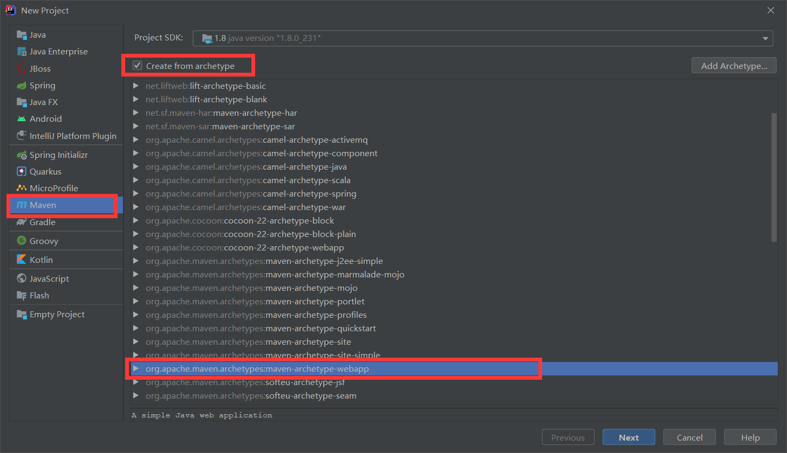

## 1. SpringMVC概述

### MVC

* MVC全名是Model View Controller，是==模型(model)==－==视图(view)==－==控制器(controller)==的缩写，一种软件设计典范，用一种业务逻辑、数据、界面显示分离的方法组织代码，将业务逻辑聚集到一个部件里面，在改进和个性化定制界面及用户交互的同时，不需要重新编写业务逻辑。MVC被独特的发展起来用于映射传统的输入、处理和输出功能在一个逻辑的图形化用户界面的结构中。
* **Model（模型）**是应用程序中用于处理应用程序数据逻辑的部分，通常模型对象负责在数据库中存取数据。
* **View（视图）**是应用程序中处理数据显示的部分，通常视图是依据模型数据创建的。
* **Controller（控制器）**是应用程序中处理用户交互的部分，通常控制器负责从视图读取数据，控制用户输入，并向模型发送数据。

## 2. 环境搭建

1. 建立maven web工程

   

2. 引入pom依赖

   ````xml
   <!-- 版本控制 -->
   <properties>
       <spring.version>5.2.7.RELEASE</spring.version>
       <tomcat.version>9.0.26</tomcat.version>
       <junit.version>5.7.0-M1</junit.version>
   </properties>
   <dependencies>
       <!-- spring-webmvc -->
       <dependency>
           <groupId>org.springframework</groupId>
           <artifactId>spring-webmvc</artifactId>
           <version>${spring.version}</version>
       </dependency>
       <!-- tomcat-jsp-api -->
       <dependency>
           <groupId>org.apache.tomcat</groupId>
           <artifactId>tomcat-jsp-api</artifactId>
           <version>${tomcat.version}</version>
       </dependency>
       <!-- tomcat-servlet-api -->
       <dependency>
           <groupId>org.apache.tomcat</groupId>
           <artifactId>tomcat-servlet-api</artifactId>
           <version>${tomcat.version}</version>
       </dependency>
       <!-- junit-jupiter-api -->
       <dependency>
           <groupId>org.junit.jupiter</groupId>
           <artifactId>junit-jupiter-api</artifactId>
           <version>${junit.version}</version>
       </dependency>
   </dependencies>
   
   ````

3. 在web.xml配置文件中配置核心控制器DispatcherServlet

   ````xml
   <?xml version="1.0" encoding="UTF-8"?>
   <web-app xmlns="http://xmlns.jcp.org/xml/ns/javaee"
            xmlns:xsi="http://www.w3.org/2001/XMLSchema-instance"
            xsi:schemaLocation="http://xmlns.jcp.org/xml/ns/javaee
               http://xmlns.jcp.org/xml/ns/javaee/web-app_4_0.xsd"
            version="4.0">
       <!--1.注册servlet-->
       <servlet>
           <servlet-name>DispatcherServlet</servlet-name>
           <servlet-class>org.springframework.web.servlet.DispatcherServlet</servlet-class>
           <!--通过初始化参数指定SpringMVC配置文件的位置，进行关联-->
           <init-param>
               <param-name>contextConfigLocation</param-name>
               <param-value>classpath:springmvc.xml</param-value>
           </init-param>
           <!-- 启动顺序，数字越小，启动越早 -->
           <load-on-startup>1</load-on-startup>
       </servlet>
       <!--所有请求都会被springmvc拦截 -->
       <servlet-mapping>
           <servlet-name>DispatcherServlet</servlet-name>
           <url-pattern>/</url-pattern>
       </servlet-mapping>
   </web-app>
   ````

4. 编写配置文件springmvc.xml

   ````xml
   <?xml version="1.0" encoding="UTF-8"?>
   <beans xmlns="http://www.springframework.org/schema/beans"
          xmlns:mvc="http://www.springframework.org/schema/mvc"
          xmlns:context="http://www.springframework.org/schema/context"
          xmlns:xsi="http://www.w3.org/2001/XMLSchema-instance"
          xsi:schemaLocation="
               http://www.springframework.org/schema/beans
               http://www.springframework.org/schema/beans/spring-beans.xsd
               http://www.springframework.org/schema/mvc
               http://www.springframework.org/schema/mvc/spring-mvc.xsd
               http://www.springframework.org/schema/context
               http://www.springframework.org/schema/context/spring-context.xsd">
       <!-- 配置spring创建容器时要扫描的包 -->
       <context:component-scan base-package="com.naclo"/>
       <!-- 配置SpringMVC不处理静态资源 -->
       <mvc:default-servlet-handler/>
       <!-- 配置视图解析器 -->
       <bean id="viewResolver" class="org.springframework.web.servlet.view.InternalResourceViewResolver">
           <property name="prefix" value="/page/"/>
           <property name="suffix" value=".jsp"/>
       </bean>
       <!-- 配置spring开启注解mvc的支持-->
       <mvc:annotation-driven/>
   </beans>
   ````

5. 编写控制类com.naclo.controller.HelloController.java

   ````java
   @Controller
   @RequestMapping("/HelloController")
   public class HelloController {
       //真实访问地址 : 项目名/HelloController/hello
       @RequestMapping("/hello")
       public String hello(Model model) {
           //向模型中添加属性msg与值，可以在JSP页面中取出并渲染
           model.addAttribute("msg", "hello,SpringMVC");
           return "hello";
       }
   }
   ````

6. 编写页面page/hello.jsp

   ````jsp
   <%@ page contentType="text/html;charset=UTF-8" language="java" %>
   <html>
   <head>
       <title>SpringMVC</title>
   </head>
   <body>
   ${msg}
   </body>
   </html>
   ````

7. 运行测试

   * 访问：`http://localhost:8080/HelloController/hello`

     