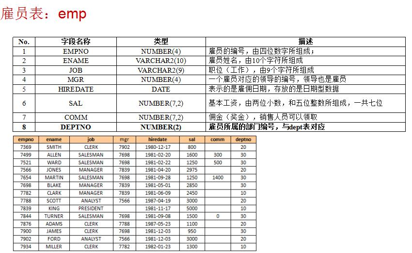

## 题型

| 题型   | 数量 | 分值 | 说明                             |
| ------ | ---- | ---- | -------------------------------- |
| 单选题 |      |      | 一个选项正确                     |
| 多选题 |      |      | 正确选项的个数从 2 个到 4 个不等 |
| 填空题 |      |      |                                  |
| 简答题 |      |      | sql,pl/sql                       |

## 复习提纲

1. 引言

   * 本部分旨在为大家介绍数据库及大型数据库相关的概念，需要大家掌握云计算概念、
     云计算的应用及分类、云数据库、关系型数据库的基本常识。

2. Oracle 12c 数据库的管理

   1.  创建/删除数据库
   2.  数据库实例的含义
   3.  容器数据库及可插拔数据库的区别及基本使用（如何在两种数据间进行切换）
   4.  数据库监听程序的管理
   5.  数据库网络配置
   6.  数据库管理开发工具的基本使用(sql plus, sql developer)
   7.  数据对象数据字典数据库存储结构的理解
   8.  用户的增加删除权限的赋予等

3. sql 基础

   1．DDL 操作：创建表、删除表、修改表、创建约束等。
   2．DML 操作：增、删、改数据表中数据。
   3．DQL 操作：查询表中数据，使用oracle 内置函数。

4. pl/sql 编程能力

   1. plsql 基础语法（变量定义声明，运算符，选择和循环结构，异常的处理方法，记
      录类型（索引表、嵌套表、可变数组），游标。
   2. 子程序的定义及使用（存储过程、存储函数）
   3. 包的定义及使用（如何建立包，运用包管理子程序，常见的系统包的应用）

## SCOTT 用户的表结构与表内容
   





## 复习

### 引言

### Oracle 12c 数据库的管理

1. ==云计算概念==

   * 中国云计算网：云计算是并行计算、分布式计算和网格计算的发展，或者说是这些计算机科学概念的商业实现，它强调云计算是多种IT技术的商业实现。
   * 美国国家标准技术研究院(NIST)：云计算是一种可以通过网络便捷地按需访问可配置的共享计算资源（例如网络、服务器、存储、应用和服务等）池的模式。这些资源能迅速提供并发布，同时可以实现管理成本的最小化，而且与服务提供商的交互最少。
   * 从商业角度定义：云计算是一种商业计算模型。它将计算任务分布在大量计算机构成的资源池上，使各种应用系统能够根据需要获取计算力、存储空间和各种软件服务。
   *  维基百科：云计算将IT相关的能力以服务的方式提供给用户，允许用户在不了解提供服务的技术、没有相关知识以及设备操作能力的情况下，通过互联网获取需要的各种服务。

2. ==云计算的特点==

   1. 按需自助服务
   2. 泛在的网络访问
   3. 资源池化
   4. 快速弹性扩展
      * 快速且弹性地提供各种能力。在需要时可自动地快速扩展资源或自动地快速释放资源。
   5. 服务可度量
      * 云系统利用计量功能自动调控和优化资源，根据不同的服务类型(如存储、处理、带宽和活跃用户账户)按照合适的度量指标进行计量。

3. ==云计算的应用及分类==

   * 应用

     | 服务模式 | 主要访问和管理工具   | 服务内容   |
     | -------- | -------------------- | ---------- |
     | SaaS     | WEB浏览器            | 云应用     |
     | PaaS     | 云开发环境           | 云平台     |
     | IaaS     | 虚拟基础设施管理程序 | 云基础设施 |

     * 云应用

       社会网络、办公软件、CRM、视频处理等等。

     * 云平台

       编程语言、软件架构、结构化数据处理等等。

     * 云基础设施

       服务器、数据库存储、防火墙、负载均衡等等。

   * 分类

     1. 私有云(Private Cloud) 
        * 云设施仅为单一组织使用，该组织可以有多个使用者(如多个业务部门等)。
     2. 公有云(Public Cloud )
        * 云设施为大众公开使用。。
     3. 社区云(Community cloud )
        * 云设施仅为单一的特定消费者社区使用，这些消费者有共同的关注点（例如任务、安全需求、政策、对合法性的考虑等）。
     4. 混合云( Hybrid Cloud )
        * 云设施是两个或者多个独立云（私有云、社区云或者公共云）通过标准或者私有技术绑定而形成，这些独立的云之间可实现数据和应用可移植（例如负载均衡时，数据或者应用可以自动在多个云之间迁移）。

4. ==云数据库==

   * 概念
     * 云数据库是在SaaS(software-as-a-service:软件即服务)成为应用趋势的大背景下发展起来的云计算技术，它极大地增强了数据库的存储能力，消除了人员、硬件、软件的重复配置，让软、硬件升级变得更加容易，同时也虚拟化了许多后端功能。
   * 特性
     1. 动态可扩展
     2. 高可用性
     3. 较低的使用代价
     4. 易用性
     5. 大规模并行处理

5. ==关系型数据库的基本常识==

   * 基本概念

     * 关系

       一个关系对应通常说的一张表。关系模式

     * 元组

       表中的一行即为一个元组。

     * 属性

       表中的一列即为一个属性，给每一个属性起一个名称即属性名。

     * 主码

       表中的某个属性组，它可以唯一确定一个元组。

     * 域

       属性的取值范围。

     * 分量

       元组中的一个属性值。是一个不可以分割的数据项。

     * 关系模式

       对关系的描述：关系名（属性1，属性2，…，属性n）

   * 数据操纵

     * 查询、插入、删除、更新
     * 数据操作是集合操作，操作对象和操作结果都是关系，即若干元组的集合
     * 存取路径对用户隐蔽，用户只要指出“干什么”，不必详细说明“怎么干”

   * 完整性

     * 实体完整性（有主键）
     * 参照完整性（外键引用）
     * 用户定义的完整性（列的约束）

   * 存储结构

     * 在关系数据模型中，实体与实体间的联系都用表来表示。
     * 在物理结构中，表以文件形式存储
     * 有的DBMS一个表对应一个操作系统文件
     * 有的DBMS自己设计文件结构

   * 系统结构

     * 从数据库内部
       * 数据库系统采用三级模式。
     * 从最终用户看
       * 集中式（单机/主从）
       * 分布式结构
       * C/S
       * 并行结构

6. ==关系型数据库的基本常识==

   * 数据库系统的特点

     1. 数据结构化

        * 数据结构化:是与文件系统的根本区别
     * 文件是记录内部有结构。定长等。
        * 数据库可以描述记录之间的关系。
   
     2. 数据的共享性高、冗余度低，易扩充
   
        * 数据是面向整个系统。多个用户共享，减少冗余。 避免不相容与不一致性。
     * 不一致性是指同一数据不同拷贝的值不一样。
        * 容易增加，易于扩充，适用各种需求。

     3. 数据独立性

        * 物理独立性

          指用户的应用程序与存储在磁盘上的数据库中数据是相互独立的。

        * 逻辑独立性

          指用户的应用程序与数据库的逻辑结构是相互独立的。数据的逻辑结构改变了，用户程序也可以不变。

   * 数据库系统的组成

     * 数据库
  * 数据库管理系统（及其开发工具）
    
     * 应用系统
  * 数据库管理员
    
   * （用户）
   
   * 关系模型 

     > 是对客观世界数据的抽象，是用来描述数据的结构和性质、数据之间的联系以及在数据或联系上的操作和约束。
   
     * 数据结构
     
       数据结构是所研究的对象类型的集合，一类是与数据类型、内容、性质有关的对象，另一类是与数据之间联
     
     * 数据操作
     
       数据操作是指对数据库中各种对象的实例所执行操作的集合。
     
     * 数据的约束条件
     
       数据的约束条件是一组完整性规则的集合。
   
   * 实体关系
   
     1. 一对一联系(1:1)
     2. 一对多联系(1:N)
     3. 多对多关系(M:N)


### sql 基础

1. ==创建/删除数据库==

   ````sql
   create tablespace 表名 datafile '路径' size 200M;
   drop tablespace 表名 including contents and datafiles;
   ````

2. ==数据库实例的含义==

   * 数据库由一组磁盘文件组成，它们可独立于实例而存在。数据库实例是管理数据库文件的内存结构和进程，它由共享内存结构和一组后台进程组成。实例可独立于数据库文件而存在。
   * 数据库实例(instance)是用来访问数据库文件集的内存结构及ORACLE进程的集合。一个数据库可以被多个实例访问。

3. ==容器数据库及可插拔数据库的区别及基本使用（如何在两种数据间进行切换）==

   * 容器数据库是Oracle 12c引⼊的新特性，允许**容器数据库**中创建并维护多个数据库，这样的数据库被称为PDB

   * 基本使用

     * 以DBA连接

       ````sql
       sqlplus sys/oracle@//localhost:1521/orcl as sysdba
       ````

     * 查看当前数据库

       ````sql
       show 数据库名
       ````

     * 查看数据文件，日志文件，控制文件

       ````sql
       select * from v$logfile;
       select * from v$tablespace;
       select * from v$controlfile;
       ````

     * 切换数据库

       ````sql
       alter session set container=pdb;
       ````

     * 创建pdb

       ````sql
       create pluggable database pdb1;
       ````

     * 打开关闭指定的pdb

       ````sql
       alter pluggable database pdb1 open;
       ````

     * 切换pdb

       ````sql
       select status from v$instance;
       ````

4. ==数据库监听程序的管理==

   ````
   lsnrctl status 查看运⾏状态
   lsnrctl stop 停⽌监听
   lsnrctl start 启动监听
   ````

5. ==数据库网络配置==

   * 概念
     * **服务名或数据库服务名**是数据库的逻辑表示，对于客户端来说就是数据库的存在方式。一个数据库可以具有多个服务名，一个服务名也可以通过多个数据库实例来实现
     * **连接描述符**是一个网络连接目标的格式描述字符串，它包括目标服务连接信息（即数据库服务名或数据库SID）和网络路由信息（即数据库监听的网络地址和端口号等）组成。 
     * **网络服务名**是用来解释连接描述符的一个服务别名。用户可以使用用户名、口令和网络服务名来连接数据库服务器。
     * **连接字符串**是指客户端在连接数据库时需要提供的信息所组成的字符串，这些信息包括用户名、口令以及连接标识符。
     * **连接标识符**可是网络服务名、数据库服务名或是存储在目录中的网络服务别名。用户使用连接标识符建立连接。
   * 网络工具
     * Oracle Enterprise Manager（OEM）
       * OEM可以跨平台的对Oracle网络服务进程配置和管理。利用OEM可以配置监听程序、命名方法、Oracle主目录位置等。
     * Oracle网络配置助手
       * Oracle网络配置助手ONCA)是用来配置基本网络组件的工具。用它可以配置监听程序名、协议地址、客户端解析连接标识符的命名方法、TNSNAMES.ORA文件中的网络服务名和目录服务器用法等。
     * Oracle网络管理器
       * Oracle网络管理器把配置功能和组件控制功能组合在一起为配置和管理Oracle 网络服务提供一个集成环境。 
   
6. ==数据库管理开发工具的基本使用(sql plus)==

   * 启动sql plus

     ````sql
     C:\>SQLPLUSW  /NOLOG 
     SQL>CONNECT 用户名/口令 [@网络服务名]；
     C:\>SQLPLUS  /NOLOG 
     SQL>CONNECT 用户名/口令 [@网络服务名]；  
     ````

   * 命令

     * `RUN 或／或R`

       运行SQL缓冲区的命令。

     * `edit [文件名]`

       以指定的文本编辑程序编辑SQL缓冲区或指定文件名，缺省时编辑程序为记事本。 

     * `SAVE 文件名[CRATE|REPLACE|APPEND]`

     * `GET 文件名

     * `@ 文件名    `

       运行PL/SQL文件

     * `CLEAR [BUFFER|SCRREN]`

       清除SQL缓冲区或屏幕

     * `EXECUTE PL/SQL语句`

       执行存储过程

     * `SPOOL 文件名 [out] `

       显示结果存文件

       * SPOOL AA 显示结果存到AA.LST文件(OFF)
       * SPOOL OUT   停止假解脱机，打印

     * `DESC [表名|视图名|过程|函数] `

       显示定义

     * `HOST [命令] `

       在SQL Plus中执行操作系统命令或暂时退出SQL Plus而回到操作系统提示符下。从SQL Plus中返回到WINDOWS命令提示符下。

     * `SHOW [ALL|SGA|ERRORS|USER|SPOOL]`

       显示所有的环境变量的值其它对象的定义

       * `SHOW ALL`  显示所有环境变量的当前值
       * `SHOW USER`	显示当前数据库用户。
       * `SHOW SGA`  显示数据库实例中SGA大小
       * `SHOW SPOOL` 	显示SQLPlus是否假脱机
       * `SHOW ERRORS` 显示存储对象中的错误

     * `Connect  用户名/口令@网络服务名 [ AS SYSDBA|SYSOPER]`

       断开当前的用户连接，用新用户连接新的服务

     * `DISCONNECT;`

       断开当前的用户连接

7. ==数据对象数据字典数据库存储结构的理解==

   * 数据对象

     单独的⼀张表就称为数据对象

   * 数据字典

     数据字典是指对数据的数据项、数据结构、数据流、数据存储、处理逻辑等进⾏定义和描述

   * 数据库存储结构

     * 逻辑结构

       1. 数据库集群-Database cluster
       2. 数据库-Database
       3. 表空间-tablespace

     * 物理结构

       ⼀个tablespace对应⼀个⽬录，存储在⽂件内，并建⽴索引

8. 数据类型

   1. 字符类型（单引号括起来的若干字符组成）
      * CHAR(N) 为N的字符串，N=1~2000字节
      * VARCHAR2(n) 变长字符串，1~4000字节
      * LONG(n) 变长字符串,n=1B~2GB。
   2. 数字类型（10(-130) ~9.9…9 * 10(125) ）
      * NUMBER(p,s) p-总位数，s-小数点后
      * NUMBER(n) 等价于NUMBER(n,0)
      * NUMBER 是指最大值到最小值
      * 如果值超出P，出错；如果精度超出S，截断。负精度S，表示取整后面S个整，去掉小数部分。
   3. 日期数据类型
      * 日期类型分域：YEAR(-4712~9999),月日时分秒。日期类型存储有日期和时间。默认：DD-MON-YY

9. 函数

   1. 数值函数

      ````sql
      ABS(N) 	返回N的绝对值。   lACOS(N)  返回N的反余弦值。
      ASCII(char)    	返回char中第一个字符的ASCII码值。
      ASIN(N)  返回N的反正弦值。lATAN(N) 	返回N的反正切值
      BITAND(n1,n2) 	返回n1与n2按二进制位与运算的结果。
      CEIL(N) 	返回大于或等于N的最小整数值。
      COS(N)  	返回N的余弦值。
      EXP(N) 	返回e的N次方。e=2.71828183 ...
      FLOOR(N）	返回等于或小于N的最大整数值。
      LN(N)		 返回N的自然对数值。
      LOG(M，N) 	返回以M为底的N的对数值。
      MOD(M，N) 	返回M被N除的余数，N为0时返回M。
      POWER(M，N) 	返回M的N次方的值。
      ROUND(exp,N)  表达式exp四舍五入后的值，保留N位小数。
      SIN(N) 	返回N的正弦值。
      SQRT(N) 	返回N的平方根值。
      TRUNC(M,N)   	返回M保留N位小数后的值，不四舍五入。 
      ````

   2. 单行字符函数

      ````sql
      CHR(N) 返回数字N对应的字符。
      CONCAT(c1,c2)	字符串C1与C2合并，||。 
      LOWER(char)	将char转换为小写字母。 
      LTRIM(C)   		删除字符串C左边的空格。 
      REPLACE(c1,c2,c3) C1中所有C2替换为C3。 
      RTRIM(C) 		删除字符串C右边的空格。 
      SUBSTR(C,m,n)	返回字符串C中从m个开始后的n个字符。
      TRIM(C) 	删除字符串C两边的空格。
      LENGTH(C)	 返回字符串C的长度。
      ````

   3. 单行日期函数

      ````sql
      CURRENT_DATE 按会话时区返回当前日期
      EXTRACT(YEAR FROM d1) 返回日期型数据d1中的数字年份。可以替换为MONTH、DAY来返回d1日期的月、日、时、分和秒。LAST_DAY(d1)   d1中月份最后一天日期SYSDATE   本地数据库的当前日期与时间。
      TRUNC(d1,fmt)  以fmt格式表示的日期d1。 
      ````

   4. 单行类型转换函数

      ````sql
      TO_CHAR(d1[,fmt])  将日期d1,按fmt格式转换成字符串。 
      TO_CHAR(n1[,fmt])  将数值n1,按fmt格式转换成字符串。
      TO_DATE(c1[,fmt])  将字符串c1按fmt格式转换成DATE类型。
      TO_MUTI_BYTE(字符串)     	 单转双，类型不变
      TO_SINGLE_BYTE(字符型）	 双转单，类型不变
      TO_NUMBER(c1[,fmt])   字符串c1按fmt转换数字。
      ````

   5. 多行函数

      ````sql
      AVG([DISTINCT|ALL]表达式)  返回表达式的平均值。如果同分组命令一起使用，DISTINCT子句只计算表达式值不同的平均值，ALL计算所有的平均值。
      COUNT([DISTINCT|ALL]表达式) 统计查询结果中返回的行数。如果指定表达式，只统计表达式不空的行数；如果返回所有行，用星号“*”代替表达式。
      MAX([DISTINCT|ALL]表达式) 返回表达式中的最大值。
      MIN([DISTINCT|ALL]表达式) 返回表达式中的最小值。
      SUM([DISTINCT|ALL]表达式) 返回表达式的和。
      
      ````

10. ==用户的增加删除权限的赋予等==

   * 用户增加

     ````sql
     CREATE USER 用户名 IDENTIFIED BY 口令
     ````

     * 例：创建用户NaClO，密码为123456

       ````
       CREATE USER NaClO IDENTIFIED BY "123456";
       ````

* 用户修改
  
  ````sql
     ALTER USER 用户名 [选项]
  ````
  
  * 用户锁定
  
    ````sql
       ALTER USER 用户名 ACCOUNT LOCK;
    ````
  
  * 用户解锁
  
       ````sql
       ALTER USER 用户名 ACCOUNT UNLOCK;
       ````

     * 修改口令

       ````sql
       ALTER USER 用户名 IDENTIFIED BY "新密码";
       ````
  
* 用户删除
  
  ````sql
     DROP USER  用户名 [CASCADE]
  ````
  
     * 删除没有对象的用户

       ````sql
       
       ````
  
      DROP USER  用户名;
       ````
  
     * 删除有对象的用户
  
       ````sql
       DROP USER  用户名 CASCADE;
       ````
  
   * 权限赋予
  
     ````sql
     GRANT 系统权限名表  TO 用户名 [PUBLIC] [WITH ADMIN OPTION]
     
     PUBLIC: 将系统权限授予PUBLIC用户组
     WITH ADMIN OPTION: 接收者可将权限授予其它用户
     ````
  
     * 例：将建立用户和删除用户的权限授予NaClO用户,并允许NaClO将这两个权限授予其它用户.
  
       ````sql
       GRANT create user,drop user TO NaClO WITH ADMIN OPTION;
       ````
  
     * 例：将会话与改变用户的权限授予所有用户
  
       ````sql
       GRANT create session,alter user TO PUBLIC;
       ````
  
   * 权限收回
  
     ````sql
     REVOKE 系统权限名 FROM 用户名|PUBLIC
     ````
  
     * 例：收回NaClO建立用户的权限.
  
       ````sql
       REVOKE create user FROM NaClO;
       ````
  
   * 授予对象级权限
  
     ````sql
     GRANT [对象权限|ALL] ON 对象[列名表] TO 
     [用户|角色|PUBLIC]  [WITH GRANT OPTION]
     ````
  
     * 例：把对A表查询权限授予NaClO用户
  
       ````sql
       GRANT select on A TO NaClO;
       ````
  
     * 例：把对A插入权限授予NaClO用户
  
       ````sql
       GRANT insert on A TO NaClO；
       ````
  
     * 例：将对表A的查询权限授予NaClO，并允许NaClO将该权限授予其它用户.
  
       ````sql
       GRANT select on A TO NaClO WITH GRANT OPTION;
       ````
  
   * 回收对象级权限
  
     ````
     REVOKE  对象权限名 ON 对象名| ALL PRIVILEGES  FROM [用户名|PUBLIC]
     ````
  
     * 例：从NaClO回收对表A所有权限
  
       ````sql
       REVOKE  ALL PRIVILEGES ON A FROM NaClO； 
       ````
  
     * 例：从所有用户回收对表A插入和查询的权限.
  
       ````sql
       REVOKE insert,select  ON A FROM PUBLIC； 
       ````
  
   * 定义角色
  
     ````sql
     CREATE ROLE 角色名 [IDENTIFIED BY 口令]
     ````
  
   * 修改角色
  
     ````sql
     ALTER ROLE 角色 [NOT IDENTIFIED] [IDENTIFIED BY 口令]
     ````
  
   * 删除角色
  
     ````sql
     DROP ROLE 角色名
     ````
  
   * 授予或回收角色权限
  
     ````sql
     GRANT 权限 TO 角色名 
     GRANT 角色名 TO 用户名
     REVOKE  权限 FROM 角色名
     REVOKE  角色名 FROM 用户名
     ````
  
#### 表的查询和排序

````sql
SELECT  [ALL|DISTINCT|UNIQUE]
[[表的别名.] 选项] [,[表的别名.]选项…]  -  输出字段表或表达式
FROM [模式.]表名 [别名] [，表名 [别名] …]  表名
[WHERE 条件表达式]   		-查询条件
[GROUP BY 分组选项[,分组选项，…]
[HAVING 筛选条件表达式]]
[UNION|INTERSECT|MINUS SELECT子查询] 
[ORDER BY 排序选项[ASC|DESC] [,排序选项[ASC|DESC]，…] 
````

1. 基本查询

   * 例：从一个表中查询出若干字段的内容。

     ````sql
     SELECT employee_id,first_name|| '  '||last_name FROM employees； 
     ````

   * 例：同上例，为每个字段名定义一个标题

     ````sql
     SELECT employee_id 雇员编号,first_name || ' '||last_name 姓名 FROM employees；
     ````

   * 例：从表EMPLOYEES中查询出所有名字(last_name)以G开头且工资(salary)大于3000的人的名字、工资、部门编号。

     `````sql
     SELECT last_name 名字, salary 工资, department_id 部门号 FROM  employees
     WHERE last_name like 'G%' and salary>3000;
     `````

   * 例：当前用户为user1,查询HR模式中的表DEPARTMENTS所有字段的内容。用户USER1对HR模式中的表DEPARTMENTS有SELECT对象权限。

     ````sql
     SELECT *  FROM  hr.departments；
     ````

2. 多表查询

   * 从表EMPLOYEES和DEPARTMENTS中查询出每个员工所在部门的名称，以部分编号department_id作为两个表之间关联字段

     ````sql
     SELECT e.employee_id 雇员编号, d.department_name 所在部门
     FROM employees e,departments d WHERE e.department_id = d.department_id； 
     ````

   * 从多表中查询出所有姓SMITH的雇员的名字、所在部门的名称及部门所在的城市。

     ````sql
     SELECT e.first_name,e.last_name,d.department_name,l.city
     FROM employees e,departments d,locations l
     WHERE e.department_id=d.department_id
     AND d.location_id=l.location_id
     AND last_name='Smith';
     ````

3. 分组统计查询

   * 按部分编号统计出表EMPLOYEES中每个部门的人数。 

     ````sql
     SELECT department_id 部门号,count(*) 部门人数 FROM employees
     GROUP BY department_id;
     ````

   * 显示部门人数少于5人的部门编号及人数。 

     ````sql
     SELECT department_id 部门号,
     count(*) 部门人数 FROM employees
     HAVING count(*)<5
     GROUP BY department_id;
     ````

   * 显示所有工资大于5000，且部门人数大于5个的部门编号、部门最低工资和部门人数。 

     ````sql
     SELECT department_id 部门号,
     min(salary) 最低工资, COUNT(*) 部门人数
     FROM employees WHERE salary>5000
     GROUP BY department_id
     HAVING count(*)>5;
     ````

4. 数据排序

   * 从表EMPLOYEES中查询工资大于1300的人的部门编号和姓，并按照部门编号和工资降序排序

     ````sql
     SELECT department_id,first_name,
     salary FROM employees
     where salary>=13000
     ORDER BY department_id,salary DESC
     ````

   * 从表EMPLOYEES中查询部门人数大于5的部门编号、最低工资和部门人数，并要求按部门人数降序排序。

     ````sql
     SELECT department_id 部门号,
     min(salary) 最低工资,COUNT(*) 部门人数 
     FROM employees  GROUP BY department_id
     HAVING count(*)>5 
     ORDER BY count(*) DESC;
     ````

5. 子查询

   * 统计表EMPLOYEES中所有工资小于平均工资的人数。

     ````sql
     SELECT count(*) FROM employees
     WHERE salary<(SELECT avg(salary) 
     FROM employees)
     ````

6. 集合运算

   * 并：两个或多个子查询的所有行。（如果用UNION ALL，重复行出现多次）

     ````sql
     SELECT employee_id,empname FROM emp1
     UNION
     SELECT employee_id,name FROM emp2；
     ````

   * 交：两个或多个子查询的公共行。

     ````sql
     SELECT employee_id,empname FROM emp1
     INTERSECT
     SELECT employee_id,name FROM emp2
     ````

   * 减：从第一个查询结果中去掉出现在第二个查询结果中的行

     ````sql
     SELECT employee_id,empname FROM emp1
     MINUS
     SELECT employee_id,name FROM emp2
     ````

#### 表操作

* 建表命令

  ````sql
  CREATE TABLE  [模式名.] 表名 
  (列名描述)     --列名 类型名(长度)[列名约] 
  (表约束) 		--字段的约束条件
  [TABLESAPCE 表空间名] --表所在表空间(有配额）
  [PCTFREE  整数]   --块内预留空间的百分比 
  [PCTUSED 整数]  --块中已用空间小于该值时，块才能插入 
  [INITRANS 整数] --并发修改块的最小事务数(1-255) 
  [MAXTRANS 整数] --并发修改块的最大事务数(1-255) 
  [STORAGE 存储子句]--表中段的分配管理方式的存储参数 
  [AS 子查询] --根据子查询的结果生成新表 
  ````

  * 正常建表

    ````sql
    CREATE TABLE TTT(
        name varchar2(10),
        age number(2)
    );
    ````

  * 列或表约束：紧跟在列名定义后，有下面几种：

    * 列名 类型 [CONSTRAINT 约束名] 约束

    * `CHECK (条件)`  列值满足指定条件

    * `DEFAULT (表达式) `  向列中放缺省值。

    * `NOT NULL` 　该列中的值不能为空。

    * `UNIQUE`    在表中是唯一的。

    * `PRIMARY KEY`   表的主键，非空且唯一。

    * 例：

      ````sql
      CREATE TABLE TT (
          n1 char(3),
          n2 char(4) DEFAULT (‘TEST’),
          PRIMARY KEY(n1,n2)
      );
      ````

    * 例：

      ````sql
      CREATE TABLE T1001 (
          NAME CHAR(10),
         SSEX CHAR(2) CHECK(SSEX IN (‘男‘,’女’))，
         SOLD NUMBER(3) CHECK (SOLD BETWEEN 17 and 20) DEFAULT (17)
      );
      ````

    * 

  * `FOREIGN KEY` 外键是另一表的主键。外键为单列时，列前加 “REFERENCES 引用表名”。

    * 例：

      ````sql
      CREATE TABLE TT (
          N1 CHAR(3),
          N2 CHAR(4)  DEFAULT ('TEST'),
          PRIMARY KEY(N1)
      )；
      ````

    * 例：

      ````sql
      CREATE TABLE TT2 (
          N CHAR(4),
          NN1 CHAR(3) REFERENCES TT
      ); 
      ````

    * 例：外键为多列

      ````sql
      CREATE TABLE T23 (
          N CHAR(3),
          NN1 CHAR(3),
          NN2CHAR(4),
          FOREIGN KEY(NN1,NN2) REFERENCES T1(N1,N2)
          ON DELETE CASCDE
      );
      ````

      * 外键加ON DELETE CASCADE表示父表中记录删除时，则子表中的相应记录也删除。

* 修改表结构

  ````sql
  ALTER TABLE 表名 
  	ADD （列描述1,…)         --增加列名
  	DROP COLUMN 列名        --删除列名  
  	MODIFY (字段描述1,…)     --修改列
  ````

  * 增加列

    ````sql
    CREATE TABLE TEST (NN NUMBER(3));
    ALTER TABLE TEST ADD(
        N1 CHAR(2) NOTNULL,
        N2 CHAR(4)
    );
    ````

  * 修改列

    ````sql
    alter table test modify(
        n1  number(3),
        n2 char(30) not null
    );
    ````

  * 删除列

    ````sql
    ALTER TABLE  TEST DROP COLUMN N2
    ````

  * 删除列及列的约束

    ````sql
    ALTER TABLE TTT DROP COLUMN T1 CASCADE CONSTRAINTS
    ````

* 删除表

  ````sql
  DROP  TABLE  表名
  ````

  * 在删除表的同时也删除由该生成的视图和约束

    ````sql
    DROP TABLE 表名 CASCADE CONSTRAINTS
    ````

* 重新命名表

  ````sql
  RENAME 旧表名 TO 新表名;
  ````

* 表记录操作

  * 插入操作

    ````sql
    INSERT INTO 表名 (列名表)VALUES (表达式表) 
    ````

    * 例：

      ````sql
      INSERT INTO JOBS (JOB_ID, JOB_TITLE) VALUES(‘MY_JOB’,’POLICE’);
      ````

    * 例：

      ````sql
      INSERT INTO JOBS VALUES ('AD_PLA',’General ’,2345,3455);
      ````

  * 更新操作

    ````sql
    UPDATE 表名 SET 列名1=表达式1，…  [WHERE 条件]
    ````

    * 例：1999-1-1后参加工作的工资加1000,提前十天。

      ````sql
      UPDATE EMPLOYEES SET  SALARY =
      SALARY+1000,  HIRE_DATE = HIRE_DATE-10
      WHERE HIRE_DATE>=DATE ‘1999-1-1’;
      ````

  * 删除操作

    ````sql
    DELETE FROM 表名 [WHERE 条件]
    ````

    * 例：

      ````sql
      DELETE FROM EMPLOYEES WHERE LAST_NAME NOT LIKE ‘A%’;  
      ````

    * 删除所有记录

      ````sql
      DELETE FROM EM1 WHERE 1=1
      DELETE FROM EM1
      ````

#### 事务控制命令

  * 事务提交

    * 显式提交：执行COMMIT命令

    * 隐式提交：执行命令ALTER,COMMENT,CONNECT,CREATE,DROP,EXIT等命令时都隐含COMMIT操作。

  * 事务回滚

    * 显式回滚：执行ROLLBACK命令
    * 隐式回滚：执行期间发生错误；发现死锁或事务流产。


#### 索引操作（INDEX）

  * 建立索引

    ````sql
    CREATE [UNIQUE] INDEX 索引名
    ON 表名(列名1[ASC|DESC],….)
    [TABLESPACE 表空间名]
    [STOREAGE 存储子句]
    ````

    * 例：

      ````sql
      CREATE INDEX SN ON STUDENT(SNAME);
      ````

  * 修改索引

    ````sql
    ALTER INDEX 索引名 [INITRANS m]
    [MAXTRANS n ] [STOREAGE 存储子句]
    ````

    * 例：

      ````sql
      ALTER INDEX SN INITRANS 5 STORAGE(NEXT 100K);
      ````

  * 删除索引

    ````sql
    DROP INDEX 索引名
    ````

#### 视图操作（VIEW）

  * 建立视图

    ````sql
    CREATE [OR REPLACE] VIEW 视图名
    AS SELECT语句 [WITH READ ONLY]
    ````

    * 例：

      ````sql
      create view em_view as 
      select employee_id,last_name, first_name
      from employees;
      ````

  * 显示视图结构

    ````sql
    DESC 视图名; 
    ````

  * 修改视图

    ````sql
    ALTER VIEW 视图名 COMPILE
    ````

  * 删除视图

    ````sql
    DROP VIEW 视图名 [CASCADE CONSTRAINTS]
    ````

#### 同义词（SYNONYM）

  **同义词**是模式中的对象的别名。用新的标识符来命名已有对象名称为建立同义词。

  * 建立同义词

    ````sql
    CREATE [PUBLIC] SYNONYM  [模式.]同义词 FOR [模式名.] 对象名。
    ````

    * 例：

      ````sql
      create synonym em for hr.employees;
      ````

  * 删除同义词

    ````sql
    DROP [PUBLIC]SYNONYM 同义词名
    ````

    * 例：

      ````sql
      DROP SYNONYM EM;
      ````

#### 序列（SEQUENCE）

  当主关键字由多个列名组成时，使用比较复杂。为表附加一列，该列的值为顺序号(序列)。

  * 建立序列

    ````sql
    CREATE SEQUENCE 序列名
    [START WITH 整数]          -- 序列起始值，1　
    [INCREMENT BY 整数] -- 序列增是值，1(正负)
    [MAXVALUE 整数]  [NOMAXVALUE]最大值
    [MINVALUE 整数]  [NOMINVALUE]　最小值
    [CYCLE｜NOCYCLE] 　--以循环方式生成序列
    [CACHE 整数|NOCACHE]  --将内容放缓存中。
    ````

    * 例：

      ````sql
      CREATE SEQUENCE SE1 START WITH 100
           INCREMENT BY 5  MAXVALUE 500
           NOCYCLE NOCACHE;
      ````

  * 修改序列

    ````sql
    ALTER SEQUENCE 序列名
    [INCREMENT BY 整数]
    [MAXVALUE 整数]  [NOMAXVALUE] [MINVALUE 整数]  [NOMINVALUE] [CYCLE｜NOCYCLE] 　
    [ORDER｜NOORDER] 
    [CACHE 整数|NOCACHE]
    ````

    * 例：

      ````sql
      alter sequence xu maxvalue 1000；
      ````

  * 删除序列

    ````sql
    DROP SEQUENCE 序列名
    ````


### pl/sql 

#### plsql基础语法

（变量定义声明，运算符，选择和循环结构，异常的处理方法，记
录类型（索引表、嵌套表、可变数组），游标。

1. PL/SQL块

   * 定义部分：定义所处理的变量、常量、游标等。

   * 可执行部分：SQL语句及控制结构的PL/SQL语句

   * 异常处理部分：对执行过程中的错误进行处理。

   * 结构：

     ````plsql
     [DECLARE 说明部分 ]
     BEGIN
       语句(SQL或PL/SQL语句）
       [EXCEPTION 错误处理程序 ]
     END   
     ````

2. 标识符

   * 标识符是用户定义的符号串，用来命名变量、常量、过程等。
   * 标识符以字母开头，后跟数字(0-9)或特殊字符$、#和_。长度不超过30，不能是PL/SQL的保留字，不能有空格。

3. 变量及变量说明

   * 变量是表示要处理数据项的名称。变量名用标识符来表示。

   * 变量在使用之前必须用DECLARE进行说明。

   * 定义：

     ````plsql
     变量名 [CONSTANT]  类型 [NOT NULL][:=值][DEFAULT SQL表达式]；
     ````

4. 变量或常量类型

   * 数值型：NUMBER(p,s),INTEGER,FLOAT,DEC
   * 字符型：CHAR(n),VARCHAR2(n),RAW(n)
   * 日期型：DATE
   * 布尔型：BOOLEAN(TRUE或FALSE)
   * 大数据类型：BFILE,BLOB,CLOB,NCLOB

5. 数据类型转换

   * 显示转换:
     * TO_CHAR(),TO_NUMBER(), RAWTOHEX(),HEXTORAW(),ROWIDTOCHAR(),TO_DATE()

6. 函数

   

7. 表达式

   * **表达式**是由变量、常量、列名、函数和运算符结合的有意义式子。
   * **数值表达式**：数值运算符、变量、常量、函数等
     * **数值运算符**：+、-、＊、/、**、()
   * **字符表达式**
     * **字符运算符**: ||(合并)
   * **关系表达式**:关系表达式的结果是TRUE和FALSE
     * **关系运算符**: <> !=  <  > <=  >=  =   LIKE IN   BETWEEN…AND…
   * **逻辑表达式**
     * **逻辑运算符**：NOT   AND  OR

8. 变量赋值

   * 变量名:=与变量同类型的表达式；

9. 注释行

   * 单行注释：在一行的任何位置以“--字符串”

   * 多行注释：/*   注释内容  */

#### 控制结构

1. 顺序结构

   * 顺序结构是指执行过程按所写程序的顺序执行。

2. IF选择结构

   ````plsql
   IF 条件 THEN
      语句序列1 
   ELSE
      语句序列2
   END IF;
   ````

   ````plsql
   IF 条件1 THEN
       语句序列1
   ELSIF 条件2 THEN
       语句序列2
   ELSE
       =语句序列3
   END IF;
   ````

3. CASE选择结构

   ````plsql
   CASE 变量
   WHEN 表达式1 THEN 
       语句序列1;
   WHEN 表达式2 THEN
       语句序列2;
   ……
   WHEN 表达式N THEN
        语句序列N;
   [ELSE 语句序列N+1;]
   END CASE
   ````

4. LOOP-EXIT-END循环结构

   ````plsql
   LOOP
       语句序列
       [EXIT]
   END LOOP
   ````

5. LOOP-EXIT WHEN-END循环

   ````plsql
   LOOP
       语句序列
       EXIT WITH 条件   --等价IF 条件 THEN EXIT，可用在其它循环
   END LOOP
   ````

6. WHILE-LOOP-END循环

   ````plsql
   WHILE  条件  LOOP
       语句序列;
   END LOOP；                           
   ````

7. FOR-IN-LOOP-END循环

   ````plsql
   FOR 循环变量 IN [REVERSE]下界..上界 LOOP
       语句序列；
   END LOOP；
   ````

8. 循环标签

   * 循环标签是以用来标示循环,放在循环前。其格式：

     ````plsql
     <<标签名>>
     ````

#### %TYPE类型

* PL/SQL变量用来存储表中的数据，但二者要有相同类型。要保证变量与列名类型总是一致，就用%TYPE类型。

  ````plsql
  变量名  表名.列名%TYPE;
  ````

  * 例：

    ````plsql
    DECLARE
        J_T JOBS.JOB_TITLE%TYPE;
    BEGIN
        SELECT JOB_TITLE INTO J_T
        FROM JOBS WHERE JOB_ID='AD_VP';
        DBMS_OUTPUT.PUT_LINE(J_T);
    END;
    ````

#### %ROWTYPE类型

* 用%ROWTYPE说明变量为一个记录类型。

  ````plsql
  变量名   表名%ROWTYPE;
  ````

  * 例：

    ````plsql
    DECLARE
        EMP EMPLOYEES %ROWTYPE;
    BEGIN
        SELECT * INTO EMP FROM  EMPLOYEES WHERE EMPLOYEE_ID='201';
        DBMS_OUTPUT.PUT_LINE
        (EMP.LAST_NAME||' '||EMP.FIRST_NAME);
    END;
    ````

#### 游标

* 游标是将从表中选择的一组记录，放置在内存的临时表中。游标是数据类型，要先说明后使用。

1. 说明游标

   ````plsql
   CURSOR  游标名  IS  SELECT语句；
   ````

   * 例：

     ````plsql
     DECLARE
         MIN_S JOBS.MIN_SALARY%TYPE;
         CURSOR MS IS
             SELECT  *   FROM JOBS 
             WHERE  MIN_SALARY>=MIN_S;
         BEGIN
             NULL;      --空语句
         END;
     ````

2. 打开游标

   ````plsql
   OPEN   游标名；
   ````

   * 打开之前，游标中的变量必须有值；
   * 打开游标后,查询记录放在内存,指针指向第一个记录。

3. 提取游标数据

   ````plsql
   FETCH 游标名 INTO 变量1,变量2,…;
   ````

   * 变量要与说明游标时SELECT后的列名在类型和个数上完成一样。不能只提取部分。

4. 关闭游标

   ````plsql
   CLOSE 游标；
   ````

5. 游标属性

   通过游标属性来知道游标的状态。

   * `%FOUND `：如果前一个FETCH返回一行，%FOUND返回TRUE；否则返回FALSE。
     * 用法：游标名%FOUND
   * `%NOTFOUND`：与%FOUND相反，常用于退出循环提出。
   * `%ISOPEN`：判定游标是否打开。打开为TRUE,否则为FALSE.
   * `%ROWCOUNT`：返回从游标中已提取的行数。

#### 参数化游标和隐含游标

1. 参数化游标

   ````plsql
   CRUSOR 游标名(变量1 类型1,变量2  类型2,…) IS SELECT语句
   ````

2. 打开参数化游标：

   ````plsql
   OPEN 游标名(实参1,实参2,…);
   ````

3. 隐含游标（SQL游标)

   * 每次处理一个SQL语句，ORACLE自动打开一个游标，该游标不能使用OPEN,FETCH或CLOSE进行操作。但可用游标特性来获得执行SQL的信息。
   * 隐含游标的名字是：SQL
   * SQL游标总是反映最后一个SQL语句执行情况。
     * %ISOPEN 永远是FALSE(执行完SQL后自动关闭）
     * %FOUND  至少处理一行,为TRUE;否则为FALSE
     * %NOTFOUND  与%FOUND相反
     * %ROWCOUNT 处理影响的行数。

#### 异常处理

1. 系统预定义异常

   | 异常号   | 异常关键字     | 说明           |
   | -------- | -------------- | -------------- |
   | ORA_1001 | INVALID_CURSOR | 非法游标操作   |
   | ORA_1012 | NOT_LOGGED_ON  | 没连接到oracle |
   | ORA_1403 | NOT_DATA_FOUND | 没有找到数据   |
   | ORA_1722 | INVALID_NUMBER | 转换数字时失败 |
   | ORA_6500 | STOREAGE_ERROR | 内存不够       |
   | ORA_6501 | PROGRAM_ERROR  | 内部PL/SQL错误 |
   | ORA_6502 | VALUE_ERROR    | 截尾、算术错误 |
   | ORA_1476 | ZERO_DIVIDE    | 被零除         |

2. 用户定义异常

   ````sql
   异常名  EXCEPTION;
   ````

3. 异常处理

   ````sql
   EXCEPTION
       WHEN 异常名1 THEN
           语句序列1；
           …
       WHEN 异常名N THEN   
           语句序列N
       WHEN OTHERS THEN
           语句序列N+1；
   ````

   

#### 子程序的定义及使用（存储过程）

无名块只能以文件形式执行、不存放在数据库中，每次执行要编译，不能在其它PL/SQL块中调用。

过程、函数和触发器都是有名块，是数据库对象

1. 创建过程

   ````plsql
   CREATE OR REPLACE PROCEDURE 过程名(参数列表) AS 
     说明部分
   BEGIN
      执行部分
   [EXCEPTION 
      异常处理部分]
   END [过程名]
   ````

2. 查询过程USER_SOURCE

   * USER_SOURCE: NAME、TEXT、TYPE、LINE

   * 例：

     ````plsql
     SELECT TEXT FROM USER_SOURCE
         WHERE NAME=‘TTT’
         ORDER BY LINE;
     ````

3. 修改过程

   * 存储过程以文件形式存在。在SQL PLUS中：

     ````sql
     @CCC.SQL
     EDIT
     ````

4. 调用过程(EXECUTE ANY PROCEDURE)

   * 在块中或过程中调用存储过程，不能在表达式。

     ````sql
     过程名[(实参1,…,实参N)]
     ````

5. 删除过程

   ````sql
   DROP PROCEDURE  过程名
   ````

6. 带参数的过程

   ````sql
   CREATE OR REPLACE PROCEDURE 过程名
       [(参数1 [IN|OUT|IN OUT] 类型1,…,)] AS
       [内部变量说明]
   BEGIN
       执行部分
   　  [EXCEPTION 异常处理]
   END；
   ````

   * IN 向过程送参数，读入参数
   * OUT: 从过程获得参数，输出参数
   * IN OUT 即可以读入参数，可也获得参数

#### 函数

函数是命名块，可以有参数或无参数，但必须有返回值，函数是用于表达式中而不能单独作为一个命令行。其它与过程相似。

1. 建立函数

   ````plsql
   CREATE OR REPLACE FUNCTION 函数名
       (参数1[IN|OUT|IN OUT],…)  RETURN 类型 AS
       内部参数说明
   BEGIN
       执行部分或有异常处理
   END;
   ````

2. 删除函数和修改函数

   * 修改函数是以文件存在,在SQL PLUS:get filename
   * 删除函数：DROP FUNCTION 函数名；

3. 查询函数(USER_SOURCE)

   * NAME,TYPE,TEXT,LINE

#### 子程序

1. 内置子程序

   * 用Create or replace 建立的子程序是内置子程序，它们存放在数据库中，它是数据库对象。任何位置都可调用。
   * USER_OBJECTS： 用户所有对象信息
   * USER_SOURCE,USER_ERROR(编译错误信息)

2. 本地子程序

   * 如果子程序是在PL/SQL块中说明部分定义，叫本地子程序。它只能在本块中调用。

   * 定义：

     ````sql
     PROCEDURE  子程序名(参数表) AS
         说明部分;
     BEGIN
          …
     END;    
     FUNCTION 函数名(参数表) return 类型 IS
         同过程定义
     ````
#### 触发器

1. 触发器建立

   ````plsql
   CREATE OR REPLACE TRIGGER 触发器名
   [BEFORE|AFTER] 触发事件 ON 表名
   [FOR EACH ROW ][WHEN 触发条件]
   ````

   * 触发事件：INSERT、UPDATE、DELETE
   * 表名：触发器只限于表

2. OLD和NEW

   *  触发器中的“:OLD.列名”和“:NEW.列名”
   * OLD:操作之前值，对UPDATE和DELETE
   * NEW：新值，只对UPDATE和INSERT

3. 触发器谓词

   * INSERTING: 触发语句是INSERT,取值TRUE
   * UPDATING: 触发语句是UPDATE,取值TRUE
   * DELETING: 触发语句是DELETE,取值TRUE

4. 删除和禁止触发器

   ````plsql
   DROP TRIGGER  触发器名
   ALTER TRIGGER 触发器名 [DISABLE|ENABLE]
   ALTER TABLE 表名 ENABLE ALL TRIGGERS
   # 激活“表名”的所有触发器
   ALTER TABLE 表名 DISABLE ALL TRIGGERS
   ````

#### 包的定义及使用

包是将一些过程、函数和程序块集合在一起。包由包头(包说明)和包体两部分，分开存储。建立包也分两步：建立包说明，建立包体。

1. 包说明

   ````plsql
   CREATE [OR REPLACE] PACKAGE 包名 IS|AS
   过程说明|函数说明|变量说明|异常说明|游标说明
   END [包名]；
   ````

2. 包体定义

   ````plsql
   CREATE OR REPLACE PACKAGE BODY 包名 
   AS
   PROCEDURE…  --过程的实际代码
   FUNCTION…　 --函数的实际代码
   END [包名]；
   ````

3. 包中过程或函数调用

   ````plsql
   包名.过程名或函数名[(实参表)]；
   ````

4. 修改包和删除包

   * 修改时同过程修改。

   * 删除包时，包说明及包体全部删除。

     ````plsql
     DROP PACKAGE 包名
     ````

   * 仅删除包体.

     ````plsql
     DROP PACKAGE BODY 包名
     ````

