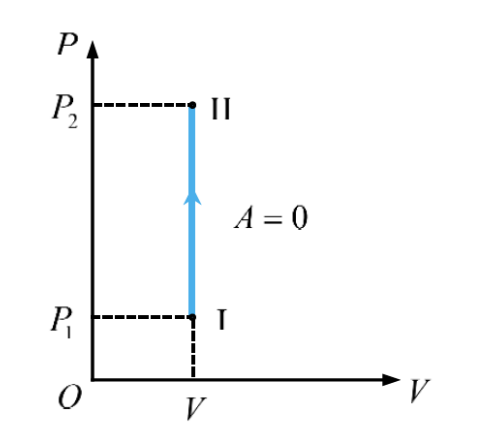
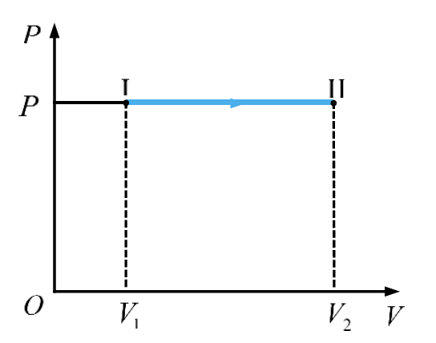
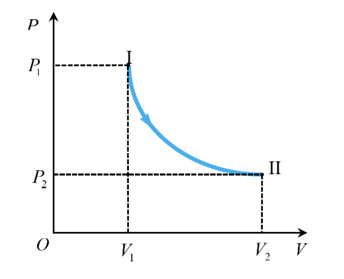
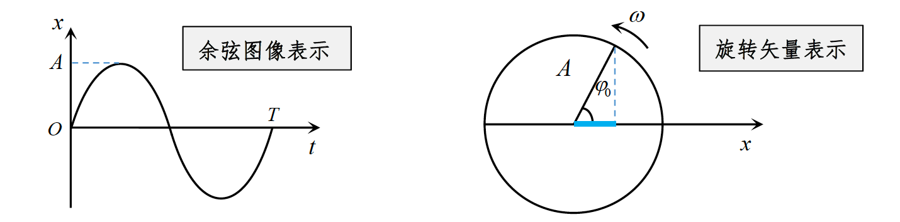
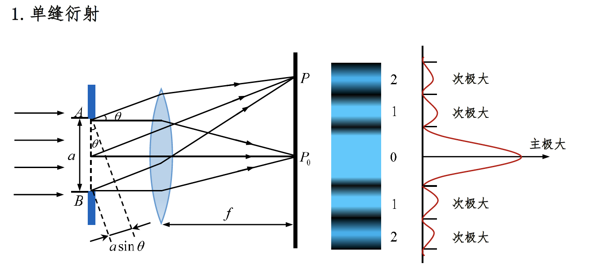
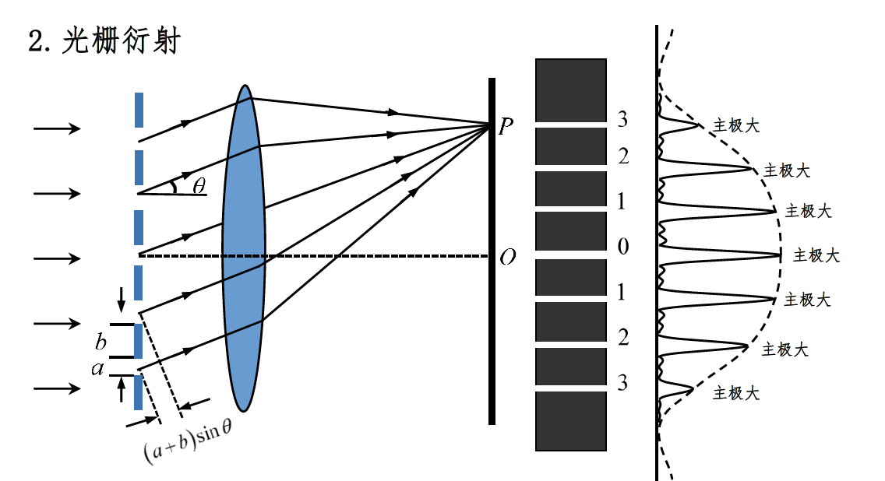
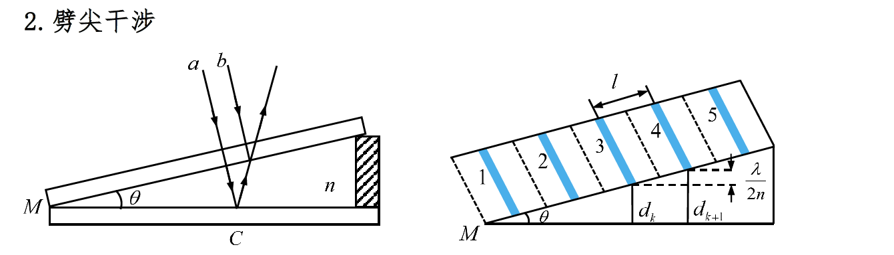

## 热学相关

- 自由度
  - 单原子 $i=3$
  - 双原子 $i=5$
  - 多原子 $i=6$

1. 理想气体

   - 状态方程

     > $pV=\frac{m}{M}RT$

   - $R=8.314$

2. 等体过程

   

   - 特征

     > $V$不变，$\frac{P}{T}=C$（常量）

   - 做功

     > $A=0$

   - 内能

     > $\Delta E=\frac{i}{2}\frac{m}{M}R(T_2-T_1)$

   - 吸热

     > $Q=\Delta E$

   - 注意

     > 摩尔定体热容：$C_V=\frac{i}{2}R$
     >
     > 内能：$\Delta E=\frac{m}{M}C_V(T_2-T_1)$

3. 等压过程

   

   - 特征

     > $P$不变，$\frac{V}{T}=C$（常量）

   - 做功

     > $A=P(V_2-V_1)=\frac{m}{M}R(T_2-T_1)$

   - 内能

     > $\Delta E=\frac{i}{2}\frac{m}{M}R(T_2-T_1)$

   - 吸热

     > $Q=\frac{i+2}{2}\frac{m}{M}R(T_2-T_1)$

   - 注意

     > 做功：$A$，内能：$\Delta E=\frac{i}{2}A$，吸热：$Q=\frac{i+2}{2}A$
     >
     > 摩尔定压热容：$C_P=C_V+R=\frac{i+2}{2}R$

4. 等温过程

   

   

   - 特征

     > $T$不变，$PV=C$（常量）

   - 做功

     > $A=\frac{m}{M}RTln\frac{V_2}{V_1}=\frac{m}{M}RTln\frac{P_1}{P_2}$

   - 内能

     > $\Delta E=0$

   - 吸热

     > $Q=A$

5. 循环效率

   - 热机效率

     > $\eta=\frac{A}{Q_1}=1-\frac{Q_2}{Q_1}$

   - 净功

     > $A=Q_1-Q_2$

   - 卡诺循环

     > $\eta=1-\frac{Q_2}{Q_1}=1-\frac{T_2}{T_1}$

## 振动学相关

1. 简谐运动相关

   

   > $A:振幅$，$\omega：角频率$，$\varphi：初相$，$T：周期$

   - 简谐运动表达式 

     > $x=Acos(\omega t+ \varphi)$

   - 周期

     > $T=\frac{2\pi}{\omega}$

   - 频率

     > $v=\frac{1}{T}=\frac{\omega}{2\pi}$

   - 速度

     > $v=\frac{dx}{dt}=-A\omega sin(\omega+\varphi)$

   - 加速度

     > $a=\frac{dv}{dt}=-A\omega^{2} cos(\omega t+ \varphi)$
   
     速度的相位比位移的相位超前$\frac{\pi}{2}$，加速度的相位比速度的相位超前$\frac{\pi}{2}$
   
   - 简谐运动的运动学特征
   
     > $a=-\omega^{2}x$

## 波动学相关

1. 平面简谐波

   > $波长：\lambda$，$周期：T$，$频率：v$，$波速：u$

   - 波函数

     > $y=Acos[\omega(t\mp\frac{x}{u})+\varphi]$
     >
     > $-$：波沿正方向传播，B点在原点负方向
     >
     > $+$：波沿负方向传播，B点在原点正方向

   - 波函数其他表达式

     > $y=Acos[\omega t\mp\frac{\omega x}{u}+\varphi]$
     >
     > $y=Acos[\omega t\mp\frac{2\pi x}{Tu}+\varphi]$
     >
     > $y=Acos[\omega t\mp\frac{2\pi x}{\lambda}+\varphi]$
     >
     > $y=Acos[\omega t\mp kx+\varphi]$，$k=\frac{2\pi}{\lambda}$
     >
     > $y=Acos[2\pi(\frac{t}{T}\mp\frac{x}{Tu})+\varphi]$
     >
     > $y=Acos[2\pi(\frac{t}{T}\mp\frac{x}{\lambda})+\varphi]$

   - 频率

     > $v=\frac{1}{T}$

   - 波速

     > $u=\frac{\lambda}{T}=v\lambda$

## 光学相关

1. 双缝

   - 明纹

     > $\Delta r=\frac{d}{D}x=
     > \begin{cases}
     > \pm2k\frac{\lambda}{2} & k=0,1,2,3,...明
     > \\
     > \pm(2k-1)\frac{\lambda}{2}  & k=1,2,3,...暗
     > \end{cases}$

   - 明纹位置

     > $x_k=\pm k\frac{D\lambda}{d}$

   - 暗纹位置

     > $x_k=\pm \frac{2k+1}{2}\frac{D\lambda}{d}$

   - 相邻两条明纹间距

     > $\Delta x=\frac{D\lambda}{d}$

   - 杨氏干涉 等间隔明纹 波长

     > $\lambda=\frac{d}{D}\Delta x$
     
   - 明纹最大级数

     > $k_{max}=\frac{d}{\lambda}$

2. 布儒斯特

   - 布儒斯特定律

     > $tan{i_0}=\frac{n_2}{n_1}$

   - 通过偏振片的光强（马吕斯定律）

     > $I=I_{0}cos^2{\alpha}$
     >
     > $I_{n+1}=I_{n}cos^2{\alpha}$

3. 单缝夫琅禾费衍射

   

   - 对应衍射角为$\varphi$的半波带的条数

     > $N=\frac{asin{\varphi}}{\frac{\lambda}{2}}$

   - 单缝衍射极大与极小的条件

     > $\Delta =asin{\varphi}=
     > \begin{cases}
     > \pm2k\frac{\lambda}{2} & k=1,2,...暗纹
     > \\
     > \pm(2k+1)\frac{\lambda}{2}  & k=1,2,...明纹
     > \end{cases}$

   - 一级暗纹坐标

     > $x=\frac{f\lambda}{a}$

   - 中央明纹的线宽度

     > $L=\frac{2f\lambda}{a}$

   - 中央亮纹角宽度

     > $\varphi_0=\frac{2\lambda}{a}$

   - 明条纹中心位置

     > $x=\pm \frac{2k+1}{2}\frac{f\lambda}{a}$

   - 暗条纹中心位置

     > $x=\pm k\frac{f\lambda}{a}$

4. 光栅

   

   - 光栅方程（主极大）

     > $(a+b)sin{\varphi}=k\lambda ,k=0,\pm1,\pm2,...亮纹$

   - 光栅常数

     > $d=a+b$

   - 主级大最大级数

     > $k=\frac{a+b}{\lambda}$（取整）

   - 缺级

     > $k=\frac{a+b}{k'}(k'=\pm1,\pm2...)$

5. 薄膜

   - 考虑半波损失 反射光光程差

     > $\delta_反 =
     > \begin{cases}
     > k\lambda & k=1,2,...明条纹
     > \\
     > (2k+1)\frac{\lambda}{2}  & k=0,1,2,...暗条纹
     > \end{cases}$

   - 透射光光程差

     > $\delta_透 =
     > \begin{cases}
     > k\lambda & k=1,2,...明条纹
     > \\
     > (2k+1)\frac{\lambda}{2}  & k=0,1,2,...暗条纹
     > \end{cases}$

   - 光线垂直入射时，反射光的光程差

     > $\delta=2ne+\frac{\lambda}{2}$

6. 劈尖

   

   - 光程差

     > $\delta =2nd=
     > \begin{cases}
     > k\lambda & k=1,2,...明条纹
     > \\
     > (2k+1)\frac{\lambda}{2}  & k=0,1,2,...暗条纹
     > \end{cases}$

   - 明（暗）纹高度差

     > $\Delta h=\frac{\lambda}{2n}$

   - 明（暗）纹间距

     > $l sin{\theta}=\frac{\lambda}{2n}$

## 量子力学

1. 光电效应

   > $h=6.626*10^{-34} J\cdot s$（普朗克常数）
   >
   > $c=3*10^8 m/s$（光速）

   - 光子的能量

     > $\varepsilon=hv$

   - 光子的动量

     > $p=\frac{\varepsilon}{c}=\frac{hv}{c}=\frac{h}{\lambda}$

   - 光子静止质量

     > $m_0=0$

   - 光子质量

     > $m=\frac{\varepsilon}{c^2}$

   - 光电效应方程

     >  $hv=\frac{1}{2}mv_m^2+A$
     >
     > $A$：逸出功
     >
     > $\frac{1}{2}mv_m^2$：最大初动能

   - 

     > $eU_a=\frac{1}{2}mv_m^2$

   - 

     > $A=\frac{hc}{\lambda}$