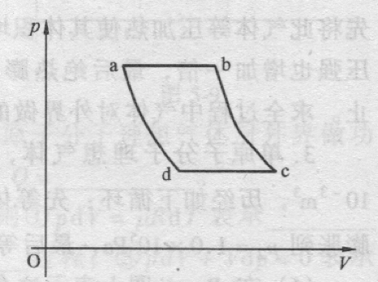
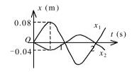
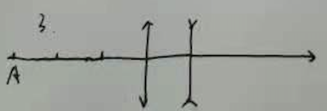

#### 填空
1. 某种物质对于空气的临界角为45°，该透明物质的折射率等于$\sqrt{2}$
   
   > $\sin{C}=\frac{1}{n}$
   > $n * \sin{45°}=1$
   > $n=\sqrt{2}$
   
2. 一物体做余弦振动，振幅为$15*10^{-2}$m，圆频率为$6\pi s^{-1}$，初相位$0.5\pi$，则振动表达式为
   
   >$x=A\cos{（\omega t+ \varphi ）}$
   >$x=0.15\cos{(6\pi t + 0.5\pi )}$
   
3. 在波传播路径上有A、B两点，B点点周相落后于A的周相$\frac{\pi}{6}$，A与B相距2.0厘米，波的周期为2.0秒，则波速度u=______________；波长$\lambda$=_____________；
   
   > 设波动方程为：$y=A\cos{[2\pi (\frac{t}{T}-\frac{x}{\lambda}+\varphi)]}$
   > 那么A和B两点的自动方程分别为
   >
   > $y_A=A\cos{[2\pi (\frac{t}{T}-\frac{x_A}{\lambda}+\varphi)]}$
   > $y_B=A\cos{[2\pi (\frac{t}{T}-\frac{x_B}{\lambda}+\varphi)]}$
   > 两点间的相位差为：$-2\pi\frac{x_B}{\lambda}-(-2\pi\frac{x_A}{\lambda})=-\frac{\pi}{6}$
   > 由于$x_B-x_A=0.02m$，所以波长为$\lambda=0.24m\\$
   > 波速为$u=\frac{\lambda}{T}=0.12ms^{-1}$
4. 单缝的宽度$b=0.40mm$，以波长$\lambda=589nm$的单色光垂直照射，设透镜的焦距$f=1.0m$，则中央明纹的宽度为______________；

   > $l=2f\frac{\lambda}{b}=2*1*\frac{589*10^{-9}}{0.4*10^{-3}}=2.95*10^{-3}$

5. 频率为$v$的光子的能量为$hv$质量为$\frac{hv}{c^2}$，动量为$\frac{h}{\lambda}$。

#### 物理意义

1. $\frac{1}{2}kT$：分子单个自由度的能量
2. $\frac{3}{2}kT$：分子的平均平动动能（或者：但原子分子的平均动能）
3. $\frac{i}{2}kT$：分子的平均动能
4. $\frac{i}{2}RT$：$1mol$气体分子的内能（忽略势能）（或：$1mol$气体分子的平均动能）
5. $\frac{m}{M}\frac{i}{2}RT$：$\frac{m}{M}mol$气体分子的平均动能

#### 计算

1. 如图所示，理想气体经历abcda的正循环过程，ab和cd为等压过程，bc和da为绝热过程，已知b点和c点点温度分别为$T_2$和$T_3$，求循环效率

   

   > $Q_{ab}=\frac{m}{M}C_{p,m}(T_b-T_a)$ 吸热
   >
   > $Q_{cd}=\frac{m}{M}C_{p,m}(T_d-T_a)$ 放热
   >
   > $Q_{bc}=Q_{da}=0$
   >
   > $\eta=1-\frac{\vert Q_{cd}\vert}{Q_{ab}}=1-\frac{T_3-T_d}{T_2-T_a}$
   >
   > 又由$\frac{p^{\gamma-1}_{a}}{T^{\gamma}_{a}}=\frac{p^{\gamma-1}_{d}}{T^{\gamma}_{d}}$
   >
   > 得 $T^{\gamma}_{d}p^{\gamma-1}_{a}=T^{\gamma}_{d}p^{\gamma-1}_{d}  $
   >
   > 同理 $T^{\gamma}_{c}p^{\gamma-1}_{b}=T^{\gamma}_{b}p^{\gamma-1}_{c}$
   >
   > 故$\frac{T_d}{T_c}=\frac{T_a}{T_b}$
   >
   > 即$\frac{T_d}{T_a}=\frac{T_c}{T_b}=\frac{T_3}{T_2}=\frac{T_3-T_d}{T_2-T_a}$
   >
   > 故$\eta=1-\frac{T_3-T_d}{T_2-T_a}=1-\frac{T_3}{T_2}$

2. 如图所示，两个简谐运动的振动曲线，若以余弦函数表示这两个振动的合成结的方程为$x=x_1+x_2=$

   

   > 如图可知$T=2s$
   >
   > $\omega=\frac{2\pi}{T}=\pi rad/s$
   >
   > $A_1=0.08 \xrightarrow{} t=0时，v>0,\varphi_1=-\frac{\pi}{2}$
   >
   > $A_2=0.04 \xrightarrow{}t=0时，v<0,\varphi_2=\frac{\pi}{2}$
   >
   > 同频率同方向简谐运动合成，合成后$A=\vert A_1-A_2\vert=0.04$，$\omega=\pi$
   >
   > 旋转矢量$\overrightarrow{A_1}$与$\overrightarrow{A_2}$合成后，$\overrightarrow{A}$的相位上$-\frac{\pi}{2}$
   >
   > $x=x_1+x_2=0.04\cos{(\pi t-\frac{\pi}{2})}$

3. 凸透镜L1和凹透镜L2共轴放置，相距10cm，凸透镜的象方焦距为20cm，凹透镜的物方焦距为20cm，物体A位于凸透镜前方30cm处，试确定物体所成的象的位置和性质。

   

   > 此题两次成象
   >
   > 第一次：
   >
   > $S_1=-30cm$ $f'_1=20cm$  $f_1=-20$
   >
   > $\frac{f_1'}{S_1'}+\frac{f_1}{S_1}=1$
   >
   > $\therefore S_1'=60cm$
   >
   > $\beta_1=\frac{S_1'}{S_1}=-2$
   >
   > 第二次
   >
   > $S_2=S_1'-10=50$
   >
   > $f_2'=-20cm$  $f_2=20cm$
   >
   > 代入$\frac{f_2'}{S_2'}+\frac{f_2}{S_2}=1$
   >
   > $S_2'=-\frac{100}{3}$
   >
   > $\beta_2=\frac{S_2'}{S_2}=-\frac{2}{3}$
   >
   > $\beta=\beta_1*\beta_2=\frac{4}{3}$
   >
   > 最终成象在凹透镜左侧$\frac{100}{3}cm$处，成当大正立的虚像

4. 波长为$400nm$的单色光垂直入射到一透光栅上，接受屏上2个相邻主极大明条纹分别出现在$\sin{\varphi}=0.20$和$\sin{\varphi}=0.30$处，并且第四级缺级。试求：1）光栅常数；2）光栅狭缝到最小宽度数；3）按上述选定的缝宽和光栅常数，写出光屏上实际呈现的全部级数。

   >1）
   >
   >光栅主极大 $d\sin{\theta}=j\lambda$，已知$\sin{\varphi_1}=0.2$，$\sin{\varphi_1}=0.3$
   >
   >$\therefore d \sin{\varphi=j\lambda}$，$d \sin{\varphi_2=(j+1)\lambda}$
   >
   >$\therefore d=4000nm$
   >
   >2）
   >
   >$\frac{d}{a}=\frac{j}{k}=4$，$k=1$时，$j=4$，$a=1000nm$
   >
   >3）
   >
   >$d\sin{90°}=j_{max}\lambda$，$j_{max}=10$不可取
   >
   >级数为 $0,\pm1,\pm2,\pm3,\bcancel{\pm4},\pm5,\pm6,\pm7,\bcancel{\pm8},\pm9$，去掉$\pm4,\pm$8

5. 当用波长为$400nm$的光照射到红阈波长为$600nm$的材料表面时，从表面发射出的电子动能为多少？

   >$h\frac{c}{\lambda}=A=h\frac{c}{600*10^{-9}}$，由此得$A=3.31*10^{-19}J$
   >
   >$\frac{1}{2}mv^2+A=h\frac{c}{\lambda^1}=h\frac{c}{400*10^{-9}}=4.97*10^{-19}J$
   >
   >$\therefore E=\frac{1}{2}mv^2=1.66*10^{-19}J=1.03eV$

