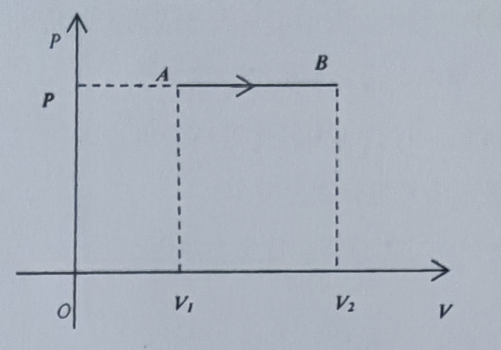
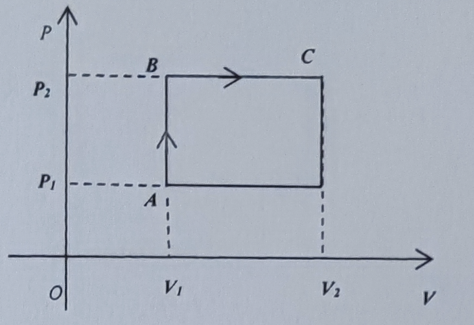
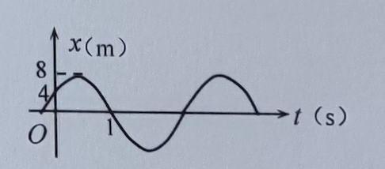

1. 单原子理想气体分子，经历如图所示等压过程由A到达B，已知$V_2=2V_1$，且$P$和$V_1$为已知量。求这个过程中:

    (1)系统做的功；(2)内能的增量；(3)系统吸收的热量。

   

   >(1) $A=P(V_2-V_1)=PV_1$
   >
   >(2) $\Delta E=\frac{i}{2}A=\frac{3}{2}PV_1$
   >
   >(3) $Q=\frac{i+2}{2}A=\frac{5}{2}PV_1$

2. 双原子理想气体分子，经历如图所示正循环过程，已知$V_2=3V1$，$P_2=2P_1$，$P_1$，$V_1$为已知量，求循环的效率。

   

   >$A\rightarrow B$等体过程
   >
   >$A_{AB}=0$
   >
   >$\Delta E_{AB}=\frac{i}{2}\frac{m}{M}R(T_2-T_1)=\frac{i}{2}(P_BV-P_AV)=\frac{5}{2}P_1V_1$
   >
   >$Q_{AB}=\Delta E=\frac{5}{2}P_1V_1$
   >
   >$B\rightarrow C$等压过程
   >
   >$A_{BC}=P(V_2-V_1)=2P_1*2V_1=4P_1V_1$
   >
   >$\Delta E_{BC}=\frac{i}{2}A=6P_1V_1$
   >
   >$Q_{BC}=\frac{i+2}{2}A=10P_1V_1$
   >
   >$Q_吸=Q_{AB}+Q_{BC}=\frac{25}{2}P_1V_1$
   >
   >根据面积 净功$A=(P_2-P_1)*(V_2-V_1)=2P_1V_1$
   >
   >$\eta=\frac{A}{Q_吸}=\frac{2P_1V_1}{\frac{25}{2}P_1V_1}=\frac{4}{25}=16\%$

3. 弹簧振子中小球沿x轴做简谐振动，振动表达式为$x=2cos(\pi t+ \pi)$，其中$x$以厘米计，$t$以秒计。求: 

   (1) 简谐振动的初相和周期；(2) $t=1s$时小球的速度

   >将方程$x=2cos(\pi t+ \pi)$与标准方程$x=Acos(\omega t+ \varphi)$比较，得出
   >
   >$A=0.02m$，$\omega=\pi$，$\varphi=\pi$
   >
   >(1) 初相位$\varphi=\pi$，周期$T=\frac{2\pi}{\omega}=2$
   >
   >(2) $v=\frac{dx}{dt}=-A\omega sin(\omega t+\varphi)=-2*\pi sin(\pi*1+\pi)=0$

4. 一质点作简谐运动的曲线如图所示，试求: (1)初相位；(2) 圆频率；(3)周期。

   

   >如图 振幅$A=8m$；$当t=0时，x=4$；$当t=1时，x=0$ 。
   >
   >代入标准方程$x=Acos(\omega t+ \varphi)$ 得
   >
   >$4=8cos(\omega*0+\varphi)$
   >
   >$0=8cos(\omega*1+\varphi)$
   >
   >得$\varphi=\pm \frac{\pi}{3}$，$\omega=\frac{5\pi}{6}$
   >
   >由$t=0,x_0=4>0$ 得 $v_0>0$ 得 $sin(\varphi)<0$ 得 $\varphi=-\frac{\pi}{3}$
   >
   >代入标准方程得
   >
   >$x=8cos(\frac{5\pi}{6}t-\frac{\pi}{3})$ 
   >
   >$T=\frac{2\pi}\omega=\frac{12}{5}$
   >
   >(1) 初相位 $\varphi=-\frac{\pi}{3}$；(2) 圆频率$\omega=\frac{5\pi}{6}$；(3) 周期$T=\frac{12}{5}$

5. 一平面简谐波沿$x$轴正向传播，$t=0$时刻位于原点处质点越过平衡位置朝$y$轴负方向运动，已知振动振幅为$50cm$，波的波长为40cm，波源振动周期为$2s$，试求:

   (1) 原点处质点的振动表达式；(2)波函数；

   >如题：$A=0.5m$，$\lambda=0.4m$，$T=2s$
   >
   >(1) 将$A=0.5m$，$\varphi=0$代入振动表达式$y=Acos(\omega t+ \varphi)$
   >
   >$y=0.5cos(\omega t+\varphi)$
   >
   >$t=0，y=0；t=0.5，y=0.5$
   >
   >$\varphi=\pm \frac{\pi}{2}$ 正方向 $sin\varphi<0$ $\therefore \varphi=-\frac{\pi}{2}$
   >
   >$\omega=\frac{2\pi}{T}=\pi$
   >
   >振动表达式：$y=0.5cos(\pi t-\frac{\pi}{2})$
   >
   >(2) $u=\frac{\lambda}{T}=0.2$ 
   >
   >代入波函数方程$y=Acos[\omega t-\frac{\omega x}{u}+\varphi]$
   >
   >$y=0.5cos[\frac{\pi}{3} t-\frac{\pi}{0.2}x- \frac{\pi}{2}]=0.5cos[\frac{\pi}{3} t-5\pi x- \frac{\pi}{2}]$

6. 在双缝干涉实验中，双缝与屏间的距离为$D=1m$，双缝间距为$d=1mm$，测得屏上相邻明条纹间距为$1mm$，求：

   (1)光源发出的单色光的波长；(2)写出两种可以增大相邻干涉条纹间距的方法。

   >(1) $ \lambda=\frac{d}{D}\Delta x=\frac{1*10^{-3}}{1}*1*10^{-3}=10^{-6}m=100nm$
   >
   >(2) $\because光波长/双缝间距=条纹间距/光屏双缝距离\\
   >		\therefore\begin{cases}光屏离双缝越远,条纹间距越大.\\
   >		光波长越长,条纹间距越大.\\
   >		双缝间距越小,条纹间距越大.\end{cases}$

7. 单缝夫琅禾费衍射中，缝宽$a=0.10mm$，波长$\lambda=500nm$的平行单色光垂直照射在单缝上，会聚透镜的焦距为$f=1m$，

   求(1)中央明纹的线宽度；(2)第2级暗纹所对应的单缝处波阵面可分为几个半波带？

   >(1) $L=\frac{2f\lambda}{a}=\frac{2*1*500*10^{-9}}{0.1*10^{-3}}=0.01m$
   >
   >(2) $asin{\varphi}=2k\frac{\lambda}{2}=2*2*\frac{\lambda}{2}=4*\frac{\lambda}{2}$
   >
   >$\therefore$ 可以分为4个半波带

8. 波长为$600nm$的单色光垂直入射到置于空气中的平行薄膜上，已知膜的折射率$n=1.4$，

   求：(1)反射光最强时膜的最小厚度；(2)透射光最强时膜的最小厚度；

   >对空气中的薄膜，反射光线对有附加的光程差。设薄膜厚度为$e$，反射光线对的光程差为$\delta=2ne+\frac{\lambda}{2}$
   >
   >(1) 要反射光最强，必须满足$\delta=2ne+\frac{\lambda}{2}=k\lambda,k=1,2,3,...$
   >
   >所以反射光最强时，膜的最小厚度为$e_{min}=\frac{\lambda}{4n}=\frac{600}{4*1.4}=\frac{750}{7}\approx107.1$
   >
   >(2) 要透射光最强，即反射光最弱，必须满足$\delta=2ne+\frac{\lambda}{2}=(2k+1)\frac{\lambda}{2},k=1,2,3,...$
   >
   >所以透射光最强时，膜的最小厚度为$e_{min}=\frac{\lambda}{2n}=\frac{600}{2*1.4}=\frac{1500}{7}\approx214.3$

9. 波长为$\lambda$的单色光垂直入射到每厘米有5000条刻痕的光栅上，测得第一级谱线到衍射角为$30度$，

   求：(1)单色波波长；(2)用此单色光照射光栅，屏幕上最多看到多少条明纹。

   >(1) 已知光栅方程$(a+b)sin{\varphi}=k\lambda ,k=0,\pm1,\pm2,...亮纹$
   >
   >$\because 每厘米有5000条刻痕,\therefore光栅常数a+b=\frac{1}{5000}cm$
   >
   >$\frac{1}{5000}*sin{30}=1*\lambda$
   >
   >$\lambda=\frac{1}{10000}cm=$ 1000nm
   >
   >(2)最多取$sin\varphi=1$
   >
   >$k=\frac{(a+b)}{\lambda}=2$
   >
   >$0,\pm1,\pm2$
   >
   >$ \therefore$  屏幕上最多看到5条明纹

10. 一束自然光光强为$I_0$，垂直入射两片偏振片$P_1$和$P_2$，它们的偏振化方向夹角为$30度$。若不考虑偏振片的反射和吸收，则一次通过两个偏振片的光强分别为多少？

    >第一片 $I_1=\frac{1}{2}I_0$
    >
    >第二片 $I_2=I_1cos^2{30}=\frac{1}{2}I_0*\frac{3}{4}=\frac{3}{8}I_0$

11. 某种透明介质的折射率为1.414，光从空气射向此介质时的布儒斯特角为多少？

    >由布儒斯特定律$tan{i_0}=\frac{n_2}{n_1}$得
    >
    >$tan{i_0}=\frac{1.414}{1}$
    >
    >$i_0=arctan{1.414} \approx 54.73^{\circ}$

12. 金属钾的逸出功为$2eV$，求：

    (1)光电效应的红限频率和红限波长；(2)如果入射光波长为$400nm$，求遏止电压。

    >(1) 已知逸出功为$A=2eV$，则红限频率和波长分别为
    >
    >$v_0=\frac{A}{h}=\frac{2*1.602*10^{-19}}{6.626*10^{-34}}=4.84*10^{14}Hz$
    >
    >$\lambda_0=\frac{c}{v_0}=6.20*10^{-7}m=620nm$
    >
    >(2) 入射光频率为 $v=\frac{c}{\lambda}=\frac{3.00*10^{8}}{300*10^{-9}}=1.00*10^{15}Hz$
    >
    >由光电效应方程$hv=\frac{1}{2}mv_m^2+A$，光电子的最大动能刚好能克服遏止电压做功而形成光电流，
    >
    >因此有关系式$eU_a=\frac{1}{2}mv_m^2$
    >
    >比较2式可得
    >
    >$U_a=\frac{hv-A}{e}=\frac{6.626*10^{-34}*1.00*10^{15}-2*1.602*10^{-19}}{1.602*10^{-19}}=2.14V$

    

    

