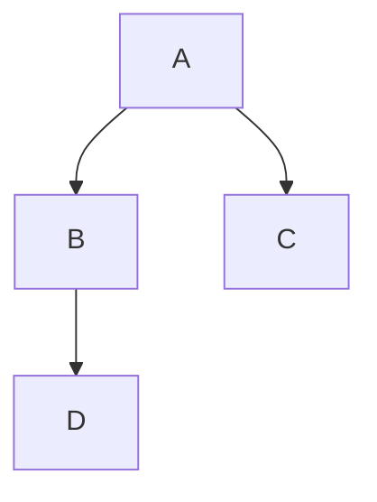
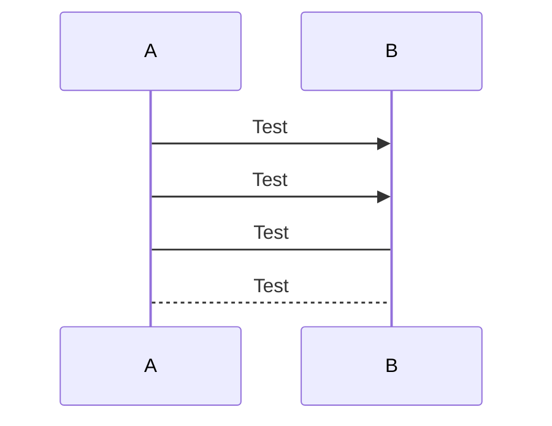

## 一. 流程图

1. 朝向

   - TB/TD - 自顶向下
     ```
     graph TB;
         A-->B;
     ```
     ````mermaid
     graph TB;
         A-->B;
     ````

   - BT - 自底向上
     ```
     graph BT;
         A-->B;
     ```
     ````mermaid
     graph BT;
         A-->B;
     ````

     

   - RL - 自右向左
     ```
     graph RL;
         A-->B;
     ```
     ````mermaid
     graph RL;
         A-->B;
     ````

   - LR - 自左向右
     ```
     graph LR;
         A-->B;
     ```
     ````mermaid
     graph LR;
         A-->B;
     ````

2. 节点样式

   - 正方形边框 `A[正方形]`

   - 圆角矩形边框 `B(圆角矩形)`

   - 运动场形边框 `C([运动场形])`

   - 子程序边框 `D[[子程序]]`

   - 圆柱体形边框 `E[(圆柱体形)]`

   - 圆形边框 `F((圆形))`

   - 标签形边框 `G>标签形]`

   - 菱形 `H{菱形}`

   - 六边形 `I{{六边形}}`

   - 平行四边形 `J[/平行四边形/]  `

   - 反平行四边形 `K[\反平行四边形\]`

   - 正梯形 `L[/正梯形\] `

   - 倒梯形 `M[\倒梯形/]`

     ```
     graph 
     	A[正方形]
     	B(圆角矩形)
     	C([运动场形])
     	D[[子程序]]
     	E[(圆柱体形)]
     	F((圆形))
     	G>标签形]
     	H{菱形}
     	I{{六边形}}
     	J[/平行四边形/]
     	K[\反平行四边形\]
     	L[/正梯形\]
     	M[\倒梯形/]
     ```
     ````mermaid
     graph 
     	A[正方形]
     	B(圆角矩形)
     	C([运动场形])
     	D[[子程序]]
     	E[(圆柱体形)]
     	F((圆形))
     	G>标签形]
     	H{菱形}
     	I{{六边形}}
     	J[/平行四边形/]
     	K[\反平行四边形\]
     	L[/正梯形\]
     	M[\倒梯形/]
     ````

3. 连接线类型

   - 带箭头实线
     ```
     graph LR
     	A1 --> B1
     	A2-->|text|B2
     	A3-- text -->B3
     ```
     ````mermaid
     graph LR
     	A1 --> B1
     	A2-->|text|B2
     	A3-- text -->B3
     ````

   - 不带箭头实线
     ```
     graph LR
     	A1 --- B1
     	A2-- text ---B2
     	A3---|text|B3
     ```
     ````mermaid
     graph LR
     	A1 --- B1
     	A2-- text ---B2
     	A3---|text|B3
     ````

     

   - 点线
     ```
     graph LR
     	A1-.->B1;
     	A2-. text .-> B2
     ```
     ````mermaid
     graph LR
     	A1-.->B1;
     	A2-. text .-> B2
     ````

     

   - 带箭头粗实线
     ```
     graph LR
     	A1 ==> B1
     	A2 == text ==> B2
     ```
     ````mermaid
     graph LR
     	A1 ==> B1
     	A2 == text ==> B2
     ````

     

4. 
```
graph TD;
    A-->B;
    A-->C;
    B-->D;
```


## 二、时序图
```
sequenceDiagram
    A->>B: Test
    A->>B: Test
    A->B: Test
    A-->B: Test
```


## 三、状态图
```
stateDiagram
    [*] --> s1
    s1 --> [*]
```
````mermaid
stateDiagram
    [*] --> s1
    s1 --> [*]
````

## 四、类图
```
classDiagram
      Animal <|-- Duck
      Animal <|-- Fish
      Animal <|-- Zebra
      Animal : +int age
      Animal : +String gender
      Animal: +isMammal()
      Animal: +mate()
      class Duck{
          +String beakColor
          +swim()
          +quack()
      }
      class Fish{
          -int sizeInFeet
          -canEat()
      }
      class Zebra{
          +bool is_wild
          +run()
      }
```
`````mermaid
classDiagram
      Animal <|-- Duck
      Animal <|-- Fish
      Animal <|-- Zebra
      Animal : +int age
      Animal : +String gender
      Animal: +isMammal()
      Animal: +mate()
      class Duck{
          +String beakColor
          +swim()
          +quack()
      }
      class Fish{
          -int sizeInFeet
          -canEat()
      }
      class Zebra{
          +bool is_wild
          +run()
      }
`````


## 五、甘特图
```
gantt
    title 工作计划
    dateFormat  YYYY-MM-DD
    section Section
    A task           :a1, 2020-01-01, 30d
    Another task     :after a1  , 20d
    section Another
    Task in sec      :2020-01-12  , 12d
    another task      : 24d
```
````mermaid
gantt
    title 工作计划
    dateFormat  YYYY-MM-DD
    section Section
    A task           :a1, 2020-01-01, 30d
    Another task     :after a1  , 20d
    section Another
    Task in sec      :2020-01-12  , 12d
    another task      : 24d
````


## 六、饼图
```
pie
    title Key elements in Product X
    "Calcium" : 42.96
    "Potassium" : 50.05
    "Magnesium" : 10.01
    "Iron" :  5
```
````mermaid
pie
    title Key elements in Product X
    "Calcium" : 42.96
    "Potassium" : 50.05
    "Magnesium" : 10.01
    "Iron" :  5
````

