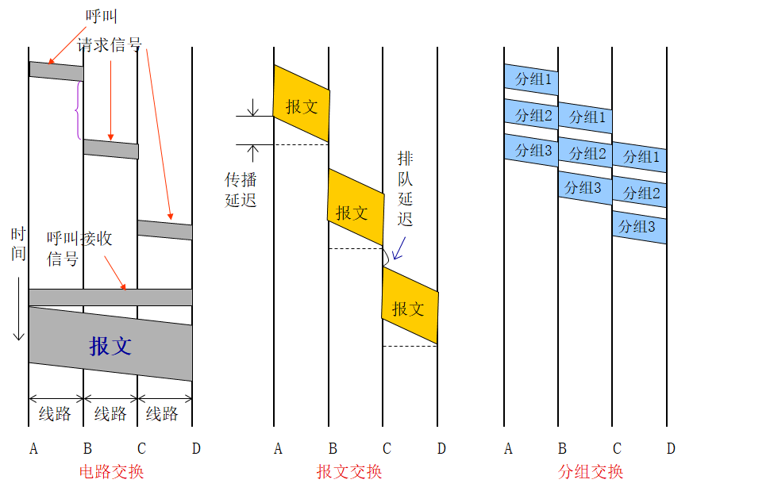

时间<font style="color:red">2020-07-01 09：00~11：30</font>

成绩：期末卷面+期中考试+作业+实验+考勤

## 题型

| 题型 | 数量 | 分值 | 说明       |
| ---- | ---- | ---- | ---------- |
| 选择 |      | 2    |            |
| 计算 |      |      | 香农 CRC   |
| 简答 |      |      | 原理，概念 |
| 综合 |      |      |            |

## 复习

### 第一章 概述

1. OSI参考模型

   * 层次，功能，数据形式，协议

   * 应用层-表示层-会话层-传输层-网络层-数据链路层-物理层

   * | 层次       | 数据形式 | 功能 | 协议 |
     | ---------- | -------- | ---- | ---- |
     | 应用层     | APDU     |      |      |
     | 表示层     | PPDU     |      |      |
     | 会话层     | SPDU     |      |      |
     | 传输层     | TPDU     |      |      |
     | 网络层     | 分组     |      |      |
     | 数据链路层 | 帧       |      |      |
     | 物理层     | 比特流   |      |      |

   * 

2. TCP/IP参考模型

   * 层次，功能，数据形式，协议
   * 应用层-传输层-互联网层-网路接口层

### 第二章 物理层

1.  最大数据传输速率计算
   
   * 那奎斯特定理
     $$
     最大传输速率=2Hlog_2V
     \\单位：bps
     $$
     
   * 香农定理
     $$
     最大传输速率=Hlog_2(1+S/N)
     \\单位：bps
     \\信噪比=10log_{10}(S/N)
     $$
   
2. 信道复用技术
   
   * 频分多路复用==FDM==
   
     * 工作原理：将多路信号中的每路信号都以不同频率的载波进行调制，而且各路载波的频率之间留有一定的间隔以使各路信号带宽不相互重叠，那么这些信号就可同时在介质上传输。
   
   * 时分多路复用==TDM==
   
     * 工作原理：采用分时技术，每路分配一个时隙。
   
   * 比较
   
     | FDM                            | TDM                                      |
     | ------------------------------ | ---------------------------------------- |
     | 传输介质的带宽充足             | 传输介质的位传输率即时间充足             |
     | 适合模拟信号的传输             | 适合数字信号的传输                       |
     | 信号在宏观和微观上都是并行传输 | 信号在宏观上是并行传输在微观上是串行传输 |
     | 主要使用调制技术               | 主要使用时间片轮转技术                   |
   
3. 数据交换技术

   * 电路交换

     * 原理：直接利用可交换的物理线路，连接通信双方

     * 三个阶段：建立通路、传输数据、拆除通路

     * 应用：公共电话网、ISDN

     * 特点：

       * 优点：

         * 数据传输延迟时间较短（对于一次连接来说，传输延迟是固定不变的）

         * 交换机对用户的数据信息不进行存储、分析和处理，交换机在处理方面的开销小，对用户的数据信息不需要附加许多用于控制的信息，传输效率高

       * 缺点：

         * 建立物理通路时间较长，短报文通信效率低。

         * 电路资源被通信双方占用，电路利用率低。

   * 报文交换

     * 原理：信息以报文（逻辑上完整的信息段）为单位进行存储-转发
     * 存储-转发思想：当有数据要发送则交给中间节点；无论数据传输过程要跨越多少个中间节点，只要下一个中间节点不忙，该数据立即送至下一节点（best-effort方式），因此线路利用率高
     * 特点：
       * 优点：
         * 线路利用率高：来自不同用户的报文可以在同一线路上以报文为单位实现时分多路复用
       * 缺点：
         * 延迟时间较长：报文通过交换机的时延大，且时延抖动也大，不利于实时通信
         * 对中间结点（通信设备）要求较高：交换机要有能力存储转发用户发送的报文，其中有的报文可能很长，这就要求交换机要有高速处理能力和大的存储空间

   * 分组交换

     * 原理：信息以分组为单位进行存储转发。源节点把报文分为分组，在中间节点存储转发，目的节点把分组合成报文
     * 特点：
       * 优点：
         * 允许中间节点在接收分组的同时发送分组，因此，多个节点对之间可以并行传输多个分组，提高传输效率
       * 缺点：
         * 每个中间节点必须有缓存，但由于分组大小固定，所以缓存通常在内存中设置
         * 接收分组和发送分组的顺序可能不一致 ，并且还需要重组

   * 比较

     | 交换 | 电路交换                                                     | 报文交换                                                     | 分组交换                                                     |
     | ---- | ------------------------------------------------------------ | ------------------------------------------------------------ | ------------------------------------------------------------ |
     | 原理 | 直接利用可交换的物理线路，连接通信双方                       | 信息以报文为单位进行存储-转发                                | 信息以分组为单位进行存储转发。源节点把报文分为分组，在中间节点存储转发，目的节点把分组合成报文 |
     | 优点 | 数据传输延迟时间较短<br/>交换机对用户的数据信息不进行存储、分析和处理，交换机在处理方面的开销小，对用户的数据信息不需要附加许多用于控制的信息，传输效率高 | 线路利用率高：来自不同用户的报文可以在同一线路上以报文为单位实现时分多路复用 | 允许中间节点在接收分组的同时发送分组，因此，多个节点对之间可以并行传输多个分组，提高传输效率 |
     | 缺点 | 建立物理通路时间较长，短报文通信效率低。<br/>电路资源被通信双方占用，电路利用率低。 | 延迟时间较长：报文通过交换机的时延大，且时延抖动也大，不利于实时通信<br>对中间结点要求较高：交换机要有能力存储转发用户发送的报文，其中有的报文可能很长，这就要求交换机要有高速处理能力和大的存储空间 | 每个中间节点必须有缓存，但由于分组大小固定，所以缓存通常在内存中设置<br>接收分组和发送分组的顺序可能不一致 ，并且还需要重组 |

   

4. 传输介质

   * 双绞线==TP==
     * 既可用于模拟传输，也可用于数据传输
     * 非屏蔽双绞线==UTP==
       * 双绞线外没有任何屏蔽
     * 屏蔽双绞线==STP==
       * 双绞线外有铝箔包裹，用于屏蔽干扰信号
   * 同轴电缆
     * 传输多路不同频率的模拟信号
   * 光纤
   * 微波

### 第三章 数据链路层

1. 差错控制

   * 检错码:奇偶校验、循环冗余编码
2. ARQ协议(滑动窗口)
   * 停-等、后退n帧、选择重传

### 第四章 局域网

1. MAC地址
2. 传统局域网技术(共享介质访问技术)
   * ALOHA
   * CSMA/CD

### 第五章 以太网技术

1. 以太网帧结构
2. 从10Mbit/s到10Gbit/s
   * 传统以太网、百兆/快速以太网、千兆以太网、万兆以太网、最短帧长

### 第六章 交换技术与虚拟局域网

1. 交换机的数据转发
   * 转发原则、冲突域、广播域、自我学习
2. 虚拟局域网
   * VLAN、端口类型、带VLAN标记的帧、VLAN划分配置

### 第七章 网络层

1. IP协议
   * IP分组格式、IP地址分类、子网掩码、网络号(网络地址)、网关、子网划分
2. 因特网控制报文协议ICMP
   * ICMP协议的运用ping、tracert原理
3. 地址解析协议ARP
   * ARP工作过程、ARP报文格式、跨网时的ARP

### 第八章 网络互联

1. 基于路由的互联
   * 静态路由、RIP协议、OSPF协议
2. 网络地址转换NAT
   * NAT原理
3. 第三层交换技术
   * 三层交换原理、三层交换配置

### 第九章 传输层

1. 传输控制协议
   * TCP特点、TCP的报文格式、端口、TCP连接的建立与释放
2. 用户数据报协议
   * UDP特点

### 第十章 应用层

1. 域名系统
   * 域名、域名解析过程
2. 万维网
   * URL、Web服务实现过程
3. FTP协议特点
4. SMTP和POP3协议作用

## 实验内容

### 虚拟网实验

* 掌握按端口划分VLAN的常⽤命令

  ````
  enable-进入交换机特权模式
  configure terminal-进入配置模式
  vlan n-建立ID为n的VLAN,n为数字
  name abc-命名当前VLAN名称为abc
  exit-退出当前配置
  
  interface 端口名称-进入某个端口配置，端口名称根据具体设备可能不同
  switchport access vlan n-将当前端口加入vlan n
  show vlan-查看当前vlan 配置
  show vlan brief-查看当前vlan主要配置
  exit-退出当前配置
  
  switchport mode trunk- 将当前端口设置为trunk 模式
  show running-config-查看当前运行配悝，这里主要是用来查看端口模式
  ````

* 理解交换机上查看VLAN、查看端口输出信息的含义

### 路由实验

* 掌握静态路由配置命令

  ````
  enable—进入路由器特权模式
  configure terminal—进入配置模式
  interface 端口名称-进入某个端口配置，端口名称根据具体设备可能不同
  ip address ip 地址子网掩码—配置端口的ip地址和子网掩码
  no shutdown-启用端口
  exit-退出当前配置
  
  show ip route-查看当前路由器的路由表
  
  ip route 目标网络 子网掩码 下一跳网关接口地址－设置静态路由
  no ip route 目标网络 子网掩码 下一跳网关接口地址－删除前面设置的静态路由
  ````

* 理解路由器上查看路由表的输出信息的含义

  ````
  C - connected, S - static, I - IGRP, R - RIP, M - mobile, B - BGP
  D - EIGRP, EX - EIGRP external, O - OSPF, IA - OSPF inter area 
  N1 - OSPF NSSA external type 1, N2 - OSPF NSSA external type 2
  E1 - OSPF external type 1, E2 - OSPF external type 2,
  i - IS-IS, su - IS-IS summary, L1 - IS-IS level-1, L2 - IS-IS level-2,
  ia - IS-IS inter area, * - candidate default, U - per-user static route,
  o - ODR, P - periodic downloaded static route
  ````

  ````
  C 192.168.1.0/24 is directly connected, FastEthernet0/0
  C是connected直接相连的意思，192.168.1.0/24是直连的网段，24是255.255.255.0的缩写，要转发数据包到192.168.1.0网段，通过fastethernet0/0接口转发。
  ````

  ````
  R 192.168.3.0/24 [120/1] via 192.168.65.2, 00:00:04, Serial2/0
  R是RIP协议，通过动态路由协议RIP学到的路由，192.168.3.0/24就是学到的路由，[120/1]即[管理距离/度量值(此数为路由跳数)]，是度量值和管理距离，也就是优先级的意思。via 192.168.65.2　via 有“经由”的意思，一般路由表中理解为“下一跳” ，指下一跳的接口IP地址为192.168.65.2，就是你要发送数据包到下个路由器的接口，从Seria2/0口转发。
  ````

### 三层交换实验

* 掌握使用三次交换机实现静态路由配置的命令

  ````
  switchport trunk encapsulation dotlq-二层端口封装802.lq协议，针对三层交换机端口
  switchport mode trunk-将当前端口设置为trunk 模式
  
  interface vlan x-进入VLANx 的接口进行配置。
  
  ip routing-启用路由功能。
  show ip route-查看路由信息。
  ````

  

* 理解查看路由表的输出信息的含义

### 网络地址转换

* 网络地址转换相关命令

  ````
  ip nat inside-设置接口为内部接口
  ip nat outside-设置接口为外部接口
  ip nat inside sources static x y-将内部地址x 静态映射为外部地址y
  show ip nat statistics-查看NAT统计数据和规则
  show ip nat translations-查看NAT活动转换
  
  ip nat pool 地址池名称 地址池起始地址 地址池结束地址netmask 子网掩码－配置公网地址池
  ip nat inside source list x pool 地址池名称－建立全局地址池和标准访问控制列表x
  之间的映射关系
  ````

  

