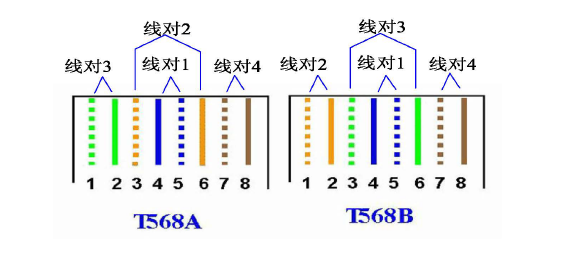
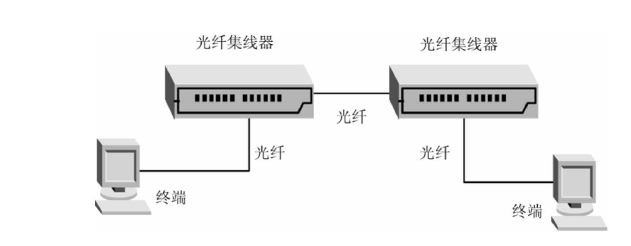

## 第一章 概述

### 第一次

1. 计算机网络都有哪些类别？

   ````
   按技术分：广播式网络，点到点网络；
   按传输介质分：有线网，无线网；
   按规模分：个域网，局域网，城域网，广域网，互联网，物联网；
   按使用范围分：专用网，公共网；
   按拓扑结构分：总线，环形，网状，星形。
   ````

2. 互联网基础结构的发展大致分为哪几个阶段？

   ````
   第一阶段：从单个网络ARPANET向互联网发展
   第二阶段：建立三级结构的互联网
   第三阶段：多层次ISP结构的互联网
   ````

3. 计算机网络提供的基本功能有哪些？

   ````
   （1）数据通信——计算机协同工作，不仅消除了地理位置的限制，而且极大地提高了工作效率，如：IP电话、网上寻呼、网络聊天和电子邮件等。
   （2）资源共享——许多计算机领域的昂贵资源，通过网络的普及而提高了利用率，使计算机系统的整体性价比得到改善，避免了重复投资。如：网络视频点播、网上教学、网上购物等。
   （3）提高可靠性——通过计算机网络，各种资源可以存放在不同地点，用户可以通过多种途径来访问网络中的某个资源，从而避免了单一节点失效对用户产生的影响。如：网络存储、网上证券等。
   （4）提高系统处理能力——计算机网络内的多台计算机可通过协同操作和并行处理来提高整个系统的处理能力，并使网络内的各计算机负载均衡。如：网络运算、分布式数据库等。
   ````

4. 写出计算机网络的定义。

   ````
   计算机网络是通过传输介质、通信设施和网络通信协议，把分散在不同地点的计算机设备互联起来，实现资源共享和信息传输的系统。
   ````

5. 计算机网络中的主干网和本地接入网的区别是什么？

   ````
   主干网：计算机网络核心部分，高速通信链路和路由器组成，数据传输速度快。
   接入网：用于把用户接入到互联网。
   ````

6. 互联网的两大组成部分（边缘部分与核心部分）的特点是什么？工作方式有哪些特点？

   ````
   边缘部分：由所有连接在互联网上的主机组成，主要目的分析用户资源。
   核心部分：由路由器和通信链路组成，提供连通和数据交换。
   ````

7. 计算机网络有哪些常用的性能指标？

   ````
   速率、带宽、吞吐量、时延、往返时间、信道利用率
   ````

### 第二次

1. 常见的网络拓扑结构有哪些？

   ````
   局域网：总线型，环型，星型
   广域网：网状型、混合型
   ````

2. 网络体系结构为什么采用分层思想？

   ````
   分层的好处:
   1、各层之间是独立的。某一层可以使用其下一层提供的服务而不需要知道服务是如何实现的。
   2、灵活性好。当某一层发生变化时，只要其接口关系不变，则这层以上或以下的各层均不受影响。
   3、结构上可分割开。各层可以采用最合适的技术来实现。
   4、易于实现和维护。
   5、能促进标准化工作。
   
   把庞大而复杂的问题转化为若干较小的局部问题，这些小问题易于研究处理。
   ````

3. 协议和服务有什么联系和区别？

   ````
   协议是控制对等实体进系通信的规则的集合；在协议的控制下，本层能向上层提供服务。协议是水平的；服务是垂直的。
   ````

4. 网络协议的三个要素是什么？各有什么含义？

   ````
   语法，数据与控制信息的格式；
   语义：何种控制信息、何种动作、何种相应；
   时序：事件实现的顺序。
   ````

5. 阐述五层网络体系结构及各层的主要功能。

   ````
   自下而上，分别是
   物理层：透明地传输比特流。
   数据链路层：在相邻节点之间无差错的传输数据。
   网络层：为跨网的主机传输分组。
   传输层：负责向两个主机中进程之间的通信提供服务。
   应用层：为用户的应用进程提供服务。
   ````

6. 试解释以下名词：协议栈、实体、对等层、协议数据单元、服务访问点、客户、服务器。

   ````
   协议栈：一层一层的协议的总称；
   实体：任何发送或接收信息的硬件和软件进程；
   对等层：通信双方实现同样功能的层；
   协议数据单元：对等实体间信息交换的数据单元
   服务访问点：相邻两层的实体交换信息的地方；
   客户：服务请求方；
   服务器：服务提供方。
   ````

7. 收发两端之间的传输距离为1000km,信号在媒体上的传播速率为2*10^8m/s,试计算以下两种情况的发送时延和传播时延：

   (1)数据长度为10^7bit,数据发送速率为100kbps;

   (2)数据长度为10^3bit,数据发送速率为1Gbps。

   注：*表示乘号；^表示幂次。

   ````
   （1）发送时延：ts=10^7/10^5=100s   传播时延：tp=10^6/(2*10^8)=0.005s
   （2）发送时延：ts=10^3/10^9=10^(-6)s=1μs   传播时延：tp=10^6/(2*10^8)=0.005s
   ````

## 第二章 物理层

### 第一次

1. 物理层要解决哪些问题？

   ````
   物理层的任务是在连接各种计算机的传输媒体上透明地传输比特流。物理层需要规定好线路连接端口的机械特性、电气特性、功能特性和规程特性。
   ````

2. 解释以下名词：数据、信号、模拟数据、模拟信号、基带信号、带通信号、数字信号、码元、单工通信、全双工通信。

   ````
   数据：是运送消息的实体。
   信号：是数据的电气或电磁表现。
   模拟数据：连续数据。
   模拟信号：连续信号。
   基带信号：信源生成的信号。
   带通信号：基带信号经过频段搬迁得到的信号。
   数字信号：离散信号。
   码元：信号编码后的符号。
   单工通信：只有一个方向的通信。
   全双工通信:双向同时通信。
   ````

3. 物理层的接口有哪些特性？

   ````
   机械特性：规定物理连接的边界点，即接插装置。规定接口所用接线器的形状、尺寸、引线数目和排列情况；
   电气特性：规定传输二进制位时，线路上信号的电压范围；
   功能特性：规定各条线路上出现的电平电压表示何种含义；
   规程特性：规定实现不同功能的工作规程，即事件出现顺序。
   ````

4. 假定某信道受奈奎斯特准则限制的最高码元速率为20000码元/秒。如果采用振幅调制，把码元的振幅划分为16各不同等级来传输，那么可以获得多高的数据率（bit/s）？
   $$
   \begin{align*}
   & C=log_2(16)*20000=80000 bps
   \end{align*}
   $$

5. 带宽为4kHz，信噪比为30dB的信道，若传输二进制信号则可达最大数据率是多少？
   $$
   \begin{align*}
   & 30=10log_{10}(S/N)\Longrightarrow S/N=10^{\frac{30}{10}}=1000\\
   & C=H*log_2(1+S/N)=4000*log_2(1+1000)=39869bps\\
   \end{align*}
   $$

6. 假定要用3kHz带宽的电话信道传输64kbps的数据（无差错），试问这个信道应具有多高的信噪比（分别用比值和分贝表示）？
   $$
   \begin{align*}
   &C=H*log_2(1+S/N)\\
   &\Longrightarrow 64kbps=3k*log_2(1+S/N)\\
   &\Longrightarrow S/N≈2642240≈2.64224*10^6\\
   &SNR=10 log10(S/N)=10log_{10}(2662240)≈64.21972dB
   \end{align*}
   $$
   
7. 简述PCM过程。

   ````
   PCM包括采样、量化和编码3个步骤。采样：把模拟信号以其信号带宽2倍以上的频率提取样值，变为在时间轴上离散的抽样信号的过程；量化：采用“四舍五入”的方法把样值分级“取整”，使一定取值范围内的样值由无限多个值变为有限个值的过程；编码：把量化的抽样信号变换成给定字长的二进制码流的过程。
   ````

### 第二次

1. 为什么要使用信道复用技术？常用的信道复用技术有哪些？

   ````
   通过复用技术可以共同使用一个信道进行通信。
   频分、时分、码分、波分。
   ````

2. 比较电路交换、报文交换和分组交换的特点。

   ````
   电路交换：分为连接、通信、释放连接三步；整个通信过程中，通信双方一旦开始电路交换就独占信道。
   报文交换：采用存储转发技术，以报文作为传输单元；不同用户的报文可以在同一线路上以报文为单位实现时分多路复用；
   分组交换：采用存储转发技术，以分组作为传输单元，分组是比报文更小的单元；多个节点对之间可以并行传输多个分组。
   ````

### 第三次

1. 下列传输介质中，那种传输介质的抗电磁干扰能力最好？

   - [ ] A. 双绞线
   - [ ] B. 同轴电缆
   - [x] C. 光纤
   - [ ] D. 无线电

2. 下列那种类型的介质安装费用大？

   - [x] A. 光纤
   - [ ] B. 同轴电缆
   - [ ] C. 屏蔽双绞线
   - [ ] D. 非屏蔽双绞线

3. 常用的物理层传输介质有哪些？

   ````
   有线介质：双绞线、同轴电缆、光纤；
   无线介质：无线电、微波、红外。
   ````

4. 试简述RS232标准的应用及特性。

   ````
   用于计算机与调制解调器间的串行物理层协议。
   机械特性：连接口使用25针或9针；
   电气特性： +12 V 和-12 V分别表示逻辑0和逻辑1。
   最长传输距离15 m，传输速率 < 20k b/s；
   ````

## 第三章 数据链路层

### 第一次

1. 数据链路层提供哪些功能？

   ````
   数据在链路上的正常传输（建立、维护和释放）、数据的定界与同步（成帧）、差错控制、流量控制。
   ````

2. 为什么要求帧具有定界能力？有哪些成帧方法？

   ````
   如果没有定界，在数据传输过程中接收方将无法区分每帧，也将无法确定帧的控制域和数据域，不能实现差错控制。 
   成帧方法有：字符计数法、带字符填充的首尾字符定界法、带位填充的首尾标记定界法、物理层编码违例法。
   ````

3. 已知发送数据的比特序列为1000100101，生成多项式比特序列为110101，求CRC校验码。
   $$
   \begin{align*}
   & M(x)=x^9+x^5+x^2+1\\
   & G(x)= x^5+x^4+x^2+1\\
   & 余数R(x)= x^5 M(x)/ G(x)\\
   & CRC为：00011
   \end{align*}
   $$

### 第二次

1. 在连续ARQ协议中，如果4,5,6号帧被正确接收，那么接收方可以发送一个编号为（   ）的确认帧给发送方。
   - [ ] A. 5
   - [x] B. 6
   - [ ] C. 7
   - [ ] D. 以上仍和一个
   
2. 对于发送窗口大小为n的滑动窗口，在没有收到确认以前，最多可以发送（   ）帧。
   - [ ] A. 0
   - [ ] B. n - 1
   - [x] C. n
   - [ ] D. n + 1
   
3. 在滑动窗口流量控制（窗口大小为8）中，ACK5意味着接收方已经收到了第（   ）号帧。
   - [ ] A. 2
   - [ ] B. 3
   - [ ] C. 4
   - [ ] D. 8
   - [x] E. 5
   
4. 采用连续ARQ协议，接收窗口位置为4时，接收到正确的5号帧应该 (   ) 。
   - [x] A. 丢弃
   - [ ] B. 缓存
   - [ ] C. 递交高层
   - [ ] D. 不做处理
   
5. 停止等待协议中，当接收端收到一个正确的数据帧时应该做些什么？如果发送端发出一个数据帧后等不到任何回复消息，它应该怎样办？

   ````
   1）回复确认帧;
   2）当超过了定时器的时间的时候，就自动重传该帧。
   ````

6. 连续ARQ协议中，假如发送端已发送了0、1、2、3、4、5号帧，但是当2号帧的超时定时器时间用完后还是等不到2号帧的确认消息，所以应该重传2号帧。重传完2号帧后，发送端接下来应该发送（或重传）哪些帧呢？

   ````
   3，4，5号帧
   ````

7. 当使用滑动窗口时，假如现在发现窗口大小设为5，发送端已经发送了0、1、2号帧。如果还没收到任何确认消息，它还可以发送哪些帧？如果收到了ACK2（对1号帧及以前所有帧的确认），它还可以发送哪些帧？

   ````
   （1）3，4号帧
   （2）3，4，5，6号帧
   ````

## 第四章 局域网

### 第一次

1. PPP协议使用同步传输技术传送比特串0110111111111100。经过零比特填充后变成怎样的比特串？

   ````
   零比特填充即连续5个1后填0，所以填充后为：011011111011111000
   ````

2. 试分析为什么局域网采用广播通信方式？

   ````
   局域网通常为一个单位所拥有，且地理范围和站点数目有限。由于上述特点，采用广播通信方式简单方便。
   ````

3. 常用的局域网的网络拓扑有哪些种类？

   ````
   总线型、星型、环型。
   ````

### 第二次

1. 下列哪个MAC地址是正确的（   ）。
   - [ ] A. 00-16-5B-4A-34-2H
   - [ ] B. 192.168.1.55
   - [ ] C. 65-10-96-58-16
   - [x] D. 00-06-5B-4F-45-BA
2. 在以太网中，冲突（ ）。
   - [ ] A. 是由于介质访问控制方法的错误使用造成的
   - [ ] B. 是由于网络管理员的失误造成的
   - [x] C. 是一种正常现象
   - [ ] D. 是一种不正常现象
3. CSMA/CD中的CD的意思是（ ）。
   - [ ] A. 载波监听
   - [ ] B. 多路访问
   - [ ] C. 冲突避免
   - [x] D. 冲突检测
4. 在以太网中采用二进制指数退避算法来降低冲突的概率，如果某站点发送数据时发生了3次冲突，则它应该(   )。
   - [ ] A. 监听信道直至空闲
   - [ ] B. 退避1个时间片后再监听信道直至空闲
   - [ ] C. 从0至3中随机选择一个作为退避的时间片数，然后再监听信道直至空闲
   - [x] D. 从0至7中随机选择一个作为退避的时间片数，然后再监听信道
5. 对于CSMA/CD而言,为了确保发送站点在传输时能检测到可能存在的冲突，数据帧的传输时延至少要等于信号传播时延的(  )。
   - [ ] A. 1倍
   - [x] B. 2倍
   - [ ] C. 4倍
   - [ ] D. 2.5倍
6. 以下对CSMA/CD描述正确的是？（ ）。
   - [x] A. 在数据发送前对网络是否空闲进行检测
   - [ ] B. 在数据发送时对网络是否空闲进行检测
   - [x] C. 在数据发送时对发送数据进行冲突检测
   - [ ] D. 发生碰撞后MAC地址小的主机拥有发送优先权
7. CSMA/CD工作原理可简单概况为四短句：(==先听后发==)、(==边听边发==)、(==冲突停止==)、(==延时重发==)。

### 第三次

1. 下列采用随机接入技术的局域网是（     ）。

   - [ ] A. 令牌环网
   - [ ] B. 令牌总线
   - [x] C. 传统以太网
   - [ ] D. FDDI

2. 以太网上主机发送的广播帧的目的MAC地址是（     ）。

   - [ ] A. 00-00-00-00-00-00
   - [ ] B. 11-11-11-11-11-11
   - [x] C. FF-FF-FF-FF-FF-FF 
   - [ ] D. 00-00-00-FF-FF-FF

3. 传统以太网中的争用期是指（     ）。

   - [ ] A. 主机发送数据前监听信号持续的时间
   - [x] B. 主机边监听边发送所需持续的时间
   - [ ] C. 主机检测到信号冲突的最短时间
   - [ ] D. 检测到信号冲突后主机需等待的时间

4. （     ）用于WLAN的IEEE标准是什么？

   - [x] 802.11
   - [ ] 802.3
   - [ ] 802.15
   - [ ] 802.7

5. 无线局域网采用（==CSMA/CA==）协议作为介质访问策略。

6. 无线局域网采用（==RTS/CTS==）协议解决隐藏终端问题。

7. 解释名词：BSS,ESS,AP,SSID。

   ````
   BSS:Basic Service Set基本服务集，包括一个基站和若干个移动站点；
   ESS:Extended Service Set 扩展服务集，包括多个基本服务集和一个分配系统；
   AP：Access Point 接入点；
   SSID: Service Set Identifier 服务集标识符
   ````

## 第五章 以太网技术

### 第一次

1. 以太网10Base-T中，“T”的含义是（   ）。
   - [ ] A. 短波光纤
   - [ ] B. 长波光纤
   - [ ] C. 细缆
   - [x] D. 双绞线
2. IEEE为快速以太网制订的标准为（   ）。
   - [ ] A. IEEE802.3z
   - [ ] B. IEEE802.3ab
   - [ ] C. IEEE802.3ak
   - [x] D. IEEE802.3u
3. HUB工作在（   ）。
   - [ ] A. 物理层
   - [ ] B. 数据链路层
   - [ ] C. 网络层
   - [ ] D. 应用层
4. 一个HUB可以看做是一个（   ）。
   - [x] A. 冲突域
   - [ ] B. 管理域
   - [ ] C. 自治域
   - [ ] D. 局域网
5. EthernetV2标准中帧头包括（   ）Byte 。
   - [ ] A. 16
   - [x] B. 14
   - [ ] C. 20
   - [ ] D. 32
6. 以太网中的最小帧长是（  ）个字节。
   - [ ] A. 40
   - [x] B. 64
   - [ ] C. 80
   - [ ] D. 1518
7. 以太网中的最小帧长是根据 （  ）来设定的。
   - [ ] A. 网络中传送的最小信息单位
   - [ ] B. 物理层可以区分的信息长度
   - [x] C. 网络中检测冲突的最长时间
   - [ ] D. 网络中发生冲突的最短时间

### 第二次

1. 试比较10M以太网、100M以太网、1000M以太网间的不同之处（速率、标准名字、最小帧长、最短帧时）。

   ````
   10M以太网：速率10Mb/s，标准802.3，最小帧长64Byte或512bit，最短帧时51.2μs；
   100M以太网：速率100Mb/s，标准802.3u，最小帧长64Byte或512bit，最短帧时5.12μs；
   1000M以太网：速率1Gb/s，标准802.3z，最小帧长64Byte或512bit，最短帧时4.096μs；
   
   速率不同，分别是：10Mb/s、100Mb/s、1000Mb/s;
   标准不同，分别是：802.3、802.3u、802.3z；
   以太网最小帧长度不同，分别是：64 字节、64 字节、512字节；
   最短帧时，分别是：512位时、512位时、4096位时。
   ````

2. 如果用II类双绞线和光纤集线器进行快速以太网的连接，50M光纤连接一台计算机，那么使用双绞线连接计算机时，可以使用的最大双绞线的长度是多少？

   附：出入2个TX/FX DTE，延时100位时；光纤往返延时1位时/米；双绞线往返延时1.112位时/米；II类双绞线和光纤集线器延时92位时。

   ````
   根据题意，可知：
   出入2个TX/FX DTE的延迟为100位时；
   50m光纤传播延迟为50位时；
   II类双绞线和光纤集线器延迟为92位时；
   以上合计为242位时；
   因为以太网的最小帧长限制，传输最短帧的延迟需要512位时，因此剩余可用延迟为270位时，
   故可得最大双绞线长度为270/1.112=242.8m。
   ````

## 第六章 交换技术与虚拟局域网

### 第一次

1. 以太网交换机中的端口/MAC地址映射表主要________。
   - [ ] A. 是由交换机的生产厂商建立的
   - [x] B. 是交换机在数据转发过程中通过学习动态建立的
   - [ ] C. 是由网络管理员建立的
   - [ ] D. 是由网络用户利用特殊的命令建立的
2. 下列哪种说法是错误的？ 
   - [ ] A. 以太网交换机可以对通过的信息进行过滤
   - [ ] B. 以太网交换机中端口的速率可能不同
   - [ ] C. 在交换式以太网中可以划分VLAN 
   - [x] D. 利用多个以太网交换机组成的局域网不能出现环
3. 在缺省配置下，交换机的所有端口________。
   - [ ] A. 处于直通状态
   - [x] B. 属于同一VLAN
   - [ ] C. 属于不同VLAN
   - [ ] D. 地址相同
4. 连接在不同交换机上的，属于同一VLAN的数据帧必须通过________传输。
   - [ ] A. 服务器
   - [ ] B. 路由器
   - [ ] C. Backbone链路
   - [x] D. Truck链路
5. 下面关于VLAN的描述中，不正确的是________。
   - [ ] A. VLAN把交换机划分为多个逻辑上独立的交换机
   - [ ] B. 主干链路可以提供多个VLAN之间通信的公共通道
   - [x] C. 由于包含了多个交换机，所以VLAN扩大了冲突域
   - [ ] D. 一个VLAN可以跨越多个交换机
6. 划分VLAN的方法有多种，这些方法中不包括________。
   - [ ] A. 根据端口划分
   - [x] B. 根据路由设备划分
   - [ ] C. 根据MAC地址划分
   - [ ] D. 根据IP地址划分
7. 下列关于在同一个VLAN中配置主机的说法哪3项是正确的？（选择3项）
   - [x] A. 同一个VLAN中的主机必须处于同一个IP子网内
   - [ ] B. 不同VLAN中的主机只能借助第2层交换机进行通信
   - [x] C. 同一个VLAN中的主机共享同一个广播域 
   - [ ] D. 同一个VLAN中的主机共享同一个冲突域
   - [x] E. 同一个VLAN中的主机遵守相同的安全策略
   - [ ] F. 同一个VLAN中的主机必须处于同一个物理网段内
8. 以太网交换机的数据转发方式可以分为==<u>直接交换</u>==和==<u>存储转发交换</u>==2类。
9. 交换式局域网的核心交换设备是==<u>交换机</u>==。

## 第七章 网络层

### 第一次

1. 下面有关虚电路和数据报的特性，正确的是（   ）。

   - [ ] A. 虚电路和数据报分别为面向无连接和面向连接的服务
   - [ ] B. 数据报在网络中沿同一条路径传输，并且按发出顺序到达
   - [x] C. 虚电路在建立连接之后，分组中只需要携带连接标识
   - [ ] D. 虚电路中的分组到达顺序可能与发出顺序不同

2. 目前使用的IPV4地址由多少个字节组成（   ）

   - [ ] A. 2
   - [x] B. 4
   - [ ] C. 8
   - [ ] D. 16

3. 我们将IP地址分为A、B、C三类，其中B类的IP地址第一字节取值范围是 （   ）

   - [ ] A. 127—191
   - [x] B. 128—191
   - [ ] C. 129—191
   - [ ] D. 126—191

4. 在IP地址方案中，210.42.194.22表示一个（   ）地址

   - [ ] A. A类
   - [ ] B. B类
   - [x] C. C类
   - [ ] D. D类

5. IP地址205.140.36.88的哪一部分表示主机号？（   ）

   - [ ] A. 205
   - [ ] B. 205.140
   - [x] C. 88
   - [ ] D. 36.88

6. 对IP数据报分片的重组通常发生什么设备上？（   ）

   - [ ] A. 源主机
   - [x] B. 目的主机
   - [ ] C. IP数据报经过的路由器
   - [ ] D. 目的主机或路由器

7. 一个数据报长度为4000字节（首部长度固定为20字节）。经过一个网络传送，此网络能够传送的MTU为1500字节。试问该如何划分数据报片，各数据报片的数据字段长度、片偏移字段和MF标志应如何设置？

   ````
   划分出3个片。
   数据字段长度分别为：1480、1480、1020字节；
   片偏移字段分别为：0、185、370；
   MF字段分别为：1、1、0。
   ````

   | 划分       | 总长度 | 数据长度 | MF   | 片偏移 |
   | ---------- | ------ | -------- | ---- | ------ |
   | 原始数据报 | 4000   | 3980     | 0    | 0      |
   | 数据报片1  | 1500   | 1480     | 1    | 0      |
   | 数据报片2  | 1500   | 1480     | 1    | 185    |
   | 数据报片3  | 1040   | 1020     | 0    | 370    |

### 第二次

1. 主机IP地址为193.32.5.22，掩码为255.255.255.192，子网地址是（   ）。
   - [ ] A. 193.32.5.22
   - [ ] B. 193.32.0.0
   - [x] C. 193.32.5.0
   - [ ] D. 0.0.5.22
2. 把网络202.112.78.0划分为多个子网（子网掩码是255.255.255.192），则各子网中可用的主机地址总数是（   ）。
   - [ ] A. 64
   - [ ] B. 128
   - [ ] C. 126
   - [x] D. 62
3. 某部门申请到一个C类IP地址，若要分成8个子网，其子网掩码应为（   ）。
   - [ ] A. 255.255.255.255
   - [ ] B. 255.255.255.0
   - [x] C. 255.255.255.240
   - [ ] D. 255.255.255.192
4. 一个网络地址为5.32.0.0，子网掩码为255.224.0.0 网络，它允许的最大主机地址是（   ）。
   - [ ] A. 5.32.254.254
   - [ ] B. 5.32.255.254
   - [x] C. 5.63.255.254
   - [ ] D. 5.63.255.255
5. 网络地址192.168.1.0/24，选择子网掩码为255.255.255.224，以下说法正确的是（   ）
   - [ ] A. 划分了4个有效子网
   - [x] B. 划分了6个有效子网
   - [x] C. 每个子网的有效主机数是30个
   - [ ] D. 每个子网的有效主机数是31个
   - [ ] E. 每个子网的有效主机数是32个
6. 使用CIDR对192.168.0.0/24、192.168.1.0/24、192.168.2.0/24、192.168.3.0/24进行网络号聚合，聚合后新网络的掩码为（==255.255.252.0==）。

### 第三次

1. CIDR地址块192.168.10.0/20所包含的IP地址范围是（   ）。
   - [ ] A. 192.168.0.0～192.168.12.255
   - [ ] B. 192.168.0.0～192.168.13.255
   - [ ] C. 192.168.0.0～192.168.14.255
   - [x] D. 192.168.0.0～192.168.15.255
2.  IPv6中IP地址长度为（   ）位。
   - [ ] A. 32
   - [ ] B. 64
   - [ ] C. 96
   - [x] D. 128
3. 下面哪项为IPv4最主要问题（   ）。
   - [x] A. 地址用尽
   - [ ] B. 路由表急剧膨胀
   - [ ] C. 无法提供多样的QOS
   - [ ] D. 网络安全威胁
4. FE80:0000:0000:0000:AAAA:00C2:00C2:0002是一个合法的IPv6地址，用零压缩法后可写成（==FE80::AAAA:00C2:00C2:0002==）。
5. 从IPv4过渡到IPv6主要有（==双协议栈==）和（==隧道技术==）两种技术。

### 第四次

1. 下述协议中，不建立于IP协议之上的协议是 （ ）

   - [x] A. ARP
   - [ ] B. ICMP
   - [ ] C. SNMP
   - [ ] D. TCP

2. 对IP数据报分片的重组通常发生什么设备上？（ ）

   - [ ] A. 源主机
   - [x] B. 目的主机
   - [ ] C. IP数据报经过的路由器
   - [ ] D. 目的主机或路由器

3. 下面关于ICMP协议的描述中，正确的是（ ）

   - [ ] A. ICMP协议根据MAC地址查找对应的IP地址
   - [ ] B. ICMP协议把公网IP 地址转化为私网IP地址
   - [x] C. ICMP协议根据网络通信情况把控制报文发送给发送方主机
   - [ ] D. ICMP协议集中管理网络中的IP地址分配

4. 回应请求与应答ICMP报文的主要功能是（ ）

   - [ ] A. 获取本网络使用的子网掩码
   - [ ] B. 报告IP数据报中的出错参数
   - [ ] C. 将IP数据报进行重新定向
   - [x] D. 测试目的主机或路由器的可达性

5. 下列哪种情况需要启动ARP请求？（ ）

   - [ ] A. 主机需要接收信息，但ARP表中没有源IP地址与MAC地址的映射关系 
   - [ ] B. 主机需要接收信息，但ARP表中已经具有了源IP地址与MAC地址的映射关系
   - [x] C. 主机需要发送信息，但ARP表中没有目的IP地址与MAC地址的映射关系
   - [ ] D. 主机需要发送信息，但ARP表中已经具有了目的IP地址与MAC地址的映射关系

6. 在通常情况下，下列哪一种说法是错误的？（ ）

   - [x] A. 高速缓存区中的ARP表主要通过人工建立
   - [ ] B. 高速缓存区中的ARP表主要通过主机自动建立的 
   - [ ] C. 高速缓存区中的ARP表是动态的
   - [ ] D. 高速缓存区中的ARP表保存了主机IP地址与物理地址的映射关系

7. 有如下4个/24地址块，试写出聚合后的CIDR地址：

   1）212.56.132.0/24

   2）212.56.133.0/24

   3）212.56.134.0/24

   4）212.56.135.0/24

   ````
   212.56.132.0/22
   ````

   

## 第八章 网络互联

### 第一次

1. 实现网络层互联的设备是（ ） 。

   - [ ] A. 中继器
   - [ ] B. 网桥
   - [x] C. 路由器
   - [ ] D. 网关

2. 路由器转发分组是根据报文分组的（ ）。

   - [ ] A. 端口号
   - [ ] B. MAC地址
   - [x] C. IP地址
   - [ ] D. 域名

3. 路由器中的路由表（ ）。

   - [ ] A. 需要包含到达所有主机的完整路径信息
   - [ ] B. 需要包含到达所有主机的下一步路径信息
   - [ ] C. 需要包含到达目的网络的完整路径信息 
   - [x] D. 需要包含到达目的网络的下一步路径信息

4. 一个路由器的路由表项如下：

    地址/掩码            下一跳 

   201.75.56.0/22          Interface 0

   201.75.60.0/22          Interface 1 

   199.103.40.0/23          Router 1 

   Default               Router 2 

   如果到达的数据包带有以下目的地地址，路由器的处理结果是什么？

   （a）201.75.63.10 

   （b）201.75.57.14 

   （c）201.75.52.2 

   （d）199.103.40.7 

   （e）199.103.56.7

   ````
   （a）下一跳为 Interface 1
   （b）下一跳为 Interface 0
   （c）下一跳为Router 2
   （d）下一跳为 Router 1
   （e）下一跳为 Router 2
   ````

5. RIP协议特点是什么？

   ````
   1）仅和相邻路由器交换信息；
   2）交换的信息是当前路由器所知道的全部信息，即自己的路由表；
   3）按固定的时间间隔交换信息。
   ````

### 第二次

1. 使用链路状态算法的路由协议是（ ）。

   - [ ] A. RIP
   - [ ] B. ICMP
   - [ ] C. IP
   - [x] D. OSPF

2. 关于OSPF和RIP，下列哪种说法是正确的？（）

   - [ ] A. OSPF和RIP都适合在规模庞大的、动态的互连网上使用。
   - [ ] B. OSPF和RIP比较适合于在小型的、静态的互连网上使用。
   - [ ] C. OSPF适合于在小型的、静态的互联网上使用，而RIP适合于在大型的、动态的互联网上使用。
   - [x] D. OSPF适合于在大型的、动态的互联网上使用，而RIP适合于在小型的、静态的互联网上使用。

3. 在图（见附件）中给出的路由连接中，路由器旁的字母代表路由器的不同端口。端口V的IP是3.3.3.3，端口T的IP是2.2.2.2。主机1的IP地址为1.1.1.1，默认网关是1.1.1.254。另外已知如下的路由设置（本题中假设所有地址的网络号都是24位）：

   路由器R1：ip route-static 3.3.3.0 255.255.255.0 6.6.6.6

   ip route-static 2.2.2.0 255.255.255.0 5.5.5.5

   路由器R3：ip route-static 2.2.2.0 255.255.255.0 4.4.4.4

   1）请根据以上这些地址信息，写出以下所有路由端口可能的IP地址：B、X、Y、Z、W、S、U端口；

   2）写出终端2、3各自可能的IP地址及相应的默认网关；

   3）路由器R2去主机3所在网络的路由设置。

   

   ````
   1）B: 1.1.1.254    X:5.5.5.6(最后一个数字可以是1到254中除5之外的任何整数)
   Y:5.5.5.5  Z:6.6.6.6  W: 6.6.6.7(最后一个数字可以是1到254中除6之外的任何整数)
   S:4.4.4.4  U:4.4.4.5(最后一个数字可以是1到254中除4之外的任何整数)
   2) 终端2：2.2.2.1(最后一个数字可以是1到254中除2之外的任何整数)，网关2.2.2.2
   终端3：3.3.3.1(最后一个数字可以是1到254中除3之外的任何整数)，网关3.3.3.3
   3) 路由设置为
   ip route-static 3.3.3.0 255.255.255.0 4.4.4.5
   ````

### 第三次

1. 以下（ ）项不是最短路径优先协议OSPF的特点。

   - [ ] A. 使用分布式的链路状态协议
   - [ ] B. 路由器发送的信息是本路由器与哪些路由器相邻及链路状态信息
   - [x] C. 当链路状态发生变化时仅向相邻路由器发送此信息
   - [ ] D. 所有的路由器最终都能建立一个链路状态数据库，即全网的拓扑结构图

2. 根据路由协议运行在一个自治习题的内部或自治系统之间，路由协议可分为（ ）和（ ）两类：

   - [ ] A. 域内网关协议，域间网关协议
   - [x] B. 内部网关协议，外部网关协议
   - [ ] C. 最短路径优先协议，边界网关协议
   - [ ] D. 路由信息协议，外部网关协议

3. 附件图中所示是设置了NAT的网络，根据表格中的已知数据，完成表格中的空白部分（其中：S-原地址，D-目的地，P-端口号）：

   |       | 外网                                    | 内网                                      | 数据方向       |
   | ----- | --------------------------------------- | ----------------------------------------- | -------------- |
   | 分组1 | S:_______, P:7001<br/>D:_______, P:____ | S:________, P:3233<br/>D:________, P:80   | 主机1访问网站A |
   | 分组2 | S:_______, P:____<br/>D:_______, P:____ | S:________, P:____<br/>D:________, P:____ | 网站A反馈主机1 |

   

   ````
   分组1：
   外网：S：18.6.9.17；P：80；D：210.30.44.15；
   内网：S：10.0.0.0；D：210.30.44.15；
   分组2：
   外网：S：210.30.44.15；P：80；D：18.6.9.17；P：7001；
   内网：S：210.30.44.15；P：80；D：10.0.0.1；P：3233；
   ````

   |       | 外网                                             | 内网                                            | 数据方向       |
   | ----- | ------------------------------------------------ | ----------------------------------------------- | -------------- |
   | 分组1 | S:18.6.9.17, P:7001<br/>D: 210.30.44.15, P:80    | S:10.0.0.1, P:3233<br/>D:210.30.44.15, P:80     | 主机1访问网站A |
   | 分组2 | S: 210.30.44.15, P: 80<br/>D: 18.6.9.17, P: 7001 | S: 210.30.44.15, P: 80<br/>D: 10.0.0.1, P: 3233 | 网站A反馈主机1 |

## 第九章 传输层

### 第一次

1. 在OSI模型中，传输层提供（  ）的数据传输功能。
   - [ ] A. 点到点
   - [ ] B. 源主机到目的主机
   - [x] C. 源端到目的端
   - [ ] D. 源进程到目的进程
2. TCP报文中的确认号字段的含义是（  ）。
   - [ ] A. 已经收到的最后一个数据的序号
   - [x] B. 期望收到的数据的序号
   - [ ] C. 错误数据的序号
   - [ ] D. 请求重传数据的序号
3. 属于TCP连接的特点有：（  ）
   - [x] A. 面向连接
   - [x] B. 可靠交付
   - [x] C. 流量控制
   - [ ] D. 适用于快速传输的应用业务
   - [ ] E. 提供安全保密
   - [x] F. 提供数据校验
   - [x] G. 面向字节流
4. 传输层为上层服务提供了两个主要协议，分别是（==TCP==）和（==UDP==）。
5. 应用层的进程通过传输层上的（==端口==）与传输实体进行交互，其中专门分配给最常用应用的称为（==熟知端口==）。
6. TCP协议中的套接字由两部分组成，分别是（==IP地址==）和（==端口号==）。

### 第二次

1. 下列哪项描述了TCP报文中使用的序号字段（  ）。

   - [ ] A. 标识下一个期望的序号
   - [ ] B. 标识源节点希望连接的下一个应用程序
   - [ ] C. 说明主机在当前会话中接收到的SYN编号
   - [x] D. 标识段中第一个数据字节的序号

2. 下列哪项不是TCP协议为了确保可靠通信而使用的（  ）。

   - [ ] A. ACK控制位
   - [ ] B. 序号
   - [ ] C. 校验和
   - [x] D. 紧急指针

3. 在TCP连接建立过程中，首先由客户端发送一个TCP报文，该报文应将（  ）。

   - [ ] A. FIN置为1
   - [ ] B. FIN置为0
   - [x] C. SYN置为1
   - [ ] D. SYN置为0

4. 对UDP协议特点描述不正确的是（  ）。

   - [ ] A. 面向无连接
   - [ ] B. 不可靠交付
   - [ ] C. 无确认机制
   - [x] D. 面向字节流

5. 阐述四次握手释放TCP连接的过程。

   ````
   1）源主机向目的主机发送连接释放请求（FIN=1,seq=x）,并且不再向目的主机发送数据，但仍继续接收从目的主机发来的数据；
   2）目的主机收到连接释放请求后立即向源主机发送确认（ACK=1,ack=x+1），但目的主机仍可继续向源主机发送尚未发完的数据；
   3）目的主机向源主机发送完全部数据后，再向源主机发送连接释放请求（FIN=1，seq=y，ack=x+1）；
   4）源主机对目的主机的连接释放请求给予确认（ACK=1,ack=y+1）,连接释放完毕。
   ````

### 第三次

1. TCP采用（  ）进行流量控制，窗口大小的单位是字节。在TCP报文段首部的窗口字段写入的数值是给对方设置的（  ）数值的上限。

   - [ ] A. 滑动窗口，接收窗口
   - [x] B. 滑动窗口，发送窗口
   - [ ] C. 控制指令，接收窗口
   - [ ] D. 控制指令，发送窗口

2. 因特网标准定义了四种算法实现TCP的拥塞控制,分别是（==慢开始==）、（==拥塞避免==）、（==快重传==）、（==快恢复==）。

3. 简述慢开始算法。

   ````
   在连接建立时，拥塞窗口cwnd初始化为一个最大报文段长度MSS的数值。此后，每收到一个对新的报文段的确认，就将拥塞窗口cwnd增加一个MSS的数值。算法中设有慢启动阈值threshold,当cwnd<threshold,使用慢开始算法；当cwnd>=threshold,停止使用慢开始算法，改用拥塞避免算法。
   ````

## 第十章 应用层

### 第一次

1. 在域名命名中，各级域名用点号分隔，按照（   ）。

   - [ ] A. 从左到右范围越来越小分多层排列
   - [ ] B. 从左到右范围越来越小分4层排列
   - [x] C. 从右到左范围越来越小分多层排列
   - [ ] D. 从右到左范围越来越小分4层排列

2. DNS服务器可以按层次分类，以下（   ）不是这种分类中的DNS服务器。

   - [ ] A. 根域名服务器
   - [ ] B. 顶级域名服务器
   - [ ] C. 权威域名服务器
   - [x] D. 主域名服务器

3. DNS域名解析按方式可分为（==迭代==）查询和（==递归==）查询。

4. 根据以下URL，其协议为（==https==），域名为（==www.shiep.edu.cn==），端口号为（==80== ），文件名为（==index.html==）。

   `https://www.shiep.edu.cn:80/network/index.html`如果某个客户机要查看WWW服务器`www.shiep.edu.cn`（ IP地址为211.211.112.112）的index主页，客户机需要经过哪些步骤？

   ````
   1）客户机向DNS服务器询问www.shiep.edu.cn的IP地址；
   2）DNS服务器进行域名解析，返回IP地址211.211.112.112；
   3）客户机与服务器建立TCP连接；
   4）客户机发送HTTP请求；
   5）服务器返回HTTP响应；
   6）释放TCP连接；
   7）客户机显示Web页面。
   ````

### 第二次

1. 因特网中用于文件传输的协议是（  ）。
   - [ ] A. TELNET
   - [ ] B. BBS
   - [ ] C. WWW
   - [x] D. FTP
2. SMTP和FTP的运行都依赖于（  ）协议。
   - [x] A. TCP
   - [ ] B. UDP
   - [ ] C. HTTP
   - [ ] D. ICMP
3. 在电子邮件程序向邮件服务器发送邮件时，使用的是SMTP，而从邮件服务器中读取邮件时，可以使用（  ）协议。
   - [ ] A. PPP
   - [x] B. POP3
   - [ ] C. P2P
   - [ ] D. ICMP
4. FTP协议工作过程中，第一阶段建立的连接是（==控制连接==），使用的端口号是（==21==）。第二阶段建立的连接是（==数据连接==），使用的端口号是（==20==）。

## 期中考

1. 从两个参考模型层次的角度对比OSI与TCP/IP两种参考模型。

   ````
   两者都是分层结构，但在层次划分上有区别。
   OSI模型将网络协议栈划分为七层：物理层、数据链路层、网络层、传输层、会话层、表示层和应用层。
   TCP/IP模型分为四层：网络接口层、网络层、传输层、应用层。
   可以看出，两者都有应用层、传输层、网络层，但TCP/IP模型结构更简洁。
   ````

2. 多路复用的目的是什么？常用的多路复用技术有哪些？

   ````
   为了节约成本，应该尽量把多路通信复用到一条物理干线上，充分利用传输线路的带宽，提高线路的利用率。
   常用的多路复用方式有：频分多路复用（Frequency Division Multiplexing，FDM）技术、时分多路复用（Time Division Multiplexing，TDM）、波分多路复用（Wavelength Division Multiplexing，WDM）和码分多路复用或称码分多址（Code Division Multiplexing，CDM）。
   ````

3. 解释以下名词：数据，信号，模拟信号，数字信号，单工通信，半双工通信，全双工通信。

   ````
   数据：是运送信息的实体；
   信号：数据的电气的或电磁的表现；
   模拟信号：连续变化的信号；
   数字信号：取值为有限的几个离散值的信号；
   单工通信：只有一个方向的通信而没有反方向的交互；
   半双工通信：双方都可以发送信息，但不能双方同时发送/接收，这种通信方式是一方发送另一方接收，过一段时间再反过来；
   全双工通信：双方可以同时发送和接收信息。
   ````

4. 什么是PCM？其目的是什么？PCM过程分哪几个步骤？

   ````
   PCM（Pulse Code Modulation）是脉冲编码调制技术；目的是通过对模拟信号进行幅度采样，使连续信号变为时间轴上的离散信号；
   PCM的过程主要分为三步：采样、量化、编码，
   （1）采样 每隔一定时间间隔，取模拟信号的当前值作为样本，该样本代表了模拟信号在某一时刻的瞬时值。 
   （2）量化 为了将模拟信号进一步离散化，将幅值划分成n个量化级。 
   （3）编码 把量化后的样本值变成相应的二进制代码。
   ````

5. 有一条5kHz的信道，如果该信道的信噪比是10dB，试分析此信道传输二进制信号最大可达到的数据传输率是多少？

   ````
   最大传输速率=Blog2(1 + S/N)=5k*log2(1+10)。
   ````

6. 比较交换机和路由器的功能区别。

   ````
   普通交换机是二层设备，用于连接局域网内设备，负责转发帧。
   路由器是三层设备，用于连接不同局域网，负责转发分组。
   ````

7. 已知发送数据的比特序列为“101110“，生成多项式比特序列为“1001“，求CRC校验码。

   ````
   余数R(x)= x3 M(x)/ G(x)。R(x)即为M(x)的CRC码，CRC码为011。
   ````

8. 以太网有哪两个主要标准？分别写出对应的帧格式。

   ````
   DIX Ethernet V2 标准 与 IEEE 的 802.3 标准。帧格式分别如下：
   目的MAC地址 | 源MAC地址 | 协议 | 数据 | 填充 | 校验和
   目的MAC地址 | 源MAC地址 | 长度 | 数据 | 填充 | 校验和
   ````

9. 说明10BASE-T中的“10”、“BASE”和“T”所代表的意思。

   ````
   10BASE-T中的“10”表示信号在电缆上的传输速率为10Mb/s，“BASE”表示电缆上的信号是基带信号，“T”代表双绞线星形网。
   ````

10. 假定1km长的CSMA/CD网络的数据发送率为1Gb/s。设信号在网络上的传播速率为200000km/s。求能够使用此协议的最短帧长。

    ````
    对于1km电缆，单程传播时间为1/200000=5为微秒，来回路程传播时间为10微秒，为了能够按照CSMA/CD工作，最小帧的发射时间不能小于10微秒，以Gb/s速率工作，10微秒可以发送的比特数等于10*10^-6*10^-9=10000,因此最短帧是10000位或1250字节长。
    ````

11. 什么是CSMA/CD？阐述以太网中CSMA/CD协议的工作原理。

    ````
    CSMA/CD全称为带冲突检测的载波侦听多路访问，是介质共享访问技术。
    CSMA/CD协议的工作原理概况为四句话：先听后发、边发边听、冲突停止、延时再发。具体过程是：
    1）当一个站点想要发送数据时候，它检测网络察看是否有其他站点正在传输，即侦听信道是否空闲。
    2）如果信道忙，则等待，直到信道空闲。
    3）如果信道空闲，站点就传输数据。
    4）在发送数据的同时，站点继续侦听网络确信没有其他站点在同时传输数据。因为有可能两个或多个站点同时检测到网络空闲然后几乎同时开始传输数据，就会产生冲突。
    5）当一个传输站点识别出一个冲突，它就发送一个冲突加强信号，这个信号通知各站点已发生冲突。
    6）其他站点收到该强化信号后，都停止传输，等待一个随机时间后尝试重发。
    ````

12. 在某网络中有以下IP地址的终端，试分析这些终端中哪些属于同一个子网，并写出各子网的网络号和该子网允许容纳的主机数。
    终端A: 192.168.100.1/26
    终端B: 192.168.100.9/26
    终端C: 192.168.100.100/26
    终端D: 192.168.100.130/26
    终端E: 192.168.100.90/26
    终端F: 192.168.100.200/26

    ````
    终端A所属网络号及网络允许主机数: 192.168.100.0      62
    终端B所属网络号及网络允许主机数: 192.168.100.0      62
    终端C所属网络号及网络允许主机数: 192.168.100.64     62
    终端D所属网络号及网络允许主机数: 192.168.100.128    62
    终端E所属网络号及网络允许主机数: 192.168.100.64     62
    终端F所属网络号及网络允许主机数: 192.168.100.192    62
    A、B属于一个子网；C、E属于一个子网。
    ````

13. 在下图所示的交换机连接中，数字表示各交换机上的端口号。

    

    1）写出将终端A、D划分到VLAN 100后各交换机上VLAN的变化情况，原先的VLAN情况见下方的信息：

    

    2）画出交换机C发给交换机D的数据帧的结构示意图。

    ````
    1）A: vlan100(1,2,3)
       B:vlan100(1,2)
       C:vlan100(1,2),vlan200(3)
       D:无
    2）不带vlan标记：
    目的MAC地址 | 源MAC地址 | 协议 | 数据 | 填充 | 校验和
    ````

14. 在下图所示捕获的帧中，已知该帧的数据部分携带的是一个ARP请求报文，请将对应的数据填写到空白处，并说明其含义。

    

    

    其中，A            ；含义是： 
               B            ；含义是：
               C            ；含义是：
               D            ；含义是：
               E            ；含义是：
               F            ；含义是：
              G            ；含义是：
              H            ；含义是：
                J            ；含义是：

    ````
    A: ff ff ff ff ff ff; 含义是目的mac地址
    B: 50 78 1c 1f 20 1b;含义是源mac地址
    C: 08 06;含义是类型
    D: 00 01; 含义是硬件地址类型
    E: 08 00; 含义是协议地址类型
    F: 50 78 1c 1f 20 1b;含义是发送站硬件地址
    G: ac 1d 41 0a; 含义是发送站协议地址
    H: 00 00 00 00 00 00; 含义是目的站硬件地址
    J: ac 1d 41 48; 含义是目的站协议地址
    ````

15. 假定在使用CSMA/CD协议的10Mb/s以太网中某个站在发送数据时检测到碰撞，执行退避算法时选择了随机数r=100。试问这个站需要等待多长时间后才能再次发送数据？如果是100Mb/s的以太网呢？

    ````
    对于10Mb/s的以太网，以太网把争用期定为51.2微秒，要退后100个争用期，等待时间是51.2（微秒）*100=5.12ms ; 
    对于100Mb/s的以太网，以太网把争用期定为5.12微秒，要退后100个争用期，等待时间是5.12（微秒）*100=512微秒。
    ````

## 校园网上的模拟卷

1. 某信道的信噪比为20dB, 则该信道信道功率与噪声功能的比值为

   - [ ] A. 20
   - [x] B. 100
   - [ ] C. 200
   - [ ] D. $10^{20}$

2. 由于无穷计数的可能性的存在，（   ）一般用在网络规模不是很大的场合

   - [ ] A. OSPF
   - [x] B. RIP
   - [ ] C. EGP
   - [ ] D. BGP

3. LAN 交换机具有很多特点，下面的论述中哪种说法不正确：

   - [ ] A. 低传输延迟
   - [ ] B. 高传输带宽
   - [x] C. 可以根据用户级别设置访问权限
   - [ ] D. 允许不同传输速率的网卡共存于同一个网络

4. (    )一般不需要专门的TCP/IP 协议

   - [x] A. 主机至网络层协议
   - [ ] B. 互联层
   - [ ] C. 传输层
   - [ ] D. 应用层

5. 下面应用层协议中使用TCP 作为传输层协议的是

   - [ ] A. DNS RIP HTTP
   - [ ] B. HTTP FTP SNMP
   - [x] C. SMTP TELENT FTP
   - [ ] D. FTP TELENT DHCP

6. 下面设备中不属于资源子网的是

   - [ ] A. 高性能工作站
   - [ ] B. PC 机
   - [ ] C. 文件服务器
   - [x] D. 路由器

7. 下面说法正确的是

   - [ ] A. 模拟数据只能用模拟信号表示
   - [x] B. 数字数据既能用模拟信号也能用数字信号表示
   - [ ] C. 数字数据只能用数字信号表示
   - [ ] D. 数字信号不能用千表示模拟数据

8. 下列关千分布路由选择算法的说法不正确的是

   - [ ] A. 分布式路由算法根据来自相邻节点的信息，通过对最小花费路由的计算
     求得每个目的地的路由
   - [x] B. 分布路由选择算法最著名的有距离适量路由选择算法和链路状态路由选
     择算法
   - [ ] C. 距离矢量算法扩展性能较好，所以得到了广泛的应用
   - [ ] D. 链路状态路由算法有很好的扩展性，故得到了广泛的应用

9. 滑动窗口协议中，接收窗口保存的是

   - [x] A. 可接收的帧序号
   - [ ] B. 可发送的帧序号
   - [ ] C. 不可发送的帧序号
   - [ ] D. 不可接收的帧序号

10. 防火墙是利用路由器以下哪个功能：

    - [ ] A. 限制数据广播域
    - [ ] B. 减少冲突域
    - [ ] C. 地址过滤
    - [x] D. 包过滤

11. 有一条5kHz 的信道，如果该信道的信噪比是10dB, 试分析此信道传输二进制信号最大可达到的数据传输率是多少?

    ````
    10= l0xlgl0; 按照香农理论，最大值是5Xlog_2(1+10)=3X3.46=10.38kb/s
    而奈魁斯特理论的最大值是2X5kb/s, 显然，奈魁斯特值是极限，最大数据速率是l0kb/s
    ````

12. 从两个参考模型层次的角度对比OSI 与TCP/IP 两种参考模型

    

13. 针对下图所示双绞线的两端，按照标准标注(a) (b)正确的接线方法

    

    答案：

    

14. 如果用两个II 类光纤集线器进行快速以太网的连接，如下图所示，根据下面所提供的数据，请分析最大的可用光纤长度是多少?

    

    | 进入和离开2 个TX/FX 终端 | 100 位时间   |
    | ------------------------ | ------------ |
    | 往返每米5 类UTP 电缆     | 1.112 位时间 |
    | 往返每米光缆             | 1 位时间     |
    | 进少和离开II 类HUB       | 92 位时间    |
    | 最小帧                   | 64 字节      |
    | 最大帧                   | 1518 字节    |

    ````
    最大可用光纤长度计算如下：
    1. 出入2 个DTE 终端（100位时）+集线器延迟(92 位时）X2=284 位时。
    2. 快速以太网的最小帧长限制是512 位，即传输最短一帧需要512 位时。剩余的可用
       位时为228 位时。
    3. 因此最大可用光纤长度是228/ 1 = 228m。
    ````

15. 如有一个1Mb/s 的卫星信道传输延迟是200ms, 数据帧长度为2000 位，采用三位序号的滑动窗口协议，试分析后退N 帧协议与选择性重传协议的最大效率各是多少？ （假定确认信息均由数据帧捎带，并忽略其长度）

    ````
    卫星信道往返传输延迟=2X200ms;对千1Mb/s的信道，发送2000bit长的帧需要发送时间是2ms在卫星信道数据传输开始后，在2ms 后，第一帧发送完毕。202ms后第一帧完全到达接收方。第204ms时，对第一帧的确认帧发送完毕，在404ms时带有确认的帧完全到达发送方，因此周期是404ms。如果在404ms内可以发送k个帧（每个帧发送用2ms时间），则信道利用率是2Xk/404, 因此：
    (a) 三位序号时后退n帧的k=7, 最大信道利用率=2X7/404≈3.47%
    (b) 三位序号时选择性重传的k=4, 最大信道利用率=2X4/404≈1.98%
    ````

16. 传输连接的建立与释放为什么采用3 次握手协议？使用两次握手建立连接会产生死锁吗？试举例说明。

    ````
    我们知道，3次握手完成两个重要功能，既要双方做好发送数据的准备工作，也要允许双方就初始序号进行协商，这个序列号在握手过程中被发送与确认。现在把3次握手改成仅需两次握手，死锁是可能发生的。作为例子，考虑计算机A和B之间的通信。假定B向A发送一个连接请求分组，A收到了这个分组，并发送了确认应答分组。按照两次握手的协定，A认为连接已经成功的建立了，可以开始发送数据分组。可是B在A的应答分组在传输中被丢失的况，将不知道A是否已准备好，不知道A建议什么样的序列号用于A到B的通信，也不知道A是否同意B所建议的用于B 到A通信的序列号，B甚至怀疑A是否收到自己的连接请求分组。在这种情况下，B认为连接还未建立成功，将忽略A 发来的任何数据分组，只等待接收连接确认应答分组。而A在发出的分组超时后，重复发送同样的分组，这样就形成了死锁。
    ````

17. 写出FTP 的英文全称，并请用图示说明FTP 客户到服务器模型

    ````
    FTP: File Transfer Protocol:
    ````

    

18. 某单位的虚拟局域网设计如下图所示

    

    请画出终端X发送给VLAN 交换设备A 的数据帧格式。

    

    * 请画出VLAN交换**设备A端口4**发送给VLAN交换**设备B端口3**的数据帧格式。

      

    * 现要实现将**终端X**由VLAN3迁移到VLAN4, 请写出各交换机上虚拟网变化后的配置情况。

      ````
      VLAN 设备A:
        VLANl (2, 3, 4, 8)
        VLAN2 (1, 4, 5, 6)
        VLAN4 (1, 4)
      VLAN 设备B:
        VLANl (1, 2, 3, 6)
        VLAN2 (3, 5, 7)
        VLAN3 (8, 12)
        VLAN4 (3, 12)
      VLAN 设备C:
        VLAN3 (1, 2, 7)
        VLAN4 (2, 4, 5, 6)
      ````

      

19. 某网络有如下图所示的拓扑结构，其中**E0**和**S0**分别为路由器的以太网和广域网端口，1~4 为终端，如果要将该拓扑结构的网络地址限定在198.2.3.0/24 网段内，且终端1 的IP 地址为198.2.3,1, 终端3 的IP 地址为198.2.3.225, 请完成以下各小题：

    

    * 分别写出终端2 和终端4 和路由器各端口可能的IP 地址及子网掩码。

      ````
      可能的IP地址及子网掩码：
      终端2 : 198.2.3.2, 255.255.255.192
      终端4: 198.2.3.226, 255.255.255.192
      路由器A: E0: 198.2.3.3, 255.255.255.192, S0: 198.2.3.71, 255.255.255.192
      路山器B: E0: 198.2.3.227, 255.255.255.192, S0: 198.2.3.72, 255.255.255.192
      ````

    * 写出路由器A 中对应于前往交换机B 的路由表项（参考格式：“目标网络","子网掩码","下一跳")。

      

    * 请写出路由器A 到交换机B 所在网络的静态路由配置表项

      ````
      IP ROUTE-STATIC 198. 2. 3. 192 255. 255.255. 192 198.2. 3. 72
      ````

    