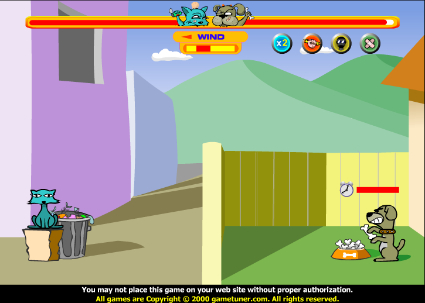
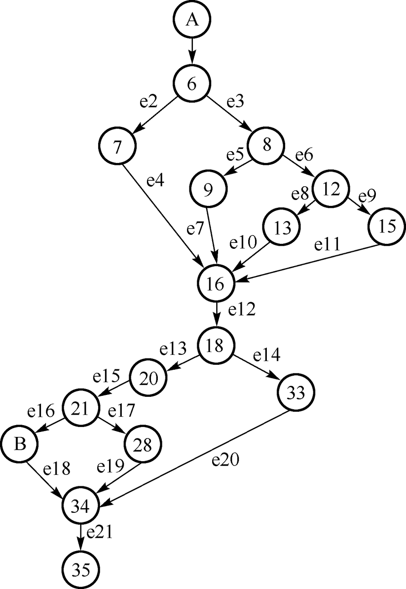
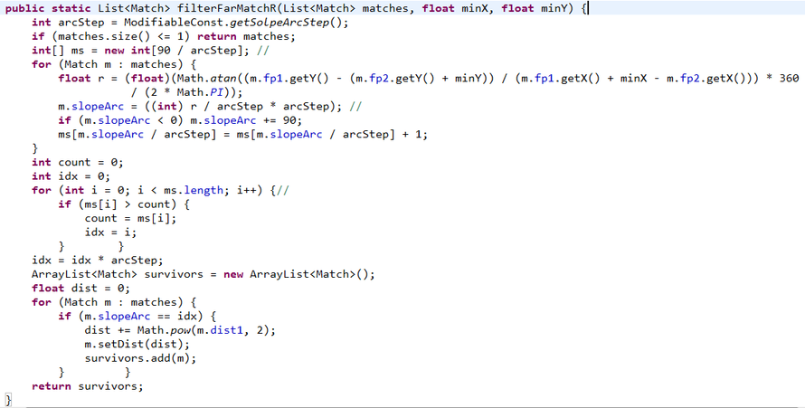

## 第1单元测试

1. 以下描述中哪个是错误的：
   - [ ] A. 静态测试不需要搭建测试环境
   - [ ] B. 测试用例的基本组成包括：输入、预期输出和测试环境
   - [x] C. 穷尽测试是一种非常有效的测试手段
   - [ ] D. 测试用例能代表需求的小的测试单元
2. 以下描述正确的是：
   - [ ] A. 程序员不需要测试自己的程序
   - [ ] B. 测试工程师肯定比其他人的测试工作做的更好
   - [x] C. 测试职位的价值之一在于它能证明程序是满足用户要求的
   - [ ] D. 没有需求就不能开始测试
3. 以下哪些项属于软件质量：
   - [x] A. 顾客和用户觉得软件满足其综合期望的程度
   - [x] B. 软件产品中能满足给定需要的性质和特性的总体
   - [x] C. 确定软件在使用中将满足顾客预期要求的程度
   - [x] D. 软件具有所期望的各种属性的组合程度
4. 以下哪些情况一定可以看做是软件缺陷：
   - [x] A. 某App分享到微信后，针对IOS用户，在IOS12以下的版本中，在微信中打开该APP出现闪退现象
   - [ ] B. 将手机的日历中的某一条备忘文本复制后，无法粘贴到短信编辑框中
   - [x] C. 登录电子邮箱时，输入正确的用户名和密码，填写正确的动态验证码后，手机收到动态短信提示成功登录，但网页端只是重新刷新了登录界面，要求重新输入用户名和密码
   - [x] D. 在微信中收到好友分享的文章链接，点击该链接后选择在APP中打开，对应APP出现闪退现象
5. 在游戏行业，游戏提供商常常在游戏正式发布之前邀请用户展开α测试作为检验游戏的一种方式。
   - [ ] A. √
   - [x] B. X
6. 用户注册了某机票预订网站的会员，但在某次使用该机票预订网站进行机票预订时，并未事先登陆，而是直接查询航班，然后填写必要信息后在线购买了机票。此时，由于是以非会员身份进行机票购买，导致该用户登录网站后无法查询到自己该次购买机票的订单信息，该用户由此感到不满。用户认为，该机票预订网站应能根据自己填写的手机号码、身份证号码等信息，自动识别自己的会员身份，并应自动提示以会员身份登录系统后再购买机票。请问，在这个案例中，机票预订系统未能识别的用户需求是（==实际需求==）（请在显式需求、隐式需求、实际需求中选择一项进行填写）

## 第2单元测试

1. 以使用某购票系统进行国内车票购买的过程为例，如果需要针对相关业务流程设计测试用例，则如下描述中错误的是：

   - [x] A. 成功登录系统，为已有乘车人成功购买单程单张车票，以及为已有乘车人成功购买单程多张车票，这两个流程分别对应两个基本事件流
   - [ ] B. 系统登录失败，该流程对应的是备选事件流
   - [ ] C. 成功登录系统，出发地城市分别选择100个不存在的、或不在中国境内的城市，无法购票，对应同一个备选事件流
   - [ ] D. 成功登录系统，为已有乘车人成功购买单程、单张车票，该流程对应的是基本事件流

2. 以下描述中哪个是正确的？

   - [ ] A. 在功能测试中，应优先使用等价类测试方法来测试数据，然后使用场景法测试流程，最后使用边界值测试做补充测试
   - [ ] B. 在数据可以穷尽的情况下，只要能保证测试用例覆盖所有数据，就可以确保测试没有风险
   - [ ] C. 在功能测试中，应选择所有不同的测试方法，围绕功能点设计尽量多的测试用例
   - [x] D. 功能测试中，针对事件流中的每个节点，应使用等价类和边界值测试对涉及的数据进行校验

3. 下图给出了猫狗大战小游戏的一个典型的对战场景，其中图中的猫和狗分别代表对战的双方，在人机对战模式下，猫是机器内置的对手，用户可操作的是狗角色，图中中央上方显示的分别是对战双方的血量，中央血条下方是风力和风向标志，四个圆形图标从左到右依次表示：打击两次、强力打击工具、臭弹工具、补血工具（补血工具仅对自己进行补血，不能攻击对手）。通过按下鼠标左键的时间长短控制出手力度，时间越长，出手力度越大。请问，以下描述中哪些是错误的：

   

   - [x] A. 从输入的角度来说，可使用等价划分方法，划分为如下三种情况:1.没超时打不中，2.没超时打中，3.超时
   - [x] B. 可使用等价划分方法，根据风向以及力度，划分为能打中对手、不能打中对手两种情况
   - [x] C. 若对攻击工具进行等价划分，则可得到如下等价类：1.打击两次工具，2.强力打击工具，3.臭弹工具，4.补血工具
   - [x] D. 针对攻击时的风向，可划分为如下两个等价类：1.顺风，2.逆风

4. 给定一组输入条件，每个输入条件均对应各自连续的有效取值范围，则以下的描述中正确的是：

   - [ ] A. 每个输入条件都至少可以划分为一个有效等价类和两个无效等价类
   - [x] B. 从输入设计测试用例后，往往还需要围绕系统输出来补充设计测试用例
   - [ ] C. 从等价类中抽取测试数据时，一定要选择非边界值
   - [x] D. 如果希望更好地控制测试用例规模，则设计的测试用例能覆盖所有有效等价类就可以了

5. 任何情况下都必须使用边界值测试。

   - [x] A. √
   - [ ] B. X

6. 等价类测试和边界值测试是面向数据的，场景法是面向（==流程==）的。

   

## 第3周单元测试

1. 已知下一日问题中，年份取如下测试数据: 1800, 1801, 2049, 2050，月份取如下测试数据: 1, 2, 11, 12，日期取如下测试数据: 1, 2, 30, 31，则如下哪个正交表最合适？

   - [ ] A. $L_9(3^4)$
   - [x] B. $L_{16}(4^5)$
   - [ ] C. $L_4(2^3)$
   - [ ] D. $L_8(2^7)$

2. 已知被测系统有三个因素：A,B,C，其中，A和B分别有两种取值A1,A2, B1,B2，C因素有三种取值C1,C2,C3，基于AETG算法的基本思想，若当前所有尚未覆盖的因素的成对组合构成集合T1，如下表所示，且候选测试用例已确定B因素取值为B2，则此时，若考虑对A因素的取值，则A应取值：

   | (A1,  B2) | (A1,  C2) | (A1,  C3) | (A2,  B1) |
   | --------- | --------- | --------- | --------- |
   | (A2,  B2) | (A2,  C1) | (A2,  C2) | (A2,  C3) |
   | (B1,  C2) | (B1,  C3) | (B2,  C1) | (B2,  C2) |
   | (B2,  C3) |           |           |           |

   - [ ] A. 只能取零值
   - [ ] B. A1和A2都无所谓
   - [x] C. 只能取A2
   - [ ] D. 只能取A1

3. 以下描述中哪些是正确的：

   - [x] A. 正交表测试非常适于成对测试
   - [x] B. 正交表测试满足100%的成对测试
   - [ ] C. 对于有k个影响因素，每个因素有n个不同取值的被测对象，至少需要k2个测试用例才能满足完全的成对组合覆盖
   - [x] D. 成对测试的目标是以最少的测试用例数，覆盖最多的成对组合元素

4. 如下关于决策表的描述中正确的是：

   - [x] A. 决策表方法不适于处理无效域的数据
   - [ ] B. 当输入条件之间相互独立时，最好采用决策表测试方法
   - [x] C. 决策表测试方法应与等价划分方法结合起来使用
   - [x] D. 决策表测试是面向数据的测试

5. 正交表要求各输入条件的取值个数相同，成对测试不要钱各输入条件取值个数相同。

   - [x] A. √
   - [ ] B. X

6. IPO算法的基本思想中，每次不是选择所有因素，而是采用（==逐步增加因素==）的方式生成测试用例。

## 第4周单元测验

1. 以下描述中哪个是正确的：
   - [x] A. 在评审会正式召开之前，评审员必须认真阅读被审查的工作产品在评审会正式召开之前，评审员必须认真阅读被审查的工作产品
   - [ ] B. 在代码评审过程中，应留出足够的时间让评审人员与开发人员就现场发现的缺陷修复达成一致意见
   - [ ] C. 在代码评审会前，必须提前设计测试用例，并在评审过程中逐一执行每个测试用例，观察执行结果
   - [ ] D. 代码评审不涉及测试环境搭建、测试脚本编写、测试用例管理等工作，因此应广泛使用代码评审，至少每周组织2-3次代码评审
2. 以下描述中哪个是错误的：
   - [ ] A. 判定节点是导致程序执行风险的主要因素
   - [ ] B. 控制流分析的主要目的就是通过对判定节点的测试来降低程序执行的风险
   - [x] C. 对代码设计测试用例必须要根据程序的设计来进行
   - [ ] D. 编程过程中编译器会发现代码中的部分错误，程序调试过程中程序员也会使用自己预设的数据来测试程序，但控制流分析仍然是必要的
3. 以下描述中哪些是错误的：
   - [x] A. 条件判定节点将影响程序执行的走向，因此，条件判定节点是代码中风险最高的元素
   - [x] B. 只要程序中存在循环结构，测试就无法穷尽
   - [ ] C. 串联的条件判定结构比嵌套的条件判定结构风险更高
   - [x] D. 只要在代码中不使用判定结构或循环结构，就一定可以降低程序运行的风险
4. 以下描述中哪些是正确的：
   - [x] A. 设计测试用例时，如果使用了判定覆盖指标就不需要再使用语句覆盖
   - [ ] B. 假设被测代码中有n个判定节点，如果基于判定覆盖指标设计测试用例，则一定需要设计2n个测试用例
   - [x] C. 应谨慎使用条件组合覆盖指标，因为该指标指导下设计测试用例可能导致测试效率不高
   - [x] D. 在时间有限的情况下，可优先选择判定覆盖测试函数代码
5. 通过消除函数内部结构之间的依赖关系，或将函数体内相似的代码改为函数调用，一定能够降低函数的复杂度，但这样也有可能会增大集成测试的负担。
   - [ ] A. √
   - [x] B. X
6. 在代码评审会召开之前，为了确保所有参会人员都了解会议流程、会议目的，都拿到正确、完整的评审材料，往往需要先召开（==评审预备会==）。

## 第5周单元测验

1. 以下的描述中正确的是：
   - [ ] A. 一段程序的环复杂度大小等于该程序代码中判定节点的个数加1
   - [ ] B. 一段程序的环复杂度必须控制在10以内
   - [ ] C. 环复杂度指标真实再现了循环结构和判定结构对程序结构复杂性造成的影响
   - [x] D. 可通过将程序中的重复代码改为函数调用来降低代码所在函数的环复杂度
2. 以下描述中哪个是错误的：
   - [ ] A. 随便从程序路径中抽取若干条路径来测试，也没有错
   - [ ] B. 只要遵循独立路径测试的路径构建原则，得到的路径集就一定是无冗余的
   - [x] C. 独立路径测试只能用于对代码的测试
   - [ ] D. 独立路径不保证得到的测试用例有意义
3. 以下描述中哪些是正确的：
   - [x] A. 通过需求分析得到程序的路径数目与程序实际的路径数不一致时，则可能是程序设计不够合理
   - [x] B. 直接基于程序控制流图计算环复杂度是完全可行的
   - [ ] C. 程序内判定和循环结构的嵌套相比串联更容易导致增大程序结构的复杂度
   - [x] D. 在程序设计中，要保证同一段程序代码中不同结构体之间完全独立是很困难的
4. 以下的描述中错误的是：
   - [x] A. 一个场景可以仅包含1个备选事件流
   - [x] B. 解决场景爆炸的最佳方案是基于事件流的个数设计场景
   - [x] C. 基于独立路径测试的思想设计场景可以保证最少的可行场景
   - [ ] D. 场景中同一个节点可同时触发多个备选事件流
5. 场景是分层次的，如果当前场景过于复杂，可将部分场景节点分解为低一级的层次，以便于测试。
   - [x] A. √
   - [ ] B. X

## 单元测验,功能测试,性能测试部分测试

1. 以下描述中不正确的是：
   - [x] A. 性能测试设计的关键是使用测试工具
   - [ ] B. 不借助测试工具几乎无法展开性能测试
   - [ ] C. 性能测试中，可利用脚本参数化实现让多个虚拟用户使用几个不同的实际发生数据来执行同一脚本的目的
   - [ ] D. 性能测试中常见的系统指标包括：平均响应时间、每秒事务数、每秒点击数、吞吐量等
2. 单元测试中最不需要测试的是：
   - [ ] A. 一个类
   - [ ] B. 类中的一个功能方法
   - [x] C. 类中的Getter方法
   - [ ] D. 一个执行排序功能的函数
3. 记录缺陷时需要注意：
   - [x] A. 标题应尽量简洁，体现所发现缺陷的核心特点
   - [x] B. 必须记录被测软件系统的版本号
   - [x] C. 应尽可能详细记录执行过程
   - [ ] D. 必须100%确保报告的缺陷可重现
4. 功能测试中应采取的措施包括：
   - [ ] A. 录制业务流程过长的测试脚本
   - [x] B. 录制脚本时提前识别被测系统中的对象
   - [x] C. 确保测试脚本相互独立，以避免不同脚本之间的影响
   - [ ] D. 只要一个新的功能点开发完成，就立刻开发对应的功能测试脚本
5. 编写单元测试脚本时，不适合的设计包括：
   - [ ] A. 使用断言校验执行结果
   - [x] B. 在同一个测试类中，所有测试方法共用一个被测类的对象
   - [x] C. 在一个测试方法中执行多个测试用例
   - [x] D. 在被测类的main函数中编写测试脚本
6. 测试用例报告中，每个测试用例的ID必须由人为按规则指定，不能由管理软件自动生成。
   - [ ] A. √
   - [x] B. X
7. 单元测试就是用某一款代码扫描工具将产品代码扫描一遍，看看有没有什么问题。
   - [ ] A. √
   - [x] B. X
8. 基于JUnit4.x设计单元测试脚本时，用于支持参数化测试的运行器是：==Parameterized==

## 第四 单元测验

1. 以下描述中哪个是不正确的：
   - [ ] A. Dromey质量模型的目标是要建立起软件质量特性与子特性之间的关系，试图找到能精确影响软件质量属性的产品特性
   - [ ] B. Boehm质量模型中，将用户分为三类：初始用户，管理员用户和相似用户
   - [x] C. 相比ISO9126模型，ISO25010质量模型最大的不同是改从产品质量和使用质量这两方面来描述软件产品质量
   - [ ] D. 在ISO25010系统和软件质量模型的基础上，ISO/IEC 25012给出了关于数据质量的描述
2. McCall模型划分了如下维度的11个软件外部质量因素：
   - [ ] A. 软件产品实用
   - [x] B. 软件产品移植
   - [x] C. 软件产品修改
   - [x] D. 软件产品运行
3. 以下的描述中错误的是：
   - [ ] A. 在软件开发的迭代过程中，通过绘制基于缺陷率的控制图，有助于发现质量不好的软件组件，但这一过程往往不是一次性完成的
   - [ ] B. 散点图可用于分析变量之间是否存在数量上的一些关联性，并有助于观察其趋势
   - [x] C. 使用帕累托图进行质量分析时，最好分为3-4项即可，分类太多容易导致分析困难
   - [x] D. 因果图是一种定量的工具
4. 只有客户才会有兴趣透彻定义它的需求以确保他约定的软件产品的质量。
   - [ ] A. √
   - [x] B. X
5. ISO9126模型中，在测试软件的过程中，通过观察和测量软件的系统行为，是从<u>==用户==</u>的角度来对软件质量进行度量。

## 华中科技大学期末考

1. 导致程序结构复杂的主要原因是：

   - [ ] A. 程序中的变量结构太复杂
   - [ ] B. 程序中代码行太多
   - [ ] C. 程序中的变量太多
   - [x] D. 程序中的分支太多

2. 以下描述中哪个是错误的：

   - [ ] A. 测试用例的基本组成包括：输入、预期输出和测试环境
   - [x] B. 穷尽测试是一种非常有效的测试手段
   - [ ] C. 测试用例能代表需求的小的测试单元
   - [ ] D. 静态测试不需要搭建测试环境

3. 以下描述中哪个是正确的？

   - [ ] A. 在功能测试中，应选择所有不同的测试方法，围绕功能点设计尽量多的测试用例
   - [ ] B. 在功能测试中，应优先使用等价类测试方法来测试数据，然后使用场景法测试流程，最后使用边界值测试做补充测试
   - [ ] C. 在数据可以穷尽的情况下，只要能保证测试用例覆盖所有数据，就可以确保测试没有风险
   - [x] D. 功能测试中，针对事件流中的每个节点，应使用等价类和边界值测试对涉及的数据进行校验

4. 通常情况下，如下缺陷不能通过单元测试发现的是

   - [ ] A. 提示的错误与实际的错误不相符
   - [x] B. 一个模块的功能是否会对另一个模块的功能产生不利影响
   - [ ] C. 输入的实际参数与形式参数的个数不相同
   - [ ] D. 变量的初始值或缺省值有错误

5. 对于如下的程序图，需要测试的最大可执行路径数是：

   

   - [ ] A. 7
   - [ ] B. 10
   - [x] C. 12
   - [ ] D. 6

6. 以下描述中正确的是：

   - [ ] A. 单元测试等同于程序员在编码过程中的调试工作
   - [ ] B. 必须利用单元测试框架才能编写单元测试脚本
   - [ ] C. 单元测试要根据函数的设计逻辑来设计测试用例
   - [x] D. 单元测试脚本其实就是可以自动执行测试用例的代码

7. 软件测试的核心是：

   - [ ] A. 对测试进行详尽且周全的计划
   - [x] B. 根据被测软件系统需求进行详尽的测试设计
   - [ ] C. 选择多种指标，对测试展开全面评估
   - [ ] D. 全面依托测试工具，自动执行软件测试

8. 如下描述中正确的是：

   - [ ] A. 测试与调试是一回事，因为都是运行程序，找到问题
   - [ ] B. 测试与调试是一回事，因为测试和调试的目的都是为了找bug
   - [ ] C. 测试与调试不是一码事，因为测试的目的是为了找bug，而调试的目的是定位bug
   - [x] D. 测试与调试不是一码事，测试时不知道是否有bug，而调试时已知有bug，但不知道导致bug的原因是什么

9. 为了提高单元测试脚本的质量，我们不应采取的措施包括：

   - [ ] A. 保证测试脚本简洁
   - [ ] B. 保证测试脚本的可读性
   - [ ] C. 使用Build-Operation-Check模式
   - [x] D. 为测试代码添加判断逻辑

10. 下列关于等价类划分方法的说法中错误的是：

    - [ ] A. 利用有效等价类设计的测试用例，可以检验程序是否实现了需求说明书中规定的功能和性能
    - [ ] B. 对同一个程序可能会划分出多种不同的等价类
    - [x] C. 对于有效等价类可以不设计测试用例
    - [ ] D. 利用无效等价类设计的测试用例，可以检验程序中功能和性能是否不符合需求说明书的规定

11. 如下缺陷报告中最合适的描述是：

    - [x] A. 在某课程平台的“软件测试与质量”课程中，从课程章节创建讨论时，新建讨论帖成功后，在页面将看到两个完全一样的讨论帖，而预期应该只能看到一个讨论帖
    - [ ] B. 在某课程平台创建讨论帖，在页面将看到两个完全一样的讨论帖，在讨论区创建讨论时，或在课程章节中创建讨论时，都出现上述现象
    - [ ] C. “在某课程平台的课程创建讨论帖出现重复帖”是一个描述清晰、简洁的缺陷标题
    - [ ] D. 在某课程平台创建讨论帖，无法成功创建

12. 给定如下的需求描述，请问错误的测试用例设计是：

    要求实现一个函数，功能是比较两个字符串，例如，ABCDE和ABFDE，用形如<...B[X]D...>来表示二者的不同之处。其中，方括号[]中的内容表示两字符串的不同之处，当两个字符串存在相同子串时，如本例中的“AB”和“DE”，凡是超过上下文长度的字符均用省略号...表示。本例中，若上下文长度为1，则ABCDE和ABFDE，用形如<...B[X]D...>来表示二者的不同之处；而若上下文长度为0，则ABCDE和ABFDE，用形如<...[X]...>来表示二者的不同之处。

    - [ ] A. 从输入域来看，被比较的字符串长度为零，应视为边界测试用例，可考虑一个字符串长度不为零，另一个字符串长度为零的输入情况
    - [ ] B. 从输出域来看，可将相同子串长度为零的情况视为边界测试用例
    - [x] C. 上下文长度为0或1时，视为边界测试用例，且必须作为系统有效输入进行处理
    - [ ] D. 上下文长度为-1时，视为边界测试用例，且必须作为无效输入进行处理

13. 在同行评审之前，被评审的材料应满足一定条件才允许进行评审，下面描述中属于评审条件的有：

    - [ ] A. 被评审的代码应控制在200行以上
    - [ ] B. 文档中应尽量使用专业术语
    - [ ] C. 文档应确保至少有15页
    - [x] D. 文档应符合相关标准模板

14. 基于JUnit编写单元测试脚本时：

    - [ ] A. 测试类中的测试方法必须以test开头
    - [x] B. 若希望同时执行Atest类和Btest类中的部分方法，应使用RunWith(Categories.class)注解
    - [ ] C. 对某个test方法使用Ignore注解和为该test方法取消Test注解的作用是一样的
    - [ ] D. 若希望让JUnit框架自动检测某方法的执行是否超时，可为该方法添加Ignore注解

15. 已知下一日问题（本课程所使用的下一日问题例子）中，年份取如下测试数据: 1800, 1801, 2049, 2050，月份取如下测试数据: 1, 2, 11, 12，日期取如下测试数据: 1, 2, 30, 31，则如下哪个正交表最合适？

    - [ ] A. $L_9(3^4)$
    - [ ] B. $L_8(2^7)$
    - [x] C. $L_{16}(4^5)$
    - [ ] D. $L_4(2^3)$

16. 良好的单元测试脚本应做到：

    - [ ] A. 测试脚本应包含业务逻辑，以便于测试到各种情况
    - [ ] B. 将测试代码放入产品代码，以便于执行测试
    - [ ] C. 将所有执行结果输出到控制台
    - [x] D. 保持测试用例执行的独立性

17. 观察函数调用图时，错误的认识是：

    - [ ] A. 若某节点被多个函数所调用，则该节点的传播速度很快
    - [x] B. 若某节点是叶子节点，则该节点的风险往往是最低的
    - [ ] C. 若某节点的出度很大，说明该节点对缺陷非常敏感
    - [ ] D. 若调用层次太深，则应将部分调用的函数合并为一个函数

18. 选择覆盖指标对源代码设计测试用例时，常见的错误包括：

    - [ ] A. 修正的判定条件覆盖一般仅在逻辑表达式特别重要的情况下使用
    - [ ] B. 判定覆盖可保证100%的语句覆盖
    - [ ] C. 判定覆盖不一定能保证条件覆盖
    - [x] D. 条件组合覆盖是最常用的逻辑覆盖指标

19. 如下描述中正确的是：

    - [ ] A. 对于领导者来说，要实施单元测试就必须牺牲开发进度
    - [ ] B. 在程序员眼中，实施单元测试意味着可以随意编码了
    - [x] C. 对于领导者来说，要实施单元测试也要控制成本
    - [ ] D. 在程序员眼中，实施单元测试意味着减少工作量，因为测试脚本是测试人员负责编写的

20. 如下描述中正确的是：

    - [ ] A. 性能测试应覆盖到所有功能
    - [ ] B. 性能测试通常要先于功能测试或者同步进行
    - [ ] C. 被测系统如果存在瓶颈就不可使用
    - [x] D. 功能测试可以发现性能问题，性能测试也能发现功能问题

21. 基于JUnit框架执行单元测试时：

    - [ ] A. 如果运行结果呈现黄色的进度条，说明测试全部通过
    - [ ] B. 如果被测产品有缺陷，对应测试Error
    - [ ] C. 如果测试脚本有缺陷，对应测试Failure
    - [x] D. 测试脚本不需要被测试

22. 下面是对某公司缺陷管理流程的概括：测试人员提交新的BUG入库，缺陷状态置为1，高级测试人员验证缺陷，如果确认是BUG，分配给相应的开发人员，设状态为2，如果不是BUG ，则拒绝，设置状态为“拒绝”状态，开发人员查询状态为3的BUG， 做如下处理，如果不是BUG，则置状态为“拒绝”状态，如果是BUG 则修复并置状态为４，如果不能解决的BUG，要留下文字说明并保持 BUG为“拒绝”状态，测试人员查询状态为５的BUG，验证BUG是否 解决，做如下处理：如果BUG解决了置缺陷状态为６，如果BUG没有 解决则置状态为７。上述流程中１到７相对应的状态标识为：

    - [ ] A. 新提交－打开－打开－关闭－修正－关闭－重新打开
    - [x] B. 新提交－打开－打开－修正－修正－关闭－重新打开
    - [ ] C. 打开－修正－关闭－修正－修正－关闭－打开
    - [ ] D. 新提交－打开－打开－修正－关闭－修正－重新打开

23. 如描述中正确的是：

    - [x] A. 构建决策表的过程中可能会发现等价划分的漏洞
    - [ ] B. 通过合并相似列降低测试用例规模时，一次仅能合并两个相似列
    - [ ] C. 决策表应与边界值测试有机结合起来使用
    - [ ] D. 决策表最适于处理异常输入的情况

24. 计算缺陷率时，我们发现：

    - [ ] A. 基于代码行，和基于功能来评估软件规模时，基于代码行的方法更合理一些
    - [x] B. 通过功能点衡量软件规模，是从用户角度进行评估的
    - [ ] C. 通过计算版本的缺陷数与KCSI的比值，可用于度量整个产品的代码质量
    - [ ] D. 在开发过程中，虽然代码行不断变化，但基于代码行的缺陷率是保持不变的

25. 下面这个函数的圈复杂度为:

    

    - [ ] A. 6
    - [ ] B. 9
    - [x] C. 8
    - [ ] D. 7

26. 如果使用基于录制-回放的功能测试工具来执行自动化功能测试，则正确的描述是：

    - [ ] A. 基于该测试工具的自动化功能测试就是录制脚本、回放脚本的过程
    - [ ] B. 自动功能测试的脚本必须以手工操作的方式生成，不能通过编程得到
    - [x] C. 该测试工具应支持设置数据表，从而实现对不同数据自动执行测试
    - [ ] D. 必须在执行测试脚本之前，让测试工具一次性识别所有被测对象，否则，无法执行测试脚本

27. 如下关于测试用例的描述中，不存在理解错误的是：

    - [x] A. 测试用例中应给出明确的验证手段
    - [ ] B. 测试用例设计得越详细越好，即每个测试用例应详细记录所有操作信息
    - [ ] C. 测试用例设计应一步到位
    - [ ] D. 发现缺陷的用例才是好的用例

28. 以下描述中不正确的是：

    - [ ] A. 不依赖于软件开发人员的技术，借助于销售和技术支持人员的努力，也可以提高软件的质量
    - [ ] B. 软件的质量要求会随着时间的变化而变化
    - [x] C. 为了保证软件的质量符合用户要求，需要在开发过程中尽量保证过程的完美
    - [ ] D. 软件产品在交付给用户之前多半无法满足其所有质量要求

29. 在场景测试中，能够确保场景可行的方案是：

    - [ ] A. 根据事件流的个数构建场景，有多少个事件流就有多少个场景
    - [ ] B. 将场景图转换为程序图，并借鉴独立路径测试的思想设计初始测试用例
    - [ ] C. 以上方案都不可行
    - [x] D. 基于原始业务需求构建场景

30. 功能测试中应避免的措施包括：

    - [ ] A. 确保测试脚本相互独立，以避免不同脚本之间的影响
    - [ ] B. 一个新的功能点开发完成后不着急立刻开发对应的功能测试脚本
    - [ ] C. 录制脚本时提前识别被测系统中的对象
    - [x] D. 录制一条业务流程尽可能长的测试脚本

31. 如下描述中正确的是：

    - [x] A. 可以通过综合查看每秒通过事务数和事务平均响应时间，来分析事务数目对执行时间的影响
    - [x] B. 通过查看事务响应时间可以分析测试场景运行期间，被测系统的性能趋势
    - [x] C. 查看事务概要图时，如果发现失败的事务非常多，则说明系统可能出现了瓶颈，或程序执行过程中发生了问题
    - [x] D. 通过分析每秒点击量的变化情况，来判断系统是否稳定

32. 如下描述中正确的是：

    - [x] A. 单元测试、集成测试、系统测试、验收测试都是不同的测试阶段
    - [ ] B. 集成测试的测试对象是模块或组件
    - [ ] C. 在软件发布前，有时会让小规模、有代表性的潜在用户试用软件，这种测试称为α测试
    - [x] D. 为了确保测试的进度，可将不同单元的测试并行展开

33. 如下关于软件质量的描述中正确的包括：

    - [x] A. 软件质量涉及周期性的测量工作
    - [ ] B. 从软件质量的角度看用户需求，用户需求是多样的，但不会随时间而变化
    - [x] C. 从软件质量的角度来看，用户不仅仅是购买了一个产品，而且是购买了开发者的承诺（或保证）
    - [ ] D. 软件质量控制的核心工作内容是找软件缺陷

34. 基于JUnit开发单元测试脚本时，我们应注意：

    - [ ] A. 在一个test方法中仅包含1个断言
    - [x] B. 在一个test方法中可包含多个断言
    - [x] C. 在一个test方法中仅包含1个测试用例
    - [ ] D. 在一个test方法中可包含多个测试用例

35. 给定如下C语言代码段：

    ````c
    if( (A+10)==2 || (B-20)<3 )
      C=0;
    if( (A+30)>10 && (C-30)<0 )
      B=30;
    ````

    对于（A,B,C）的取值，所有能实现语句覆盖要求的测试用例包括：

    - [ ] A. (-19, 0, 29)
    - [x] B. (-30, 20, 30)
    - [x] C. (2, 30, 1)
    - [ ] D.  (-8, 20, 3)

36. 如下关于缺陷的描述中，不正确的是：

    - [x] A. 在测试报告中应明确描述缺陷是否可以修复
    - [x] B. 所有缺陷都必须在产品发布前得到修复
    - [x] C. 对于严重性非常低的缺陷，没有必要进行修复
    - [ ] D. 缺陷优先级一旦设定，将不能修改

37. 基于JUnit框架编写单元测试代码时，若要实现将多个测试类中的多个测试用例组织在一起，一次性执行，如下哪些措施是可行的：

    - [ ] A. 以上均不可行
    - [x] B. 创建Java类，直接基于JUnitCore.runClasses，将多个测试类组织起来进行测试
    - [x] C. 利用运行配置或依托开发平台，可一次性运行当前工程中所有的测试
    - [x] D. 利用测试套包，将多个测试类组织成测试套包进行测试

38. 如下关于软件质量的描述中不正确的包括：

    - [ ] A. 预防产生软件质量
    - [x] B. 软件测试可以提高软件质量
    - [x] C. 检查提高软件质量
    - [ ] D. 软件测试可以验证软件质量

39. 如下属于白盒测试策略的包括：

    - [x] A. 单元测试
    - [x] B. 桌面检查
    - [ ] C. 系统测试
    - [x] D. 基于CA工具的代码审查

40. 使用测试管理工具对测试进行管理时，如下描述中正确的是：

    - [x] A. 通过在测试计划中包含测试轮次，可实现按照轮次执行测试
    - [ ] B. 提交缺陷时，该缺陷必须与测试用例对应
    - [x] C. 设置项目团队成员时，团队成员的角色可以与该用户的系统角色不同
    - [x] D. 创建项目时，必须指定项目经理

41. 给定一个加法函数int Add(int x, int y)，其中，x,y的有效取值范围均为大于等于1且小于等于100的整数，则针对无效输入至少应设计一个测试用例，使其满足x和y均小于1

    - [x] A. X
    - [ ] B. √

42. 在图形用户界面的测试中，一个页面也可以视为一个单元。

    - [ ] A. X
    - [x] B. √

43. 缺陷报告中，每个缺陷的ID必须由人为按规则指定，不能由管理软件自动生成。

    - [x] A. X
    - [ ] B. √

44. 条件组合覆盖可以发现代码中所有可能的缺陷。

    - [x] A. X
    - [ ] B. √

45. 一旦给定明确的需求，黑盒测试用例设计就可以与产品开发并行展开。

    - [ ] A. X
    - [x] B. √

46. McCall模型与Boehm模型十分类似，都是层次模型。

    - [ ] A. X
    - [x] B. √

47. 在单元测试中，针对被测类的所有方法都必须有对应的测试方法。

    - [x] A. X
    - [ ] B. √

48. 程序员对缺陷给出的处理方式如果是外部原因，不修复，重复的，不可重现，或符合设计的，则该缺陷将无法得到修复。

    - [x] A. X
    - [ ] B. √

49. 性能测试应尽量采用自动化方式来执行。

    - [ ] A. X
    - [x] B. √

50. 用代码行来估算软件规模比用功能点法进行估算更加精确，因为它是从开发的角度估算软件规模。

    - [x] A. X
    - [ ] B. √